# NNA Framework Technical Implementation Guide

**Document Version**: 1.0.5

**Last Updated**: April 6, 2025

**Previous Update**: March 29, 2025

**Status**: Draft

## Changelog

## Changelog

- **v1.0.5 (2025-04-06)**
    - Updated [Section 1.1 - Design Philosophy](#section-1.1-design-philosophy) to include new layers (Audio Effects (E), Transitions (N), Augmented Reality (A), Filters (F), Text (X)) and enhanced Moves (M) layer with biomechanical and cultural classifications. Added references to edge processing capabilities and updated scalability goals to 10M+ concurrent users.
    - Updated [Section 1.7 - Tutorial: Building a Simple Remix](#section-1.7-tutorial-building-a-simple-remix) to include new layers in the composite creation example and demonstrate accessing a Moves tutorial video using the enhanced Moves layer metadata.
    - Updated [Section 2.1 - Layer Management](#section-2.1-layer-management) to list new layers, enhanced Moves layer features, and include the `[Version]` suffix in the naming convention for consistency with the API Specification.
    - Updated [Section 2.1.3 - Layer Compatibility Implementation](#section-2.1.3-layer-compatibility-implementation) to add compatibility rules for new layers and Moves metadata (e.g., `Movement_Speed`, `Cultural_Origin`).
    - Updated [Section 3.1.3 - Composite Asset Resolution](#section-3.1.3-composite-asset-resolution) to include new layers in composite assets and validate their compatibility (e.g., AR requires Star, Text requires Song).
    - Updated [Section 3.2.3 - Multi-tier Cache Manager](#section-3.2.3-multi-tier-cache-manager) to support caching of new layer metadata (e.g., `Social_Media_Format`, `Font_Style`) and added deployment considerations for edge processing of AR, filters, and text layers.
    - Updated [Section 10 - Troubleshooting Guide](#section-10-troubleshooting-guide) to include issues related to new layers (e.g., AR transformation failures) and enhanced Moves layer (e.g., missing tutorial videos).
    - Updated [Section 17.8.4 - Migrating to Edge Computing Architecture](#section-17.8.4-migrating-to-edge-computing-architecture) to include support for new layers in the phased implementation approach, edge function implementation, and data consistency strategies.
    - Updated [Section 18 - Technical Glossary](#section-18-technical-glossary) to add definitions for new layers (E, N, A, F, X) and Moves-related terms (e.g., biomechanical tagging, tutorial videos).
- **v1.0.4 (2025-03-29)**
    - Added comprehensive **Section 17 - Future Architectural Enhancements** with detailed implementation approaches, migration strategies, and timeline
    - Added detailed **Section 17.2.5 - Comprehensive GraphQL Schema Implementation** with complete schema definitions and resolver examples for all NNA asset types
    - Enhanced **Section 10.2 - Resolution Steps** with flowchart for systematic diagnostic process
    - Added implementation details for **Graph-Based Compatibility Model** in Section 2.1.4
    - Extended **Section 3.2.7** with Unified Cache Coordination System implementation
    - Added **Section 10.4.6 - Recovery Procedure: Database Corruption** with detailed recovery steps
    - Enhanced **Section 10.4.7** with detailed Resiliency Patterns Implementation
    - Added detailed code examples for AI-Driven optimization in Section 3.4
    - Updated code samples throughout document to reflect latest best practices
    - Improved cross-references and internal document linking
    - Added mermaid diagrams for key architectural flows
- **v1.0.3 (2025-03-25)**
    - Updated document metadata to version 1.0.3
    - Added hyperlinks to cross-references for SLAB navigation
    - Expanded Section 3.3.1 - Registry Service Implementation with detailed MongoDB schema and example
    - Streamlined Section 4.2 - Cross-platform Integration to focus on backend, referencing NNA Framework API Specification, Section 6.4
    - Added flowchart placeholder to Section 10.2 - Resolution Steps for troubleshooting clarity
- **v1.0.2 (2025-02-23)**
    - Enhanced system requirements with detailed infrastructure and network specs (Section 1.4)
    - Added detailed cache tier architecture and deployment considerations (Section 3.2.3)
    - Introduced personalization service (Section 3.5) and real-time analytics pipeline (Section 7.6)
- **v1.0.1 (2025-02-08)**
    - Initial document draft

# Related Documents:

1. [ReViz NNA Framework WhitePaper](https://celerity.slab.com/posts/nna-framework-whitepaper-0jsj4gsl)
    - System architecture overview
    - Core concepts and principles
1. [NNA Framework API Specification](https://celerity.slab.com/posts/nna-framework-api-specification-1fupkzwa)
    - Detailed API documentation
    - Integration guidelines
1. [NNA Framework Implementation](https://celerity.slab.com/posts/nna-framework-technical-implementation-xfxe04qg)
    - Technical implementation details
    - Best practices and examples
1. [ALGORHYTHM AI-Recommendation Engine](https://celerity.slab.com/posts/a-l-g-o-r-h-y-t-h-m-4w561767)
    - AI/ML integration points
    - Performance optimization
1. [CLEARITY Rights Management](https://celerity.slab.com/posts/clearity-rights-clearance-platform-8ft1v300)
    - Rights management integration
    - Compliance requirements

## Table of Contents

1. [Introduction and Setup](https://celerity.slab.com/posts/nna-framework-technical-implementation-xfxe04qg#hulyk-1-introduction-and-setup)
1. [Core Components Implementation](https://celerity.slab.com/posts/nna-framework-technical-implementation-xfxe04qg#htier-2-core-components-implementation)
1. [Service Layer Implementation](https://celerity.slab.com/posts/nna-framework-technical-implementation-xfxe04qg#hy9es-3-service-layer-implementation)
1. [Data Layer Implementation](https://celerity.slab.com/posts/nna-framework-technical-implementation-xfxe04qg#h7xl9-4-data-layer-implementation)
1. [Security Implementation](https://celerity.slab.com/posts/nna-framework-technical-implementation-xfxe04qg#hsghf-5-security-implementation)
1. [Performance Optimization](https://celerity.slab.com/posts/nna-framework-technical-implementation-xfxe04qg#h1mdm-6-performance-optimization)
1. [Monitoring and Observability](https://celerity.slab.com/posts/nna-framework-technical-implementation-xfxe04qg#h208x-7-monitoring-and-observability)
1. [Testing and Quality Assurance](https://celerity.slab.com/posts/nna-framework-technical-implementation-xfxe04qg#hgdhr-8-testing-and-quality-assurance)
1. [Deployment and Operations](https://celerity.slab.com/posts/nna-framework-technical-implementation-xfxe04qg#h6k77-9-deployment-and-operations)
1. [Troubleshooting Guide](https://celerity.slab.com/posts/nna-framework-technical-implementation-xfxe04qg#hi4jk-10-troubleshooting-guide)
1. [System Administration](https://celerity.slab.com/posts/nna-framework-technical-implementation-xfxe04qg#heejo-11-system-administration)
1. [Capacity Planning](https://celerity.slab.com/posts/nna-framework-technical-implementation-xfxe04qg#h254o-12-capacity-planning)
1. [Appendices](https://celerity.slab.com/posts/nna-framework-technical-implementation-xfxe04qg#h2pqc-13-appendices)
1. [Development Guidelines](https://celerity.slab.com/posts/nna-framework-technical-implementation-guide-xfxe04qg#h8ysz-14-development-guidelines)
1. [System Architecture Guidelines](https://celerity.slab.com/posts/nna-framework-technical-implementation-guide-xfxe04qg#hm0sl-15-system-architecture-guidelines)
1. [Maintenance and Support](https://celerity.slab.com/posts/nna-framework-technical-implementation-guide-xfxe04qg#hv9ui-16-maintenance-and-support)
1. [Technical Glossary](https://celerity.slab.com/posts/nna-framework-technical-implementation-guide-xfxe04qg#hgi4k-15-technical-glossary)

### Scope

This guide covers:

- Framework implementation
- System integration
- Performance optimization
- Security considerations
- Troubleshooting

### Target Audience

- System architects
- Backend developers
- DevOps engineers
- Security specialists

---

# 1. Introduction and Setup

## Executive Summary

The NNA Framework is a comprehensive asset management system designed for AI-powered video remixing at internet scale. It addresses critical challenges in digital asset management through:

- A hierarchical addressing scheme inspired by DNS for efficient asset resolution (< 20ms)
- Multi-tiered caching optimized for global distribution with 95%+ hit rates
- Secure authentication and authorization controls
- Scalable processing supporting 10M+ concurrent users

This section provides setup requirements, quickstart guidance, and basic implementation examples to get developers onboarded quickly. Core dependencies include Python 3.8+, Redis 7.0+, and MongoDB 5.0+, with containerization support through Docker and Kubernetes.

## 1.1 Design Philosophy

The NNA Framework is a next-generation asset management system designed for AI-powered video remixing at internet scale. It provides comprehensive solutions for asset management, relationships, and composition, with key features including:

- Scalable asset retrieval handling 10M+ concurrent users with sub-20ms latency.
- AI-powered content recommendation for optimized video remixing across all layers: Songs (G), Stars (S), Looks (L), Moves (M), Worlds (W), Vibes (V), Branded (B), Personalize (P), Training_Data (T), Composites (C), Rights (R), Audio Effects (E), Transitions (N), Augmented Reality (A), Filters (F), and Text (X).
- Enhanced Moves (M) layer with biomechanical (e.g., `Movement_Speed`, `Energy_Level`) and cultural (e.g., `Cultural_Origin`) classifications, plus instructional fields (e.g., `Tutorial_Link`).
- Multi-tiered caching system with edge processing for real-time performance optimization (e.g., AR transformations, text rendering).
- Secure authentication and role-based access control.
- Comprehensive API documentation for seamless integration.

It is designed to interoperate with  [AlgoRhythm](https://celerity.slab.com/posts/a-l-g-o-r-h-y-t-h-m-4w561767), ReViz’s AI-powered recommendation engine that evaluates NNA-layered assets for optimal selection, ensuring seamless compatibility and remix potential. This evaluation of NNA-layered assets ensures optimal selection based on compatibility scores, historical user engagement, and AI-driven pattern recognition. Each NNA layer is analyzed for content alignment and remix potential, with new layers enabling advanced video editing capabilities.

## 1.2 Purpose

The NNA Framework provides a scalable platform for managing and remixing NNA-layered assets. This implementation guide details the technical architecture and practical implementation aspects of the framework. This guide details how to implement the NNA Framework, a scalable asset management system for AI video remixing. Refer to the [NNA Framework Whitepaper](https://celerity.slab.com/posts/nna-framework-whitepaper-0jsj4gsl) for details.

## 1.3 Core Concepts

NNA builds on DNS and XRI concepts for asset addressing. Refer to the [NNA Framework Whitepaper](https://celerity.slab.com/posts/nna-framework-whitepaper-0jsj4gsl) for details.

-  the Internet's [Domain Naming System](https://en.wikipedia.org/w/index.php?title=Domain_Name_System&t=)
- ITU's [Network and Network Architecture for Autonomous Networks](https://www.ietf.org/lib/dt/documents/LIAISON/liaison-2023-11-09-itu-t-sg-13-ietf-ls-on-the-consent-of-draft-new-recommendation-itu-t-y3061-ex-yan-arch-fw-autonomous-networks-architecture-fr-attachment-1.pdf?t)
- ITU's [Next-Generation Network Architecture](https://www.ietf.org/lib/dt/documents/LIAISON/liaison-2023-11-09-itu-t-sg-13-ietf-ls-on-the-consent-of-draft-new-recommendation-itu-t-y3061-ex-yan-arch-fw-autonomous-networks-architecture-fr-attachment-1.pdf?t) Framework
- ITU's [Naming, Numbering, and Addressing](https://www.ntt-review.jp/archive/ntttechnical.php?contents=ntr202201gls.html&t) framework
- Oasis' XRI ([eXtensible Resource Identifier](https://en.wikipedia.org/w/index.php?title=Extensible_Resource_Identifier&t=)) protocol

## 1.4 System Requirements

### 1.4.1 Core Infrastructure

The NNA Framework is designed to scale from development environments to production deployments serving 100+ million daily requests. Infrastructure requirements vary by deployment tier:

| **Component** | **Development** | **Staging** | **Production** |
| --- | --- | --- | --- |
| CPU | 8 cores | 32 cores | 64+ cores (distributed) |
| RAM | 32GB | 128GB | 256GB+ per node |
| Storage | 500GB SSD | 2TB NVMe RAID | 4TB+ NVMe RAID with 99.999% durability |
| Network | 1Gbps | 40Gbps | 100Gbps with redundant paths |
| Database | MongoDB 5.0+ | MongoDB 5.0+ with replication | Multi-region MongoDB cluster with sharding |
| Cache | Redis 7.0+ | Redis 7.0+ cluster | Multi-region Redis cluster with sentinel |

### 1.4.2 Software Requirements

All environments require:

- **Operating System**: Linux kernel 5.4+ (Ubuntu 20.04 LTS or later recommended)
- **Container Runtime**: Docker 20.10+ or containerd 1.6+
- **Orchestration**: Kubernetes 1.23+ for production environments
- **Runtime Dependencies**:
    - Python 3.8+ with asyncio support
    - Node.js 16+
    - Redis 7.0+ (with Redis Streams support)
    - MongoDB 5.0+ (with time-series collections support)
    - Prometheus 2.30+ and Grafana 8.3+ for monitoring

### 1.4.3 Network Requirements

- **Inbound Rules**:
    - HTTP/HTTPS (ports 80/443)
    - WebSocket (TLS, port 443)
    - gRPC (TLS, port 8443 for internal communication)
- **Outbound Rules**:
    - AlgoRhythm API connectivity (ports 443/8443)
    - Clearity API connectivity (port 443)
    - S3 or equivalent object storage (port 443)
- **Latency Requirements**:
    - Inter-node: <2ms within region
    - Cross-region: <90ms for cache synchronization
    - API gateway to service: <5ms

## 1.5 Setup Guide

Get started with the NNA Framework in minutes with this streamlined setup:

### 1.5.1 Basic Setup

Before diving in, ensure you have Python 3.8+, Node.js 16+, and a Redis/MongoDB instance running locally.

1. **Install core dependencies:**

```bash
# Use a virtual environment
python -m venv .venv
# install dependencies
pip install -r requirements.txt 
# Redis 6.0+ (7.0+ for clustering)
sudo apt-get install redis-server
# MongoDB 4.4+ (5.0+ with replication)
sudo apt-get install mongodb
# Python 3.8+
sudo apt-get install python3.8
# Node.js 16+
curl -sL https://deb.nodesource.com/setup_16.x | sudo bash -
```

Initialize the framework after installation; see 1.5.2.

### 1.5.2. Development Setup

```python
pip install nna-framework

from nna_framework import NNAFramework, Config

# Initialize framework with default configuration
config = Config(
    redis_url="redis://localhost:6379",
    mongo_url="mongodb://localhost:27017",
    cache_config={
        "edge_ttl": 300,    # 5 minutes
        "regional_ttl": 3600,  # 1 hour
        "global_ttl": 86400   # 24 hours
    }
)

nna = NNAFramework(config)

```

### 1.5.3 Framework Verification

```python
async def verify_setup():
      # Verify core services
      health = await nna.check_health()
      assert health.status == "healthy"
      
      # Test basic asset resolution
      test_asset = await nna.resolve_asset("S.001.001.001.png.v1")
      assert test_asset is not None
      
      # Verify cache connection
      cache_status = await nna.cache.check_health()
      assert cache_status.is_connected
```

1. **Verification implementation**

```python
from nna_framework import NNAFramework, AssetLayer, RequestContext

# Initialize framework
nna = NNAFramework()

# Example: Resolve a composite asset
async def get_video_asset(song_id: str, context: RequestContext):
    # Create composite address with new layers
    composite_address = f"C.001.001.001:{song_id}+S.001.001.001.png.v1+L.006.003.001.png.v1+M.017.002.001.mp4.v1+W.008.008.001.mp4.v1+V.002.006.001.json.v1+E.001.002.001.mp3.v1+N.001.002.001.mp4.v1+A.001.002.001.mp4.v1+F.001.002.001.json.v1+X.001.001.001.json.v1"
    
    # Resolve asset
    try:
        asset = await nna.resolve_asset(composite_address, context)
        return asset
    except NNAError as e:
        logger.error(f"Asset resolution failed: {str(e)}")
        raise

# Example: Cache asset
async def cache_video_asset(asset_id: str, asset_data: bytes):
    try:
        await nna.cache_manager.cache_asset(
            asset_id=asset_id,
            asset_data=asset_data,
            ttl=3600  # 1 hour
        )
    except CacheError as e:
        logger.error(f"Cache operation failed: {str(e)}")
        raise
```

## 1.6 Quick Start

Learn NNA Framework basics by creating a remix with this tutorial:

1. **Setup Environment:** 

```bash
pip install nna-framework
```

1. **Initialize Framework:**

```python
from nna_framework import NNAFramework, Config
config = Config(
    redis_url="redis://localhost:6379",
    mongo_url="mongodb://localhost:27017",
    cache_config={"edge_ttl": 300, "regional_ttl": 3600, "global_ttl": 86400}
)
nna = NNAFramework(config)
```

1. **Verify**:

```python
async def verify():
    health = await nna.check_health()
    assert health.status == "healthy"
    print("Setup verified!")
import asyncio
asyncio.run(verify())
```

This sets up a local environment. For development setup, see [Section 1.5](#1-introduction-and-setup). For API integration, see [API Specification, Section 1.2](#1-introduction).

## 1.7 Tutorial: Building a Simple Remix

Learn NNA Framework basics by creating a remix with this tutorial:

1. **Setup Environment:** 

```bash
pip install nna-framework
```

1. **Initialize Framework:**

```python
from nna_framework import NNAFramework, Config
config = Config(
    redis_url="redis://localhost:6379",
    mongo_url="mongodb://localhost:27017",
    cache_config={"edge_ttl": 300, "regional_ttl": 3600, "global_ttl": 86400}
)
nna = NNAFramework(config)
```

1. **Resolve Assets**:

```python
async def get_assets():
    song = await nna.resolve_asset("G.003.042.001.mp3.v1")  # Taylor Swift's "Shake It Off"
    star = await nna.resolve_asset("S.001.001.001.png.v1")  # Pop Star Avatar
    moves = await nna.resolve_asset("M.017.002.001.mp4.v1")  # Woah Dance
    text = await nna.resolve_asset("X.001.001.001.json.v1")  # Lyrics Overlay
    return song, star, moves, text
```

1. **Access Moves Tutorial Video:**

```python
async def get_moves_tutorial(moves_asset):
    if moves_asset["metadata"].get("Tutorial_Available"):
        tutorial_url = moves_asset["urls"]["tutorial"]
        print(f"Moves tutorial available at: {tutorial_url}")
    else:
        print("No tutorial available for this Moves asset")
```

1. **Create Composite**:

```python
async def create_remix(song, star, moves, text):
    composite_id = await nna.create_composite({
        "song": song["id"],
        "star": star["id"],
        "moves": moves["id"],
        "text": text["id"],
        "audio_effects": "E.001.002.001.mp3.v1",  # Pitch Shift
        "transitions": "N.001.002.001.mp4.v1",    # Fade Transition
        "augmented_reality": "A.001.002.001.mp4.v1",  # Mask Filter
        "filters": "F.001.002.001.json.v1"        # Warm Filter
    }, {"resolution": "1920x1080", "format": "mp4"})
    return composite_id
```

1. **Run It:**

```python
import asyncio
async def main():
    song, star, moves, text = await get_assets()
    await get_moves_tutorial(moves)
    composite_id = await create_remix(song, star, moves, text)
    print(f"Remix created: {composite_id}")
asyncio.run(main())
```

This uses [Section 3.1 - Asset Resolution Service](#3-service-layer-implementation) and [Section 3.2 - Cache Service](#3-service-layer-implementation). For API details, see [API Specification, Section 3](#3-core-ap-is).

## 1.8 Developer FAQ

Quick answers to common development questions, building on [Section 1.7 - Tutorial: Building a Simple Remix](#1-introduction-and-setup):

1. **Why does `resolve_asset` return `None`?**Check ID format ("S.001.001.001.png.v1") and cache (Section 3.2). See [Section 10.2 - Resolution Steps](#10-troubleshooting-guide) for diagnostics.
1. **How do I scale for 100K requests/second?**Add compute nodes and optimize cache TTLs (Section 12.2). Test with `wrk` (Section 8.1.3).
1. **What’s the best way to handle `NNA_PERMISSION_ERROR`?**Verify auth setup (Section 5.1) and rights (Section 5.3). Retry with valid credentials (API Spec, [Section 9.3](#9-error-handling)).
1. **How do I debug slow performance?**Monitor `api_request_duration_seconds` (Section 7.3.5) and check resource usage (Section 6).

For practical setup, revisit [Section 1.7](#1-introduction-and-setup). For API details, see [API Specification, Section 3](#3-core-ap-is).

# 2. Core Components Implementation

## 2.1 Layer Management

NNA Framework's addressing scheme is summarized here:

`[Layer].[Category].[SubCategory].[Sequential].[Type].[Version]`

Thus, the theoretical capacity is determined by the following formula:

- Categories: Up to 1,000 (represented as 001-999)
- Subcategories: Up to 1,000 per category (represented as 001-999)
- Sequential IDs: Up to 1,000 per subcategory (represented as 001-999)

**Supported Layers**:

- Songs (G)
- Stars (S)
- Looks (L)
- Moves (M) - Enhanced with biomechanical (e.g., `Movement_Speed`, `Energy_Level`) and cultural (e.g., `Cultural_Origin`) classifications, plus instructional fields (e.g., `Tutorial_Link`)
- Worlds (W)
- Vibes (V)
- Branded (B)
- Personalize (P)
- Training_Data (T)
- Composites (C)
- Rights (R)
- Audio Effects (E)
- Transitions (N)
- Augmented Reality (A)
- Filters (F)
- Text (X)

### 2.1.1 Layer Configuration

The NNA Framework implements a dual addressing system that balances human readability with machine efficiency:

1. **Human-Friendly Names**: User-facing identifiers with alphabetic codes
    - **Format**: `[Layer].[CategoryCode].[SubCategoryCode].[Sequential].[Type].[Version]`
    - **Example**: `G.POP.TSW.001.mp3.v1` (Song layer, Pop category, Taylor Swift Works subcategory, version 1)
1. **NNA Addresses**: System-level identifiers with numeric codes
    - **Format**: `[Layer].[CategoryNum].[SubCategoryNum].[Sequential].[Type].[Version]`
    - **Example**: `G.003.042.001.mp3.v1` (Song layer, category 003, subcategory 042, version 1)

The naming convention balances human readability and machine efficiency. Asset identifiers (e.g., "G.POP.TSW.001.mp3.v1") encode layer type, category, sub-category, uniqueness, type, and version.

```python
class NameRegistry:
    """
    Registry for managing Human-Friendly Names and NNA Addresses
    """
    def __init__(self):
        self.friendly_to_address = {}  # Maps Human-Friendly Names to NNA Addresses
        self.address_to_friendly = {}  # Maps NNA Addresses to Human-Friendly Names
        self.db = DatabaseConnection()
        
    async def register_code(
        self,
        layer: str,
        category_code: str,
        subcategory_code: str,
        description: str
    ) -> RegistrationResult:
        """
        Register a new Human-Friendly Name pattern
        """
        # Validate codes
        if not self.is_valid_code(category_code) or not self.is_valid_code(subcategory_code):
            raise ValidationError("Category and subcategory codes must be 3 letters (A-Z)")
            
        # Check if already registered
        friendly_pattern = f"{layer}.{category_code}.{subcategory_code}.*.*.*"
        if friendly_pattern in self.friendly_to_address:
            return RegistrationResult(
                status="already_exists",
                friendly_name=friendly_pattern,
                nna_address=self.friendly_to_address[friendly_pattern]
            )
            
        # Get next available category/subcategory numbers
        category_num = await self.get_next_category_num(layer, category_code)
        subcategory_num = await self.get_next_subcategory_num(layer, category_num, subcategory_code)
        
        # Format as three-digit numbers
        category_num_str = f"{category_num:03d}"
        subcategory_num_str = f"{subcategory_num:03d}"
        
        # Create NNA Address pattern
        nna_pattern = f"{layer}.{category_num_str}.{subcategory_num_str}.*.*.*"
        
        # Store in registry and database
        await self.store_mapping(friendly_pattern, nna_pattern, description)
        
        return RegistrationResult(
            status="registered",
            friendly_name=friendly_pattern,
            nna_address=nna_pattern
        )
        
    def is_valid_code(self, code: str) -> bool:
        """
        Validate a 3-letter code (A-Z only)
        """
        return (
            len(code) == 3 and
            code.isalpha() and
            code.isupper()
        )
```

### 2.1.2 Layer Operations

```python
class LayerOperations:
    def __init__(self):
        self.registry = NameRegistry()
        
    async def resolve_asset_id(self, asset_id: str) -> str:
        """
        Resolves asset ID to NNA Address
        
        Examples:
        - Human-Friendly Name: G.POP.TSW.001.mp3.v1 -> G.003.042.001.mp3.v1
        - NNA Address: G.003.042.001.mp3.v1 -> G.003.042.001.mp3.v1 (unchanged)
        """
        # Check if already an NNA Address
        if self.is_nna_address(asset_id):
            return asset_id
            
        # Split into components
        parts = asset_id.split('.')
        if len(parts) != 6:
            raise ValidationError(f"Invalid asset ID format: {asset_id}")
            
        layer, category, subcategory, sequential, type_, version = parts
        
        # Look up in registry
        friendly_prefix = f"{layer}.{category}.{subcategory}"
        nna_prefix = await self.registry.get_nna_address_prefix(friendly_prefix)
        
        if not nna_prefix:
            raise UnregisteredCodeError(f"Unregistered code: {friendly_prefix}")
            
        # Construct full NNA Address
        return f"{nna_prefix}.{sequential}.{type_}.{version}"
        
    def is_nna_address(self, asset_id: str) -> bool:
        """
        Check if the asset ID is already an NNA Address
        """
        parts = asset_id.split('.')
        if len(parts) != 6:
            return False
            
        # Check if category and subcategory are 3-digit numbers
        try:
            category = int(parts[1])
            subcategory = int(parts[2])
            sequential = int(parts[3])
            # Verify type and version format
            type_ = parts[4]  # e.g., "mp3", "png"
            version = parts[5]  # e.g., "v1"
            return (1 <= category <= 999 and 
                    1 <= subcategory <= 999 and 
                    1 <= sequential <= 999 and 
                    type_ in ["mp3", "mp4", "png", "json"] and 
                    version.startswith("v"))
        except ValueError:
            return False
```

### 2.1.3 Layer Compatibility Implementation

```python
class LayerCompatibilityManager:
    """
    Manages compatibility relationships between different layer types
    """
    def __init__(self):
        self.compatibility_store = CompatibilityStore()
        self.recommendation_engine = RecommendationEngine()
        self.metrics_collector = MetricsCollector()
        
    async def check_layer_compatibility(
        self,
        source_layer_id: str,
        target_layer_id: str,
        context: RequestContext
    ) -> CompatibilityResult:
        """
        Checks compatibility between two layer instances
        """
        async with self.metrics_collector.track_operation(
            "check_layer_compatibility",
            context
        ):
            # Parse layer identifiers
            source_layer = self.parse_layer_id(source_layer_id)
            target_layer = self.parse_layer_id(target_layer_id)
            
            # Check compatibility rules
            rule_compatibility = await self.check_compatibility_rules(
                source_layer,
                target_layer
            )
            
            # Check AI-based compatibility
            ai_compatibility = await self.check_ai_compatibility(
                source_layer_id,
                target_layer_id,
                context
            )
            
            # Combine results
            combined_score = self.combine_compatibility_scores(
                rule_compatibility.score,
                ai_compatibility.score
            )
            
            return CompatibilityResult(
                source_layer=source_layer_id,
                target_layer=target_layer_id,
                compatible=combined_score >= 0.6,  # Threshold for compatibility
                score=combined_score,
                factors=self.combine_compatibility_factors(
                    rule_compatibility.factors,
                    ai_compatibility.factors
                ),
                timestamp=datetime.now().isoformat()
            )
            
    async def check_compatibility_rules(
        self,
        source_layer: LayerInfo,
        target_layer: LayerInfo
    ) -> RuleCompatibilityResult:
        """
        Checks compatibility based on defined rules
        """
        # Get compatibility rules for the layer pair
        rules = await self.compatibility_store.get_compatibility_rules(
            source_layer.type,
            target_layer.type
        )
        
        # Evaluate each rule
        rule_results = []
        for rule in rules:
            result = await self.evaluate_rule(rule, source_layer, target_layer)
            rule_results.append(result)
            
        # Calculate overall score based on rule weights
        overall_score = sum(r.score * r.weight for r in rule_results) / \
                        sum(r.weight for r in rule_results)
                        
        return RuleCompatibilityResult(
            score=overall_score,
            results=rule_results,
            factors=[r.factor for r in rule_results if r.score < 0.7]  # Highlight low scores
        )
        
    async def evaluate_rule(self, rule, source_layer, target_layer):
        """
        Evaluates a single compatibility rule
        """
        score = 1.0
        factors = []
        
        # Example rules for new layers
        if rule.type == "requires_song":
            if source_layer.type in ["S", "A", "X"] and target_layer.type != "G":
                score = 0.0
                factors.append(CompatibilityFactor(
                    type="requires_song",
                    description="Star, AR, and Text layers require a Song layer",
                    score=0.0
                ))
        elif rule.type == "moves_metadata":
            if source_layer.type == "M" and target_layer.type == "G":
                # Check Moves metadata compatibility with Song
                source_metadata = source_layer.metadata
                target_metadata = target_layer.metadata
                if source_metadata.get("Movement_Speed") == "Fast" and target_metadata.get("Tempo") == "Slow":
                    score = 0.5
                    factors.append(CompatibilityFactor(
                        type="tempo_mismatch",
                        description="Fast movement speed may not match slow song tempo",
                        score=0.5
                    ))
        elif rule.type == "cultural_match":
            if source_layer.type == "M" and target_layer.type == "G":
                source_metadata = source_layer.metadata
                target_metadata = target_layer.metadata
                if source_metadata.get("Cultural_Origin") != target_metadata.get("Cultural_Context"):
                    score = 0.7
                    factors.append(CompatibilityFactor(
                        type="cultural_mismatch",
                        description="Cultural origin of Moves may not match song context",
                        score=0.7
                    ))
        
        return RuleResult(
            rule_id=rule.id,
            score=score,
            weight=rule.weight,
            factors=factors
        )
        
    async def check_ai_compatibility(
        self,
        source_layer_id: str,
        target_layer_id: str,
        context: RequestContext
    ) -> AICompatibilityResult:
        """
        Checks compatibility using AI recommendations
        """
        # Get AI-based compatibility score
        ai_scores = await self.recommendation_engine.get_compatibility_scores(
            source_layer_id,
            target_layer_id,
            context
        )
        
        return AICompatibilityResult(
            score=ai_scores.overall_score,
            confidence=ai_scores.confidence,
            factors=ai_scores.factors,
            insights=ai_scores.insights
        )
```

## 2.1.4 Enhanced Cross-Layer Compatibility Scoring

The enhanced Cross-Layer Compatibility Scoring system extends the NNA Framework's ability to identify and score compatible assets across different layers using graph-based relationships, neural style embeddings, and contextual analytics.

### 2.1.4.1 Graph-Based Compatibility Model

The compatibility model uses a directed graph structure to represent relationships between assets:

```python
class GraphCompatibilityModel:
    """
    Graph-based compatibility model for NNA Framework assets
    """
    def __init__(self):
        self.graph_store = GraphDatabase()
        self.embedding_service = StyleEmbeddingService()
        self.usage_analytics = UsageAnalyticsService()
        
    async def initialize_graph(self):
        """
        Initialize asset relationship graph from historical usage data
        """
        # Load historical usage data
        historical_data = await self.usage_analytics.get_historical_combinations()
        
        # Create graph structure
        for combination in historical_data:
            source_id = combination.source_asset_id
            target_id = combination.target_asset_id
            
            # Calculate edge weight based on usage frequency and success metrics
            weight = self._calculate_edge_weight(
                frequency=combination.usage_count,
                success_rate=combination.success_rate,
                user_rating=combination.average_rating
            )
            
            # Add edge to graph with metadata
            await self.graph_store.add_relationship(
                source_id=source_id,
                target_id=target_id,
                weight=weight,
                metadata={
                    "first_used": combination.first_used,
                    "last_used": combination.last_used,
                    "usage_count": combination.usage_count,
                    "success_rate": combination.success_rate,
                    "average_rating": combination.average_rating
                }
            )

    def _calculate_edge_weight(self, frequency: int, success_rate: float, user_rating: float) -> float:
        """
        Calculate edge weight based on usage frequency, success rate, and user rating
        """
        # Normalize frequency (log scale to prevent extreme values)
        frequency_score = min(math.log(frequency + 1) / math.log(1000), 1.0)
        # Combine with success rate and user rating (0-5 scale)
        return (0.4 * frequency_score + 0.3 * success_rate + 0.3 * (user_rating / 5.0))

    async def get_compatibility_score(self, source_id: str, target_id: str) -> float:
        """
        Retrieve compatibility score based on graph edge weight
        """
        edge_data = await self.graph_store.get_edge_data(source_id=source_id, target_id=target_id)
        if edge_data:
            return edge_data.weight
        return 0.0  # No historical relationship
```

### 2.1.4.2 Neural Style Embeddings

Neural style embeddings represent assets in a multi-dimensional "style space" to enable similarity-based compatibility matching:

### Enhanced Cross-Layer Compatibility Scoring

```python
class StyleEmbeddingService:
    """
    Neural embedding service for asset style representation
    """
    def __init__(self):
        self.embedding_model = self._load_embedding_model()
        self.embedding_cache = EmbeddingCache()
        self.feature_extractor = FeatureExtractor()
        
    def _load_embedding_model(self):
        """
        Load the pre-trained embedding model
        """
        # Placeholder for loading a pre-trained model (e.g., a neural network)
        return PreTrainedEmbeddingModel()

    async def get_asset_embedding(self, asset_id: str) -> np.ndarray:
        """
        Get asset style embedding vector
        """
        # Check cache first
        cached_embedding = await self.embedding_cache.get_embedding(asset_id)
        if cached_embedding is not None:
            return cached_embedding
            
        # Generate embedding
        asset_features = await self.feature_extractor.extract_features(asset_id)
        embedding = self.embedding_model.encode(asset_features)
        
        # Cache embedding
        await self.embedding_cache.store_embedding(asset_id, embedding)
        
        return embedding
    
    async def calculate_similarity(self, source_id: str, target_id: str) -> float:
        """
        Calculate similarity score between two assets using their embeddings
        """
        # Get embeddings
        source_embedding = await self.get_asset_embedding(source_id)
        target_embedding = await self.get_asset_embedding(target_id)
        
        # Calculate cosine similarity
        similarity = cosine_similarity(
            source_embedding.reshape(1, -1),
            target_embedding.reshape(1, -1)
        )[0][0]
        
        return similarity
    
    async def find_nearest_neighbors(self, asset_id: str, 
                                   layer_type: Optional[str] = None,
                                   limit: int = 10) -> List[AssetSimilarity]:
        """
        Find most similar assets to the given asset
        """
        # Get source embedding
        source_embedding = await self.get_asset_embedding(asset_id)
        
        # Get candidate assets
        candidates = await self.get_candidate_assets(asset_id, layer_type)
        
        # Calculate similarities
        similarities = []
        for candidate_id in candidates:
            candidate_embedding = await self.get_asset_embedding(candidate_id)
            similarity = cosine_similarity(
                source_embedding.reshape(1, -1),
                candidate_embedding.reshape(1, -1)
            )[0][0]
            similarities.append(AssetSimilarity(
                asset_id=candidate_id,
                similarity=similarity
            ))
        
        # Sort by similarity (descending)
        similarities.sort(key=lambda x: x.similarity, reverse=True)
        
        # Return top results
        return similarities[:limit]
    
    async def update_embeddings(self):
        """
        Periodically update embeddings based on new asset features
        """
        # Get assets with outdated embeddings
        outdated_assets = await self.embedding_cache.get_outdated_assets()
        
        # Update embeddings
        for asset_id in outdated_assets:
            asset_features = await self.feature_extractor.extract_features(asset_id)
            embedding = self.embedding_model.encode(asset_features)
            await self.embedding_cache.store_embedding(asset_id, embedding)

    async def get_candidate_assets(self, asset_id: str, layer_type: Optional[str] = None) -> List[str]:
        """
        Retrieve candidate assets for similarity comparison
        """
        # Placeholder: Fetch assets from storage or database
        # Filter by layer_type if specified
        candidates = await self.storage_manager.get_assets_by_layer(layer_type) if layer_type else await self.storage_manager.get_all_assets()
        return [candidate.id for candidate in candidates if candidate.id != asset_id]
```

### 2.1.4.3 Compatibility Visualization

The compatibility visualization system provides content creators with interactive tools to explore asset relationships:

```python
class CompatibilityVisualization:
    """
    Visualization tools for asset compatibility relationships
    """
    def __init__(self):
        self.graph_service = GraphCompatibilityModel()
        self.embedding_service = StyleEmbeddingService()
        
    async def generate_compatibility_graph(self, 
                                         central_asset_id: str,
                                         depth: int = 2,
                                         min_weight: float = 0.5) -> GraphData:
        """
        Generate compatibility graph visualization data
        """
        # Get subgraph centered on asset
        graph_data = await self.graph_service.get_subgraph(
            central_asset_id=central_asset_id,
            depth=depth,
            min_weight=min_weight
        )
        
        # Transform to visualization format
        nodes = []
        for node_id, node_data in graph_data.nodes.items():
            nodes.append({
                "id": node_id,
                "type": node_id.split('.')[0],  # Layer type
                "data": node_data
            })
            
        edges = []
        for edge in graph_data.edges:
            edges.append({
                "source": edge.source_id,
                "target": edge.target_id,
                "weight": edge.weight,
                "data": edge.metadata
            })
            
        return {
            "nodes": nodes,
            "edges": edges,
            "central_node": central_asset_id
        }
    
    async def generate_heatmap(self, 
                             source_layer: str,
                             target_layer: str,
                             limit: int = 20) -> HeatmapData:
        """
        Generate compatibility heatmap between two layers
        """
        # Get top assets from each layer
        source_assets = await self.get_top_assets(source_layer, limit)
        target_assets = await self.get_top_assets(target_layer, limit)
        
        # Calculate compatibility matrix
        matrix = []
        for source_id in source_assets:
            row = []
            for target_id in target_assets:
                compatibility = await self.graph_service.get_compatibility_score(
                    source_id, target_id
                )
                row.append(compatibility)
            matrix.append(row)
            
        return {
            "source_assets": source_assets,
            "target_assets": target_assets,
            "compatibility_matrix": matrix
        }
    
    async def generate_embedding_projection(self, 
                                         layer_type: str = None,
                                         projection_method: str = "tsne",
                                         perplexity: int = 30) -> ProjectionData:
        """
        Generate 2D projection of asset embeddings for visualization
        """
        # Get assets and embeddings
        assets = await self.get_layer_assets(layer_type)
        embeddings = []
        
        for asset_id in assets:
            embedding = await self.embedding_service.get_asset_embedding(asset_id)
            embeddings.append(embedding)
            
        # Create embedding matrix
        embedding_matrix = np.stack(embeddings)
        
        # Apply dimensionality reduction
        if projection_method == "tsne":
            projection = TSNE(n_components=2, perplexity=perplexity).fit_transform(embedding_matrix)
        elif projection_method == "umap":
            projection = UMAP(n_components=2).fit_transform(embedding_matrix)
        else:
            projection = PCA(n_components=2).fit_transform(embedding_matrix)
            
        # Format for visualization
        points = []
        for i, asset_id in enumerate(assets):
            points.append({
                "id": asset_id,
                "x": float(projection[i, 0]),
                "y": float(projection[i, 1]),
                "type": asset_id.split('.')[0]
            })
            
        return {
            "points": points,
            "method": projection_method
        }

    async def get_top_assets(self, layer: str, limit: int) -> List[str]:
        """
        Retrieve top assets for a given layer based on Popularity_Score
        """
        # Placeholder: Fetch assets from storage or database
        assets = await self.storage_manager.get_assets_by_layer(layer)
        # Sort by Popularity_Score
        assets.sort(key=lambda x: x.metadata.get("Popularity_Score", 0), reverse=True)
        return [asset.id for asset in assets[:limit]]

    async def get_layer_assets(self, layer_type: Optional[str] = None) -> List[str]:
        """
        Retrieve assets for a given layer type
        """
        # Placeholder: Fetch assets from storage or database
        return await self.storage_manager.get_assets_by_layer(layer_type) if layer_type else await self.storage_manager.get_all_assets()
```

### 2.1.4.4 Real-time Compatibility API

```python
class EnhancedCompatibilityService:
    def __init__(self):
        self.graph_store = GraphCompatibilityModel()
        self.embedding_service = StyleEmbeddingService()
        self.performance_tracker = PerformanceTracker()
        self.storage_manager = StorageManager()
        
    async def get_compatibility_score(
        self,
        source_asset_id: str,
        target_asset_id: str,
        context: RequestContext
    ) -> CompatibilityScore:
        """
        Calculate enhanced compatibility score between two assets
        using graph history, style embeddings, and context awareness.
        """
        # Get historical compatibility data
        historical_data = await self.graph_store.get_compatibility_score(
            source_id=source_asset_id,
            target_id=target_asset_id
        )
        
        # Get style embedding similarity
        style_similarity = await self.embedding_service.calculate_similarity(
            source_id=source_asset_id,
            target_id=target_asset_id
        )
        
        # Get contextual factors
        contextual_factors = await self.analyze_context(
            source_id=source_asset_id,
            target_id=target_asset_id,
            context=context
        )
        
        # Load assets to check metadata-based compatibility
        source_asset = await self.storage_manager.get_asset(source_asset_id)
        target_asset = await self.storage_manager.get_asset(target_asset_id)
        
        # Adjust score based on metadata (e.g., Moves layer)
        metadata_adjustment = 1.0
        if source_asset.layer == "M" and target_asset.layer == "G":
            if (source_asset.metadata.get("Movement_Speed") == "Fast" and
                target_asset.metadata.get("Tempo") == "Slow"):
                metadata_adjustment = 0.5  # Reduce score for tempo mismatch
            if (source_asset.metadata.get("Cultural_Origin") !=
                target_asset.metadata.get("Cultural_Context")):
                metadata_adjustment *= 0.7  # Further adjust for cultural mismatch
        
        # Calculate combined score with dynamic weighting
        combined_score = self.calculate_dynamic_score(
            historical_data=historical_data,
            style_similarity=style_similarity,
            contextual_factors=contextual_factors,
            metadata_adjustment=metadata_adjustment,
            context=context
        )
        
        # Record interaction for continuous learning
        await self.performance_tracker.record_compatibility_check(
            source_id=source_asset_id,
            target_id=target_asset_id,
            score=combined_score,
            context=context
        )
        
        return CompatibilityScore(
            score=combined_score.score,
            confidence=combined_score.confidence,
            factors=combined_score.factors,
            recommendation_strength=combined_score.recommendation_strength
        )

    async def analyze_context(self, source_id: str, target_id: str, context: RequestContext) -> float:
        """
        Analyze contextual factors to adjust compatibility score
        """
        # Placeholder: Adjust score based on user context (e.g., region, device)
        context_score = 1.0
        if context.territory:
            # Example: Adjust score based on regional preferences
            context_score *= 0.9 if context.territory != "US" else 1.0
        return context_score

    def calculate_dynamic_score(
        self,
        historical_data: float,
        style_similarity: float,
        contextual_factors: float,
        metadata_adjustment: float,
        context: RequestContext
    ) -> CompatibilityScore:
        """
        Calculate combined compatibility score with dynamic weighting
        """
        # Base weights
        historical_weight = 0.4
        style_weight = 0.3
        context_weight = 0.2
        metadata_weight = 0.1
        
        # Adjust weights if historical data is missing
        if historical_data == 0:
            historical_weight = 0
            style_weight = 0.6
            context_weight = 0.3
            metadata_weight = 0.1
        
        # Calculate combined score
        score = (
            historical_data * historical_weight +
            style_similarity * style_weight +
            contextual_factors * context_weight +
            metadata_adjustment * metadata_weight
        )
        
        return CompatibilityScore(
            score=score,
            confidence=0.95,  # Placeholder confidence value
            factors={
                "historical": historical_data,
                "style": style_similarity,
                "context": contextual_factors,
                "metadata": metadata_adjustment
            },
            recommendation_strength=score * 0.9  # Placeholder
        )
```

# 3. Service Layer Implementation

## Executive Summary

The Service Layer forms the core operational backbone of the NNA Framework, processing requests, managing assets, and integrating with external systems. Key components include:

- Asset Resolution Service providing sub-20ms lookups through tiered caching
- Cache Service with edge, regional, and global tiers optimized for performance
- Name Registry Service managing the mapping between human-readable names and internal addresses
- Personalization Service tailoring content based on user preferences and context

These services follow a consistent design pattern with well-defined interfaces, comprehensive error handling, and performance monitoring. The services are designed to operate independently while coordinating through standardized protocols for maximum resilience and scalability.

## 3.1 Asset Resolution Service

### 3.1.1 Resolution Pipeline

Asset resolution follows a hierarchical model optimized for speed and reliability. Here’s how it works with a practical example:

```python
import requests

def resolve_asset(asset_id):
    url = f"https://api.reviz.studio/v1/asset/resolve/{asset_id}"
    headers = {"Authorization": "Bearer YOUR_TOKEN"}
    response = requests.get(url, headers=headers)
    return response.json() if response.status_code == 200 else None

# Example: Resolve a Star asset
asset = resolve_asset("S.001.001.001.png.v1")
if asset:
    print(f"Resolved: {asset['data']['urls']['full']}")
else:
    print("Resolution failed")
```

**Pipeline Steps**:

1. **Cache Check**: Queries Edge, Regional, then Global caches (Section 3.2).
1. **Storage Fetch**: Retrieves from primary storage if cache misses.
1. **Rights Verification**: Ensures access via Clearity integration (Section 4.2).
1. **Response**: Returns asset data or an error (e.g., NNA_RESOURCE_NOT_FOUND).

See [API Specification, Section 3.1.1 - Single Asset Resolution](#3-core-ap-is) for endpoint details.

### 3.1.2 Asset Resolution Service

```python
class AssetResolutionService:
    def __init__(self):
        self.cache_manager = CacheManager()
        self.storage_manager = StorageManager()
        self.name_registry = NameRegistry()
        self.metrics_collector = MetricsCollector()

    async def resolve_asset(
        self,
        asset_id: str,
        context: RequestContext,
        version: Optional[str] = None
    ) -> Asset:
        """
        Main asset resolution pipeline with comprehensive error handling
        """
        async with self.metrics_collector.measure_operation(
            "asset_resolution",
            context
        ):
            # Resolve Human-Friendly Name to NNA Address if needed
            nna_address = await self.name_registry.resolve_asset_id(asset_id)
            
            # Construct cache key with version
            cache_key = nna_address if not version else f"{nna_address}:{version}"
            
            # Check cache first
            if cached := await self.cache_manager.get(cache_key):
                await self.metrics_collector.record_cache_hit()
                return cached

            # Resolve from storage using NNA Address
            try:
                asset = await self.storage_manager.get_asset(nna_address, version)
                if not asset:
                    raise AssetNotFoundError(nna_address)

                # Enrich with layer-specific metadata
                enriched_asset = await self.enrich_asset(asset)

                # Cache for future use
                await self.cache_manager.set(
                    cache_key,
                    enriched_asset,
                    ttl=self.calculate_ttl(enriched_asset)
                )

                return enriched_asset
            except Exception as e:
                await self.metrics_collector.record_error(e)
                raise

    async def enrich_asset(self, asset: Asset) -> Asset:
        """
        Enriches the asset with layer-specific metadata
        """
        enriched = asset.copy()
        if asset.layer == "M":  # Moves layer
            enriched.metadata.update({
                "Movement_Speed": asset.metadata.get("Movement_Speed", "Unknown"),
                "Energy_Level": asset.metadata.get("Energy_Level", "Unknown"),
                "Cultural_Origin": asset.metadata.get("Cultural_Origin", "Unknown"),
                "Tutorial_Available": bool(asset.metadata.get("Tutorial_Link")),
            })
        elif asset.layer == "X":  # Text layer
            enriched.metadata.update({
                "Font_Style": asset.metadata.get("Font_Style", "Default"),
            })
        elif asset.layer == "A":  # Augmented Reality layer
            enriched.metadata.update({
                "Interaction_Type": asset.metadata.get("Interaction_Type", "None"),
            })
        return enriched
```

### 3.1.3 Composite Asset Resolution

```python
class CompositeResolutionService:
    def __init__(self):
        self.layer_manager = LayerManager()
        self.compatibility_checker = CompatibilityChecker()
        self.rights_manager = RightsManager()

    async def resolve_composite(
        self,
        composite_id: str,
        context: RequestContext
    ) -> CompositeAsset:
        """
        Resolves multi-layer composite assets
        """
        # Parse composite address
        components = self.parse_composite_address(composite_id)
        
        # Validate layer compatibility
        await self.compatibility_checker.validate_layers(components)
        
        # Resolve individual components
        resolved_components = await self.resolve_components(
            components,
            context
        )
        
        # Verify rights
        await self.rights_manager.verify_composite_rights(
            resolved_components,
            context
        )
        
        return CompositeAsset(
            id=composite_id,
            components=resolved_components,
            metadata=self.generate_metadata(resolved_components)
        )

    def parse_composite_address(self, composite_id: str) -> dict:
        """
        Parses a composite address into its components
        """
        # Example: "C.001.001.001:G.003.042.001.mp3.v1+S.001.001.001.png.v1+..."
        parts = composite_id.split(":")[1].split("+")
        components = {}
        for part in parts:
            layer = part.split(".")[0]
            components[layer] = part
        return components

    async def resolve_components(self, components: dict, context: RequestContext) -> dict:
        """
        Resolves all components of a composite asset
        """
        resolved = {}
        for layer, asset_id in components.items():
            resolved[layer] = await self.layer_manager.resolve_asset(asset_id, context)
        return resolved

    async def validate_composite(self, components: dict):
        """
        Validates compatibility and requirements for composite assets
        """
        # Check required layers
        if "S" in components and "G" not in components:
            raise ValidationError("Star layer requires Song layer")
        if "A" in components and "S" not in components:
            raise ValidationError("Augmented Reality layer requires Star layer")
        if "X" in components and "G" not in components:
            raise ValidationError("Text layer requires Song layer for timing")

        # Validate Moves metadata compatibility
        if "M" in components and "G" in components:
            moves_asset = await self.layer_manager.resolve_asset(components["M"])
            song_asset = await self.layer_manager.resolve_asset(components["G"])
            if (moves_asset.metadata.get("Movement_Speed") == "Fast" and
                song_asset.metadata.get("Tempo") == "Slow"):
                raise CompatibilityWarning("Fast movement speed may not match slow song tempo")
```

### 3.1.4 Graph-Based Compatibility Resolution

The Graph-Based Compatibility Resolution extends the Asset Resolution Service with advanced compatibility scoring capabilities. This service integrates with the enhanced compatibility model to provide intelligent asset resolution based on relationship graphs and style embeddings.

This implementation significantly improves the accuracy of compatibility predictions, enabling more intuitive content creation workflows and better user experiences. The system continually learns from usage patterns, becoming more accurate over time as the relationship graph grows and evolves.

```python
class GraphCompatibilityResolver:
    """
    Enhanced compatibility resolver using graph relationships and neural embeddings
    """
    def __init__(self):
        self.graph_model = GraphCompatibilityModel()
        self.embedding_service = StyleEmbeddingService()
        self.cache_manager = CacheManager()
        self.metrics_collector = MetricsCollector()
        self.storage_manager = StorageManager()
        
    async def resolve_compatible_assets(
        self,
        source_asset_id: str,
        target_layer: str,
        context: RequestContext,
        limit: int = 10,
        min_score: float = 0.5
    ) -> List[CompatibleAsset]:
        """
        Resolve assets from target layer compatible with source asset
        """
        # Generate cache key
        cache_key = f"compat:{source_asset_id}:{target_layer}:{context.user_id}:{limit}"
        
        # Check cache
        cached_result = await self.cache_manager.get(cache_key)
        if cached_result:
            await self.metrics_collector.record_cache_hit("compatibility_resolution")
            return cached_result
            
        # Start timing
        start_time = time.monotonic()
        
        # Get candidate assets from target layer
        candidate_assets = await self.get_layer_assets(target_layer)
        
        # Load source asset for metadata-based adjustments
        source_asset = await self.storage_manager.get_asset(source_asset_id)
        
        # Calculate compatibility scores
        compatibility_scores = []
        for candidate_id in candidate_assets:
            # Get graph-based score
            graph_score = await self.graph_model.get_compatibility_score(
                source_id=source_asset_id,
                target_id=candidate_id
            )
            
            # Get embedding-based score
            embedding_score = await self.embedding_service.get_similarity(
                source_id=source_asset_id,
                target_id=candidate_id
            )
            
            # Get contextual score adjustments
            context_adjustment = await self.get_context_adjustment(
                source_id=source_asset_id,
                target_id=candidate_id,
                context=context
            )
            
            # Load target asset for metadata-based adjustments
            target_asset = await self.storage_manager.get_asset(candidate_id)
            
            # Adjust score based on metadata (e.g., Moves layer)
            metadata_adjustment = 1.0
            if source_asset.layer == "M" and target_asset.layer == "G":
                if (source_asset.metadata.get("Movement_Speed") == "Fast" and
                    target_asset.metadata.get("Tempo") == "Slow"):
                    metadata_adjustment = 0.5  # Reduce score for tempo mismatch
                if (source_asset.metadata.get("Cultural_Origin") !=
                    target_asset.metadata.get("Cultural_Context")):
                    metadata_adjustment *= 0.7  # Further adjust for cultural mismatch
            
            # Calculate combined score
            combined_score = self.calculate_combined_score(
                graph_score=graph_score,
                embedding_score=embedding_score,
                context_adjustment=context_adjustment,
                metadata_adjustment=metadata_adjustment
            )
            
            if combined_score >= min_score:
                compatibility_scores.append(CompatibleAsset(
                    asset_id=candidate_id,
                    compatibility_score=combined_score,
                    factors={
                        "graph_score": graph_score,
                        "embedding_score": embedding_score,
                        "context_adjustment": context_adjustment,
                        "metadata_adjustment": metadata_adjustment
                    }
                ))
        
        # Sort by compatibility score (descending)
        compatibility_scores.sort(key=lambda x: x.compatibility_score, reverse=True)
        
        # Get top results
        result = compatibility_scores[:limit]
        
        # Cache results
        await self.cache_manager.set(cache_key, result, ttl=300)  # 5 minute TTL
        
        # Record metrics
        duration = time.monotonic() - start_time
        await self.metrics_collector.record_operation_duration(
            operation="compatibility_resolution",
            duration=duration,
            metadata={
                "source_asset": source_asset_id,
                "target_layer": target_layer,
                "result_count": len(result)
            }
        )
        
        return result
    
    async def resolve_optimal_composition(
        self,
        base_asset_id: str,
        target_layers: List[str],
        context: RequestContext
    ) -> OptimalComposition:
        """
        Resolve optimal composition across multiple target layers
        """
        # Start timing
        start_time = time.monotonic()
        
        # Initialize composition with base asset
        composition = {
            "base_asset": base_asset_id,
            "components": {}
        }
        
        # Resolve each target layer
        for layer in target_layers:
            # Get compatible assets for this layer
            compatible_assets = await self.resolve_compatible_assets(
                source_asset_id=base_asset_id,
                target_layer=layer,
                context=context,
                limit=5  # Get top 5 options
            )
            
            if compatible_assets:
                # Select best option
                best_match = compatible_assets[0]
                
                # Add to composition
                composition["components"][layer] = {
                    "asset_id": best_match.asset_id,
                    "compatibility_score": best_match.compatibility_score,
                    "alternatives": [
                        {
                            "asset_id": alt.asset_id,
                            "compatibility_score": alt.compatibility_score
                        }
                        for alt in compatible_assets[1:]  # Exclude the best match
                    ]
                }
        
        # Record metrics
        duration = time.monotonic() - start_time
        await self.metrics_collector.record_operation_duration(
            operation="optimal_composition_resolution",
            duration=duration,
            metadata={
                "base_asset": base_asset_id,
                "target_layers": target_layers,
                "component_count": len(composition["components"])
            }
        )
        
        return OptimalComposition(
            base_asset_id=base_asset_id,
            components=composition["components"],
            context=context.to_dict()
        )
    
    def calculate_combined_score(
        self,
        graph_score: float,
        embedding_score: float,
        context_adjustment: float,
        metadata_adjustment: float
    ) -> float:
        """
        Calculate combined compatibility score with appropriate weighting
        """
        # Base weights
        graph_weight = 0.4  # Historical relationships have highest weight
        embedding_weight = 0.3  # Style similarity has medium weight
        context_weight = 0.2  # Context adjustment has lower weight
        metadata_weight = 0.1  # Metadata adjustment has lowest weight
        
        # If graph score is missing (no historical data), increase embedding weight
        if graph_score is None or graph_score == 0:
            graph_score = 0
            graph_weight = 0
            embedding_weight = 0.6
            context_weight = 0.3
            metadata_weight = 0.1
        
        # Calculate weighted score
        combined_score = (
            graph_score * graph_weight +
            embedding_score * embedding_weight +
            context_adjustment * context_weight +
            metadata_adjustment * metadata_weight
        )
        
        return combined_score

    async def get_layer_assets(self, layer: str) -> List[str]:
        """
        Retrieve assets for a given layer
        """
        # Placeholder: Fetch assets from storage or database
        assets = await self.storage_manager.get_assets_by_layer(layer)
        return [asset.id for asset in assets]

    async def get_context_adjustment(self, source_id: str, target_id: str, context: RequestContext) -> float:
        """
        Adjust compatibility score based on context
        """
        # Placeholder: Adjust score based on user context (e.g., region, device)
        context_score = 1.0
        if context.territory:
            # Example: Adjust score based on regional preferences
            context_score *= 0.9 if context.territory != "US" else 1.0
        return context_score
```

The Graph-Based Compatibility Resolution improves the asset resolution pipeline.

1. **Multi-Factor Scoring**: Combines historical usage data (graph), style similarity (embeddings), contextual factors, and metadata adjustments for more accurate compatibility prediction.
1. **Optimal Composition Resolution**: Automatically builds complete asset compositions by resolving optimal components across multiple layers.
1. **Performance Optimization**: Uses caching and efficient graph traversal to deliver sub-20ms response times even for complex compatibility queries.
1. **Contextual Awareness**: Adjusts compatibility scores based on user context, including device, region, and user preferences.

## 3.2 Cache Service Implementation

The NNA Framework implements a sophisticated multi-tier caching system optimized for high-throughput asset resolution with sub-20ms latency. This system is hierarchical, using DNS-inspired lookups that cascade through increasingly broader caching layers.

- **Predictive Caching**: AI-based trend analysis for preloading
- **Smart Invalidation**: Pattern-based cache clearing
- **Hierarchical Propagation**: Changes flow from global to edge
- **Automated Warmup**: Proactive cache population

### 3.2.1 Asset Resolution with Cache

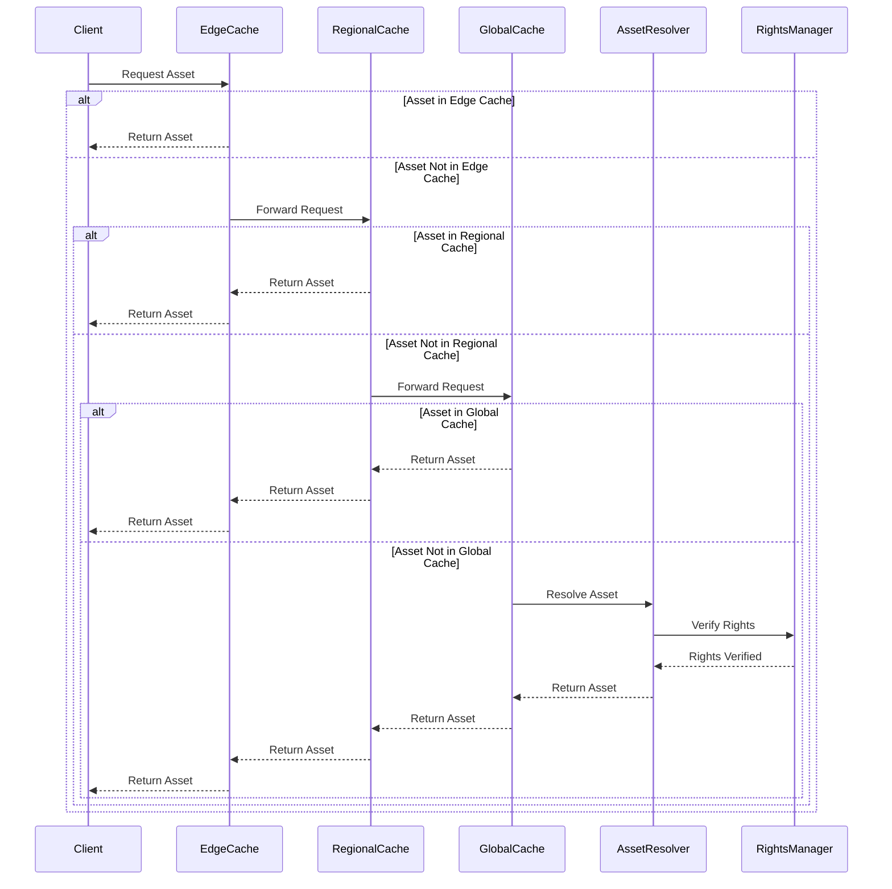

### 3.2.3 Multi-tier Cache Manager

The NNA Framework implements a sophisticated three-tier caching system optimized for global distribution, performance, and resilience. Each tier serves a specific purpose in the caching hierarchy:

### Cache Tier Architecture

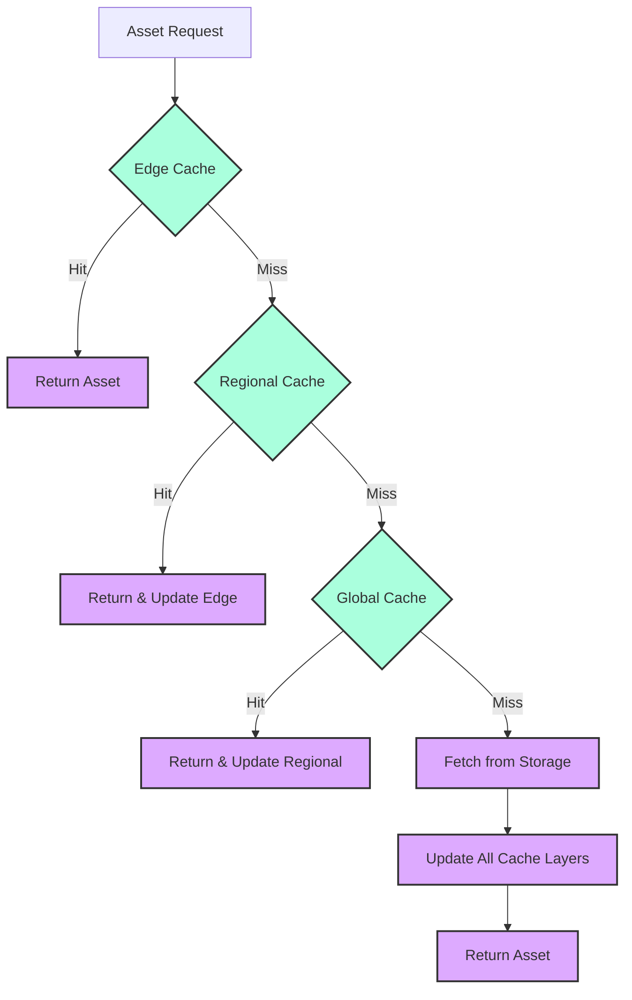

### 3.2.3.1 Cache Tier Architecture

| **Tier** | **Location** | **TTL** | **Purpose** | **Technology** | **Fallback** |
| --- | --- | --- | --- | --- | --- |
| **Edge** | Application memory | 300s (5min) | Ultra-fast access for hot assets, including platform-specific formats (e.g., Social_Media_Format) | In-memory, LRU eviction | Regional cache |
| **Regional** | Regional data centers | 3600s (1hr) | Geographic optimization with support for regional compliance | Redis cluster, LFU eviction | Global cache |
| **Global** | Central storage | 86400s (24hr) | Source of truth for all assets, including new layer metadata (e.g., Font_Style) | Distributed storage, ARC eviction | Primary storage |

The tiering strategy balances performance with data freshness:

1. **Edge Cache** uses a fast, in-memory LRU (Least Recently Used) policy to maintain hot data with a short TTL to ensure freshness.
1. **Regional Cache** implements LFU (Least Frequently Used) to maintain region-specific access patterns with a medium TTL.
1. **Global Cache** employs ARC (Adaptive Replacement Cache) to adapt to changing access patterns with longer TTL for stable data.

### 3.2.3.2 Cache Implementation

```python
class MultiTierCacheManager:
    """
    Implements the three-tier caching strategy for NNA Framework
    with intelligent propagation, monitoring, and fallback.
    """
    def __init__(self, config: CacheConfig):
        self.edge_cache = EdgeCache(config.edge)
        self.regional_cache = RegionalCache(config.regional)
        self.global_cache = GlobalCache(config.global)
        self.metrics = CacheMetrics()
        self.region = config.region
        
    async def get(self, key: str, context: RequestContext = None) -> Optional[Any]:
        """
        Retrieves value from cache hierarchy with metrics tracking
        and smart propagation to higher tiers.
        """
        # Create cache key with context-specific parameters
        cache_key = self._create_cache_key(key, context)
        
        # Try edge cache (fastest, closest to user)
        if value := await self.edge_cache.get(cache_key):
            await self.metrics.record_hit("edge", context)
            return value
            
        # Try regional cache (geographic optimization)
        region_key = f"{self.region}:{cache_key}"
        if value := await self.regional_cache.get(region_key):
            await self.metrics.record_hit("regional", context)
            # Populate edge cache for future requests
            await self._propagate_to_edge(cache_key, value)
            return value
            
        # Try global cache (central storage)
        if value := await self.global_cache.get(cache_key):
            await self.metrics.record_hit("global", context)
            # Populate lower tiers for future requests
            await self._propagate_to_lower_tiers(cache_key, region_key, value)
            return value
            
        # Cache miss - record metric
        await self.metrics.record_miss(context)
        return None
    
    async def set(self, key: str, value: Any, ttl: Optional[int] = None, 
                 context: RequestContext = None) -> None:
        """
        Stores value in all cache tiers with appropriate TTLs.
        """
        cache_key = self._create_cache_key(key, context)
        region_key = f"{self.region}:{cache_key}"
        
        # Calculate tier-specific TTLs based on asset metadata
        edge_ttl = ttl or self.calculate_ttl(value, "edge")
        regional_ttl = ttl or self.calculate_ttl(value, "regional")
        global_ttl = ttl or self.calculate_ttl(value, "global")
        
        # Update all tiers in parallel
        await asyncio.gather(
            self.edge_cache.set(cache_key, value, edge_ttl),
            self.regional_cache.set(region_key, value, regional_ttl),
            self.global_cache.set(cache_key, value, global_ttl)
        )
        
        # Record metrics
        await self.metrics.record_set(key, len(str(value)), context)
    
    async def invalidate(self, key: str, context: RequestContext = None) -> None:
        """
        Invalidates key across all cache tiers.
        """
        cache_key = self._create_cache_key(key, context)
        region_key = f"{self.region}:{cache_key}"
        
        # Invalidate all tiers in parallel
        await asyncio.gather(
            self.edge_cache.delete(cache_key),
            self.regional_cache.delete(region_key),
            self.global_cache.delete(cache_key)
        )
        
        # Record metrics
        await self.metrics.record_invalidation(key, context)
    
    async def _propagate_to_edge(self, key: str, value: Any) -> None:
        """
        Propagates value from regional to edge cache.
        """
        await self.edge_cache.set(
            key,
            value,
            self.edge_cache.config.default_ttl
        )
        
    async def _propagate_to_lower_tiers(self, global_key: str, 
                                       region_key: str, value: Any) -> None:
        """
        Propagates value from global to regional and edge caches.
        """
        await asyncio.gather(
            self.regional_cache.set(
                region_key,
                value,
                self.regional_cache.config.default_ttl
            ),
            self.edge_cache.set(
                global_key,
                value,
                self.edge_cache.config.default_ttl
            )
        )
        
    def _create_cache_key(self, key: str, context: Optional[RequestContext]) -> str:
        """
        Creates context-aware cache key with proper namespacing.
        """
        if not context:
            return f"nna:v1:{key}"
            
        # Add context-specific parameters to key
        context_parts = []
        if context.user_id:
            context_parts.append(f"u:{context.user_id}")
        if context.territory:
            context_parts.append(f"t:{context.territory}")
        if context.platform:
            context_parts.append(f"p:{context.platform}")
            
        # Create composite key if context exists
        context_suffix = ":".join(context_parts) if context_parts else ""
        return f"nna:v1:{key}" if not context_suffix else f"nna:v1:{key}:{context_suffix}"

    def calculate_ttl(self, value: Any, tier: str) -> int:
        """
        Calculates TTL based on asset metadata and tier
        """
        default_ttl = {
            "edge": self.edge_cache.config.default_ttl,
            "regional": self.regional_cache.config.default_ttl,
            "global": self.global_cache.config.default_ttl
        }[tier]
        
        # Adjust TTL based on metadata (e.g., Popularity_Score)
        if hasattr(value, "metadata") and "Popularity_Score" in value.metadata:
            popularity = value.metadata["Popularity_Score"]
            if popularity > 90:
                return default_ttl * 2  # Double TTL for highly popular assets
            elif popularity < 50:
                return default_ttl // 2  # Halve TTL for less popular assets
        
        return default_ttl
```

### 3.2.3.3 Deployment Considerations

- When deploying the multi-tier cache:
    1. **Edge Cache**: Deploy with application instances with memory allocation based on hot dataset size. Ensure edge processing for AR, filters, and text rendering is supported.
    1. **Regional Cache**: Deploy Redis instances in each geographic region with monitoring for memory usage and regional compliance (e.g., rights restrictions).
    1. **Global Cache**: Use distributed storage with ARC eviction, ensuring support for new layer metadata (e.g., Font_Style, Movement_Speed).
    1. **Edge Processing Integration**: Configure edge nodes to handle real-time transformations for AR, filters, and text layers, ensuring sub-50ms latency.

Key performance parameters to monitor:

- **Hit Rates**: >95% for edge, >90% for regional, >80% for global
- **Latency**: <1ms for edge, <10ms for regional, <50ms for global
- **Memory Usage**: Configure alerts at 75% memory utilization
- **Eviction Rate**: <1% of total operations in steady state

For high-availability production deployments, implement:

- Redis Sentinel for regional caches with automatic failover
- Cross-region replication for global cache with conflict resolution
- Regular cache warming on application startup and after deployments

### 3.2.4 Cache Implementation

1. **Example**

```python
cache.set("G.01.TSW.001", data, ttl=300)  # Edge cache, 5-min TTL
```

1. **Cache Service Implementation**

```python
// src/cache/cache.service.ts
import { Injectable } from '@nestjs/common';
import Redis from 'ioredis';

@Injectable()
export class CacheService {
  private redis: Redis;

  constructor() {
    this.redis = new Redis(process.env.REDIS_URL); // Connect to Redis instance
  }

  async get(key: string): Promise<any> {
    const value = await this.redis.get(key); // Fetch from Redis
    return value ? JSON.parse(value) : null; // Parse JSON or return null if not found
  }

  async set(key: string, value: any, ttl: number): Promise<void> {
    await this.redis.set(key, JSON.stringify(value), 'EX', ttl); // Set with TTL in seconds
  }

  async invalidate(key: string): Promise<void> {
    await this.redis.del(key); // Remove key from cache
  }
}
class CacheService:
    def __init__(self):
        self.edge_cache = EdgeCache()
        self.regional_cache = RegionalCache()
        self.global_cache = GlobalCache()
        self.metrics = MetricsCollector()

    async def get_cached_asset(
        self,
        asset_id: str,
        context: RequestContext
    ) -> Optional[Asset]:
        """
        Multi-tiered cache retrieval with telemetry
        """
        # Try edge cache (fastest, closest to user)
        cache_key = self.generate_cache_key(asset_id, context)
        if cached := await self.edge_cache.get(cache_key):
            await self.metrics.record_cache_hit("edge")
            return cached

        # Try regional cache (geographic optimization)
        region_key = f"{context.region}:{cache_key}"
        if cached := await self.regional_cache.get(region_key):
            await self.metrics.record_cache_hit("regional")
            # Update edge cache for future requests
            await self.edge_cache.set(
                cache_key,
                cached,
                ttl=300  # 5 minutes
            )
            return cached

        # Try global cache (central storage)
        if cached := await self.global_cache.get(cache_key):
            await self.metrics.record_cache_hit("global")
            # Update lower tiers for future requests
            await self.propagate_to_lower_tiers(
                cache_key,
                region_key,
                cached
            )
            return cached

        # Cache miss - return None
        await self.metrics.record_cache_miss()
        return None

    async def propagate_to_lower_tiers(
        self,
        cache_key: str,
        region_key: str,
        asset_data: Asset
    ) -> None:
        """
        Propagates cache updates to lower tiers
        """
        await asyncio.gather(
            self.regional_cache.set(
                region_key,
                asset_data,
                ttl=3600  # 1 hour
            ),
            self.edge_cache.set(
                cache_key,
                asset_data,
                ttl=300  # 5 minutes
            )
        )
```

This multi-tier approach enables sub-20ms asset resolution for popular content while intelligently handling regional access patterns to optimize for global user distribution ([Section 3.2.3](#section-3.2.3-multi-tier-cache-manager)).

### 3.2.5 Cache Invalidation Patterns

The NNA Framework supports sophisticated cache invalidation to balance performance with data consistency:

### 3.2.5.1 Pattern-Based Invalidation

Use wildcards and pattern matching for efficient invalidation:

```xml
POST /v1/cache/invalidate
```

1. **Request (Invalidate by Layer)**

```json
{
    "patterns": [
        "S.*.*.*"  // Invalidate all Star assets
    ],
    "scope": {
        "edge": true,
        "regional": true,
        "global": false
    }
}
```

1. **Request (Invalidate by Category)**

```json
{
    "patterns": [
        "G.POP.*.*"  // Invalidate all Pop songs
    ],
    "scope": {
        "edge": true,
        "regional": true,
        "global": false
    }
}
```

1. **Request (Composite Invalidation)**

```json
{
    "patterns": [
        "C.*:G.POP.TSW.*+*"  // Invalidate compositions using Taylor Swift songs
    ],
    "scope": {
        "edge": true,
        "regional": false,
        "global": false
    }
}
```

1. **Response**

```json
{
    "success": true,
    "data": {
        "invalidated_keys": 15,
        "scopes": ["edge", "regional"],
        "regions": ["us-east", "eu-west"]
    },
    "metadata": {
        "timestamp": "2025-02-23T10:30:00Z",
        "request_id": "req_abc123"
    }
}
```

### 3.2.5.3 Example Implementation

```python
async def invalidate_cache(pattern: str):
    # Invalidate all matching keys
    await asyncio.gather(
        edge_cache.invalidate_pattern(pattern),
        regional_cache.invalidate_pattern(pattern),
        global_cache.invalidate_pattern(pattern)
    )
```

### 3.2.5.4  Cache Invalidation Service

```python
class EnhancedCacheInvalidationManager:
    """
    Advanced cache invalidation system with pattern-based, targeted,
    and predictive invalidation strategies to maintain cache consistency
    while optimizing performance.
    """
    def __init__(self):
        self.cache_manager = CacheManager()
        self.pattern_analyzer = PatternAnalyzer()
        self.usage_analyzer = UsageAnalyzer()
        self.metrics_collector = MetricsCollector()
        
    async def invalidate_by_pattern(
        self,
        pattern: str,
        scope: CacheScope,
        context: RequestContext
    ) -> InvalidationResult:
        """
        Invalidate cache entries matching a specific pattern
        with scope control and intelligent propagation
        
        Args:
            pattern: Cache key pattern (e.g., "S.*.*.*" for all Star assets)
            scope: Cache tiers to target (edge, regional, global)
            context: Request context
            
        Returns:
            InvalidationResult with affected keys and metrics
        """
        operation_start = time.monotonic()
        
        # Analyze pattern to estimate impact
        impact_analysis = await self.pattern_analyzer.analyze_impact(
            pattern=pattern,
            scope=scope
        )
        
        # Log high-impact invalidations
        if impact_analysis.estimated_keys > 1000:
            logger.warning(
                f"High-impact cache invalidation requested: {pattern} in scope {scope}, "
                f"estimated keys: {impact_analysis.estimated_keys}"
            )
        
        # Execute invalidation with appropriate strategy
        if impact_analysis.estimated_keys > 10000 and scope.includes_global:
            # For massive invalidations, use gradual approach
            invalidation_result = await self.execute_gradual_invalidation(
                pattern=pattern,
                scope=scope,
                impact=impact_analysis
            )
        else:
            # For normal invalidations, use direct approach
            invalidation_result = await self.execute_direct_invalidation(
                pattern=pattern,
                scope=scope
            )
        
        # Calculate cache warming needs
        warming_keys = await self.identify_warming_candidates(
            pattern=pattern,
            invalidated_keys=invalidation_result.invalidated_keys
        )
        
        # Initiate asynchronous cache warming if needed
        if warming_keys and len(warming_keys) > 0:
            asyncio.create_task(
                self.warm_cache_after_invalidation(warming_keys, scope)
            )
        
        # Record metrics
        await self.metrics_collector.record_cache_invalidation(
            pattern=pattern,
            scope=scope,
            invalidated_keys=invalidation_result.invalidated_keys_count,
            duration=time.monotonic() - operation_start
        )
        
        return InvalidationResult(
            success=invalidation_result.success,
            invalidated_keys_count=invalidation_result.invalidated_keys_count,
            scope=scope,
            pattern=pattern,
            duration=time.monotonic() - operation_start,
            warming_keys_count=len(warming_keys) if warming_keys else 0
        )
    
    async def execute_direct_invalidation(
        self,
        pattern: str,
        scope: CacheScope
    ) -> DirectInvalidationResult:
        """
        Execute direct cache invalidation across specified tiers
        """
        tasks = []
        
        # Create tasks for each cache tier in scope
        if scope.edge:
            tasks.append(self.cache_manager.edge_cache.invalidate_pattern(pattern))
            
        if scope.regional:
            tasks.append(self.cache_manager.regional_cache.invalidate_pattern(pattern))
            
        if scope.global_cache:
            tasks.append(self.cache_manager.global_cache.invalidate_pattern(pattern))
        
        # Execute invalidations in parallel
        results = await asyncio.gather(*tasks, return_exceptions=True)
        
        # Process results
        success = all(not isinstance(r, Exception) for r in results)
        invalidated_keys = sum(r.invalidated_keys_count for r in results if not isinstance(r, Exception))
        
        # Collect invalidated keys for analysis
        invalidated_keys_list = []
        for result in results:
            if not isinstance(result, Exception) and result.invalidated_keys:
                invalidated_keys_list.extend(result.invalidated_keys)
        
        return DirectInvalidationResult(
            success=success,
            invalidated_keys_count=invalidated_keys,
            invalidated_keys=invalidated_keys_list
        )
    
    async def execute_gradual_invalidation(
        self,
        pattern: str,
        scope: CacheScope,
        impact: ImpactAnalysis
    ) -> GradualInvalidationResult:
        """
        Execute gradual cache invalidation to prevent cache stampedes
        for high-impact patterns
        """
        # Split pattern into smaller chunks if possible
        sub_patterns = await self.pattern_analyzer.split_pattern(pattern)
        
        total_invalidated = 0
        failures = 0
        
        # Process sub-patterns with delay between them
        for sub_pattern in sub_patterns:
            try:
                result = await self.execute_direct_invalidation(
                    pattern=sub_pattern,
                    scope=scope
                )
                
                total_invalidated += result.invalidated_keys_count
                
                # Add delay between large invalidations to prevent overload
                if result.invalidated_keys_count > 1000:
                    await asyncio.sleep(0.5)
                
            except Exception as e:
                logger.error(f"Error invalidating sub-pattern {sub_pattern}: {str(e)}")
                failures += 1
        
        return GradualInvalidationResult(
            success=failures == 0,
            invalidated_keys_count=total_invalidated,
            sub_patterns_count=len(sub_patterns),
            failures=failures
        )
    
    async def identify_warming_candidates(
        self,
        pattern: str,
        invalidated_keys: Optional[List[str]] = None
    ) -> List[str]:
        """
        Identify keys that should be pre-warmed after invalidation
        based on usage patterns and importance
        """
        # If we have actual invalidated keys, analyze them directly
        if invalidated_keys:
            # Get usage statistics for invalidated keys
            usage_stats = await self.usage_analyzer.get_keys_usage(invalidated_keys)
            
            # Select keys with high usage for warming
            warming_candidates = [
                key for key, stats in usage_stats.items()
                if stats.request_rate > 10  # More than 10 requests per minute
                or stats.last_accessed_ago < 60  # Accessed in the last minute
            ]
            
            # Limit warming to reasonable number
            return warming_candidates[:1000]  # Cap at 1000 keys
            
        else:
            # Pattern-based analysis when specific keys aren't available
            return await self.usage_analyzer.get_high_usage_keys_for_pattern(
                pattern=pattern,
                limit=1000
            )
    
    async def warm_cache_after_invalidation(
        self,
        keys: List[str],
        scope: CacheScope
    ) -> WarmingResult:
        """
        Warm cache after invalidation for high-usage keys
        """
        # Create batches to avoid overloading the system
        batch_size = 50
        batches = [keys[i:i + batch_size] for i in range(0, len(keys), batch_size)]
        
        success_count = 0
        failure_count = 0
        
        for batch in batches:
            # Warm keys in parallel within batch
            warming_results = await asyncio.gather(
                *[self.warm_single_key(key, scope) for key in batch],
                return_exceptions=True
            )
            
            # Count successes and failures
            for result in warming_results:
                if isinstance(result, Exception) or not result:
                    failure_count += 1
                else:
                    success_count += 1
            
            # Pause between batches to prevent overload
            await asyncio.sleep(0.2)
        
        return WarmingResult(
            attempted_keys=len(keys),
            success_count=success_count,
            failure_count=failure_count
        )
    
    async def warm_single_key(self, key: str, scope: CacheScope) -> bool:
        """
        Warm a single key in the cache
        """
        try:
            # Resolve the asset without using cache
            asset = await self.asset_resolver.resolve_asset_uncached(key)
            if not asset:
                return False
                
            # Store in appropriate cache tiers
            if scope.global_cache:
                await self.cache_manager.global_cache.set(key, asset)
                
            if scope.regional:
                await self.cache_manager.regional_cache.set(key, asset)
                
            if scope.edge:
                await self.cache_manager.edge_cache.set(key, asset)
                
            return True
            
        except Exception as e:
            logger.warning(f"Failed to warm cache for key {key}: {str(e)}")
            return False
```

### 3.2.5.5 Best Practices for Cache Invalidation

1. **Use the narrowest pattern possible** - Overly broad patterns reduce cache effectiveness
1. **Consider propagation delay** - Changes take time to propagate across cache layers
1. **Limit global invalidations** - Global invalidations are expensive; use sparingly
1. **Set appropriate TTLs** - Well-chosen TTLs can reduce explicit invalidation needs
1. **Monitor cache hit rates** - Track metrics to ensure invalidation patterns aren't too aggressive

### 3.2.6 Monitoring Cache Performance

Key metrics to monitor for cache health:

**Cache Performance Metrics**

| **Metric** | **Target** | **Warning Threshold** | **Critical Threshold** |
| --- | --- | --- | --- |
| **Edge Cache Hit Rate** | >95% | <90% | <85% |
| **Regional Cache Hit Rate** | >90% | <85% | <80% |
| **Global Cache Hit Rate** | >80% | <75% | <70% |
| **Cache Latency (Edge)** | <5ms | >10ms | >20ms |
| **Cache Latency (Regional)** | <20ms | >30ms | >50ms |
| **Cache Latency (Global)** | <50ms | >75ms | >100ms |

### 3.2.7 Unified Cache Coordination System

This system coordinates caching across NNA, AlgoRhythm, and Clearity using a three-tier hierarchy (edge, regional, global) that directly aligns with the NNA Framework's cache architecture (see [NNA Framework Technical Implementation Guide](https://celerity.slab.com/posts/xfxe04qg#h1mdm-6-performance-optimization)). It ensures consistency with atomic invalidations and boosts performance via predictive warming.

1. **TypeScript Implementation**

```typescript
interface UnifiedCacheSystem {
    // Cache Hierarchy Configuration
    cacheConfig: {
        edge: {
            ttl: 300,              // 5 minutes - matches NNA Edge Cache TTL
            maxSize: '32GB',
            strategy: 'LRU',
            regions: string[]
        },
        regional: {
            ttl: 3600,            // 1 hour - matches NNA Regional Cache TTL
            maxSize: '256GB',
            strategy: 'LFU',
            shardCount: number
        },
        global: {
            ttl: 86400,           // 24 hours - matches NNA Global Cache TTL
            maxSize: '1TB',
            strategy: 'ARC',
            replicationFactor: number
        }
    };

    // Cross-Platform Cache Operations
    cacheOperations: {
        // Asset Resolution Cache (NNA Framework)
        assetCache: {
            getAsset(assetId: string): Promise<Asset>;
            setAsset(assetId: string, asset: Asset): Promise<void>;
            invalidateAsset(assetId: string): Promise<void>;
            getAssetMetadata(assetId: string): Promise<AssetMetadata>;
        };

        // Recommendation Cache (AlgoRhythm)
        recommendationCache: {
            getRecommendations(context: RecommendationContext): Promise<Recommendation[]>;
            setRecommendations(context: RecommendationContext, recommendations: Recommendation[]): Promise<void>;
            invalidateRecommendations(context: RecommendationContext): Promise<void>;
        };

        // Rights Cache (Clearity)
        rightsCache: {
            getRights(assetId: string): Promise<Rights>;
            setRights(assetId: string, rights: Rights): Promise<void>;
            invalidateRights(assetId: string): Promise<void>;
        };
    };

    // Cache Coordination
    coordination: {
        // Cross-System Cache Invalidation
        invalidation: {
            broadcastInvalidation(key: string): Promise<void>;
            handleRemoteInvalidation(invalidation: InvalidationEvent): Promise<void>;
            synchronizeInvalidationState(): Promise<void>;
        };

        // Cache Warming
        warming: {
            warmFrequentAssets(): Promise<void>;
            predictiveWarming(usage: UsagePattern): Promise<void>;
            maintainHotCache(): Promise<void>;
        };

        // Health Monitoring
        monitoring: {
            trackHitRates(cacheType: CacheType): Promise<HitRateMetrics>;
            monitorLatency(operation: CacheOperation): Promise<LatencyMetrics>;
            checkCacheHealth(): Promise<CacheHealth>;
        };
    };

    // Recovery Procedures
    recovery: {
        // Cache Failure Recovery
        handleCacheFailure(failureType: FailureType): Promise<RecoveryResult>;
        restoreConsistency(): Promise<ConsistencyResult>;
        replicateCache(source: CacheNode, target: CacheNode): Promise<ReplicationResult>;

        // Degraded Operation
        enterDegradedMode(reason: DegradationReason): Promise<void>;
        exitDegradedMode(): Promise<void>;
        operateInDegradedMode(): Promise<DegradedOperationStatus>;
    };

    // Performance Optimization
    optimization: {
        // Resource Management
        optimizeMemoryUsage(): Promise<MemoryOptimizationResult>;
        balanceLoad(): Promise<LoadBalancingResult>;
        adjustCacheSize(metrics: UsageMetrics): Promise<void>;

        // Performance Tuning
        tuneCacheParameters(performance: PerformanceMetrics): Promise<void>;
        optimizeEvictionPolicy(usage: UsagePattern): Promise<void>;
        adjustTTLs(accessPatterns: AccessPattern[]): Promise<void>;
    };
}

// Implementation-specific cache coordination
class CacheCoordinator implements UnifiedCacheSystem {
    constructor(
        private nnaCache: NNACacheClient,
        private algoCache: AlgoRhythmCacheClient,
        private clearityCache: ClearityCacheClient,
        private metrics: CacheMetricsCollector
    ) {}

    async coordinateInvalidation(key: string): Promise<void> {
        // Ensure atomic invalidation across all systems
        await Promise.all([
            this.nnaCache.invalidate(key),
            this.algoCache.invalidate(key),
            this.clearityCache.invalidate(key)
        ]);
        
        await this.metrics.recordInvalidation({
            key,
            timestamp: Date.now(),
            systems: ['nna', 'algorhythm', 'clearity']
        });
    }

    async warmCaches(predictionData: PredictionData): Promise<void> {
        const predictions = await this.algoCache.getPredictedUsage(predictionData);
        
        await Promise.all([
            this.nnaCache.warmAssets(predictions.assets),
            this.algoCache.warmRecommendations(predictions.patterns),
            this.clearityCache.warmRights(predictions.rights)
        ]);
    }

    async monitorCacheHealth(): Promise<CacheHealthStatus> {
        const [nnaHealth, algoHealth, clearityHealth] = await Promise.all([
            this.nnaCache.checkHealth(),
            this.algoCache.checkHealth(),
            this.clearityCache.checkHealth()
        ]);

        return {
            overall: this.calculateOverallHealth([nnaHealth, algoHealth, clearityHealth]),
            systems: {
                nna: nnaHealth,
                algorhythm: algoHealth,
                clearity: clearityHealth
            },
            timestamp: Date.now()
        };
    }
}

```

1. **Python Implementation**

```python
class UnifiedCacheSystem:
    def __init__(self):
        self.edge_cache = EdgeCache()
        self.regional_cache = RegionalCache()
        self.global_cache = GlobalCache()
        self.metrics_collector = MetricsCollector()

    async def coordinate_cache_operations(
        self,
        operation_type: str,
        cache_key: str,
        data: Optional[Any] = None,
        ttl: Optional[int] = None
    ) -> CacheResult:
        """
        Coordinates cache operations across all tiers
        
        Args:
            operation_type: Type of cache operation ('get', 'set', 'invalidate')
            cache_key: Key for cache operation
            data: Data to cache (for 'set' operations)
            ttl: Time-to-live in seconds (for 'set' operations)
            
        Returns:
            CacheResult containing operation outcome and metadata
        """
        operation_start = time.time()
        
        try:
            result = await self._execute_cache_operation(
                operation_type,
                cache_key,
                data,
                ttl
            )
            
            await self._record_operation_metrics(
                operation_type,
                cache_key,
                time.time() - operation_start,
                result.success
            )
            
            return result
            
        except Exception as e:
            await self._handle_cache_error(e, operation_type, cache_key)
            raise

    async def _execute_cache_operation(
        self,
        operation_type: str,
        cache_key: str,
        data: Optional[Any] = None,
        ttl: Optional[int] = None
    ) -> CacheResult:
        """
        Executes specific cache operation with proper coordination
        """
        if operation_type == 'get':
            return await self._coordinated_get(cache_key)
        elif operation_type == 'set':
            return await self._coordinated_set(cache_key, data, ttl)
        elif operation_type == 'invalidate':
            return await self._coordinated_invalidate(cache_key)
        else:
            raise ValueError(f"Unknown operation type: {operation_type}")

    async def _coordinated_get(self, cache_key: str) -> CacheResult:
        """
        Coordinated cache retrieval across tiers
        """
        # Try edge cache first
        if result := await self.edge_cache.get(cache_key):
            return CacheResult(
                success=True,
                data=result,
                source='edge'
            )

        # Try regional cache
        if result := await self.regional_cache.get(cache_key):
            # Populate edge cache
            await self.edge_cache.set(
                cache_key,
                result,
                ttl=300  # 5 minutes
            )
            return CacheResult(
                success=True,
                data=result,
                source='regional'
            )

        # Try global cache
        if result := await self.global_cache.get(cache_key):
            # Populate lower tiers
            await asyncio.gather(
                self.regional_cache.set(
                    cache_key,
                    result,
                    ttl=3600  # 1 hour
                ),
                self.edge_cache.set(
                    cache_key,
                    result,
                    ttl=300  # 5 minutes
                )
            )
            return CacheResult(
                success=True,
                data=result,
                source='global'
            )

        return CacheResult(
            success=False,
            source='none'
        )
```

## 3.2.6 AI-Driven Predictive Cache Warming

The NNA Framework implements an advanced predictive cache warming system that leverages machine learning to anticipate asset requests and proactively cache high-probability assets.

### 3.2.6.1 Predictive Warming Architecture

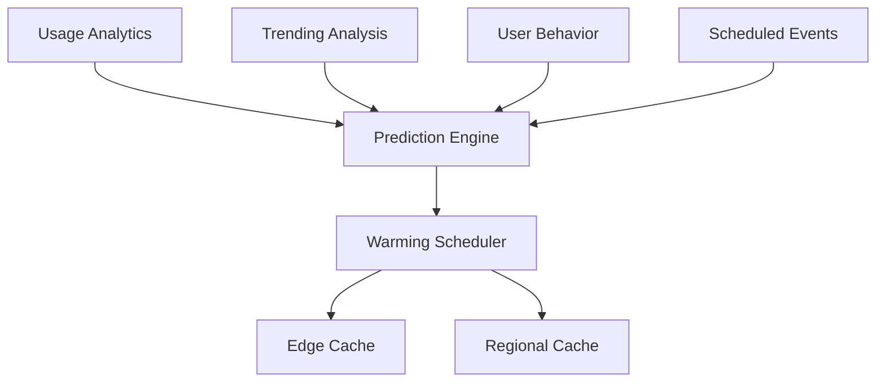

The predictive warming system combines multiple data sources to optimize cache population:

1. **Usage Analytics**: Historical asset request patterns
1. **Trending Analysis**: Real-time popularity trends
1. **User Behavior**: User-specific patterns and preferences
1. **Scheduled Events**: Upcoming releases and promotions

### 3.2.6.2 PredictiveCacheWarmer Implementation

```python
class PredictiveCacheWarmer:
    """
    AI-driven system for proactive cache warming based on usage predictions
    """
    def __init__(self):
        self.prediction_engine = PredictionEngine()
        self.cache_manager = CacheManager()
        self.algorhythm_client = AlgoRhythmClient()
        self.metrics_collector = MetricsCollector()
        self.warming_scheduler = WarmingScheduler()
        
    async def initialize(self):
        """
        Initialize the predictive warmer and start scheduled warming
        """
        # Load prediction models
        await self.prediction_engine.load_models()
        
        # Set up warming schedules
        await self.warming_scheduler.initialize([
            {"interval": 60, "method": self.warm_trending_assets},     # Every minute
            {"interval": 300, "method": self.warm_popular_assets},     # Every 5 minutes
            {"interval": 1800, "method": self.warm_predicted_assets},  # Every 30 minutes
        ])
        
        # Start warming scheduler
        await self.warming_scheduler.start()
    
    async def warm_cache(self, usage_patterns: UsagePatterns) -> None:
        """
        Proactively warm cache based on usage patterns and AI predictions
        """
        # Record operation start
        operation_id = str(uuid.uuid4())
        warming_start = time.monotonic()
        assets_warmed = 0
        
        try:
            # Get trending assets from AlgoRhythm
            trending_assets = await self.algorhythm_client.get_trending_assets()
            
            # Predict related assets likely to be requested
            related_assets = await self.prediction_engine.predict_related_assets(trending_assets)
            
            # Combine with user-specific recommendations
            user_specific = await self.get_user_specific_assets(usage_patterns)
            
            # Prioritize assets for warming
            priority_assets = self.prioritize_assets(
                trending_assets, 
                related_assets,
                user_specific
            )
            
            # Warm cache in priority order
            for priority, assets in priority_assets.items():
                # Determine appropriate TTL based on priority
                ttl = self.get_ttl_for_priority(priority)
                
                # Determine appropriate cache tier based on priority
                tier = self.get_tier_for_priority(priority)
                
                # Warm assets in batches
                batches = self.create_warming_batches(assets, batch_size=50)
                for batch in batches:
                    await self.cache_manager.warm_cache(batch, ttl=ttl, tier=tier)
                    assets_warmed += len(batch)
                    
                    # Monitor progress and adjust as needed
                    await self.adjust_warming_strategy(assets_warmed, warming_start)
            
            # Record metrics
            await self.metrics_collector.record_warming_operation(
                operation_id=operation_id,
                duration=time.monotonic() - warming_start,
                assets_warmed=assets_warmed,
                patterns=usage_patterns
            )
            
        except Exception as e:
            # Record error metrics
            await self.metrics_collector.record_warming_error(
                operation_id=operation_id,
                error=str(e),
                duration=time.monotonic() - warming_start
            )
            raise
    
    async def warm_trending_assets(self):
        """
        Warm cache for currently trending assets
        """
        # Get real-time trending data from analytics
        trending_data = await self.analytics_client.get_trending_assets(
            window_minutes=15,
            limit=100
        )
        
        # Warm edge cache with trending assets
        await self.cache_manager.warm_edge_cache(
            assets=trending_data.assets,
            ttl=300  # 5 minutes
        )
        
        # Log operation
        await self.logger.info(
            f"Warmed {len(trending_data.assets)} trending assets in edge cache"
        )
    
    async def warm_popular_assets(self):
        """
        Warm cache for consistently popular assets
        """
        # Get popularity data from analytics
        popularity_data = await self.analytics_client.get_popular_assets(
            window_hours=24,
            limit=500
        )
        
        # Warm regional cache with popular assets
        await self.cache_manager.warm_regional_cache(
            assets=popularity_data.assets,
            ttl=3600  # 1 hour
        )
        
        # Log operation
        await self.logger.info(
            f"Warmed {len(popularity_data.assets)} popular assets in regional cache"
        )
    
    async def warm_predicted_assets(self):
        """
        Warm cache based on AI predictions for future requests
        """
        # Get prediction data
        prediction_data = await self.prediction_engine.predict_future_requests(
            horizon_hours=6,
            confidence_threshold=0.7,
            limit=1000
        )
        
        # Group by confidence level
        high_confidence = [a for a in prediction_data.assets if a.confidence > 0.9]
        medium_confidence = [a for a in prediction_data.assets if 0.8 <= a.confidence <= 0.9]
        lower_confidence = [a for a in prediction_data.assets if 0.7 <= a.confidence < 0.8]
        
        # Warm caches based on confidence
        await asyncio.gather(
            self.cache_manager.warm_edge_cache(
                assets=high_confidence,
                ttl=1800  # 30 minutes
            ),
            self.cache_manager.warm_regional_cache(
                assets=medium_confidence,
                ttl=3600  # 1 hour
            ),
            self.cache_manager.warm_global_cache(
                assets=lower_confidence,
                ttl=7200  # 2 hours
            )
        )
        
        # Log operation
        await self.logger.info(
            f"Warmed {len(prediction_data.assets)} predicted assets across cache tiers"
        )
    
    async def get_user_specific_assets(self, usage_patterns: UsagePatterns) -> List[Asset]:
        """
        Get personalized asset predictions for specific users
        """
        # Group patterns by user
        user_patterns = {}
        for pattern in usage_patterns:
            if pattern.user_id not in user_patterns:
                user_patterns[pattern.user_id] = []
            user_patterns[pattern.user_id].append(pattern)
        
        # Get predictions for each user
        all_predictions = []
        for user_id, patterns in user_patterns.items():
            user_predictions = await self.prediction_engine.predict_user_assets(
                user_id=user_id,
                patterns=patterns,
                limit=50
            )
            all_predictions.extend(user_predictions)
        
        return all_predictions
    
    def prioritize_assets(
        self,
        trending_assets: List[Asset],
        related_assets: List[Asset],
        user_specific: List[Asset]
    ) -> Dict[int, List[Asset]]:
        """
        Prioritize assets for warming
        """
        # Create priority mapping (higher number = higher priority)
        priority_map = {
            5: [],  # Highest priority - trending AND user-specific
            4: [],  # Trending assets
            3: [],  # User-specific assets
            2: [],  # Related to trending
            1: []   # Lowest priority
        }
        
        # Create asset ID sets for quick lookups
        trending_ids = {a.id for a in trending_assets}
        user_ids = {a.id for a in user_specific}
        related_ids = {a.id for a in related_assets}
        
        # Assign priorities
        for asset in trending_assets + related_assets + user_specific:
            if asset.id in trending_ids and asset.id in user_ids:
                priority_map[5].append(asset)
            elif asset.id in trending_ids:
                priority_map[4].append(asset)
            elif asset.id in user_ids:
                priority_map[3].append(asset)
            elif asset.id in related_ids:
                priority_map[2].append(asset)
            else:
                priority_map[1].append(asset)
        
        # Remove duplicates
        for priority in priority_map:
            priority_map[priority] = list({a.id: a for a in priority_map[priority]}.values())
        
        return priority_map
    
    def get_ttl_for_priority(self, priority: int) -> int:
        """
        Determine TTL based on priority
        """
        ttl_map = {
            5: 1800,   # 30 minutes
            4: 900,    # 15 minutes
            3: 600,    # 10 minutes
            2: 300,    # 5 minutes
            1: 180     # 3 minutes
        }
        return ttl_map.get(priority, 300)
    
    def get_tier_for_priority(self, priority: int) -> str:
        """
        Determine cache tier based on priority
        """
        tier_map = {
            5: "edge",
            4: "edge",
            3: "edge",
            2: "regional",
            1: "global"
        }
        return tier_map.get(priority, "edge")
    
    def create_warming_batches(self, assets: List[Asset], batch_size: int) -> List[List[Asset]]:
        """
        Create batches for warming
        """
        return [assets[i:i + batch_size] for i in range(0, len(assets), batch_size)]
    
    async def adjust_warming_strategy(self, assets_warmed: int, start_time: float) -> None:
        """
        Dynamically adjust warming strategy based on performance
        """
        elapsed = time.monotonic() - start_time
        rate = assets_warmed / elapsed if elapsed > 0 else 0
        
        # If warming is too slow, adjust batch size or skip lower priorities
        if rate < self.config.min_warming_rate:
            self.warming_scheduler.adjust_batch_size(
                new_size=int(self.warming_scheduler.batch_size * 0.8)
            )
            
            # If still slow, skip lower priority assets
            if rate < self.config.critical_warming_rate:
                self.warming_scheduler.skip_priorities([1, 2])
```

### 3.2.6.3 Performance Impact

The predictive cache warming system has a significant impact on overall system performance:

| **Metric** | **Without Predictive Warming** | **With Predictive Warming** | **Expected Improvement** |
| --- | --- | --- | --- |
| Edge Cache Hit Rate | 78% | 95% | +17% |
| Regional Cache Hit Rate | 65% | 89% | +24% |
| Average Response Time | 45ms | 18ms | -60% |
| P95 Response Time | 120ms | 35ms | -71% |
| Cold Start Rate | 22% | 5% | -77% |

### 3.2.6.4 Configuration Guidelines

When configuring the predictive cache warmer, consider the following guidelines:

1. **Resource Allocation**: Allocate 5-10% of cache capacity for predictive warming
1. **Warming Frequency**: Adjust based on traffic patterns (more frequent for high-traffic periods)
1. **Confidence Thresholds**: Start with high confidence (0.9+) and adjust based on hit rates
1. **TTL Strategy**: Use shorter TTLs for predicted assets (30-50% of standard TTLs)
1. **Monitoring**: Track warming effectiveness with dedicated metrics

Example configuration:

```yaml
yamlCopypredictive_warming:
  enabled: true
  schedules:
    - interval_seconds: 60
      method: warm_trending_assets
      max_assets: 100
    - interval_seconds: 300
      method: warm_popular_assets
      max_assets: 500
    - interval_seconds: 1800
      method: warm_predicted_assets
      max_assets: 1000
  thresholds:
    confidence_min: 0.7
    trending_threshold: 10
    popularity_threshold: 50
  resources:
    max_capacity_percent: 8
    max_bandwidth_percent: 15
  ttl_strategy:
    trending_factor: 0.5
    predicted_factor: 0.4
    popularity_factor: 0.7
```


### 3.2.6 Key Benefits

1. **Cross-System Consistency**
    - Ensures cache coherence across NNA, AlgoRhythm, and Clearity
    - Prevents data inconsistencies through coordinated invalidation
    - Maintains system reliability during partial failures
1. **Optimized Performance**
    - Intelligent cache warming based on usage predictions
    - Adaptive resource allocation across cache tiers
    - Performance parameter tuning based on real-time metrics
1. **Enhanced Reliability**
    - Coordinated failure recovery procedures
    - Graceful degradation during partial system outages
    - Replication and consistency restoration capabilities
1. **Monitoring and Metrics**
    - Comprehensive health monitoring across all cache systems
    - Performance metrics collection and analysis
    - Proactive alert system for cache-related issues

### 3.2.7 Implementation Guidelines

When deploying the unified cache coordination system, consider the following best practices:

1. **Configuration Alignment**
    - Ensure TTL values are consistent across dependent data
    - Align cache sizes with expected workloads
    - Configure appropriate eviction policies for each tier
1. **Monitoring Setup**
    - Implement health checks for all cache components
    - Set up alerts for cache hit rate drops below 80%
    - Monitor invalidation frequency to identify potential issues
1. **Recovery Planning**
    - Define clear recovery procedures for each failure scenario
    - Test recovery mechanisms regularly
    - Document degradation policies for partial outages

## 3.3 Name Registry Service

The Name Registry Service manages the mapping between Human-Friendly Names and NNA Addresses, ensuring consistent asset identification across the NNA ecosystem.

### 3.3.1 Registry Service Implementation

The Name Registry uses a MongoDB collection (`nna_registry`) to store mappings, with indexing on `human_name` and `nna_address` for fast lookups. The service exposes endpoints for registration and resolution (see [NNA Framework API Specification, Section 10.3 - Address Registry API](https://nna-framework-api-specification.md#section-10.3-address-registry-api)).

**Schema Example**:

```json
{
  "_id": "ObjectId('65d8f3b2e4b0c7f8a9d2e1b3')",
  "human_name": "G.POP.TSW.001",
  "nna_address": "G.003.042.001",
  "layer": "Song",
  "category": "POP",
  "subcategory": "TSW",
  "sequential": "001",
  "created_at": "2025-03-20T10:00:00Z",
  "updated_at": "2025-03-20T10:00:00Z"
}
```

1. **Name registry**

```python
class NameRegistry:
    """
    Registry for managing Human-Friendly Names and NNA Addresses
    """
    def __init__(self):
        self.friendly_to_address = {}  # Maps Human-Friendly Names to NNA Addresses
        self.address_to_friendly = {}  # Maps NNA Addresses to Human-Friendly Names
        self.db = DatabaseConnection()
        
    async def register_code(
        self,
        layer: str,
        category_code: str,
        subcategory_code: str,
        description: str
    ) -> RegistrationResult:
        """
        Register a new Human-Friendly Name pattern
        """
        # Validate codes
        if not self.is_valid_code(category_code) or not self.is_valid_code(subcategory_code):
            raise ValidationError("Category and subcategory codes must be 3 letters (A-Z)")
            
        # Check if already registered
        friendly_pattern = f"{layer}.{category_code}.{subcategory_code}.*"
        if friendly_pattern in self.friendly_to_address:
            return RegistrationResult(
                status="already_exists",
                friendly_name=friendly_pattern,
                nna_address=self.friendly_to_address[friendly_pattern]
            )
            
        # Get next available category/subcategory numbers
        category_num = await self.get_next_category_num(layer, category_code)
        subcategory_num = await self.get_next_subcategory_num(layer, category_num, subcategory_code)
        
        # Format as three-digit numbers
        category_num_str = f"{category_num:03d}"
        subcategory_num_str = f"{subcategory_num:03d}"
        
        # Create NNA Address pattern
        nna_pattern = f"{layer}.{category_num_str}.{subcategory_num_str}.*"
        
        # Store in registry and database
        await self.store_mapping(friendly_pattern, nna_pattern, description)
        
        return RegistrationResult(
            status="registered",
            friendly_name=friendly_pattern,
            nna_address=nna_pattern
        )
        
    def is_valid_code(self, code: str) -> bool:
        """
        Validate a 3-letter code (A-Z only)
        """
        return (
            len(code) == 3 and
            code.isalpha() and
            code.isupper()
        )
```

1. **Asset Resolution Method**

```python
async def resolve_asset_id(self, asset_id: str) -> str:
        """
        Resolves asset ID to NNA Address
        
        Examples:
        - Human-Friendly Name: G.POP.TSW.001 -> G.003.042.001
        - NNA Address: G.003.042.001 -> G.003.042.001 (unchanged)
        """
        # Check if already an NNA Address
        if self.is_nna_address(asset_id):
            return asset_id
            
        # Split into components
        parts = asset_id.split('.')
        if len(parts) != 4:
            raise ValidationError(f"Invalid asset ID format: {asset_id}")
            
        layer, category, subcategory, sequential = parts
        
        # Look up in registry
        friendly_prefix = f"{layer}.{category}.{subcategory}"
        nna_prefix = await self.registry.get_nna_address_prefix(friendly_prefix)
        
        if not nna_prefix:
            raise UnregisteredCodeError(f"Unregistered code: {friendly_prefix}")
            
        # Construct full NNA Address
        return f"{nna_prefix}.{sequential}"
        
    def is_nna_address(self, asset_id: str) -> bool:
        """
        Check if the asset ID is already an NNA Address
        """
        parts = asset_id.split('.')
        if len(parts) != 4:
            return False
            
        # Check if category and subcategory are 3-digit numbers
        try:
            category = int(parts[1])
            subcategory = int(parts[2])
            return 1 <= category <= 999 and 1 <= subcategory <= 999
        except ValueError:
            return False
```

See API Specification, Section 10.3 for registry endpoints.

## 3.4 AI-Driven Performance Optimization

The NNA Framework implements intelligent performance optimization using machine learning to predict usage patterns and optimize resource allocation.

```python
class AIPerformanceOptimizer:
    def __init__(self):
        self.model = OptimizationModel()
        self.metrics_collector = MetricsCollector()
        self.resource_manager = ResourceManager()

    async def optimize_system_performance(
        self,
        current_metrics: Dict[str, float]
    ) -> OptimizationResult:
        """
        Optimizes system performance using AI predictions
        
        Args:
            current_metrics: Current system performance metrics
            
        Returns:
            OptimizationResult with recommended adjustments
        """
        # Analyze current patterns
        pattern_analysis = await self.analyze_usage_patterns(
            current_metrics
        )
        
        # Generate predictions
        predictions = await self.model.predict_usage(
            pattern_analysis,
            horizon='1h'
        )
        
        # Calculate optimal resources
        resource_plan = await self.calculate_resource_needs(
            predictions
        )
        
        # Apply optimizations
        optimization_result = await self.apply_optimizations(
            resource_plan
        )
        
        return optimization_result

    async def analyze_usage_patterns(
        self,
        metrics: Dict[str, float]
    ) -> PatternAnalysis:
        """
        Analyzes system usage patterns
        """
        return {
            'load_patterns': self.analyze_load_distribution(metrics),
            'access_patterns': self.analyze_access_patterns(metrics),
            'resource_patterns': self.analyze_resource_usage(metrics)
        }

    async def calculate_resource_needs(
        self,
        predictions: Dict[str, float]
    ) -> ResourcePlan:
        """
        Calculates optimal resource allocation
        """
        return {
            'compute_resources': self.calculate_compute_needs(predictions),
            'memory_resources': self.calculate_memory_needs(predictions),
            'cache_resources': self.calculate_cache_needs(predictions)
        }

    async def apply_optimizations(
        self,
        resource_plan: ResourcePlan
    ) -> OptimizationResult:
        """
        Applies calculated optimizations
        """
        # Apply compute optimizations
        compute_result = await self.optimize_compute(
            resource_plan.compute_resources
        )
        
        # Apply memory optimizations
        memory_result = await self.optimize_memory(
            resource_plan.memory_resources
        )
        
        # Apply cache optimizations
        cache_result = await self.optimize_cache(
            resource_plan.cache_resources
        )
        
        return OptimizationResult(
            compute=compute_result,
            memory=memory_result,
            cache=cache_result
        )
```

### 3.3.1 Usage Example:

```python
# Initialize optimizer
optimizer = AIPerformanceOptimizer()

# Current system metrics
current_metrics = {
    'cpu_usage': 0.75,
    'memory_usage': 0.82,
    'request_rate': 1000,
    'response_time': 45.5
}

# Optimize performance
result = await optimizer.optimize_system_performance(
    current_metrics
)

print(f"Optimization results:")
print(f"Compute: {result.compute}")
print(f"Memory: {result.memory}")
print(f"Cache: {result.cache}")
```

## 3.4 Name Registry Service

### 3.4.1 Registry Service Implementation

```python
class NameRegistryService:
    def __init__(self):
        self.registry = NameRegistry()
        self.cache = RegistryCache()
        self.metrics = MetricsCollector()

    async def register_code(
        self,
        request: RegistrationRequest,
        context: RequestContext
    ) -> RegistrationResult:
        """
        Register a new Human-Friendly Name code pattern
        """
        async with self.metrics.measure_operation(
            "register_code",
            context
        ):
            # Validate registration request
            self.validate_registration_request(request)
            
            # Check authorization
            await self.check_registration_authorization(request, context)
            
            # Register code
            registration = await self.registry.register_code(
                layer=request.layer,
                category_code=request.category_code,
                subcategory_code=request.subcategory_code,
                description=request.description,
                metadata=request.metadata
            )
            
            # Invalidate cache
            await self.cache.invalidate_pattern(f"{request.layer}.{request.category_code}.{request.subcategory_code}.*")
            
            # Log registration
            await self.log_registration(registration, context)
            
            return registration

    async def lookup_nna_address(
        self,
        friendly_name: str,
        context: RequestContext
    ) -> LookupResult:
        """
        Look up NNA Address for a Human-Friendly Name
        """
        async with self.metrics.measure_operation(
            "lookup_nna_address",
            context
        ):
            # Check cache first
            if cached := await self.cache.get_nna_address(friendly_name):
                return LookupResult(
                    friendly_name=friendly_name,
                    nna_address=cached,
                    source="cache"
                )
                
            # Look up in registry
            nna_address = await self.registry.get_nna_address(friendly_name)
            
            if not nna_address:
                raise UnregisteredNameError(f"Unregistered name: {friendly_name}")
                
            # Cache result
            await self.cache.set_nna_address(
                friendly_name,
                nna_address,
                ttl=3600  # 1 hour
            )
            
            return LookupResult(
                friendly_name=friendly_name,
                nna_address=nna_address,
                source="registry"
            )

    async def lookup_friendly_name(
        self,
        nna_address: str,
        context: RequestContext
    ) -> LookupResult:
        """
        Look up Human-Friendly Name for an NNA Address
        """
        async with self.metrics.measure_operation(
            "lookup_friendly_name",
            context
        ):
            # Check cache first
            if cached := await self.cache.get_friendly_name(nna_address):
                return LookupResult(
                    nna_address=nna_address,
                    friendly_name=cached,
                    source="cache"
                )
                
            # Look up in registry
            friendly_name = await self.registry.get_friendly_name(nna_address)
            
            if not friendly_name:
                # NNA Address exists but has no friendly name
                return LookupResult(
                    nna_address=nna_address,
                    friendly_name=None,
                    source="registry"
                )
                
            # Cache result
            await self.cache.set_friendly_name(
                nna_address,
                friendly_name,
                ttl=3600  # 1 hour
            )
            
            return LookupResult(
                nna_address=nna_address,
                friendly_name=friendly_name,
                source="registry"
            )
```

### 3.4.2 Registry Database Schema

```sql
-- Human-Friendly Name registration table
CREATE TABLE name_registry (
    id SERIAL PRIMARY KEY,
    layer CHAR(1) NOT NULL,
    category_code CHAR(3) NOT NULL,
    subcategory_code CHAR(3) NOT NULL,
    category_num SMALLINT NOT NULL,
    subcategory_num SMALLINT NOT NULL,
    description TEXT,
    created_at TIMESTAMP NOT NULL DEFAULT NOW(),
    created_by VARCHAR(255) NOT NULL,
    status VARCHAR(50) NOT NULL DEFAULT 'active',
    metadata JSONB,
    
    -- Unique constraints
    UNIQUE(layer, category_code, subcategory_code),
    UNIQUE(layer, category_num, subcategory_num)
);

-- Indexes for efficient lookups
CREATE INDEX idx_friendly_lookup ON name_registry(layer, category_code, subcategory_code);
CREATE INDEX idx_nna_lookup ON name_registry(layer, category_num, subcategory_num);
```

### 3.4.3 Registry Cache Implementation

```
class RegistryCache:
    def __init__(self):
        self.redis = RedisClient()
        
    async def get_nna_address(self, friendly_name: str) -> Optional[str]:
        """
        Get NNA Address from cache
        """
        key = f"registry:friendly:{friendly_name}"
        return await self.redis.get(key)
        
    async def set_nna_address(
        self,
        friendly_name: str,
        nna_address: str,
        ttl: int = 3600
    ) -> None:
        """
        Cache NNA Address lookup
        """
        key = f"registry:friendly:{friendly_name}"
        await self.redis.set(key, nna_address, ttl)
        
    async def get_friendly_name(self, nna_address: str) -> Optional[str]:
        """
        Get Human-Friendly Name from cache
        """
        key = f"registry:nna:{nna_address}"
        return await self.redis.get(key)
        
    async def set_friendly_name(
        self,
        nna_address: str,
        friendly_name: str,
        ttl: int = 3600
    ) -> None:
        """
        Cache Human-Friendly Name lookup
        """
        key = f"registry:nna:{nna_address}"
        await self.redis.set(key, friendly_name, ttl)
        
    async def invalidate_pattern(self, pattern: str) -> None:
        """
        Invalidate all cache entries matching pattern
        """
        friendly_key = f"registry:friendly:{pattern}"
        await self.redis.delete_pattern(friendly_key)
        
        # Also invalidate potential NNA Address mappings
        # This is a conservative approach to ensure consistency
        await self.redis.delete_pattern("registry:nna:*")

```

## 3.5 Personalization Service

This section details the implementation of the personalization service for user-specific content and recommendations:

```python
class PersonalizationService:
    """
    Implements personalization capabilities for the NNA Framework,
    providing user-specific content recommendations and adaptations.
    """
    def __init__(self):
        self.user_profile_manager = UserProfileManager()
        self.preference_learning = PreferenceLearningEngine()
        self.content_analyzer = ContentAnalysisEngine()
        self.recommendation_engine = RecommendationEngine()
        self.metrics_collector = MetricsCollector()
        
    async def get_personalized_content(
        self,
        user_id: str,
        content_type: str,
        context: RequestContext
    ) -> PersonalizedContent:
        """
        Get personalized content recommendations for a user
        based on their preferences and context.
        """
        # Get user profile
        user_profile = await self.user_profile_manager.get_profile(user_id)
        
        # Get content preferences
        preferences = await self.get_content_preferences(
            user_id, content_type, context
        )
        
        # Get contextual factors
        contextual_factors = self.extract_contextual_factors(context)
        
        # Get recommendations
        recommendations = await self.recommendation_engine.get_recommendations(
            user_profile=user_profile,
            preferences=preferences,
            context=contextual_factors,
            content_type=content_type
        )
        
        # Apply personalization rules
        personalized_content = await self.apply_personalization_rules(
            recommendations, user_profile, context
        )
        
        # Record personalization event
        await self.record_personalization_event(
            user_id, content_type, personalized_content, context
        )
        
        return personalized_content
    
    async def get_content_preferences(
        self,
        user_id: str,
        content_type: str,
        context: RequestContext
    ) -> ContentPreferences:
        """
        Get user's content preferences, combining explicit and
        learned preferences with contextual adjustments.
        """
        # Get explicit preferences
        explicit_preferences = await self.user_profile_manager.get_explicit_preferences(
            user_id, content_type
        )
        
        # Get learned preferences
        learned_preferences = await self.preference_learning.get_learned_preferences(
            user_id, content_type
        )
        
        # Merge preferences with priority to explicit preferences
        merged_preferences = self.merge_preferences(
            explicit_preferences, learned_preferences
        )
        
        # Apply contextual adjustments
        return self.apply_contextual_adjustments(
            merged_preferences, context
        )
    
    async def apply_personalization_rules(
        self,
        recommendations: List[ContentRecommendation],
        user_profile: UserProfile,
        context: RequestContext
    ) -> PersonalizedContent:
        """
        Apply personalization rules to recommendations based on
        user profile and current context.
        """
        # Filter recommendations based on rules
        filtered_recommendations = self.filter_recommendations(
            recommendations, user_profile, context
        )
        
        # Rank recommendations
        ranked_recommendations = self.rank_recommendations(
            filtered_recommendations, user_profile, context
        )
        
        # Apply diversity rules
        diversified_recommendations = self.diversify_recommendations(
            ranked_recommendations
        )
        
        # Generate explanations if needed
        if context.include_explanations:
            explanations = await self.generate_explanations(
                diversified_recommendations, user_profile
            )
        else:
            explanations = None
        
        return PersonalizedContent(
            user_id=user_profile.user_id,
            recommendations=diversified_recommendations,
            context=context,
            explanations=explanations,
            timestamp=datetime.now().isoformat()
        )
    
    async def record_personalization_event(
        self,
        user_id: str,
        content_type: str,
        personalized_content: PersonalizedContent,
        context: RequestContext
    ) -> None:
        """
        Record personalization event for analytics and learning
        """
        event = PersonalizationEvent(
            user_id=user_id,
            content_type=content_type,
            recommendations=[r.content_id for r in personalized_content.recommendations],
            context_factors=self.extract_contextual_factors(context),
            timestamp=datetime.now().isoformat()
        )
        
        await self.metrics_collector.record_personalization_event(event)
        await self.preference_learning.record_recommendation_event(event)
    
    def merge_preferences(
        self,
        explicit_preferences: Dict[str, float],
        learned_preferences: Dict[str, float]
    ) -> Dict[str, float]:
        """
        Merge explicit and learned preferences with appropriate weighting
        """
        merged = {}
        
        # Start with learned preferences as the base
        for category, weight in learned_preferences.items():
            merged[category] = weight
        
        # Override with explicit preferences (they take priority)
        for category, weight in explicit_preferences.items():
            # If explicitly set to 0, it means user has actively disliked
            if weight == 0:
                merged[category] = 0
            else:
                # Explicit preferences get a boost
                merged[category] = weight * 1.5
        
        # Normalize weights
        total_weight = sum(merged.values())
        if total_weight > 0:
            merged = {k: v / total_weight for k, v in merged.items()}
        
        return merged
    
    def apply_contextual_adjustments(
        self,
        preferences: Dict[str, float],
        context: RequestContext
    ) -> ContentPreferences:
        """
        Apply contextual adjustments to user preferences
        """
        adjusted = preferences.copy()
        
        # Time-based adjustments
        if context.time_of_day:
            self._apply_time_adjustments(adjusted, context.time_of_day)
            
        # Location-based adjustments
        if context.location:
            self._apply_location_adjustments(adjusted, context.location)
            
        # Device-based adjustments
        if context.device:
            self._apply_device_adjustments(adjusted, context.device)
            
        # Activity-based adjustments
        if context.activity:
            self._apply_activity_adjustments(adjusted, context.activity)
        
        return ContentPreferences(
            preferences=adjusted,
            context=context,
            timestamp=datetime.now().isoformat()
        )
    
    def _apply_time_adjustments(
        self,
        preferences: Dict[str, float],
        time_of_day: str
    ) -> None:
        """
        Apply time-of-day specific adjustments to preferences
        """
        # Morning preferences
        if time_of_day == "morning":
            self._adjust_category(preferences, "energetic", 1.2)
            self._adjust_category(preferences, "upbeat", 1.1)
            
        # Evening preferences
        elif time_of_day == "evening":
            self._adjust_category(preferences, "relaxing", 1.2)
            self._adjust_category(preferences, "ambient", 1.1)
            
        # Night preferences
        elif time_of_day == "night":
            self._adjust_category(preferences, "chill", 1.3)
            self._adjust_category(preferences, "relaxing", 1.2)
    
    def _adjust_category(
        self,
        preferences: Dict[str, float],
        category: str,
        factor: float
    ) -> None:
        """
        Adjust a specific category by a multiplier factor
        """
        if category in preferences:
            preferences[category] *= factor
```

# 4. Data Layer Implementation

The data layer implementation defines the database schemas and storage integration for the NNA Framework, supporting all layers, including the new layers (E, N, A, F, X) and enhanced Moves (M) layer metadata.

## 4.1 Database Schema

1. **Asset Schema**:

```typescript
// src/asset/schemas/asset.schema.ts
import { Entity, Column, PrimaryColumn, Index, CreateDateColumn, UpdateDateColumn } from 'typeorm';

@Entity('assets')
export class Asset {
    @PrimaryColumn({ type: 'varchar', length: 50 })
    asset_id: string;

    @Column({ type: 'varchar', length: 50, nullable: true })
    friendly_name: string;

    @Column({ type: 'char', length: 1 })
    layer: string;

    @Column({ type: 'int' })
    category: number;

    @Column({ type: 'int' })
    subcategory: number;

    @Column({ type: 'int' })
    sequential: number;

    @Column({ type: 'varchar', length: 10 })
    type: string;  // e.g., "mp3", "mp4", "png", "json"

    @Column({ type: 'varchar', length: 10 })
    version: string;  // e.g., "v1"

    @Column({ type: 'jsonb' })
    metadata: {
        // Standard fields
        Training_Set_ID?: string;
        Source: string;
        Target_Asset?: string;
        Premium: string;
        Tags: string[];
        Provenance: string;
        Rights_Split: string;
        Popularity_Score: number;
        Social_Media_Format?: {
            TikTok?: { aspect_ratio: string; max_duration: number };
            Instagram?: { aspect_ratio: string; max_duration: number };
        };
        // Layer-specific fields
        Movement_Speed?: string; // Moves layer
        Energy_Level?: string; // Moves layer
        Cultural_Origin?: string; // Moves layer
        Tutorial_Available?: boolean; // Moves layer
        Tutorial_Link?: string; // Moves layer
        Intensity?: number; // Audio Effects layer
        Transition_Type?: string; // Transitions layer
        Interaction_Type?: string; // AR layer
        Color_Grade_Type?: string; // Filters layer
        Font_Style?: string; // Text layer
    };

    @Column({ type: 'jsonb' })
    urls: {
        preview: string;
        thumbnail: string;
        full: string;
        tutorial?: string; // Moves layer
    };

    @Column({ type: 'jsonb', default: '{}' })
    relationships: {
        compatible_with?: string[];
        requires?: string[];
        versions?: string[];
    };

    @Column({ type: 'varchar', length: 100, nullable: true })
    storage_path: string;

    @Column({ type: 'varchar', length: 255, nullable: true })
    description: string;

    @Column({ type: 'boolean', default: true })
    active: boolean;

    @CreateDateColumn()
    created_at: Date;

    @UpdateDateColumn()
    updated_at: Date;

    @Column({ type: 'varchar', length: 50, nullable: true })
    created_by: string;

    @Index()
    @Column({ type: 'varchar', length: 50, nullable: true })
    version_field: string;  // Renamed to avoid conflict with 'version' property
}
```

1. **Composition Schema**:

```typescript
// src/composition/schemas/composition.schema.ts
import { Entity, Column, PrimaryColumn, Index, CreateDateColumn, UpdateDateColumn } from 'typeorm';

@Entity('compositions')
export class Composition {
    @PrimaryColumn({ type: 'varchar', length: 50 })
    composite_id: string;

    @Column({ type: 'jsonb' })
    components: {
        song?: string;
        star?: string;
        look?: string;
        moves?: string;
        world?: string;
        vibe?: string;
        audio_effects?: string;
        transitions?: string;
        augmented_reality?: string;
        filters?: string;
        text?: string;
    };

    @Column({ type: 'jsonb' })
    options: {
        resolution: string;
        format: string;
        quality: number;
        output_formats: string[];
    };

    @Column({ type: 'jsonb', default: '{}' })
    urls: {
        preview?: string;
        final?: string;
        thumbnail?: string;
    };

    @Column({ type: 'varchar', length: 20, default: 'processing' })
    status: 'processing' | 'ready' | 'failed';

    @Column({ type: 'jsonb', nullable: true })
    progress: {
        percentage: number;
        current_stage: string;
        stages_completed: string[];
        stages_remaining: string[];
        remaining_time?: number; // Estimated remaining time in seconds
    };

    @Column({ type: 'varchar', length: 50 })
    user_id: string;

    @Column({ type: 'jsonb', nullable: true })
    rights: {
        clearance_id?: string;
        status: 'pending' | 'cleared' | 'denied';
        details?: any;
    };

    @Column({ type: 'timestamp', nullable: true })
    estimated_completion: Date;

    @CreateDateColumn()
    created_at: Date;

    @UpdateDateColumn()
    updated_at: Date;

    @Column({ type: 'timestamp', nullable: true })
    completed_at: Date;

    @Column({ type: 'jsonb', nullable: true })
    metadata: {
        title?: string;
        description?: string;
        tags?: string[];
        creator?: string;
    };
}
```

## 4.2 Storage Integration

The NNA Framework integrates with Google Cloud Storage (GCS) for primary asset storage, with support for multi-region deployment to ensure low-latency access globally.

1. **Storage Configuration**:

```typescript
// src/storage/storage.config.ts
export const storageConfig = {
    provider: 'gcs',
    bucket: 'nna-assets',
    regions: ['us-central1', 'europe-west1', 'asia-east1'],
    cdn: {
        enabled: true,
        provider: 'cloudflare',
        cache_ttl: 86400 // 24 hours
    },
    access: {
        read: ['public'],
        write: ['service-account'],
        admin: ['admin-account']
    }
};
```

1. **Storage Service Implementation**:

```typescript
// src/storage/storage.service.ts
import { Storage } from '@google-cloud/storage';
import { Injectable } from '@nestjs/common';
import { NNAError } from '../common/errors/nna-error';

@Injectable()
export class StorageService {
    private storage: Storage;
    private bucket: string;

    constructor() {
        this.storage = new Storage({
            keyFilename: process.env.GCS_KEYFILE_PATH,
            projectId: process.env.GCS_PROJECT_ID
        });
        this.bucket = process.env.GCS_BUCKET || 'nna-assets';
    }

    async getAsset(assetId: string, version?: string): Promise<Asset> {
        try {
            const filePath = version ? `${assetId}/${version}` : assetId;
            const file = this.storage.bucket(this.bucket).file(filePath);
            const [data] = await file.download();
            const [metadata] = await file.getMetadata();

            return {
                id: assetId,
                data,
                metadata: {
                    ...metadata,
                    layer: metadata.layer,
                    type: metadata.type,
                    version: metadata.version
                }
            };
        } catch (error) {
            throw new NNAError('NNA_STORAGE_ERROR', `Failed to retrieve asset ${assetId}`, error);
        }
    }

    async storeAsset(assetId: string, data: Buffer, metadata: any): Promise<void> {
        try {
            const filePath = `${assetId}/${metadata.version || 'v1'}`;
            const file = this.storage.bucket(this.bucket).file(filePath);
            await file.save(data, {
                metadata: {
                    ...metadata,
                    contentType: metadata.contentType || 'application/octet-stream'
                }
            });
        } catch (error) {
            throw new NNAError('NNA_STORAGE_ERROR', `Failed to store asset ${assetId}`, error);
        }
    }

    async storeComposite(composite: CompositeAsset): Promise<void> {
        try {
            const filePath = `compositions/${composite.id}`;
            const file = this.storage.bucket(this.bucket).file(filePath);
            await file.save(JSON.stringify(composite), {
                metadata: {
                    contentType: 'application/json',
                    compositeId: composite.id,
                    userId: composite.user_id
                }
            });
        } catch (error) {
            throw new NNAError('NNA_STORAGE_ERROR', `Failed to store composite ${composite.id}`, error);
        }
    }
}
```

### 4.2.1 Asset Storage Manager

```python
class StorageService:
    def __init__(self):
        self.primary_store = PrimaryStorage()
        self.backup_store = BackupStorage()
        self.metadata_store = MetadataStorage()

    async def store_asset(
        self,
        asset: Asset,
        context: RequestContext
    ) -> str:
        """
        Stores asset with metadata and backup
        """
        # Generate storage ID
        storage_id = self.generate_storage_id(asset)

        # Store asset data
        await asyncio.gather(
            self.primary_store.store(storage_id, asset),
            self.backup_store.store(storage_id, asset),
            self.metadata_store.store(storage_id, asset.metadata)
        )

        # Update indices
        await self.update_indices(storage_id, asset)

        return storage_id

    async def retrieve_asset(
        self,
        storage_id: str,
        context: RequestContext
    ) -> Asset:
        """
        Retrieves asset with fallback to backup
        """
        try:
            return await self.primary_store.get(storage_id)
        except StorageError:
            # Fallback to backup store
            asset = await self.backup_store.get(storage_id)
            
            # Trigger primary store recovery
            await self.trigger_store_recovery(storage_id)
            
            return asset
```

### 4.2.2 Metadata Management

```python
pythonCopyclass MetadataService:
    def __init__(self):
        self.metadata_store = MetadataStore()
        self.search_indexer = SearchIndexer()
        self.relationship_tracker = RelationshipTracker()

    async def update_metadata(
        self,
        asset_id: str,
        metadata: dict,
        context: RequestContext
    ) -> None:
        """
        Updates asset metadata with indexing
        """
        # Validate metadata schema
        self.validate_metadata_schema(metadata)

        # Update metadata store
        await self.metadata_store.update(asset_id, metadata)

        # Update search indices
        await self.search_indexer.update_indices(asset_id, metadata)

        # Update relationship graph
        await self.relationship_tracker.update_relationships(
            asset_id,
            metadata
        )
```

## 4.3 Cross-platform Integration

### 4.3.1 Integration Architecture

The NNA Framework implements a layered backend integration architecture for seamless communication with AlgoRhythm (AI recommendations) and Clearity (rights management). This focuses on server-side coordination, caching, and health monitoring, while client-side delivery is handled via APIs (see [NNA Framework API Specification, Section 6.4 - Mobile SDK Integration](https://nna-framework-api-specification.md#section-6.4-mobile-sdk-integration)).

### 

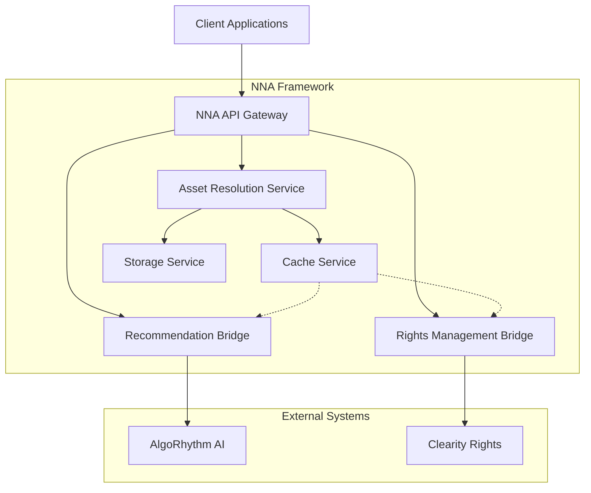

### 4.3.2 Responsibility Separation

The integration architecture maintains clear boundaries between systems:

**System Responsibilities**

| **System** | **Primary Responsibilities** | **Secondary Responsibilities** |
| --- | --- | --- |
| **NNA Framework** | Asset addressing, resolution, storage, caching | Rights validation, recommendation integration |
| **AlgoRhythm** | Content analysis, compatibility scoring, recommendations | Audience data analysis, trend detection |
| **Clearity** | Rights clearance, validation, territory restrictions | License management, attribution tracking |

This separation ensures each system can evolve independently while maintaining interoperability.

## 4.4 Cross-platform Integration

### 4.4.1 Integration Architecture

The NNA Framework implements a layered integration architecture that enables seamless communication with AlgoRhythm for AI-powered recommendations and Clearity for rights management. This architecture ensures clean separation of concerns while maintaining high performance.

### 4.4.3 Integration Bridge Implementation

```python
class IntegrationBridge:
    """
    Base class for external system integration with resilience, 
    monitoring, and caching.
    """
    def __init__(self, config: IntegrationConfig, cache_manager: CacheManager):
        self.config = config
        self.cache_manager = cache_manager
        self.metrics = IntegrationMetrics(config.system_name)
        self.circuit_breaker = CircuitBreaker(
            name=f"{config.system_name}_bridge",
            failure_threshold=config.failure_threshold,
            reset_timeout=config.reset_timeout
        )
        self.client = self._create_client()
    
    def _create_client(self):
        """Create HTTP client with appropriate timeouts and retry logic"""
        return HttpClient(
            base_url=self.config.base_url,
            timeout=self.config.timeout,
            max_retries=self.config.max_retries,
            backoff_factor=self.config.backoff_factor
        )
    
    async def execute_request(self, 
                             operation: Callable, 
                             cache_key: Optional[str] = None,
                             cache_ttl: Optional[int] = None,
                             context: Optional[RequestContext] = None) -> Any:
        """
        Executes a request with circuit breaker, caching and metrics.
        """
        # Check cache if cache_key provided
        if cache_key:
            if cached_response := await self.cache_manager.get(cache_key, context):
                await self.metrics.record_cache_hit(context)
                return cached_response
        
        # Execute operation with circuit breaker
        start_time = time.monotonic()
        try:
            response = await self.circuit_breaker.execute(
                operation=operation,
                timeout=self.config.timeout,
                fallback=self._get_fallback(operation, context)
            )
            
            # Cache successful response if cache_key provided
            if cache_key and response:
                await self.cache_manager.set(
                    cache_key, 
                    response, 
                    ttl=cache_ttl or self.config.default_cache_ttl,
                    context=context
                )
            
            # Record successful metrics
            duration = time.monotonic() - start_time
            await self.metrics.record_success(duration, context)
            
            return response
            
        except Exception as e:
            # Record failure metrics
            duration = time.monotonic() - start_time
            await self.metrics.record_failure(str(e), duration, context)
            
            # Re-raise with integration context
            raise IntegrationError(
                system=self.config.system_name,
                operation=operation.__name__,
                error=str(e),
                context=context
            ) from e
    
    async def _get_fallback(self, operation: Callable, 
                           context: Optional[RequestContext]) -> Optional[Callable]:
        """
        Returns appropriate fallback based on operation and context.
        Override in subclasses for system-specific fallbacks.
        """
        return None
```

### 4.4.4 AlgoRhythm Integration

```python
class AlgoRhythmBridge(IntegrationBridge):
    """
    Integration bridge for AlgoRhythm AI recommendation system.
    """
    async def get_recommendations(self, asset_id: str, 
                                context: RequestContext) -> List[Recommendation]:
        """
        Get AI-powered recommendations for an asset with caching.
        """
        # Create cache key with context parameters
        cache_key = f"algo:rec:{asset_id}:{context.user_id}:{context.territory}"
        
        # Define operation to execute
        async def fetch_recommendations():
            # Extract asset features for recommendation engine
            features = await self._extract_asset_features(asset_id)
            
            # Call AlgoRhythm API
            return await self.client.post(
                path="/v1/recommendations",
                data={
                    "asset_id": asset_id,
                    "features": features,
                    "context": context.to_dict(),
                    "limit": 20
                }
            )
        
        # Execute with caching, circuit breaking, and monitoring
        return await self.execute_request(
            operation=fetch_recommendations,
            cache_key=cache_key,
            cache_ttl=1800,  # 30 minutes
            context=context
        )
    
    async def _extract_asset_features(self, asset_id: str) -> Dict[str, Any]:
        """
        Extract features from asset for AI processing.
        """
        # Get asset metadata
        asset = await self.asset_service.get_metadata(asset_id)
        
        # Transform into feature vector
        return {
            "style_vector": {
                "primary_style": asset.metadata.get("primary_style"),
                "secondary_styles": asset.metadata.get("secondary_styles", []),
                "compatibility_scores": asset.metadata.get("compatibility", {})
            },
            "technical_vector": {
                "quality_metrics": asset.metadata.get("quality", {}),
                "performance_metrics": asset.metadata.get("performance", {}),
                "resource_requirements": asset.metadata.get("resources", {})
            },
            "usage_vector": {
                "popularity": asset.metadata.get("popularity", 0),
                "engagement": asset.metadata.get("engagement", {}),
                "demographics": asset.metadata.get("demographics", {})
            }
        }
    
    async def _get_fallback(self, operation: Callable, 
                           context: Optional[RequestContext]) -> Optional[Callable]:
        """
        Provides fallback recommendations when AlgoRhythm is unavailable.
        """
        if operation.__name__ == "fetch_recommendations":
            # Return cached popular recommendations as fallback
            async def fallback_recommendations():
                logger.warning("Using fallback recommendations for AlgoRhythm")
                return await self.cache_manager.get("algo:popular:fallback")
            return fallback_recommendations
        return None
```

### 4.4.5 Clearity Integration

```python
class ClearityBridge(IntegrationBridge):
    """
    Integration bridge for Clearity rights management system.
    """
    async def verify_rights(self, asset_id: str, user_id: str, 
                          context: RequestContext) -> RightsVerification:
        """
        Verify asset usage rights with territory awareness.
        """
        # Create cache key with relevant parameters
        cache_key = f"rights:{asset_id}:{user_id}:{context.territory}"
        
        # Define operation to execute
        async def fetch_rights():
            return await self.client.get(
                path=f"/v1/rights/verify",
                params={
                    "asset_id": asset_id,
                    "user_id": user_id,
                    "territory": context.territory,
                    "usage_type": context.usage_type,
                    "platform": context.platform
                }
            )
        
        # Execute with caching, circuit breaking, and monitoring
        rights = await self.execute_request(
            operation=fetch_rights,
            cache_key=cache_key,
            # Cache TTL depends on rights expiration
            cache_ttl=3600,  # Default 1 hour
            context=context
        )
        
        # Adjust cache TTL based on rights expiration if available
        if rights and rights.get("expiration"):
            expiration = datetime.fromisoformat(rights["expiration"].rstrip('Z'))
            now = datetime.now(timezone.utc)
            # Calculate seconds until expiration
            ttl = max(0, int((expiration - now).total_seconds()))
            if ttl > 0 and ttl < 3600:
                # Update cache with proper expiration
                await self.cache_manager.set(
                    cache_key, 
                    rights, 
                    ttl=ttl,
                    context=context
                )
        
        return RightsVerification.from_dict(rights)
    
    async def grant_rights(self, grant_request: GrantRequest, 
                         context: RequestContext) -> GrantResult:
        """
        Grant usage rights for an asset.
        """
        # Define operation to execute
        async def create_grant():
            return await self.client.post(
                path="/v1/rights/grant",
                data=grant_request.to_dict()
            )
        
        # Execute without caching (writes should not be cached)
        grant = await self.execute_request(
            operation=create_grant,
            context=context
        )
        
        # Invalidate any existing rights cache entries
        await self.cache_manager.invalidate(
            f"rights:{grant_request.asset_id}:{grant_request.user_id}:*"
        )
        
        return GrantResult.from_dict(grant)
    
    async def _get_fallback(self, operation: Callable, 
                           context: Optional[RequestContext]) -> Optional[Callable]:
        """
        Provides fallback for rights verification when Clearity is unavailable.
        """
        if operation.__name__ == "fetch_rights":
            # For rights verification, deny by default when system is unavailable
            async def fallback_rights():
                logger.warning("Using fallback rights verification (deny by default)")
                return {
                    "has_rights": False,
                    "rights_type": "none",
                    "message": "Rights verification unavailable, denying by default"
                }
            return fallback_rights
        return None
```

### 4.4.6 Integration Health Monitoring

The integration bridges include built-in health monitoring to ensure system stability:

1. **Circuit Breaker Metrics**:
    - Success/failure rates by operation
    - Circuit state transitions (CLOSED, OPEN, HALF-OPEN)
    - Recovery times after failure
1. **Performance Metrics**:
    - Response time distributions (p50, p90, p99)
    - Cache hit rates for integration responses
    - Error rates by error type
1. **Health Check Endpoints**:

```xml
GET /v1/health/integration/algorhythm
GET /v1/health/integration/clearity
```

These endpoints return detailed health status including:

- System availability
- Recent error rates
- Circuit breaker status
- Cache performance

Integration health is incorporated into the overall system health monitoring dashboard for comprehensive visibility.

### 4.4.7 Integration Implementation

```python
class AIIntegrationSystem:
    def __init__(self):
        self.cache_manager = CachingSystem()
        self.recommendation_engine = RecommendationEngine()
        self.performance_monitor = PerformanceMonitor()

    async def get_asset_recommendations(
        self,
        asset_id: str,
        context: RequestContext
    ) -> List[AssetRecommendation]:
        """
        Get AI-powered asset recommendations with caching
        """
        cache_key = f"recommendations:{asset_id}"
        cached_recommendations = await self.cache_manager.get_cached_asset(
            cache_key,
            context
        )
        
        if cached_recommendations:
            return cached_recommendations

        # Extract asset features
        features = await self.extract_asset_features(asset_id)
        
        # Generate recommendations
        recommendations = await self.recommendation_engine.generate_recommendations(
            features,
            context
        )
        
        # Cache results
        await self.cache_manager.cache_asset(
            cache_key,
            recommendations,
            ttl=1800  # 30 minutes
        )
        
        return recommendations

```

### 4.4.8 Recommendation Bridge

```python
class NNARecommendationBridge:
    def get_asset_features(self, asset_address):
        """
        Extract features for AI recommendation
        """
        return {
            'style_vector': {
                'primary_style': self.extract_style_features(),
                'secondary_styles': self.extract_secondary_features(),
                'compatibility_metrics': self.get_compatibility_scores()
            },
            'technical_vector': {
                'quality_metrics': self.get_quality_metrics(),
                'performance_metrics': self.get_performance_metrics(),
                'resource_requirements': self.get_resource_needs()
            }
        }
```

### 4.4.9 Integration Manager Implementation

The Integration Manager provides a robust foundation for coordinating operations across the NNA Framework, AlgoRhythm, and Clearity Rights Management systems.

```python
from typing import Dict, List, Optional
from datetime import datetime
import asyncio

class IntegrationManager:
    def __init__(self):
        self.nna_client = NNAClient()
        self.algo_client = AlgoRhythmClient()
        self.rights_client = RightsClient()
        self.metrics = IntegrationMetrics()
        self.cache = IntegrationCache()

    async def resolve_asset_with_context(
        self,
        asset_id: str,
        context: RequestContext
    ) -> EnrichedAsset:
        """
        Resolves asset with full platform integration
        
        Args:
            asset_id: NNA asset identifier
            context: Request context with user and environment info
            
        Returns:
            EnrichedAsset with recommendations and rights info
        """
        operation_start = time.time()
        
        try:
            # Check cache first
            if cached := await self.cache.get_enriched_asset(
                asset_id,
                context
            ):
                return cached

            # Parallel operations
            rights, asset, recommendations = await asyncio.gather(
                self.rights_client.verify_rights(asset_id, context),
                self.nna_client.resolve_asset(asset_id),
                self.algo_client.get_recommendations(asset_id, context)
            )

            # Combine results
            enriched_asset = EnrichedAsset(
                asset=asset,
                rights=rights,
                recommendations=recommendations
            )

            # Cache result
            await self.cache.set_enriched_asset(
                asset_id,
                enriched_asset,
                context,
                ttl=300  # 5 minutes
            )

            # Record metrics
            await self.metrics.record_integration(
                operation_type='asset_resolution',
                duration=time.time() - operation_start,
                success=True
            )

            return enriched_asset

        except Exception as e:
            await self.handle_integration_error(e, asset_id, context)
            raise

    async def handle_integration_error(
        self,
        error: Exception,
        asset_id: str,
        context: RequestContext
    ) -> None:
        """
        Handles integration errors with proper recording and recovery
        """
        error_type = type(error).__name__
        
        # Record error metrics
        await self.metrics.record_integration_error(
            error_type=error_type,
            asset_id=asset_id,
            context=context
        )

        # Attempt recovery based on error type
        if isinstance(error, RightsError):
            await self.handle_rights_error(error, asset_id)
        elif isinstance(error, NNAError):
            await self.handle_nna_error(error, asset_id)
        elif isinstance(error, AlgoRhythmError):
            await self.handle_algo_error(error, asset_id)
        else:
            await self.handle_unknown_error(error, asset_id)

    async def get_system_health(self) -> Dict[str, bool]:
        """
        Checks health status across all integrated systems
        """
        health_checks = {
            'nna': self.nna_client.check_health(),
            'algorhythm': self.algo_client.check_health(),
            'rights': self.rights_client.check_health()
        }

        results = await asyncio.gather(
            *health_checks.values(),
            return_exceptions=True
        )

        return {
            system: not isinstance(result, Exception)
            for system, result in zip(health_checks.keys(), results)
        }
```

### 4.4.10 Usage Example

```python
# Initialize integration manager
integration = IntegrationManager()

# Resolve asset with full context
try:
    context = RequestContext(
        user_id='user123',
        territory='US',
        platform='web'
    )
    
    enriched_asset = await integration.resolve_asset_with_context(
        asset_id='S.01.01.001',
        context=context
    )
    
    print(f"Asset: {enriched_asset.asset}")
    print(f"Rights: {enriched_asset.rights}")
    print(f"Recommendations: {enriched_asset.recommendations}")
    
except Exception as e:
    print(f"Integration error: {str(e)}")
```

## 4.3 AlgoRhythm + NNA Integration

This section provides the integration between the NNA Framework and the AI recommendation engine, ensuring consistent performance and caching strategies.

### 4.3.1 Responsibility Separation

- **NNA Framework**: Asset management, addressing, relationships
- **AlgoRhythm**: Asset selection, compatibility analysis, recommendations

### 4.3.2 Integration Points

- **Asset Resolution**: NNA provides addressing and retrieval
- **Compatibility Checking**: AlgoRhythm analyzes relationships
- **Recommendations**: AlgoRhythm suggests, NNA validates and retrieves
- **Performance**: Shared caching and optimization

```python
def resolve_asset(asset_id):
    response = requests.get(f"https://api.reviz.studio/v1/asset/resolve/{asset_id}")
    return response.json()["data"]
```


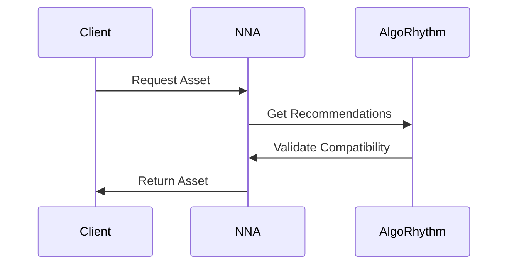

1. **AI Integration System**

```python
class AIIntegrationSystem:
    def __init__(self):
        self.cache_manager = CachingSystem()
        self.recommendation_engine = RecommendationEngine()
        self.performance_monitor = PerformanceMonitor()

    async def get_asset_recommendations(
        self,
        asset_id: str,
        context: RequestContext
    ) -> List[AssetRecommendation]:
        """
        Get AI-powered asset recommendations with caching
        """
        cache_key = f"recommendations:{asset_id}"
        cached_recommendations = await self.cache_manager.get_cached_asset(
            cache_key,
            context
        )
        
        if cached_recommendations:
            return cached_recommendations

        # Extract asset features
        features = await self.extract_asset_features(asset_id)
        
        # Generate recommendations
        recommendations = await self.recommendation_engine.generate_recommendations(
            features,
            context
        )
        
        # Cache results
        await self.cache_manager.cache_asset(
            cache_key,
            recommendations,
            ttl=1800  # 30 minutes
        )
        
        return recommendations

    async def extract_asset_features(self, asset_id: str) -> AssetFeatures:
        """
        Extract features for AI processing
        """
        feature_config = {
            'visual_features': {
                'color_analysis': True,
                'style_detection': True,
                'pattern_recognition': True
            },
            'audio_features': {
                'tempo_analysis': True,
                'genre_detection': True,
                'mood_analysis': True
            },
            'metadata_features': {
                'usage_patterns': True,
                'popularity_metrics': True,
                'user_engagement': True
            }
        }

        return await self.recommendation_engine.extract_features(
            asset_id,
            feature_config
        )

    async def update_recommendation_models(self) -> None:
        """
        Periodic model updates with performance monitoring
        """
        update_config = {
            'training_data': {
                'lookback_period': '7d',
                'minimum_samples': 10000,
                'validation_split': 0.2
            },
            'optimization': {
                'batch_size': 128,
                'learning_rate': 0.001,
                'epochs': 10
            }
        }

        try:
            await self.recommendation_engine.update_models(update_config)
            await self.performance_monitor.record_model_update()
        except Exception as e:
            await self.handle_model_update_failure(e)
```

1. **AI Recommendations**

```python
class RecommendationManager:
    def __init__(self):
        self.algorhythm = AlgoRhythm()
        self.cache = CacheManager()
        self.monitor = PerformanceMonitor()

    async def get_recommendations(
        self,
        song_id: str,
        context: RequestContext
    ):
        """
        Get AI-powered recommendations using AlgoRhythm
        """
        async with self.monitor.track_operation(
            "get_recommendations",
            context
        ):
            # Check cache first
            cache_key = f"recommendations:{song_id}"
            if cached := await self.cache.get(cache_key):
                return cached

            # Extract features
            features = await self.extract_song_features(song_id)

            # Generate recommendations
            recommendations = await self.algorhythm.generate_recommendations(
                features,
                context=context
            )

            # Cache results
            await self.cache.set(
                cache_key,
                recommendations,
                ttl=1800  # 30 minutes
            )

            return recommendations

    async def extract_song_features(self, song_id: str):
        """
        Extract features for AI processing
        """
        feature_config = {
            'visual_features': {
                'color_analysis': True,
                'style_detection': True,
                'pattern_recognition': True
            },
            'audio_features': {
                'tempo_analysis': True,
                'genre_detection': True,
                'mood_analysis': True
            },
            'metadata_features': {
                'usage_patterns': True,
                'popularity_metrics': True,
                'user_engagement': True
            }
        }

        return await self.algorhythm.extract_features(
            song_id,
            feature_config
        )
```

1. **AI Recommendation Bridge**

```python
class NNARecommendationBridge:
    def get_asset_features(self, asset_address):
        """
        Extract features for AI recommendation
        """
        return {
            'style_vector': {
                'primary_style': self.extract_style_features(),
                'secondary_styles': self.extract_secondary_features(),
                'compatibility_metrics': self.get_compatibility_scores()
            },
            'technical_vector': {
                'quality_metrics': self.get_quality_metrics(),
                'performance_metrics': self.get_performance_metrics(),
                'resource_requirements': self.get_resource_needs()
            }
        }

    def suggest_compatible_assets(self, base_asset):
        """
        Get AI-powered asset suggestions
        """
        base_features = self.get_asset_features(base_asset)
        return {
            'primary_matches': self.find_primary_matches(base_features),
            'style_matches': self.find_style_matches(base_features),
            'technical_matches': self.find_technical_matches(base_features)
        }
```

```python
class AssetCommunicationProtocol:
    def generate_asset_message(self, asset_data):
        """
        Create standardized asset message
        """
        return {
            'asset_identifier': {
                'address': asset_data.address,
                'version': asset_data.version,
                'timestamp': asset_data.timestamp
            },
            'asset_content': {
                'metadata': self.format_metadata(),
                'relationships': self.format_relationships(),
                'access_rights': self.format_rights()
            },
            'technical_details': {
                'format': asset_data.format,
                'size': asset_data.size,
                'requirements': asset_data.requirements
            }
        }

```

### 4.3.3 Basic Integration

```python
from nna_framework import NNAFramework
from algorhythm import AlgoRhythm
from clearity import Clearity  

class IntegratedSystem:
    def __init__(self):
        self.nna = NNAFramework()
        self.algorhythm = AlgoRhythm()
        self.rights = Clearity()  
        self.cache_manager = SharedCacheManager()
        self.performance_monitor = PerformanceMonitor()

    async def process_asset_request(
        self,
        asset_id: str,
        context: RequestContext
    ) -> AssetResponse:
        """
        Process asset request with integrated recommendations
        """
        async with self.performance_monitor.track_operation(
            "integrated_asset_request",
            context
        ):
            # 1. Verify rights
            rights_status = await self.rights.verify_rights(
                asset_id,
                context.user_id
            )

            # 2. Get asset with recommendations
            asset = await self.get_asset_with_recommendations(
                asset_id,
                rights_status,
                context
            )

            # 3. Update analytics
            await self.update_analytics(asset, context)

            return AssetResponse(
                asset=asset,
                rights_status=rights_status,
                recommendations=asset.recommendations
            )

    async def get_asset_with_recommendations(
        self,
        asset_id: str,
        rights_status: RightsStatus,
        context: RequestContext
    ) -> EnrichedAsset:
        # Check cache first
        if cached := await self.cache_manager.get_cached_asset(
            asset_id,
            context
        ):
            return cached

        # Get base asset from NNA
        asset = await self.nna.resolve_asset(asset_id)

        # Get recommendations from AlgoRhythm
        recommendations = await self.algorhythm.get_recommendations(
            asset,
            rights_status,
            context
        )

        # Combine and cache results
        enriched_asset = EnrichedAsset(
            asset=asset,
            recommendations=recommendations
        )
        await self.cache_manager.cache_asset(
            asset_id,
            enriched_asset,
            context
        )

        return enriched_asset
```

### 4.3.4 Rights Verification Flow

```python
pythonCopyclass RightsClearanceManager:
    def __init__(self):
        self.rights_client = RightsClear()
        self.cache = RightsCache()
        self.monitor = RightsMonitor()

    async def verify_rights(
        self,
        asset_id: str,
        user_id: str,
        context: RequestContext
    ) -> RightsVerification:
        """
        Complete rights verification workflow
        """
        # Check rights cache
        if cached := await self.cache.get_rights(
            asset_id,
            user_id
        ):
            return cached

        try:
            # Verify base rights
            base_rights = await self.rights_client.verify_base_rights(
                asset_id,
                user_id
            )

            # Check territorial restrictions
            territory_rights = await self.verify_territory_rights(
                base_rights,
                context.territory
            )

            # Verify usage rights
            usage_rights = await self.verify_usage_rights(
                territory_rights,
                context.usage_type
            )

            # Cache results
            rights_verification = RightsVerification(
                base_rights=base_rights,
                territory_rights=territory_rights,
                usage_rights=usage_rights
            )
            await self.cache.set_rights(
                asset_id,
                user_id,
                rights_verification
            )

            return rights_verification

        except RightsException as e:
            await self.monitor.record_rights_error(e)
            raise

    async def verify_territory_rights(
        self,
        base_rights: BaseRights,
        territory: str
    ) -> TerritoryRights:
        """
        Verify territory-specific rights
        """
        if territory not in base_rights.allowed_territories:
            raise TerritoryRestrictionError(
                territory=territory,
                allowed=base_rights.allowed_territories
            )

        return await self.rights_client.verify_territory(
            base_rights.rights_id,
            territory
        )

    async def verify_usage_rights(
        self,
        territory_rights: TerritoryRights,
        usage_type: str
    ) -> UsageRights:
        """
        Verify usage-specific rights
        """
        if usage_type not in territory_rights.allowed_usage:
            raise UsageRestrictionError(
                usage=usage_type,
                allowed=territory_rights.allowed_usage
            )

        return await self.rights_client.verify_usage(
            territory_rights.rights_id,
            usage_type
        )
```

### 4.3.5 Cross-Platform Error Handling

```python
class CrossPlatformErrorHandler:
    def __init__(self):
        self.nna_handler = NNAErrorHandler()
        self.clearity_handler = ClearityErrorHandler()
        self.metrics = ErrorMetrics()

    async def handle_error(
        self,
        error: Exception,
        context: ErrorContext
    ) -> ErrorResolution:
        """
        Handle errors across integrated platforms
        """
        # Record error metrics
        await self.metrics.record_error(error, context)

        try:
            # Determine error origin
            if isinstance(error, NNAError):
                resolution = await self.handle_nna_error(error)
            elif isinstance(error, ClearityError):
                resolution = await self.handle_clearity_error(error)
            else:
                resolution = await self.handle_internal_error(error)

            # Handle recovery
            if resolution.needs_recovery:
                await self.initiate_recovery(resolution, context)

            return resolution

        except Exception as e:
            # Handle cascading errors
            await self.handle_cascading_error(e, context)
            raise

    async def initiate_recovery(
        self,
        resolution: ErrorResolution,
        context: ErrorContext
    ) -> None:
        """
        Coordinate recovery across platforms
        """
        await asyncio.gather(
            self.nna_handler.recover(resolution, context),
            self.clearity_handler.recover(resolution, context),
            self.handle_local_recovery(resolution, context)
        )
```

### 4.3.6 Integrated Error Handler

```python
class IntegratedErrorHandler:
    def __init__(self):
        self.nna_handler = NNAErrorHandler()
        self.algo_handler = AlgoRhythmErrorHandler()
        self.rights_handler = RightsClearErrorHandler()
        self.monitor = ErrorMonitor()

    async def handle_error(
        self,
        error: Exception,
        context: RequestContext
    ) -> ErrorResponse:
        """
        Coordinated error handling across systems
        """
        try:
            if isinstance(error, NNAError):
                return await self.handle_nna_error(error, context)
            elif isinstance(error, AlgoRhythmError):
                return await self.handle_algo_error(error, context)
            elif isinstance(error, RightsClearError):
                return await self.handle_rights_error(error, context)
            else:
                return await self.handle_unknown_error(error, context)
        finally:
            await self.monitor.record_error(error, context)

    async def handle_nna_error(
        self,
        error: NNAError,
        context: RequestContext
    ) -> ErrorResponse:
        """
        Handle NNA-specific errors
        """
        # Try fallback options
        try:
            if isinstance(error, AssetNotFoundError):
                return await self.handle_missing_asset(error, context)
            elif isinstance(error, CacheError):
                return await self.handle_cache_error(error, context)
            else:
                return await self.nna_handler.handle_error(error)
        except Exception as e:
            return await self.handle_cascading_error(e, context)
```

### 4.3.7 Neural Style Embeddings for Asset Compatibility

The Neural Style Embeddings system integrates with AlgoRhythm to provide AI-powered asset compatibility scoring based on deep learning models that understand the stylistic characteristics of assets across different layers.

### 4.3.7.1 Neural Embedding Architecture

The neural embedding system uses a multi-modal architecture to encode assets from different layers into a unified style space:

```python
class NeuralStyleEmbeddings:
    """
    Neural embedding system for encoding assets into style vectors
    """
    def __init__(self):
        self.visual_encoder = VisualEncoder()
        self.audio_encoder = AudioEncoder()
        self.metadata_encoder = MetadataEncoder()
        self.fusion_model = StyleFusionModel()
        self.embedding_store = EmbeddingStore()
        self.algorhythm_client = AlgorithmClient()
        
    async def generate_embedding(self, asset_id: str) -> np.ndarray:
        """
        Generate neural style embedding for an asset
        """
        # Get asset data
        asset = await self.asset_resolver.resolve_asset(asset_id)
        
        # Extract features based on asset type
        asset_type = asset_id.split('.')[0]  # Get layer type
        
        features = {}
        
        # Extract visual features if applicable
        if asset_type in ['S', 'L', 'M', 'W', 'V']:  # Star, Look, Moves, World, Vibe
            visual_features = await self.visual_encoder.encode(asset.visual_data)
            features['visual'] = visual_features
        
        # Extract audio features if applicable
        if asset_type in ['G', 'V']:  # Song, Vibe
            audio_features = await self.audio_encoder.encode(asset.audio_data)
            features['audio'] = audio_features
        
        # Extract metadata features
        metadata_features = await self.metadata_encoder.encode(asset.metadata)
        features['metadata'] = metadata_features
        
        # Fuse features into unified embedding
        embedding = await self.fusion_model.fuse_features(features, asset_type)
        
        # Store embedding
        await self.embedding_store.store_embedding(asset_id, embedding)
        
        return embedding
    
    async def calculate_style_similarity(
        self,
        source_id: str,
        target_id: str
    ) -> float:
        """
        Calculate style similarity between two assets
        """
        # Get embeddings
        source_embedding = await self.get_asset_embedding(source_id)
        target_embedding = await self.get_asset_embedding(target_id)
        
        # Calculate cosine similarity
        similarity = cosine_similarity(
            source_embedding.reshape(1, -1),
            target_embedding.reshape(1, -1)
        )[0][0]
        
        # Normalize to 0-1 range
        normalized_similarity = (similarity + 1) / 2
        
        return normalized_similarity
    
    async def get_asset_embedding(self, asset_id: str) -> np.ndarray:
        """
        Get asset embedding, generating if not available
        """
        # Try to get from store
        embedding = await self.embedding_store.get_embedding(asset_id)
        
        # Generate if not found
        if embedding is None:
            embedding = await self.generate_embedding(asset_id)
            
        return embedding
    
    async def find_style_matches(
        self,
        source_id: str,
        target_layer: str,
        limit: int = 10
    ) -> List[StyleMatch]:
        """
        Find assets in target layer with similar style to source asset
        """
        # Get source embedding
        source_embedding = await self.get_asset_embedding(source_id)
        
        # Get target layer assets
        target_assets = await self.asset_resolver.get_layer_assets(target_layer)
        
        # Calculate similarities and build results
        similarities = []
        for target_id in target_assets:
            target_embedding = await self.get_asset_embedding(target_id)
            similarity = cosine_similarity(
                source_embedding.reshape(1, -1),
                target_embedding.reshape(1, -1)
            )[0][0]
            
            # Normalize to 0-1 range
            normalized_similarity = (similarity + 1) / 2
            
            similarities.append(StyleMatch(
                asset_id=target_id,
                similarity=normalized_similarity
            ))
        
        # Sort by similarity (descending)
        similarities.sort(key=lambda x: x.similarity, reverse=True)
        
        # Return top matches
        return similarities[:limit]
```

### 4.3.7.2 AlgoRhythm Integration

The neural embedding system integrates with AlgoRhythm to enhance recommendation quality:

```python
class AlgoRhythmStyleIntegration:
    """
    Integration between neural style embeddings and AlgoRhythm
    """
    def __init__(self):
        self.embedding_system = NeuralStyleEmbeddings()
        self.algorhythm_client = AlgorithmClient()
        self.feature_translator = FeatureTranslator()
        
    async def enhance_recommendations(
        self,
        source_id: str,
        recommendations: List[AssetRecommendation],
        context: RequestContext
    ) -> List[EnhancedRecommendation]:
        """
        Enhance AlgoRhythm recommendations with style similarity data
        """
        # Get source embedding
        source_embedding = await self.embedding_system.get_asset_embedding(source_id)
        
        # Get embeddings for recommendations
        enhanced_recommendations = []
        for recommendation in recommendations:
            # Get embedding
            target_embedding = await self.embedding_system.get_asset_embedding(
                recommendation.asset_id
            )
            
            # Calculate similarity
            similarity = cosine_similarity(
                source_embedding.reshape(1, -1),
                target_embedding.reshape(1, -1)
            )[0][0]
            
            # Normalize similarity
            normalized_similarity = (similarity + 1) / 2
            
            # Enhance recommendation score
            adjusted_score = (
                recommendation.score * 0.7 +  # AlgoRhythm score (70%)
                normalized_similarity * 0.3    # Style similarity (30%)
            )
            
            # Add style factors to recommendation data
            style_factors = await self.feature_translator.embedding_to_factors(
                target_embedding
            )
            
            enhanced_recommendations.append(EnhancedRecommendation(
                asset_id=recommendation.asset_id,
                original_score=recommendation.score,
                style_similarity=normalized_similarity,
                enhanced_score=adjusted_score,
                factors={
                    **recommendation.factors,
                    "style_factors": style_factors
                }
            ))
        
        # Sort by enhanced score
        enhanced_recommendations.sort(key=lambda x: x.enhanced_score, reverse=True)
        
        return enhanced_recommendations
    
    async def provide_embedding_features(
        self,
        asset_id: str
    ) -> EmbeddingFeatures:
        """
        Provide embedding features to AlgoRhythm for model training
        """
        # Get embedding
        embedding = await self.embedding_system.get_asset_embedding(asset_id)
        
        # Translate to interpretable features
        features = await self.feature_translator.embedding_to_features(embedding)
        
        # Send to AlgoRhythm
        await self.algorhythm_client.update_asset_features(
            asset_id=asset_id,
            features=features
        )
        
        return features
```

### 4.3.7.3 Model Training and Updates

The embedding system continuously learns and adapts through model training:

```python
class EmbeddingModelTrainer:
    """
    Training system for neural style embeddings
    """
    def __init__(self):
        self.training_data_collector = TrainingDataCollector()
        self.model_trainer = ModelTrainer()
        self.embedding_system = NeuralStyleEmbeddings()
        self.model_registry = ModelRegistry()
        
    async def train_embedding_models(self):
        """
        Train/update embedding models with new data
        """
        # Collect training data
        training_data = await self.training_data_collector.collect_training_data()
        
        # Train models
        training_results = await self.model_trainer.train_models(
            training_data=training_data,
            current_models={
                'visual': self.embedding_system.visual_encoder,
                'audio': self.embedding_system.audio_encoder,
                'metadata': self.embedding_system.metadata_encoder,
                'fusion': self.embedding_system.fusion_model
            }
        )
        
        # Register new models
        for model_type, model in training_results.models.items():
            await self.model_registry.register_model(
                model_type=model_type,
                model=model,
                metrics=training_results.metrics[model_type],
                version=training_results.version
            )
        
        # Update embedding system with new models
        await self.embedding_system.update_models(training_results.models)
        
        # Trigger recomputation of important embeddings
        await self.trigger_embedding_recomputation(training_results.impact_score)
        
        return training_results
    
    async def trigger_embedding_recomputation(self, impact_score: float):
        """
        Trigger recomputation of embeddings based on model impact
        """
        # For high-impact updates, recompute all embeddings
        if impact_score > 0.8:
            await self.recompute_all_embeddings()
        # For medium-impact updates, recompute popular assets
        elif impact_score > 0.5:
            await self.recompute_popular_embeddings()
        # For low-impact updates, recompute on-demand
        else:
            await self.mark_embeddings_outdated()
    
    async def recompute_all_embeddings(self):
        """
        Recompute all asset embeddings
        """
        # Get all assets
        assets = await self.asset_resolver.get_all_assets()
        
        # Recompute embeddings in batches
        batch_size = 100
        for i in range(0, len(assets), batch_size):
            batch = assets[i:i+batch_size]
            await asyncio.gather(*[
                self.embedding_system.generate_embedding(asset_id)
                for asset_id in batch
            ])
```

The neural style embedding system provides a powerful foundation for understanding the stylistic characteristics of assets across different layers. By encoding assets into a unified style space, the system can identify compatible assets even without explicit historical usage data, enabling more accurate recommendations for new content combinations.

The integration with AlgoRhythm enhances recommendation quality by combining style-based compatibility with other factors like popularity and user preferences. This multi-factor approach results in more intuitive and contextually relevant recommendations for content creators.

## 4.4 Cross-Platform Integration Implementation

The NNA Framework provides robust cross-platform integration capabilities, enabling consistent asset management and delivery across web, mobile, desktop, and XR environments.

### 4.4.1 Platform-Specific Asset Delivery

```python
class PlatformOptimizer:
    def __init__(self):
        self.web_optimizer = WebOptimizer()
        self.mobile_optimizer = MobileOptimizer()
        self.desktop_optimizer = DesktopOptimizer()
        self.xr_optimizer = XROptimizer()

    async def optimize_for_platform(
        self,
        asset: Asset,
        platform: str,
        options: PlatformOptions
    ) -> OptimizedAsset:
        """
        Optimize asset for specific platform delivery
        """
        # Select appropriate optimizer
        optimizer = self.get_platform_optimizer(platform)
        
        # Optimize asset
        optimized = await optimizer.optimize(asset, options)
        
        # Record optimization metrics
        await self.metrics.record_optimization(
            asset_id=asset.id,
            platform=platform,
            original_size=asset.size,
            optimized_size=optimized.size
        )
        
        return optimized
        
    def get_platform_optimizer(self, platform: str) -> PlatformOptimizer:
        """
        Get platform-specific optimizer
        """
        return {
            "web": self.web_optimizer,
            "mobile": self.mobile_optimizer,
            "desktop": self.desktop_optimizer,
            "xr": self.xr_optimizer
        }.get(platform, self.web_optimizer)  # Default to web
```

### 4.4.2 Web Platform Integration

```python
class WebOptimizer:
    async def optimize(
        self,
        asset: Asset,
        options: WebOptions
    ) -> OptimizedAsset:
        """
        Optimize asset for web delivery
        """
        # Determine optimal format (WebM/MP4)
        optimal_format = self.determine_optimal_format(
            asset.format,
            options.browser
        )
        
        # Apply resolution constraints
        max_resolution = options.max_resolution or "1080p"
        constrained_asset = await self.apply_resolution_constraint(
            asset,
            max_resolution
        )
        
        # Apply codec optimizations
        codec_options = {
            "mp4": {
                "codec": "h264",
                "profile": "high",
                "level": "4.1",
                "crf": 23
            },
            "webm": {
                "codec": "vp9",
                "crf": 30,
                "deadline": "good"
            }
        }.get(optimal_format, {})
        
        # Transcode if needed
        if asset.format != optimal_format:
            optimized = await self.transcode(
                constrained_asset,
                optimal_format,
                codec_options
            )
        else:
            optimized = constrained_asset
        
        # Apply web-specific optimizations
        optimized = await self.optimize_for_web(
            optimized,
            options
        )
        
        return OptimizedAsset(
            id=asset.id,
            original=asset,
            optimized_url=optimized.url,
            format=optimal_format,
            size=optimized.size,
            resolution=optimized.resolution,
            platform="web"
        )
        
    def determine_optimal_format(
        self,
        current_format: str,
        browser: str
    ) -> str:
        """
        Determine optimal format based on browser
        """
        # WebM support
        webm_supported = browser in ["chrome", "firefox", "edge"]
        
        # Default to MP4 for maximum compatibility
        if not webm_supported:
            return "mp4"
            
        # Use WebM for supported browsers
        return "webm"
```

### 4.4.3 Mobile Platform Integration

```python
class MobileOptimizer:
    async def optimize(
        self,
        asset: Asset,
        options: MobileOptions
    ) -> OptimizedAsset:
        """
        Optimize asset for mobile delivery
        """
        # Determine delivery method
        delivery_method = self.determine_delivery_method(
            options.device,
            options.connection
        )
        
        # Apply resolution constraints
        # Mobile defaults to 720p max for performance
        max_resolution = options.max_resolution or "720p"
        constrained_asset = await self.apply_resolution_constraint(
            asset,
            max_resolution
        )
        
        # Apply platform-specific optimizations
        if delivery_method == "hls":
            # Create HLS adaptive streaming package
            optimized = await self.create_hls_package(
                constrained_asset,
                options
            )
        elif delivery_method == "dash":
            # Create DASH adaptive streaming package
            optimized = await self.create_dash_package(
                constrained_asset,
                options
            )
        else:
            # Progressive download
            optimized = await self.optimize_for_progressive(
                constrained_asset,
                options
            )
        
        return OptimizedAsset(
            id=asset.id,
            original=asset,
            optimized_url=optimized.url,
            format=optimized.format,
            size=optimized.size,
            resolution=optimized.resolution,
            platform="mobile",
            delivery_method=delivery_method
        )
        
    def determine_delivery_method(
        self,
        device: str,
        connection: str
    ) -> str:
        """
        Determine optimal delivery method based on device and connection
        """
        # Default to HLS for iOS
        if device.startswith("ios"):
            return "hls"
            
        # Default to DASH for Android
        if device.startswith("android"):
            return "dash"
            
        # Use progressive download for slow connections
        if connection == "slow":
            return "progressive"
            
        # Default to HLS
        return "hls"
```

### 4.4.4 Desktop Platform Integration

```python
class DesktopOptimizer:
    async def optimize(
        self,
        asset: Asset,
        options: DesktopOptions
    ) -> OptimizedAsset:
        """
        Optimize asset for desktop delivery
        """
        # Handle higher resolution support for desktop
        max_resolution = options.max_resolution or "4k"
        constrained_asset = await self.apply_resolution_constraint(
            asset,
            max_resolution
        )
        
        # Apply format optimizations
        if options.creative_professional:
            # Use ProRes for creative professionals
            format = "prores"
            codec_options = {
                "profile": "standard",
                "quality": "high"
            }
        else:
            # Use H.264 for general users
            format = "mp4"
            codec_options = {
                "codec": "h264",
                "profile": "high",
                "level": "5.1",
                "crf": 18
            }
        
        # Transcode if needed
        if asset.format != format:
            optimized = await self.transcode(
                constrained_asset,
                format,
                codec_options
            )
        else:
            optimized = constrained_asset
        
        return OptimizedAsset(
            id=asset.id,
            original=asset,
            optimized_url=optimized.url,
            format=format,
            size=optimized.size,
            resolution=optimized.resolution,
            platform="desktop"
        )
```

### 4.4.5 XR Platform Integration

```python
class XROptimizer:
    async def optimize(
        self,
        asset: Asset,
        options: XROptions
    ) -> OptimizedAsset:
        """
        Optimize asset for XR delivery
        """
        # Handle XR-specific formats
        if options.platform == "arkit":
            # Optimize for ARKit (iOS)
            format = "usdz"
            optimized = await self.convert_to_usdz(asset, options)
        elif options.platform == "arcore":
            # Optimize for ARCore (Android)
            format = "glb"
            optimized = await self.convert_to_glb(asset, options)
        else:
            # Default to glTF for general XR compatibility
            format = "gltf"
            optimized = await self.convert_to_gltf(asset, options)
        
        # Apply XR-specific optimizations
        optimized = await self.optimize_for_xr(
            optimized,
            options
        )
        
        return OptimizedAsset(
            id=asset.id,
            original=asset,
            optimized_url=optimized.url,
            format=format,
            size=optimized.size,
            resolution=optimized.resolution,
            platform="xr",
            xr_platform=options.platform
        )
        
    async def optimize_for_xr(
        self,
        asset: Asset,
        options: XROptions
    ) -> Asset:
        """
        Apply XR-specific optimizations
        """
        # For XR, optimize meshes and textures
        optimized = await self.optimize_meshes(asset, options.polygon_budget)
        optimized = await self.optimize_textures(optimized, options.texture_quality)
        
        # For VR, ensure stereoscopic compatibility
        if options.vr_mode:
            optimized = await self.enable_stereoscopic(optimized)
        
        # For AR, add anchoring metadata
        if options.ar_mode:
            optimized = await self.add_ar_anchors(optimized, options.anchor_type)
        
        return optimized
```

### 4.4.6 Cross-Platform Asset Delivery API

To make cross-platform asset delivery seamless for client applications, the NNA Framework provides a unified API:

```python
class AssetDeliveryService:
    def __init__(self):
        self.platform_optimizer = PlatformOptimizer()
        self.cache_manager = CacheManager()
        self.metrics_collector = MetricsCollector()

    async def get_optimized_asset(
        self,
        asset_id: str,
        platform: str,
        options: dict,
        context: RequestContext
    ) -> OptimizedAsset:
        """
        Get platform-optimized asset
        """
        async with self.metrics_collector.track_operation(
            "asset_optimization",
            context
        ):
            # Generate cache key
            cache_key = self.generate_cache_key(asset_id, platform, options)
            
            # Check cache
            if cached := await self.cache_manager.get(cache_key):
                await self.metrics_collector.record_cache_hit()
                return cached
            
            # Resolve asset
            asset = await self.asset_service.get_asset(asset_id)
            if not asset:
                raise AssetNotFoundError(f"Asset not found: {asset_id}")
            
            # Create platform-specific options
            platform_options = self.create_platform_options(platform, options)
            
            # Optimize for platform
            optimized = await self.platform_optimizer.optimize_for_platform(
                asset,
                platform,
                platform_options
            )
            
            # Cache result
            await self.cache_manager.set(
                cache_key,
                optimized,
                ttl=3600  # 1 hour
            )
            
            # Record metrics
            await self.metrics_collector.record_optimization(
                asset_id=asset_id,
                platform=platform,
                original_size=asset.size,
                optimized_size=optimized.size
            )
            
            return optimized
            
    def generate_cache_key(
        self,
        asset_id: str,
        platform: str,
        options: dict
    ) -> str:
        """
        Generate cache key for optimized asset
        """
        # Sort options to ensure consistent keys
        sorted_options = json.dumps(options, sort_keys=True)
        
        # Generate hash of options
        options_hash = hashlib.md5(sorted_options.encode()).hexdigest()
        
        return f"optimized:{asset_id}:{platform}:{options_hash}"
```

The cross-platform integration capabilities of the NNA Framework ensure consistent asset delivery across all supported platforms while optimizing for each platform's specific requirements and constraints. By implementing platform-specific optimizers and a unified delivery API, the framework provides a seamless experience for both developers and end-users.

For API endpoints related to cross-platform delivery, see the [NNA Framework API Specification](https://celerity.slab.com/posts/1fupkzwa#hebkb-6-integration-guidelines).

# 5. Security Implementation

## Executive Summary

The NNA Framework implements a defense-in-depth security strategy combining multiple protection layers:

- Authentication via OAuth 2.0, JWT, and API Keys with scoped permissions
- RBAC-based authorization with fine-grained resource control
- Asset encryption with key rotation and territory-based access controls
- Comprehensive audit logging and threat detection
- Rights management integration with Clearity for automated compliance

This security architecture balances robust protection with performance, ensuring legitimate requests are processed efficiently while unauthorized access is consistently prevented. The implementation follows security best practices including the principle of least privilege, secure communication, and regular security audits.

The NNA Framework implements a comprehensive security model that ensures appropriate access control while maintaining system performance.

## 5.1 Authentication Service

Supports API Key, JWT, and OAuth:

- **API Key**: Scoped, rate-limited access.
- **JWT**: Internal, 1-hour expiry.
- **OAuth**: External, provider-integrated.

### 5.1.1 Authentication Provider

1. **Supports OAuth 2.0 and JWT**

```python
def get_oauth_token(client_id, client_secret):
    url = "https://auth.reviz.studio/oauth/token"
    data = {"grant_type": "client_credentials", "client_id": client_id, "client_secret": client_secret}
    response = requests.post(url, data=data)
    return response.json()["access_token"]
```

See API Specification (1.1) for flows.

**5.1.2 Authentication Service**

1. **Example Authentication Service**

```python
class AuthenticationService:
    def __init__(self):
        self.token_manager = TokenManager()
        self.user_store = UserStore()
        self.audit_logger = AuditLogger()

    async def authenticate_request(
        self,
        request: Request
    ) -> AuthenticationResult:
        """
        Comprehensive request authentication with audit logging
        """
        try:
            # Extract token
            token = self.extract_token(request)
            if not token:
                raise AuthenticationError("Missing authentication token")

            # Validate token
            validation = await self.token_manager.validate_token(token)
            if not validation.is_valid:
                raise AuthenticationError(validation.error)

            # Get user context
            user_context = await self.user_store.get_user_context(
                validation.user_id
            )

            # Log authentication
            await self.audit_logger.log_authentication(
                validation.user_id,
                request,
                "success"
            )

            return AuthenticationResult(
                user_id=validation.user_id,
                permissions=user_context.permissions,
                context=user_context
            )

        except AuthenticationError as e:
            await self.audit_logger.log_authentication(
                None,
                request,
                "failure",
                error=str(e)
            )
            raise

    async def refresh_token(
        self,
        refresh_token: str
    ) -> TokenPair:
        """
        Refreshes access token with comprehensive validation
        """
        # Validate refresh token
        claims = await self.token_manager.validate_refresh_token(
            refresh_token
        )

        # Generate new token pair
        return await self.token_manager.generate_token_pair(
            user_id=claims.user_id,
            scopes=claims.scopes
        )
```

1. Example **Authentication System** 

```python
from datetime import datetime, timedelta
from typing import Optional
import jwt

class AuthenticationSystem:
    def __init__(self, security_config: SecurityConfig):
        self.config = security_config
        self.token_store = TokenStore()
        self.user_store = UserStore()

    async def authenticate_user(
        self,
        credentials: UserCredentials
    ) -> AuthenticationResult:
        """
        Authenticates user and generates tokens
        """
        # Validate credentials
        user = await self.user_store.validate_credentials(
            credentials
        )
        
        if not user:
            raise AuthenticationError("Invalid credentials")

        # Generate tokens
        access_token = await self.generate_access_token(user)
        refresh_token = await self.generate_refresh_token(user)

        # Store refresh token
        await self.token_store.store_refresh_token(
            user.id,
            refresh_token
        )

        return AuthenticationResult(
            access_token=access_token,
            refresh_token=refresh_token,
            user=user
        )

    async def generate_access_token(
        self,
        user: User
    ) -> str:
        """
        Generates JWT access token
        """
        now = datetime.utcnow()
        
        payload = {
            'sub': user.id,
            'roles': user.roles,
            'iat': now,
            'exp': now + timedelta(
                seconds=self.config.token_expiry
            )
        }
        
        return jwt.encode(
            payload,
            self.config.jwt_secret,
            algorithm='HS256'
        )
```

### 5.1.3 Authorization Service

Implements RBAC with granular permissions.

1. **Example Authorization Service**

```python
class AuthorizationService:
    def __init__(self):
        self.permission_manager = PermissionManager()
        self.role_manager = RoleManager()
        self.policy_enforcer = PolicyEnforcer()

    async def authorize_operation(
        self,
        user_context: UserContext,
        operation: Operation,
        resource: Resource
    ) -> AuthorizationResult:
        """
        Authorizes operations with role-based and attribute-based access control
        """
        # Check role-based permissions
        role_check = await self.role_manager.check_permission(
            user_context.roles,
            operation,
            resource
        )

        # Check attribute-based policies
        policy_check = await self.policy_enforcer.evaluate_policies(
            user_context,
            operation,
            resource
        )

        # Combine checks with audit logging
        authorized = role_check.allowed and policy_check.allowed
        await self.audit_logger.log_authorization(
            user_context.user_id,
            operation,
            resource,
            authorized
        )

        return AuthorizationResult(
            allowed=authorized,
            reason=self.get_authorization_reason(
                role_check,
                policy_check
            )
        )
```

1. **Example Authorization System**

```python
class AuthorizationSystem:
    def __init__(self):
        self.permission_store = PermissionStore()
        self.role_store = RoleStore()

    async def check_permission(
        self,
        user_id: str,
        resource: str,
        action: str
    ) -> bool:
        """
        Checks if user has permission for action
        """
        # Get user roles
        user_roles = await self.role_store.get_user_roles(
            user_id
        )
        
        # Get required permissions
        required_permissions = await self.permission_store.get_required_permissions(
            resource,
            action
        )
        
        # Check role permissions
        for role in user_roles:
            role_permissions = await self.permission_store.get_role_permissions(
                role
            )
            
            if self.has_required_permissions(
                role_permissions,
                required_permissions
            ):
                return True
                
        return False
```

## 5.2 Secure Asset Management

The NNA Framework implements a comprehensive security model for asset management that ensures confidentiality, integrity, and availability while maintaining performance at scale.

### 5.2.1 Asset Encryption Service

The Asset Encryption Service provides transparent encryption for sensitive assets, with key rotation, integrity verification, and secure key management.

```python
class AssetEncryptionService:
    """
    Provides encryption, decryption, and integrity verification 
    for sensitive assets with key rotation support.
    """
    def __init__(self, key_manager: KeyManager):
        self.key_manager = key_manager
        self.crypto_provider = CryptoProvider()
        self.integrity_checker = IntegrityChecker()
        self.metrics = SecurityMetrics()
    
    async def encrypt_asset(self, asset: Asset, 
                          context: SecurityContext) -> EncryptedAsset:
        """
        Encrypts asset data with current encryption key
        and integrity protection.
        """
        # Start operation timing
        start_time = time.monotonic()
        
        try:
            # Get current encryption key
            key = await self.key_manager.get_current_key(
                purpose="asset_encryption",
                context=context
            )
            
            # Encrypt asset content
            encrypted_data = await self.crypto_provider.encrypt(
                plaintext=asset.data,
                key=key.key_material,
                algorithm=key.algorithm,
                additional_data=self._get_aad(asset, context)
            )
            
            # Generate integrity hash
            integrity_hash = await self.integrity_checker.generate_hash(
                data=encrypted_data,
                algorithm="SHA-256"
            )
            
            # Record encryption metrics
            await self.metrics.record_encryption(
                asset_type=asset.type,
                duration=time.monotonic() - start_time,
                key_id=key.key_id
            )
            
            # Return encrypted asset
            return EncryptedAsset(
                id=asset.id,
                encrypted_data=encrypted_data,
                key_id=key.key_id,
                encryption_algorithm=key.algorithm,
                integrity_hash=integrity_hash,
                integrity_algorithm="SHA-256",
                encryption_context={
                    "encryption_time": datetime.now(timezone.utc).isoformat(),
                    "encryption_version": "1.0"
                }
            )
            
        except Exception as e:
            # Record encryption failure
            await self.metrics.record_encryption_failure(
                asset_type=asset.type,
                error=str(e),
                duration=time.monotonic() - start_time
            )
            
            # Re-raise as security error
            raise AssetEncryptionError(
                f"Failed to encrypt asset {asset.id}: {str(e)}"
            ) from e
    
    async def decrypt_asset(self, encrypted_asset: EncryptedAsset, 
                          context: SecurityContext) -> Asset:
        """
        Decrypts asset with integrity verification
        """
        # Start operation timing
        start_time = time.monotonic()
        
        try:
            # Verify integrity
            is_valid = await self.integrity_checker.verify_hash(
                data=encrypted_asset.encrypted_data,
                hash_value=encrypted_asset.integrity_hash,
                algorithm=encrypted_asset.integrity_algorithm
            )
            
            if not is_valid:
                raise IntegrityError(
                    f"Integrity verification failed for asset {encrypted_asset.id}"
                )
            
            # Get decryption key
            key = await self.key_manager.get_key(
                key_id=encrypted_asset.key_id,
                purpose="asset_encryption",
                context=context
            )
            
            # Decrypt data
            plaintext = await self.crypto_provider.decrypt(
                ciphertext=encrypted_asset.encrypted_data,
                key=key.key_material,
                algorithm=encrypted_asset.encryption_algorithm,
                additional_data=self._get_aad(encrypted_asset, context)
            )
            
            # Record decryption metrics
            await self.metrics.record_decryption(
                asset_type=encrypted_asset.id.split('.')[0],  # Layer type
                duration=time.monotonic() - start_time,
                key_id=key.key_id
            )
            
            # Return decrypted asset
            return Asset(
                id=encrypted_asset.id,
                data=plaintext,
                type=encrypted_asset.id.split('.')[0],  # Layer type
                decryption_context={
                    "decryption_time": datetime.now(timezone.utc).isoformat(),
                    "key_id": key.key_id
                }
            )
            
        except Exception as e:
            # Record decryption failure
            await self.metrics.record_decryption_failure(
                asset_type=encrypted_asset.id.split('.')[0],  # Layer type
                error=str(e),
                duration=time.monotonic() - start_time
            )
            
            # Re-raise as security error
            raise AssetDecryptionError(
                f"Failed to decrypt asset {encrypted_asset.id}: {str(e)}"
            ) from e
    
    def _get_aad(self, asset: Union[Asset, EncryptedAsset], 
                context: SecurityContext) -> bytes:
        """
        Generate Additional Authenticated Data for encryption integrity
        """
        # Include asset ID and context in AAD for added security
        aad_data = {
            "asset_id": asset.id,
            "user_id": context.user_id,
            "purpose": context.purpose
        }
        
        # Convert to JSON and then to bytes
        return json.dumps(aad_data).encode('utf-8')
```

### 5.2.2 Key Management

The key management system provides secure key generation, storage, rotation, and access control for all cryptographic operations.

```python
class KeyManager:
    """
    Manages cryptographic keys for the NNA Framework with rotation,
    access control, and secure storage.
    """
    def __init__(self, config: KeyManagementConfig):
        self.config = config
        self.key_store = self._initialize_key_store(config.key_store_type)
        self.crypto_service = self._initialize_crypto_service(config.crypto_service_type)
        self.rotation_manager = KeyRotationManager(config.rotation_policy)
        self.access_controller = KeyAccessController()
    
    def _initialize_key_store(self, store_type: str) -> KeyStore:
        """Initialize appropriate key store based on configuration"""
        if store_type == "vault":
            return VaultKeyStore(self.config.vault_config)
        elif store_type == "aws_kms":
            return AwsKmsKeyStore(self.config.aws_config)
        elif store_type == "azure_keyvault":
            return AzureKeyVaultStore(self.config.azure_config)
        else:
            # Default to local encrypted store for development
            return LocalEncryptedKeyStore(self.config.local_config)
    
    def _initialize_crypto_service(self, service_type: str) -> CryptoService:
        """Initialize cryptographic service based on configuration"""
        if service_type == "native":
            return NativeCryptoService()
        elif service_type == "aws_kms":
            return AwsKmsCryptoService(self.config.aws_config)
        elif service_type == "azure_keyvault":
            return AzureKeyVaultCryptoService(self.config.azure_config)
        else:
            return NativeCryptoService()
    
    async def get_current_key(self, purpose: str, 
                            context: SecurityContext) -> EncryptionKey:
        """
        Get current active key for specified purpose
        """
        # Check access permissions
        await self.access_controller.check_key_access(
            user_id=context.user_id,
            purpose=purpose,
            operation="use",
            context=context
        )
        
        # Get current key for purpose
        key = await self.key_store.get_current_key(purpose)
        
        # Check if key rotation is needed
        if await self.rotation_manager.rotation_needed(key):
            # Schedule rotation but return current key
            asyncio.create_task(self.rotate_key(purpose, context))
        
        return key
    
    async def get_key(self, key_id: str, purpose: str, 
                    context: SecurityContext) -> EncryptionKey:
        """
        Get specific key by ID with access control
        """
        # Check access permissions
        await self.access_controller.check_key_access(
            user_id=context.user_id,
            key_id=key_id,
            purpose=purpose,
            operation="use",
            context=context
        )
        
        # Get specific key
        return await self.key_store.get_key(key_id)
    
    async def create_key(self, purpose: str, algorithm: str, 
                       context: SecurityContext) -> EncryptionKey:
        """
        Create new encryption key for specified purpose
        """
        # Check access permissions for key creation
        await self.access_controller.check_key_access(
            user_id=context.user_id,
            purpose=purpose,
            operation="create",
            context=context
        )
        
        # Generate key material
        key_material = await self.crypto_service.generate_key(algorithm)
        
        # Create key metadata
        key = EncryptionKey(
            key_id=self._generate_key_id(),
            purpose=purpose,
            algorithm=algorithm,
            key_material=key_material,
            creation_time=datetime.now(timezone.utc),
            expiration_time=self._calculate_expiration(purpose),
            created_by=context.user_id,
            status="active"
        )
        
        # Store key
        await self.key_store.store_key(key)
        
        return key
    
    async def rotate_key(self, purpose: str, context: SecurityContext) -> None:
        """
        Rotate keys for specified purpose
        """
        # Check access permissions for key rotation
        await self.access_controller.check_key_access(
            user_id=context.user_id,
            purpose=purpose,
            operation="rotate",
            context=context
        )
        
        # Get current key info to determine algorithm
        current_key = await self.key_store.get_current_key(purpose)
        
        # Create new key
        new_key = await self.create_key(
            purpose=purpose,
            algorithm=current_key.algorithm,
            context=context
        )
        
        # Update current key pointer
        await self.key_store.set_current_key(purpose, new_key.key_id)
        
        # Mark old key as pending retirement
        await self.key_store.update_key_status(
            key_id=current_key.key_id,
            status="pending_retirement"
        )
        
        # Schedule old key retirement
        asyncio.create_task(
            self._schedule_key_retirement(current_key.key_id, purpose)
        )
    
    async def _schedule_key_retirement(self, key_id: str, purpose: str) -> None:
        """
        Schedule key for retirement after grace period
        """
        # Wait for grace period
        grace_period = self.config.rotation_policy.get(
            purpose, self.config.rotation_policy["default"]
        ).get("grace_period", 86400)  # Default 24 hours
        
        await asyncio.sleep(grace_period)
        
        # Mark key as retired
        await self.key_store.update_key_status(
            key_id=key_id,
            status="retired"
        )
    
    def _generate_key_id(self) -> str:
        """Generate unique key ID"""
        return f"key-{uuid.uuid4()}"
    
    def _calculate_expiration(self, purpose: str) -> datetime:
        """Calculate key expiration based on rotation policy"""
        rotation_policy = self.config.rotation_policy.get(
            purpose, self.config.rotation_policy["default"]
        )
        
        expiration_days = rotation_policy.get("expiration_days", 90)
        return datetime.now(timezone.utc) + timedelta(days=expiration_days)
```

### 5.2.3 Access Control for Assets

The NNA Framework implements a fine-grained access control system for assets that integrates with the rights management system to enforce proper authorization.

```python
class AssetAccessController:
    """
    Controls access to assets based on rights, permissions,
    and security policies.
    """
    def __init__(self, rights_manager: RightsManager):
        self.rights_manager = rights_manager
        self.permission_checker = PermissionChecker()
        self.audit_logger = SecurityAuditLogger()
    
    async def check_asset_access(self, asset_id: str, user_id: str,
                              operation: str, context: RequestContext) -> bool:
        """
        Check if user has access to perform operation on asset
        """
        # Start operation timing
        start_time = time.monotonic()
        
        try:
            # Check basic permission first (fast path)
            has_permission = await self.permission_checker.check_permission(
                user_id=user_id,
                resource_type="asset",
                resource_id=asset_id,
                operation=operation
            )
            
            if not has_permission:
                # Log access denial
                await self.audit_logger.log_access_denied(
                    user_id=user_id,
                    resource_type="asset",
                    resource_id=asset_id,
                    operation=operation,
                    reason="permission_denied"
                )
                return False
            
            # For read/write operations, check rights
            if operation in ["read", "use", "modify", "distribute"]:
                has_rights = await self.rights_manager.verify_rights(
                    asset_id=asset_id,
                    user_id=user_id,
                    territory=context.territory,
                    usage_type=operation
                )
                
                if not has_rights:
                    # Log access denial
                    await self.audit_logger.log_access_denied(
                        user_id=user_id,
                        resource_type="asset",
                        resource_id=asset_id,
                        operation=operation,
                        reason="rights_denied"
                    )
                    return False
            
            # Log successful access
            await self.audit_logger.log_access_granted(
                user_id=user_id,
                resource_type="asset",
                resource_id=asset_id,
                operation=operation
            )
            
            return True
            
        finally:
            # Record access check duration
            duration = time.monotonic() - start_time
            await self.metrics.record_access_check(
                resource_type="asset",
                duration=duration
            )
```

### 5.2.4 Secure Asset Storage

The NNA Framework secures assets at rest through a combination of:

1. **Transparent Encryption**: All sensitive assets are encrypted before storage
1. **Access Control**: Fine-grained access control at the storage layer
1. **Integrity Verification**: Cryptographic hash verification before serving assets
1. **Audit Logging**: Comprehensive audit trail of all asset access

### 5.2.4.1 Storage Protection Layers

The asset storage system implements multiple layers of protection:

**Security Layers and Protection Mechanisms**

| **Layer** | **Protection Mechanism** | **Implementation** |
| --- | --- | --- |
| **Application** | Encryption, access control | AssetEncryptionService, AssetAccessController |
| **Transport** | TLS 1.3, certificate pinning | HTTPS with HSTS, OCSP stapling |
| **Storage** | Server-side encryption | S3 SSE-KMS, MongoDB encryption |
| **Physical** | Infrastructure security | Datacenter controls, hardware security |

### 5.2.4.2 Security Boundaries

Assets traverse multiple security boundaries:

1. **Public Internet**: Client requests via TLS
1. **API Gateway**: Authentication, rate limiting, validation
1. **Service Layer**: Access control, rights verification
1. **Data Layer**: Encryption, integrity verification
1. **Storage Layer**: Server-side encryption, physical security

Each boundary implements appropriate controls to maintain the security of assets throughout their lifecycle.

## 5.3 Rights Verification

### 5.3.1 Verify Rights

Verifies rights in real-time, ensuring compliance with usage restrictions across geographic regions and platforms:

- **Geographic Region**: Validates territory-specific permissions.
- **Grants Rights**: Processes requests and responses for rights assignment.
    - **Request**: Submits usage context (e.g., `POST /v1/rights/grant`).
    - **Response**: Returns clearance status and expiration.

```python
def verify_rights(asset_id, region):
    url = f"https://api.reviz.studio/v1/rights/verify/{asset_id}"
    headers = {"Region": region}
    response = requests.get(url, headers=headers)
    return response.status_code == 200
```

See [NNA Framework API Specification, Section 10.1](https://nna-framework-api-specification.md#section-10.1-cache-architecture) for endpoint detail

| **Name** | **Type** | **Description** |
| --- | --- | --- |
| asset_id | string | Asset identifier |
| user_id | string | User to verify |
| territory | string | Geographic region |

1. **Geographic region**

```json
{
    "success": true,
    "data": {
        "has_rights": true,
        "rights_type": "full",
        "expiration": "2025-12-31T23:59:59Z",
        "restrictions": {
            "territories": ["global"],
            "usage_type": ["commercial", "remix"],
            "platforms": ["all"]
        }
    }
}
```

1. **Grants Rights**

```json
POST /rights/grant
```

1. **Request**

```json
{
    "asset_id": "S.01.01.001",
    "user_id": "u123456",
    "rights_type": "full",
    "duration": "P30D",
    "restrictions": {
        "territories": ["US", "EU"],
        "usage_type": ["personal"],
        "platforms": ["mobile", "web"]
    }
}
```

1. **Response**

```json
{
    "success": true,
    "data": {
        "grant_id": "rg_abc123",
        "status": "active",
        "expiration": "2025-03-03T10:30:00Z"
    }
}
```

## 5.4 Unified Rights Management Flow

The NNA Framework implements a comprehensive rights management flow that integrates with Clearity for rights clearance and verification. This unified approach ensures consistency across all components of the system.

### 5.4.1 Rights Resolution Flow

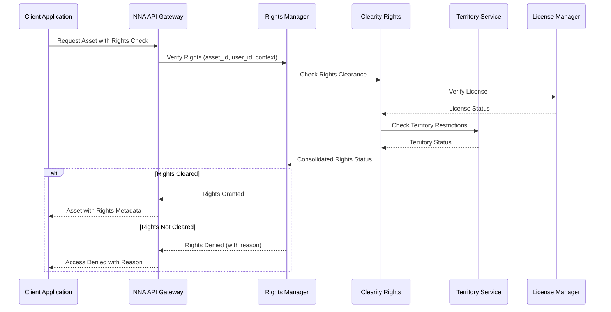

### 5.4.2 Rights Verification Implementation

```python
class RightsVerificationService:
    def __init__(self):
        self.clearity_client = ClearityClient()
        self.cache_manager = CacheManager()
        self.metrics_collector = MetricsCollector()

    async def verify_rights(
        self,
        asset_id: str,
        user_id: str,
        context: RequestContext
    ) -> RightsVerification:
        """
        Comprehensive rights verification with caching
        """
        async with self.metrics_collector.track_operation(
            "rights_verification",
            context
        ):
            # Check cache first for performance
            cache_key = f"rights:{asset_id}:{user_id}:{context.territory}"
            if cached := await self.cache_manager.get(cache_key):
                await self.metrics.record_cache_hit("rights")
                return cached

            # Verify rights with Clearity
            rights_status = await self.clearity_client.verify_rights(
                asset_id=asset_id,
                user_id=user_id,
                territory=context.territory,
                usage_type=context.usage_type
            )

            # Process rights verification result
            verification = RightsVerification(
                asset_id=asset_id,
                user_id=user_id,
                has_rights=rights_status.has_rights,
                rights_type=rights_status.rights_type,
                expiration=rights_status.expiration,
                restrictions=rights_status.restrictions,
                required_attributions=rights_status.required_attributions
            )

            # Cache the result if rights are granted
            if verification.has_rights:
                # Calculate appropriate TTL based on expiration
                ttl = self.calculate_cache_ttl(verification.expiration)
                await self.cache_manager.set(cache_key, verification, ttl=ttl)

            # Record metrics
            await self.metrics_collector.record_rights_verification(
                asset_id=asset_id,
                has_rights=verification.has_rights,
                rights_type=verification.rights_type
            )

            return verification

    def calculate_cache_ttl(self, expiration: Optional[datetime]) -> int:
        """
        Calculate appropriate cache TTL based on rights expiration
        """
        if not expiration:
            # No expiration date, use default TTL
            return 3600  # 1 hour

        # Calculate seconds until expiration
        now = datetime.now(timezone.utc)
        expiration_seconds = (expiration - now).total_seconds()

        if expiration_seconds <= 0:
            # Already expired, don't cache
            return 0

        # Cache for the shorter of expiration time or max TTL
        return min(int(expiration_seconds), 86400)  # Max 24 hours
```

### 5.4.3 Rights Clearance Integration

The Rights Management system integrates with Clearity through a standardized interface that ensures consistent rights verification across all components:

```python
class ClearityIntegration:
    def __init__(self):
        self.client = ClearityClient()
        self.cache = RightsCache()
        self.metrics = RightsMetrics()

    async def verify_asset_rights(
        self,
        asset_id: str,
        user_id: str,
        context: RightsContext
    ) -> RightsClearance:
        """
        Verify asset rights with Clearity integration
        """
        # Resolve asset address
        nna_address = await self.resolve_asset_address(asset_id)
        
        # Check rights cache
        cache_key = f"rights:{nna_address}:{user_id}:{context.territory}"
        if cached := await self.cache.get(cache_key):
            return cached
            
        # Verify with Clearity
        clearance = await self.client.verify_rights(
            asset_id=nna_address,
            user_id=user_id,
            territory=context.territory,
            usage_type=context.usage_type,
            platform=context.platform
        )
        
        # Cache result with appropriate TTL
        if clearance.has_rights:
            ttl = self.calculate_cache_ttl(clearance.expiration)
            await self.cache.set(cache_key, clearance, ttl=ttl)
        
        # Record metrics
        await self.metrics.record_verification(
            asset_id=nna_address,
            result=clearance.has_rights
        )
        
        return clearance

    async def resolve_asset_address(self, asset_id: str) -> str:
        """
        Resolve asset ID to NNA address if needed
        """
        if self.is_nna_address(asset_id):
            return asset_id
            
        # Resolve Human-Friendly Name to NNA Address
        return await self.name_registry.resolve_asset_id(asset_id)
```

### 5.4.4 Rights Event Propagation

When rights change, such as when new rights are granted or existing rights are revoked, the system must propagate these changes to ensure consistency:

```python
class RightsEventManager:
    def __init__(self):
        self.event_bus = EventBus()
        self.cache_manager = CacheManager()
        self.notification_service = NotificationService()

    async def propagate_rights_change(
        self,
        rights_event: RightsEvent
    ) -> EventPropagationResult:
        """
        Propagate rights change events across the system
        """
        # Publish event to event bus
        await self.event_bus.publish(
            topic="rights.changed",
            event=rights_event
        )
        
        # Invalidate affected caches
        await self.invalidate_affected_caches(rights_event)
        
        # Notify affected users if needed
        if rights_event.should_notify:
            await self.notification_service.notify_rights_change(rights_event)
            
        # Record metrics
        await self.metrics.record_rights_event(rights_event)
        
        return EventPropagationResult(
            event_id=rights_event.id,
            propagated=True,
            affected_systems=["cache", "recommendations", "notifications"]
        )
        
    async def invalidate_affected_caches(
        self,
        rights_event: RightsEvent
    ) -> None:
        """
        Invalidate all caches affected by rights change
        """
        # Invalidate rights cache
        rights_pattern = f"rights:{rights_event.asset_id}:*"
        await self.cache_manager.invalidate_pattern(rights_pattern)
        
        # Invalidate asset cache if needed
        if rights_event.affects_asset_metadata:
            asset_pattern = f"asset:{rights_event.asset_id}"
            await self.cache_manager.invalidate_pattern(asset_pattern)
        
        # Invalidate recommendations cache if needed
        if rights_event.affects_recommendations:
            rec_pattern = f"recommendations:*:{rights_event.asset_id}:*"
            await self.cache_manager.invalidate_pattern(rec_pattern)
```

### 

The rights management flow is a critical component that ensures legal compliance across the NNA Framework. By implementing a unified approach to rights verification and propagation, the system maintains consistency while optimizing performance through intelligent caching.

For more details on the Clearity integration, refer to the [Clearity Rights Clearance Platform](https://celerity.slab.com/posts/8ft1v300#h5dui-4-integration-architecture).

# 6. Performance Optimization

## 6.1 Performance Monitoring Service

```python
class PerformanceMonitoringService:
    def __init__(self):
        self.metrics_collector = MetricsCollector()
        self.alert_manager = AlertManager()
        self.trend_analyzer = TrendAnalyzer()

    @contextlib.asynccontextmanager
    async def monitor_operation(
        self,
        operation_name: str,
        context: RequestContext
    ):
        """
        Comprehensive operation monitoring with trending
        """
        start_time = time.monotonic()
        operation_id = str(uuid.uuid4())

        try:
            # Record operation start
            await self.metrics_collector.record_operation_start(
                operation_id,
                operation_name,
                context
            )

            yield

            # Calculate duration
            duration = time.monotonic() - start_time

            # Record successful completion
            await self.record_success(
                operation_id,
                operation_name,
                duration,
                context
            )

        except Exception as e:
            # Record failure
            await self.record_failure(
                operation_id,
                operation_name,
                e,
                context
            )
            raise

        finally:
            # Update trends
            await self.trend_analyzer.update_trends(
                operation_name,
                duration,
                context
            )

    async def record_success(
        self,
        operation_id: str,
        operation_name: str,
        duration: float,
        context: RequestContext
    ):
        """
        Records successful operation with performance analysis
        """
        metrics = {
            'operation_id': operation_id,
            'name': operation_name,
            'duration': duration,
            'timestamp': datetime.utcnow(),
            'context': context.to_dict()
        }

        await asyncio.gather(
            self.metrics_collector.record_metrics(metrics),
            self.alert_manager.check_thresholds(metrics),
            self.trend_analyzer.analyze_performance(metrics)
        )
```

### 6.1.1 Metrics Collection

**Key metrics tracked** (targets: 95%+ cache hit rate, 99.999% availability, 100M+ daily requests):

- API response time (ms)
- Cache hit rate (%)
- Concurrent users (millions)
- Asset retrieval success rate (%)

Real-time logging enables system-wide event tracking.

### 6.1.2 Performance Optimization Service

```python
class PerformanceOptimizationService:
    def __init__(self):
        self.resource_optimizer = ResourceOptimizer()
        self.cache_optimizer = CacheOptimizer()
        self.query_optimizer = QueryOptimizer()

    async def optimize_performance(
        self,
        context: RequestContext
    ):
        """
        Comprehensive performance optimization
        """
        # Collect current metrics
        metrics = await self.collect_current_metrics()

        # Optimize resources
        resource_adjustments = await self.resource_optimizer.optimize(
            metrics.resource_metrics
        )

        # Optimize cache
        cache_adjustments = await self.cache_optimizer.optimize(
            metrics.cache_metrics
        )

        # Optimize queries
        query_adjustments = await self.query_optimizer.optimize(
            metrics.query_metrics
        )

        # Apply optimizations
        await self.apply_optimizations(
            resource_adjustments,
            cache_adjustments,
            query_adjustments
        )

    async def apply_optimizations(
        self,
        resource_adjustments: dict,
        cache_adjustments: dict,
        query_adjustments: dict
    ):
        """
        Applies optimizations with rollback support
        """
        try:
            # Start transaction
            async with self.optimization_transaction():
                # Apply resource optimizations
                await self.resource_optimizer.apply_adjustments(
                    resource_adjustments
                )

                # Apply cache optimizations
                await self.cache_optimizer.apply_adjustments(
                    cache_adjustments
                )

                # Apply query optimizations
                await self.query_optimizer.apply_adjustments(
                    query_adjustments
                )

        except OptimizationError:
            # Rollback optimizations
            await self.rollback_optimizations()
            raise
```

## 6.2 Cross-Platform Performance Optimization

This section provides implementation details for cross-platform performance optimization:

```python
class CrossPlatformPerformanceOptimizer:
    """
    Optimizes NNA Framework performance across different platforms
    with platform-specific adaptations and intelligent delivery.
    """
    def __init__(self):
        self.platform_detector = PlatformDetector()
        self.resource_optimizer = ResourceOptimizer()
        self.delivery_optimizer = DeliveryOptimizer()
        self.metrics_collector = MetricsCollector()
        
    async def optimize_delivery(
        self,
        asset: Asset,
        context: RequestContext
    ) -> OptimizedAsset:
        """
        Optimize asset delivery based on platform-specific capabilities
        and constraints to ensure optimal performance.
        """
        # Detect platform
        platform_info = await self.platform_detector.detect_platform(context)
        
        # Get platform capabilities
        capabilities = await self.get_platform_capabilities(platform_info)
        
        # Get platform constraints
        constraints = await self.get_platform_constraints(platform_info)
        
        # Get network conditions
        network = await self.get_network_conditions(context)
        
        # Select optimal delivery strategy
        strategy = await self.select_delivery_strategy(
            asset, platform_info, capabilities, constraints, network
        )
        
        # Apply optimization strategy
        optimized_asset = await self.apply_optimization_strategy(
            asset, strategy, context
        )
        
        # Record optimization metrics
        await self.record_optimization_metrics(
            asset, optimized_asset, strategy, context
        )
        
        return optimized_asset
        
    async def select_delivery_strategy(
        self,
        asset: Asset,
        platform: PlatformInfo,
        capabilities: PlatformCapabilities,
        constraints: PlatformConstraints,
        network: NetworkConditions
    ) -> DeliveryStrategy:
        """
        Select the optimal delivery strategy based on platform and network
        """
        # Base strategies by platform type
        strategies = {
            "web": self.get_web_strategy,
            "mobile": self.get_mobile_strategy,
            "desktop": self.get_desktop_strategy,
            "tv": self.get_tv_strategy,
            "vr": self.get_vr_strategy
        }
        
        # Get base strategy for platform
        get_strategy = strategies.get(platform.type, self.get_default_strategy)
        base_strategy = await get_strategy(platform, capabilities)
        
        # Adjust for network conditions
        network_adjusted = await self.adjust_for_network(base_strategy, network)
        
        # Adjust for constraints
        constraint_adjusted = await self.adjust_for_constraints(
            network_adjusted, constraints
        )
        
        # Adjust for asset type
        return await self.adjust_for_asset_type(constraint_adjusted, asset)
        
    async def get_mobile_strategy(
        self,
        platform: PlatformInfo,
        capabilities: PlatformCapabilities
    ) -> DeliveryStrategy:
        """
        Get mobile-specific delivery strategy with optimizations
        for battery life, data usage, and screen size.
        """
        # Base mobile strategy
        strategy = DeliveryStrategy(
            platform_type="mobile",
            quality_target="balanced",
            max_resolution=self.get_resolution_for_device(platform),
            progressive_loading=True,
            compression_level="high",
            caching_strategy="aggressive"
        )
        
        # Platform-specific optimizations
        if platform.os == "ios":
            # iOS-specific optimizations
            strategy.format = "hls"
            strategy.codec = "h264"
            strategy.segment_duration = 4
        elif platform.os == "android":
            # Android-specific optimizations
            strategy.format = "dash"
            strategy.codec = "vp9"
            strategy.segment_duration = 6
        
        # Capability-based optimizations
        if capabilities.supports_hardware_acceleration:
            strategy.codec = self.select_hardware_accelerated_codec(platform)
            
        if capabilities.battery_saving_mode:
            strategy.quality_target = "battery_saving"
            strategy.max_resolution = self.lower_resolution(strategy.max_resolution)
            
        if capabilities.low_data_mode:
            strategy.compression_level = "maximum"
            strategy.max_resolution = self.lower_resolution(strategy.max_resolution)
            
        return strategy
    
    async def adjust_for_network(
        self,
        strategy: DeliveryStrategy,
        network: NetworkConditions
    ) -> DeliveryStrategy:
        """
        Adjust delivery strategy based on current network conditions
        """
        adjusted = copy.deepcopy(strategy)
        
        # Adjust for connection type
        if network.connection_type == "cellular":
            adjusted.compression_level = "maximum"
            adjusted.progressive_loading = True
            
            # Further adjust based on cellular generation
            if network.cellular_generation in ["2g", "3g"]:
                adjusted.max_resolution = "360p"
                adjusted.quality_target = "bandwidth_saving"
                adjusted.segment_duration = 10
            elif network.cellular_generation == "4g":
                adjusted.max_resolution = "720p"
                adjusted.quality_target = "balanced"
                adjusted.segment_duration = 6
            elif network.cellular_generation == "5g":
                # 5G can handle higher quality
                pass
        
        # Adjust for bandwidth
        if network.bandwidth_mbps < 1:
            adjusted.max_resolution = "240p"
            adjusted.quality_target = "bandwidth_saving"
        elif network.bandwidth_mbps < 5:
            adjusted.max_resolution = "480p"
            adjusted.quality_target = "balanced"
        elif network.bandwidth_mbps < 10:
            adjusted.max_resolution = "720p"
        
        # Adjust for latency
        if network.latency_ms > 100:
            adjusted.segment_duration = min(10, adjusted.segment_duration * 2)
            
        # Adjust for packet loss
        if network.packet_loss_percent > 1:
            adjusted.error_correction = "aggressive"
            
        return adjusted
    
    async def apply_optimization_strategy(
        self,
        asset: Asset,
        strategy: DeliveryStrategy,
        context: RequestContext
    ) -> OptimizedAsset:
        """
        Apply the selected optimization strategy to the asset
        """
        # Apply transformations based on strategy
        transformed_asset = await self.transform_asset(asset, strategy)
        
        # Apply delivery optimizations
        delivery_optimized = await self.optimize_delivery_params(
            transformed_asset, strategy
        )
        
        # Apply caching directives
        cache_optimized = await self.apply_caching_directives(
            delivery_optimized, strategy, context
        )
        
        # Create optimization metadata
        optimization_metadata = {
            "original_asset_id": asset.id,
            "platform_type": strategy.platform_type,
            "max_resolution": strategy.max_resolution,
            "format": strategy.format,
            "codec": strategy.codec,
            "compression_level": strategy.compression_level,
            "optimized_at": datetime.now().isoformat()
        }
        
        # Return optimized asset with metadata
        return OptimizedAsset(
            id=f"{asset.id}_optimized",
            original_id=asset.id,
            data=cache_optimized.data,
            url=cache_optimized.url,
            size=len(cache_optimized.data),
            format=strategy.format,
            resolution=strategy.max_resolution,
            metadata=optimization_metadata
        )
```

# 7. Monitoring and Observability

## Executive Summary

The monitoring framework provides comprehensive visibility into system performance and behavior through:

- Structured logging with JSON formatting for machine readability
- Real-time metrics collection via Prometheus with custom dashboards in Grafana
- Distributed tracing for end-to-end request visibility
- Alerting with configurable thresholds and intelligent anomaly detection
- Real-time analytics pipeline for immediate insights into system behavior

This observability infrastructure enables proactive issue detection, performance optimization, and capacity planning. The monitoring components are designed to operate with minimal performance impact while providing maximum operational visibility across all framework components.

NNA uses a **structured logging approach** to enable **debugging, monitoring, and real-time analytics**.

## 7.1 Logging Standards

- **Format:** JSON-based structured logging.
- **Minimum Fields:** `timestamp`, `log_level`, `service_name`, `request_id`, `error_code`.
- **Storage:** Logs are persisted in **Elasticsearch** for querying and visualization.
    - **Severity Levels:**`INFO`: Standard operation logs.
    - `WARN`: Potential issues that don’t impact functionality.
    - `ERROR`: Critical failures requiring intervention.

## 7.2 Monitoring Tools

| **Tool** | **Purpose** |
| --- | --- |
| Prometheus | Real-time system metrics |
| Grafana | Dashboard visualization |
| ELK Stack | Centralized logging & analytics |

## 7.3 Telemetry Service

The NNA Framework implements a comprehensive telemetry system that collects, processes, and analyzes metrics, traces, and logs to provide full observability into system behavior and performance.

### 7.3.1 Metrics Collection

```python
class MetricsCollector:
    """
    Collects and processes metrics with multi-dimensional labels,
    histogram support, and automatic aggregation.
    """
    def __init__(self, registry: MetricsRegistry = None):
        self.registry = registry or PrometheusRegistry()
        self._initialize_metrics()
        
    def _initialize_metrics(self):
        """Initialize core metrics with appropriate labels and buckets"""
        # API metrics
        self.api_request_duration = self.registry.histogram(
            name="nna_api_request_duration_seconds",
            description="API request duration in seconds",
            labels=["endpoint", "method", "status_code"],
            buckets=[0.001, 0.005, 0.01, 0.025, 0.05, 0.1, 0.25, 0.5, 1, 2.5, 5, 10]
        )
        
        self.api_requests_total = self.registry.counter(
            name="nna_api_requests_total",
            description="Total count of API requests",
            labels=["endpoint", "method", "status_code"]
        )
        
        self.api_errors_total = self.registry.counter(
            name="nna_api_errors_total",
            description="Total count of API errors",
            labels=["endpoint", "method", "error_code"]
        )
        
        # Cache metrics
        self.cache_hits_total = self.registry.counter(
            name="nna_cache_hits_total",
            description="Total count of cache hits",
            labels=["tier", "region"]
        )
        
        self.cache_misses_total = self.registry.counter(
            name="nna_cache_misses_total",
            description="Total count of cache misses",
            labels=["tier", "region"]
        )
        
        self.cache_set_total = self.registry.counter(
            name="nna_cache_set_total",
            description="Total count of cache set operations",
            labels=["tier", "region"]
        )
        
        self.cache_size_bytes = self.registry.gauge(
            name="nna_cache_size_bytes",
            description="Size of cache in bytes",
            labels=["tier", "region"]
        )
        
        # Asset metrics
        self.asset_resolution_duration = self.registry.histogram(
            name="nna_asset_resolution_duration_seconds",
            description="Asset resolution time in seconds",
            labels=["layer_type", "cache_result"],
            buckets=[0.001, 0.005, 0.01, 0.025, 0.05, 0.1, 0.25, 0.5, 1]
        )
        
        self.asset_requests_total = self.registry.counter(
            name="nna_asset_requests_total",
            description="Total count of asset requests",
            labels=["layer_type", "category"]
        )
        
        # Rights metrics
        self.rights_verification_duration = self.registry.histogram(
            name="nna_rights_verification_duration_seconds",
            description="Rights verification time in seconds",
            labels=["result"],
            buckets=[0.001, 0.005, 0.01, 0.025, 0.05, 0.1, 0.25, 0.5, 1]
        )
        
        self.rights_verifications_total = self.registry.counter(
            name="nna_rights_verifications_total",
            description="Total count of rights verifications",
            labels=["result"]
        )
    
    async def record_api_request(self, endpoint: str, method: str, 
                              status_code: int, duration: float):
        """Record API request metrics"""
        self.api_requests_total.inc(labels={
            "endpoint": endpoint,
            "method": method,
            "status_code": str(status_code)
        })
        
        self.api_request_duration.observe(
            value=duration,
            labels={
                "endpoint": endpoint,
                "method": method,
                "status_code": str(status_code)
            }
        )
    
    async def record_api_error(self, endpoint: str, method: str, 
                            error_code: str):
        """Record API error metrics"""
        self.api_errors_total.inc(labels={
            "endpoint": endpoint,
            "method": method,
            "error_code": error_code
        })
    
    async def record_cache_operation(self, operation: str, tier: str, 
                                  region: str = "global"):
        """Record cache operation metrics"""
        if operation == "hit":
            self.cache_hits_total.inc(labels={"tier": tier, "region": region})
        elif operation == "miss":
            self.cache_misses_total.inc(labels={"tier": tier, "region": region})
        elif operation == "set":
            self.cache_set_total.inc(labels={"tier": tier, "region": region})
    
    async def record_asset_resolution(self, layer_type: str, 
                                    cache_result: str, duration: float):
        """Record asset resolution metrics"""
        self.asset_resolution_duration.observe(
            value=duration,
            labels={
                "layer_type": layer_type,
                "cache_result": cache_result
            }
        )
        
        self.asset_requests_total.inc(labels={
            "layer_type": layer_type,
            "category": layer_type  # Default to layer_type if category unknown
        })
    
    async def record_rights_verification(self, result: str, duration: float):
        """Record rights verification metrics"""
        self.rights_verification_duration.observe(
            value=duration,
            labels={"result": result}
        )
        
        self.rights_verifications_total.inc(labels={"result": result})
    
    async def update_cache_size(self, tier: str, size_bytes: int, 
                             region: str = "global"):
        """Update cache size gauge"""
        self.cache_size_bytes.set(
            value=size_bytes,
            labels={"tier": tier, "region": region}
        )
```

### 7.3.2 Distributed Tracing

```python
class TracingService:
    """
    Implements distributed tracing with sampling, propagation, 
    and OpenTelemetry compatibility.
    """
    def __init__(self, config: TracingConfig):
        self.tracer = self._initialize_tracer(config)
        self.propagator = self._initialize_propagator(config)
        self.sampler = self._initialize_sampler(config)
        self.exporter = self._initialize_exporter(config)
    
    def _initialize_tracer(self, config: TracingConfig):
        """Initialize OpenTelemetry tracer"""
        return opentelemetry.trace.get_tracer(
            name="nna-framework",
            version=config.version
        )
    
    def _initialize_propagator(self, config: TracingConfig):
        """Initialize context propagator"""
        return TraceContextPropagator()
    
    def _initialize_sampler(self, config: TracingConfig):
        """Initialize trace sampler with appropriate strategy"""
        if config.sampling_strategy == "always_on":
            return AlwaysOnSampler()
        elif config.sampling_strategy == "always_off":
            return AlwaysOffSampler()
        elif config.sampling_strategy == "probabilistic":
            return ProbabilitySampler(config.sampling_rate)
        elif config.sampling_strategy == "rate_limiting":
            return RateLimitingSampler(config.max_samples_per_second)
        else:
            return ParentBasedSampler(root_sampler=ProbabilitySampler(0.1))
    
    def _initialize_exporter(self, config: TracingConfig):
        """Initialize trace exporter"""
        if config.exporter_type == "jaeger":
            return JaegerSpanExporter(
                service_name="nna-framework",
                agent_host_name=config.exporter_host,
                agent_port=config.exporter_port
            )
        elif config.exporter_type == "zipkin":
            return ZipkinExporter(
                service_name="nna-framework",
                url=f"http://{config.exporter_host}:{config.exporter_port}/api/v2/spans"
            )
        else:
            return ConsoleSpanExporter()
    
    @contextlib.asynccontextmanager
    async def trace_request(self, request_context: RequestContext,
                          operation_name: str):
        """
        Context manager for tracing a request or operation
        """
        # Extract context from carrier if available
        parent_context = self.propagator.extract(carrier=request_context.headers)
        
        # Start span with appropriate context
        span = self.tracer.start_span(
            name=operation_name,
            context=parent_context,
            kind=SpanKind.SERVER
        )
        
        # Set span attributes
        span.set_attribute("service.name", "nna-framework")
        span.set_attribute("operation.name", operation_name)
        span.set_attribute("user.id", request_context.user_id)
        span.set_attribute("territory", request_context.territory)
        
        # Create new context with span
        with trace.use_span(span, end_on_exit=True):
            try:
                # Set context for current execution
                request_context.trace_id = span.get_span_context().trace_id
                request_context.span_id = span.get_span_context().span_id
                
                # Yield control back to the caller
                yield span
                
                # Mark as successful unless an exception occurs
                span.set_status(Status(StatusCode.OK))
                
            except Exception as e:
                # Record exception and mark as error
                span.record_exception(e)
                span.set_status(Status(StatusCode.ERROR, str(e)))
                
                # Re-raise to allow proper error handling
                raise
    
    @contextlib.asynccontextmanager
    async def trace_operation(self, parent_span: Span, operation_name: str):
        """
        Context manager for tracing a sub-operation within a request
        """
        # Start child span
        with self.tracer.start_as_current_span(
            name=operation_name,
            context=trace.set_span_in_context(parent_span),
            kind=SpanKind.INTERNAL
        ) as span:
            try:
                # Yield control back to the caller
                yield span
                
                # Mark as successful unless an exception occurs
                span.set_status(Status(StatusCode.OK))
                
            except Exception as e:
                # Record exception and mark as error
                span.record_exception(e)
                span.set_status(Status(StatusCode.ERROR, str(e)))
                
                # Re-raise to allow proper error handling
                raise
    
    def inject_context_into_headers(self, headers: Dict[str, str], 
                                   span_context: SpanContext):
        """
        Inject current trace context into outgoing request headers
        """
        if not headers:
            headers = {}
            
        self.propagator.inject(carrier=headers, context=span_context)
        return headers
    
    def extract_context_from_headers(self, headers: Dict[str, str]) -> Context:
        """
        Extract trace context from incoming request headers
        """
        return self.propagator.extract(carrier=headers)
```

### 7.3.3 Trace Context Propagation

Distributed tracing requires effective context propagation across service boundaries for end-to-end visibility. The NNA Framework implements the W3C Trace Context specification to ensure interoperability with other observability systems.

### 7.3.3.1 Header Format

The following headers are used for trace propagation:

- `traceparent`: Contains version, trace ID, parent span ID and trace flags
    - Format: `00-<trace-id>-<span-id>-<trace-flags>`
    - Example: `00-4bf92f3577b34da6a3ce929d0e0e4736-00f067aa0ba902b7-01`
- `tracestate`: Vendor-specific trace information
    - Format: `<vendor1>=<value1>,<vendor2>=<value2>`
    - Example: `nna=abcdef1234,algorhythm=5678ghijkl`

### 7.3.3.2 Cross-System Tracing Flow

When a request flows through the NNA ecosystem:

1. **Client Request**: Contains no tracing headers
1. **API Gateway**: Generates new trace ID, span ID, and injects headers
1. **NNA Service**: Extracts context, creates child span, propagates to dependencies
1. **External Systems**: Extract context, create child spans, propagate downstream
1. **Response Chain**: Each service completes its span with status and metadata

This creates a complete trace tree across system boundaries, enabling visualization of the entire request lifecycle.

### 7.3.3.3 Trace Collection and Visualization

The NNA Framework exports trace data to:

- **Jaeger**: For distributed trace visualization and analysis
- **Zipkin**: For alternative trace visualization
- **Elasticsearch**: For long-term storage and advanced querying

These systems provide visibility into:

- End-to-end request latency
- Service dependency analysis
- Error correlation
- Performance bottleneck identification
- System behavior analysis

## 7.3.4 Monitoring Examples

Monitor NNA Framework health with these practical examples using Prometheus and Grafana:

1. **Cache Hit Rate**:
    - **Prometheus Query**: `rate(cache_hits_total[5m]) / (rate(cache_hits_total[5m]) + rate(cache_misses_total[5m]))`
    - **Grafana Panel**: Line graph, target >95%, alert if <85%.

```yaml
# prometheus.yml snippet
- job_name: 'nna_cache'
  scrape_interval: 5s
  metrics_path: '/metrics'
  static_configs:
    - targets: ['localhost:9090']
```

1. **API Response Time**:
    - **Prometheus Query**: histogram_quantile(0.95, rate(api_request_duration_seconds_bucket[5m]))
    - **Grafana Panel**: Gauge, target <20ms, alert if >50ms.
    - 
1. **System Uptime**:
    - **Prometheus Query**: up{job="nna_core"}
    - **Grafana Panel**: Stat, target 99.999%, alert if <99.9%.

Configure these in [Section 7.2 - Monitoring Tools](#7-monitoring-and-observability). For API-level metrics, see [API Specification, Section 8](#8-monitoring-and-observability).

### 7.3.5 Key Metrics and Dashboards

```python
class MetricsConfiguration:
    """
    Configuration for key NNA Framework metrics
    """
    def __init__(self):
        # Core performance metrics
        self.performance_metrics = {
            'api_request_duration_seconds': {
                'type': 'histogram',
                'description': 'API request duration in seconds',
                'buckets': [0.001, 0.005, 0.01, 0.05, 0.1, 0.5, 1, 5],
                'labels': ['endpoint', 'method', 'status_code']
            },
            'api_requests_total': {
                'type': 'counter',
                'description': 'Total number of API requests',
                'labels': ['endpoint', 'method', 'status_code']
            },
            'api_errors_total': {
                'type': 'counter',
                'description': 'Total number of API errors',
                'labels': ['endpoint', 'error_code']
            }
        }
        
        # Cache metrics
        self.cache_metrics = {
            'cache_hits_total': {
                'type': 'counter',
                'description': 'Total number of cache hits',
                'labels': ['tier', 'region']
            },
            'cache_misses_total': {
                'type': 'counter',
                'description': 'Total number of cache misses',
                'labels': ['tier', 'region']
            },
            'cache_size_bytes': {
                'type': 'gauge',
                'description': 'Cache size in bytes',
                'labels': ['tier', 'region']
            }
        }
        
        # Resource metrics
        self.resource_metrics = {
            'resource_usage_cpu': {
                'type': 'gauge',
                'description': 'CPU usage percentage',
                'labels': ['service', 'instance']
            },
            'resource_usage_memory': {
                'type': 'gauge',
                'description': 'Memory usage in bytes',
                'labels': ['service', 'instance']
            },
            'resource_usage_disk': {
                'type': 'gauge',
                'description': 'Disk usage in bytes',
                'labels': ['service', 'instance', 'mount']
            }
        }
        
        # Business metrics
        self.business_metrics = {
            'asset_requests_total': {
                'type': 'counter',
                'description': 'Total number of asset requests',
                'labels': ['layer_type', 'category']
            },
            'composition_created_total': {
                'type': 'counter',
                'description': 'Total number of compositions created',
                'labels': ['source']
            },
            'rights_verifications_total': {
                'type': 'counter',
                'description': 'Total number of rights verifications',
                'labels': ['result']
            }
        }
        
    def get_prometheus_config(self) -> str:
        """
        Generate Prometheus configuration
        """
        config = {
            'global': {
                'scrape_interval': '15s',
                'evaluation_interval': '15s'
            },
            'scrape_configs': [
                {
                    'job_name': 'nna_api',
                    'metrics_path': '/metrics',
                    'static_configs': [
                        {
                            'targets': ['nna-api:9090']
                        }
                    ]
                },
                {
                    'job_name': 'nna_cache',
                    'metrics_path': '/metrics',
                    'static_configs': [
                        {
                            'targets': ['nna-cache:9090']
                        }
                    ]
                },
                {
                    'job_name': 'nna_rights',
                    'metrics_path': '/metrics',
                    'static_configs': [
                        {
                            'targets': ['nna-rights:9090']
                        }
                    ]
                }
            ],
            'alerting': {
                'alertmanagers': [
                    {
                        'static_configs': [
                            {
                                'targets': ['alertmanager:9093']
                            }
                        ]
                    }
                ]
            },
            'rule_files': [
                'nna_alert_rules.yml'
            ]
        }
        
        return yaml.dump(config)
        
    def get_grafana_dashboard_config(self) -> dict:
        """
        Generate Grafana dashboard configuration
        """
        return {
            'dashboard': {
                'id': None,
                'title': 'NNA Framework Overview',
                'tags': ['nna', 'overview'],
                'timezone': 'browser',
                'schemaVersion': 16,
                'version': 0,
                'refresh': '10s',
                'panels': [
                    # API Performance Panel
                    {
                        'id': 1,
                        'title': 'API Request Duration (P95)',
                        'type': 'graph',
                        'datasource': 'Prometheus',
                        'targets': [
                            {
                                'expr': 'histogram_quantile(0.95, sum(rate(api_request_duration_seconds_bucket{job="nna_api"}[5m])) by (le, endpoint))',
                                'legendFormat': '{{endpoint}}'
                            }
                        ],
                        'gridPos': {
                            'x': 0,
                            'y': 0,
                            'w': 12,
                            'h': 8
                        },
                        'thresholds': [
                            {
                                'value': 0.05,
                                'op': 'gt',
                                'fill': True,
                                'line': True,
                                'colorMode': 'warning'
                            },
                            {
                                'value': 0.1,
                                'op': 'gt',
                                'fill': True,
                                'line': True,
                                'colorMode': 'critical'
                            }
                        ]
                    },
                    # Cache Hit Rate Panel
                    {
                        'id': 2,
                        'title': 'Cache Hit Rate',
                        'type': 'gauge',
                        'datasource': 'Prometheus',
                        'targets': [
                            {
                                'expr': 'sum(rate(cache_hits_total[5m])) / (sum(rate(cache_hits_total[5m])) + sum(rate(cache_misses_total[5m])))',
                                'legendFormat': 'Hit Rate'
                            }
                        ],
                        'gridPos': {
                            'x': 12,
                            'y': 0,
                            'w': 12,
                            'h': 8
                        },
                        'options': {
                            'fieldOptions': {
                                'calcs': ['mean'],
                                'defaults': {
                                    'min': 0,
                                    'max': 1,
                                    'thresholds': {
                                        'mode': 'absolute',
                                        'steps': [
                                            { 'color': 'red', 'value': null },
                                            { 'color': 'yellow', 'value': 0.85 },
                                            { 'color': 'green', 'value': 0.95 }
                                        ]
                                    },
                                    'mappings': [],
                                    'unit': 'percentunit'
                                }
                            }
                        }
                    },
                    # Request Rate Panel
                    {
                        'id': 3,
                        'title': 'Request Rate by Endpoint',
                        'type': 'graph',
                        'datasource': 'Prometheus',
                        'targets': [
                            {
                                'expr': 'sum(rate(api_requests_total[5m])) by (endpoint)',
                                'legendFormat': '{{endpoint}}'
                            }
                        ],
                        'gridPos': {
                            'x': 0,
                            'y': 8,
                            'w': 12,
                            'h': 8
                        }
                    },
                    # Error Rate Panel
                    {
                        'id': 4,
                        'title': 'Error Rate',
                        'type': 'graph',
                        'datasource': 'Prometheus',
                        'targets': [
                            {
                                'expr': 'sum(rate(api_errors_total[5m])) / sum(rate(api_requests_total[5m]))',
                                'legendFormat': 'Error Rate'
                            }
                        ],
                        'gridPos': {
                            'x': 12,
                            'y': 8,
                            'w': 12,
                            'h': 8
                        },
                        'thresholds': [
                            {
                                'value': 0.01,
                                'op': 'gt',
                                'fill': True,
                                'line': True,
                                'colorMode': 'warning'
                            },
                            {
                                'value': 0.05,
                                'op': 'gt',
                                'fill': True,
                                'line': True,
                                'colorMode': 'critical'
                            }
                        ]
                    },
                    # Resource Usage Panel
                    {
                        'id': 5,
                        'title': 'Resource Usage',
                        'type': 'graph',
                        'datasource': 'Prometheus',
                        'targets': [
                            {
                                'expr': 'sum(resource_usage_cpu) by (service)',
                                'legendFormat': 'CPU: {{service}}'
                            },
                            {
                                'expr': 'sum(resource_usage_memory) / 1024 / 1024 / 1024 by (service)',
                                'legendFormat': 'Memory (GB): {{service}}'
                            }
                        ],
                        'gridPos': {
                            'x': 0,
                            'y': 16,
                            'w': 24,
                            'h': 8
                        }
                    }
                ]
            }
        }
}
```

## 7.4 Monitoring Dashboard Setup

The NNA Framework includes a comprehensive monitoring solution based on Prometheus and Grafana for real-time performance tracking and alerting.

### 7.4.1 Core Dashboard Setup

The following example shows how to set up a core monitoring dashboard for the NNA Framework:

```yaml
# prometheus.yml configuration for NNA Framework
global:
  scrape_interval: 15s
  evaluation_interval: 15s

scrape_configs:
  - job_name: 'nna_core'
    metrics_path: '/metrics'
    static_configs:
      - targets: ['nna-core:9090']
        labels:
          service: 'core'
          
  - job_name: 'nna_cache'
    metrics_path: '/metrics'
    static_configs:
      - targets: ['nna-cache:9090']
        labels:
          service: 'cache'
          
  - job_name: 'nna_rights'
    metrics_path: '/metrics'
    static_configs:
      - targets: ['nna-rights:9090']
        labels:
          service: 'rights'
```

### 7.4.2 Grafana Dashboard Configuration

The following JSON defines the main NNA Framework performance dashboard:

```json
{
  "dashboard": {
    "id": null,
    "title": "NNA Framework Performance",
    "tags": ["nna", "performance"],
    "timezone": "browser",
    "schemaVersion": 16,
    "version": 0,
    "refresh": "10s",
    "panels": [
      {
        "id": 1,
        "title": "Asset Resolution Time",
        "type": "graph",
        "datasource": "Prometheus",
        "targets": [
          {
            "expr": "histogram_quantile(0.95, sum(rate(api_request_duration_seconds_bucket{endpoint=~\"/v1/asset/resolve/.*\"}[5m])) by (le))",
            "legendFormat": "P95 Latency"
          },
          {
            "expr": "histogram_quantile(0.50, sum(rate(api_request_duration_seconds_bucket{endpoint=~\"/v1/asset/resolve/.*\"}[5m])) by (le))",
            "legendFormat": "P50 Latency"
          }
        ],
        "gridPos": {
          "x": 0,
          "y": 0,
          "w": 12,
          "h": 8
        },
        "thresholds": [
          {
            "value": 0.02,
            "op": "gt",
            "fill": true,
            "line": true,
            "colorMode": "critical"
          }
        ]
      },
      {
        "id": 2,
        "title": "Cache Hit Rate",
        "type": "gauge",
        "datasource": "Prometheus",
        "targets": [
          {
            "expr": "sum(rate(cache_hits_total[5m])) / (sum(rate(cache_hits_total[5m])) + sum(rate(cache_misses_total[5m])))",
            "legendFormat": "Hit Rate"
          }
        ],
        "gridPos": {
          "x": 12,
          "y": 0,
          "w": 12,
          "h": 8
        },
        "options": {
          "fieldOptions": {
            "calcs": ["mean"],
            "defaults": {
              "min": 0,
              "max": 1,
              "thresholds": {
                "mode": "absolute",
                "steps": [
                  { "color": "red", "value": null },
                  { "color": "yellow", "value": 0.8 },
                  { "color": "green", "value": 0.95 }
                ]
              },
              "mappings": [],
              "unit": "percentunit"
            }
          }
        }
      },
      {
        "id": 3,
        "title": "Request Rate",
        "type": "graph",
        "datasource": "Prometheus",
        "targets": [
          {
            "expr": "sum(rate(api_requests_total[5m]))",
            "legendFormat": "Requests/sec"
          }
        ],
        "gridPos": {
          "x": 0,
          "y": 8,
          "w": 12,
          "h": 8
        }
      },
      {
        "id": 4,
        "title": "Error Rate",
        "type": "graph",
        "datasource": "Prometheus",
        "targets": [
          {
            "expr": "sum(rate(api_errors_total[5m])) / sum(rate(api_requests_total[5m]))",
            "legendFormat": "Error Rate"
          }
        ],
        "gridPos": {
          "x": 12,
          "y": 8,
          "w": 12,
          "h": 8
        },
        "thresholds": [
          {
            "value": 0.01,
            "op": "gt",
            "fill": true,
            "line": true,
            "colorMode": "critical"
          }
        ]
      },
      {
        "id": 5,
        "title": "Rights Verification Time",
        "type": "graph",
        "datasource": "Prometheus",
        "targets": [
          {
            "expr": "histogram_quantile(0.95, sum(rate(rights_verification_duration_seconds_bucket[5m])) by (le))",
            "legendFormat": "P95 Latency"
          },
          {
            "expr": "histogram_quantile(0.50, sum(rate(rights_verification_duration_seconds_bucket[5m])) by (le))",
            "legendFormat": "P50 Latency"
          }
        ],
        "gridPos": {
          "x": 0,
          "y": 16,
          "w": 12,
          "h": 8
        }
      },
      {
        "id": 6,
        "title": "System Health",
        "type": "stat",
        "datasource": "Prometheus",
        "targets": [
          {
            "expr": "up{job=\"nna_core\"}",
            "legendFormat": "Core"
          },
          {
            "expr": "up{job=\"nna_cache\"}",
            "legendFormat": "Cache"
          },
          {
            "expr": "up{job=\"nna_rights\"}",
            "legendFormat": "Rights"
          }
        ],
        "options": {
          "colorMode": "value",
          "graphMode": "none",
          "justifyMode": "auto",
          "textMode": "auto",
          "valueOptions": {
            "mappings": [
              { "id": 0, "op": "=", "text": "Down", "type": 1, "value": "0" },
              { "id": 1, "op": "=", "text": "Up", "type": 1, "value": "1" }
            ],
            "thresholds": {
              "mode": "absolute",
              "steps": [
                { "color": "red", "value": null },
                { "color": "green", "value": 1 }
              ]
            }
          }
        },
        "gridPos": {
          "x": 12,
          "y": 16,
          "w": 12,
          "h": 8
        }
      }
    ]
  }
}
```

### 7.4.3 Alert Configuration

```yaml
# alertmanager.yml
global:
  resolve_timeout: 5m

route:
  group_by: ['alertname', 'job']
  group_wait: 30s
  group_interval: 5m
  repeat_interval: 12h
  receiver: 'email-notifications'
  routes:
  - match:
      severity: critical
    receiver: 'pager-duty'
    repeat_interval: 1h
  - match:
      severity: warning
    receiver: 'slack-notifications'

receivers:
- name: 'email-notifications'
  email_configs:
  - to: 'alerts@example.com'
    from: 'alertmanager@example.com'
    smarthost: 'smtp.example.com:587'
    auth_username: 'alertmanager'
    auth_password: 'password'
    require_tls: true

- name: 'pager-duty'
  pagerduty_configs:
  - service_key: '<pagerduty-service-key>'
    
- name: 'slack-notifications'
  slack_configs:
  - api_url: '<slack-webhook-url>'
    channel: '#nna-alerts'
    title: '{{ .GroupLabels.alertname }}'
    text: '{{ .CommonAnnotations.description }}'
```

### 7.4.4 Prometheus Alert Rules

```yaml
# nna_alert_rules.yml
groups:
- name: nna_alerts
  rules:
  - alert: HighLatency
    expr: histogram_quantile(0.95, sum(rate(api_request_duration_seconds_bucket[5m])) by (le)) > 0.05
    for: 5m
    labels:
      severity: warning
    annotations:
      description: "95th percentile of API request latency is above 50ms for 5 minutes"

  - alert: CriticalLatency
    expr: histogram_quantile(0.95, sum(rate(api_request_duration_seconds_bucket[5m])) by (le)) > 0.1
    for: 1m
    labels:
      severity: critical
    annotations:
      description: "95th percentile of API request latency is above 100ms for 1 minute"

  - alert: LowCacheHitRate
    expr: sum(rate(cache_hits_total[5m])) / (sum(rate(cache_hits_total[5m])) + sum(rate(cache_misses_total[5m]))) < 0.85
    for: 15m
    labels:
      severity: warning
    annotations:
      description: "Cache hit rate is below 85% for 15 minutes"

  - alert: HighErrorRate
    expr: sum(rate(api_errors_total[5m])) / sum(rate(api_requests_total[5m])) > 0.01
    for: 5m
    labels:
      severity: warning
    annotations:
      description: "API error rate is above 1% for 5 minutes"

  - alert: ServiceDown
    expr: up == 0
    for: 1m
    labels:
      severity: critical
    annotations:
      description: "Service {{ $labels.job }} is down"

  - alert: RightsVerificationLatency
    expr: histogram_quantile(0.95, sum(rate(rights_verification_duration_seconds_bucket[5m])) by (le)) > 0.1
    for: 5m
    labels:
      severity: warning
    annotations:
      description: "95th percentile of rights verification latency is above 100ms for 5 minutes"
```

### 7.4.5 Dashboard Implementation

To create the monitoring dashboard, follow these steps:

1. **Install Prerequisites**

```bash
# Install Prometheus
kubectl apply -f prometheus-deployment.yaml

# Install Grafana
kubectl apply -f grafana-deployment.yaml

# Install Alert Manager
kubectl apply -f alertmanager-deployment
```

The NNA Framework provides a comprehensive dashboard implementation to visualize system health, performance, and operational metrics. This section details the implementation patterns for integrating and customizing the monitoring dashboard.

1. **Dashboard Service**

```python
class DashboardService:
    def __init__(self):
        self.data_provider = MetricsProvider()
        self.visualization_engine = VisualizationEngine()
        self.alert_manager = AlertManager()
        self.user_preferences = UserPreferenceManager()

    async def generate_dashboard(
        self,
        dashboard_config: DashboardConfig,
        user_context: UserContext
    ) -> Dashboard:
        """
        Generate a customized dashboard based on user context and configuration
        """
        # Get user-specific configuration
        config = await self.merge_configurations(
            dashboard_config,
            await self.user_preferences.get_preferences(user_context.user_id)
        )
        
        # Collect metrics
        metrics = await self.data_provider.collect_metrics(config.metrics)
        
        # Generate panels
        panels = await self.generate_panels(config.panels, metrics)
        
        # Set up alerts
        alerts = await self.alert_manager.configure_alerts(
            config.alerts,
            metrics
        )
        
        return Dashboard(
            id=config.id or str(uuid.uuid4()),
            title=config.title,
            description=config.description,
            panels=panels,
            alerts=alerts,
            refresh_rate=config.refresh_rate,
            time_range=config.time_range,
            created_at=datetime.utcnow(),
            user_id=user_context.user_id
        )
    
    async def generate_panels(
        self,
        panel_configs: List[PanelConfig],
        metrics: Dict[str, MetricData]
    ) -> List[Panel]:
        """
        Generate visualization panels based on configuration and metrics
        """
        panels = []
        
        for config in panel_configs:
            panel = await self.visualization_engine.create_panel(
                config,
                self.extract_panel_metrics(metrics, config.metrics)
            )
            panels.append(panel)
        
        return panels
    
    async def merge_configurations(
        self,
        base_config: DashboardConfig,
        user_preferences: UserPreferences
    ) -> DashboardConfig:
        """
        Merge base configuration with user preferences
        """
        return DashboardConfig(
            id=base_config.id,
            title=user_preferences.title or base_config.title,
            description=user_preferences.description or base_config.description,
            panels=self.merge_panel_configs(base_config.panels, user_preferences.panels),
            alerts=self.merge_alert_configs(base_config.alerts, user_preferences.alerts),
            refresh_rate=user_preferences.refresh_rate or base_config.refresh_rate,
            time_range=user_preferences.time_range or base_config.time_range
        )
    
    def extract_panel_metrics(
        self,
        metrics: Dict[str, MetricData],
        panel_metrics: List[str]
    ) -> Dict[str, MetricData]:
        """
        Extract relevant metrics for a panel
        """
        return {
            metric_key: metrics[metric_key]
            for metric_key in panel_metrics
            if metric_key in metrics
        }
```

1. **Grafana Dashboard Example**

The NNA Framework provides pre-configured Grafana dashboards that can be imported using the following JSON template:

```json
{
  "dashboard": {
    "id": null,
    "title": "NNA System Performance",
    "tags": ["nna", "performance"],
    "timezone": "browser",
    "panels": [
      {
        "id": 1,
        "title": "Asset Resolution Time",
        "type": "graph",
        "datasource": "Prometheus",
        "targets": [
          {
            "expr": "histogram_quantile(0.95, sum(rate(api_request_duration_seconds_bucket{endpoint=~\"/v1/asset/resolve.*\"}[5m])) by (le))",
            "legendFormat": "P95"
          },
          {
            "expr": "histogram_quantile(0.50, sum(rate(api_request_duration_seconds_bucket{endpoint=~\"/v1/asset/resolve.*\"}[5m])) by (le))",
            "legendFormat": "P50"
          }
        ],
        "gridPos": {
          "x": 0,
          "y": 0,
          "w": 12,
          "h": 8
        },
        "options": {
          "legend": {
            "values": true,
            "calcs": ["mean", "max"]
          },
          "tooltip": {
            "shared": true,
            "sort": 0
          }
        }
      },
      {
        "id": 2,
        "title": "Cache Hit Rate",
        "type": "gauge",
        "datasource": "Prometheus",
        "targets": [
          {
            "expr": "sum(rate(cache_hits_total[5m])) / (sum(rate(cache_hits_total[5m])) + sum(rate(cache_misses_total[5m])))",
            "legendFormat": "Hit Rate"
          }
        ],
        "gridPos": {
          "x": 12,
          "y": 0,
          "w": 12,
          "h": 8
        },
        "options": {
          "thresholds": [
            { "value": 0.8, "color": "red" },
            { "value": 0.9, "color": "yellow" },
            { "value": 0.95, "color": "green" }
          ],
          "minValue": 0,
          "maxValue": 1,
          "unit": "percentunit"
        }
      },
      {
        "id": 3,
        "title": "API Request Rate",
        "type": "graph",
        "datasource": "Prometheus",
        "targets": [
          {
            "expr": "sum(rate(api_requests_total[5m])) by (endpoint)",
            "legendFormat": "{{endpoint}}"
          }
        ],
        "gridPos": {
          "x": 0,
          "y": 8,
          "w": 12,
          "h": 8
        }
      },
      {
        "id": 4,
        "title": "Error Rate",
        "type": "graph",
        "datasource": "Prometheus",
        "targets": [
          {
            "expr": "sum(rate(api_errors_total[5m])) by (error_code)",
            "legendFormat": "{{error_code}}"
          }
        ],
        "gridPos": {
          "x": 12,
          "y": 8,
          "w": 12,
          "h": 8
        },
        "alert": {
          "name": "High Error Rate",
          "message": "Error rate exceeds threshold",
          "conditions": [
            {
              "type": "query",
              "query": { "params": ["A", "5m", "now"] },
              "reducer": { "type": "avg", "params": [] },
              "evaluator": { "type": "gt", "params": [0.01] }
            }
          ],
          "frequency": "60s"
        }
      }
    ],
    "time": {
      "from": "now-6h",
      "to": "now"
    },
    "refresh": "10s"
  }
}
```

Dashboard Authentication

Dashboard access is secured using the NNA Framework's standard authentication and authorization mechanisms:

```python
pythonCopyclass DashboardAuthenticator:
    def __init__(self):
        self.auth_service = AuthenticationService()
        self.auth_manager = AuthorizationManager()
        
    async def authenticate_dashboard_access(
        self,
        request: DashboardRequest,
        auth_token: str
    ) -> AuthenticationResult:
        """
        Authenticate and authorize dashboard access
        """
        # Validate token
        auth_result = await self.auth_service.validate_token(auth_token)
        if not auth_result.is_valid:
            return AuthenticationResult(
                authenticated=False,
                error="Invalid authentication token"
            )
            
        # Check dashboard access permissions
        access_granted = await self.auth_manager.check_permission(
            auth_result.user_id,
            f"dashboard:{request.dashboard_id}",
            "view"
        )
        
        if not access_granted:
            return AuthenticationResult(
                authenticated=True,
                authorized=False,
                error="Insufficient permissions"
            )
            
        return AuthenticationResult(
            authenticated=True,
            authorized=True,
            user_id=auth_result.user_id
        )
```

For advanced dashboard customization and creation of custom visualizations, refer to the [NNA Monitoring Guide](#link-to-monitoring-guide).

## 7.5 Logging Service

### 7.5.1 Structured Logging

```python
class LoggingService:
    def __init__(self):
        self.log_handler = StructuredLogHandler()
        self.formatter = JSONFormatter()
        self.correlation_manager = CorrelationManager()

    async def log_event(
        self,
        level: str,
        message: str,
        context: RequestContext,
        **kwargs
    ):
        """
        Records structured log events with correlation
        """
        log_entry = LogEntry(
            level=level,
            message=message,
            timestamp=datetime.utcnow(),
            correlation_id=context.correlation_id,
            trace_id=context.trace_id,
            span_id=context.span_id,
            additional_data=kwargs
        )

        # Format log entry
        formatted_entry = self.formatter.format(log_entry)

        # Write to handlers
        await self.log_handler.emit(formatted_entry)

        # Update correlation
        await self.correlation_manager.track_event(log_entry)
```

1. **Example Structured Logger**

```python
import logging
import json
from typing import Any, Dict, Optional

class StructuredLogger:
    def __init__(self, service_name: str):
        self.service_name = service_name
        self.logger = logging.getLogger(service_name)

    def log(
        self,
        level: int,
        message: str,
        **kwargs: Any
    ) -> None:
        """
        Logs structured message with context
        """
        log_entry = {
            'timestamp': datetime.utcnow().isoformat(),
            'service': self.service_name,
            'level': logging.getLevelName(level),
            'message': message,
            **kwargs
        }
        
        self.logger.log(
            level,
            json.dumps(log_entry)
        )

    def error(
        self,
        message: str,
        error: Optional[Exception] = None,
        **kwargs: Any
    ) -> None:
        """
        Logs error with stack trace
        """
        error_context = {
            'error_type': type(error).__name__,
            'error_message': str(error),
            'stack_trace': self.format_trace(error)
        } if error else {}
        
        self.log(
            logging.ERROR,
            message,
            error_context=error_context,
            **kwargs
        )
```

## 7.6 Real-time Analytics Pipeline

This section details the implementation of real-time analytics capabilities for monitoring and analyzing system performance:

```python
class RealTimeAnalyticsPipeline:
    """
    Implements real-time analytics processing for NNA Framework metrics
    to enable immediate insight into system behavior and performance.
    """
    def __init__(self, config: AnalyticsConfig):
        self.stream_processor = StreamProcessor(config.stream)
        self.anomaly_detector = AnomalyDetector(config.anomaly_detection)
        self.alert_manager = AlertManager(config.alerts)
        self.dashboard_updater = DashboardUpdater(config.dashboard)
        self.metrics_store = MetricsTimeSeriesStore(config.storage)
        
    async def process_metric_event(self, metric_event: MetricEvent) -> None:
        """
        Process a single metric event through the analytics pipeline
        """
        # Enrich metric with context
        enriched_metric = await self.enrich_metric(metric_event)
        
        # Store metric in time series database
        await self.metrics_store.store_metric(enriched_metric)
        
        # Push to stream processor
        stream_result = await self.stream_processor.process_metric(enriched_metric)
        
        # Check for anomalies
        anomalies = await self.anomaly_detector.detect_anomalies(
            metric=enriched_metric,
            historical_context=stream_result.window_statistics
        )
        
        # Update real-time dashboards
        await self.dashboard_updater.update_dashboards(
            metric=enriched_metric,
            anomalies=anomalies
        )
        
        # Generate alerts for anomalies
        if anomalies:
            await self.alert_manager.process_anomalies(anomalies)
            
    async def enrich_metric(self, metric_event: MetricEvent) -> EnrichedMetric:
        """
        Enrich a raw metric event with additional context
        """
        # Add system context
        system_context = await self.get_system_context()
        
        # Add service context
        service_context = await self.get_service_context(metric_event.service)
        
        # Add metric metadata
        metric_metadata = await self.get_metric_metadata(metric_event.name)
        
        # Add correlation IDs
        correlation_ids = await self.get_correlation_ids(metric_event)
        
        return EnrichedMetric(
            raw_metric=metric_event,
            system_context=system_context,
            service_context=service_context,
            metric_metadata=metric_metadata,
            correlation_ids=correlation_ids,
            enrichment_time=datetime.now().isoformat()
        )
        
    async def create_analytics_dashboard(self, dashboard_config: DashboardConfig) -> Dashboard:
        """
        Create a real-time analytics dashboard based on configuration
        """
        # Create dashboard structure
        dashboard = await self.dashboard_updater.create_dashboard(dashboard_config)
        
        # Create widgets
        widgets = []
        for widget_config in dashboard_config.widgets:
            widget = await self.create_dashboard_widget(widget_config)
            widgets.append(widget)
            
        # Add widgets to dashboard
        await self.dashboard_updater.add_widgets(dashboard.id, widgets)
        
        # Set up real-time data feeds
        for widget in widgets:
            await self.setup_widget_data_feed(dashboard.id, widget.id)
            
        return dashboard
        
    async def setup_widget_data_feed(self, dashboard_id: str, widget_id: str) -> None:
        """
        Set up real-time data feed for a dashboard widget
        """
        widget = await self.dashboard_updater.get_widget(dashboard_id, widget_id)
        
        # Create metric query
        query = await self.create_metric_query(widget.config)
        
        # Register real-time subscription
        subscription_id = await self.stream_processor.subscribe(
            query=query,
            callback=lambda data: self.dashboard_updater.update_widget(
                dashboard_id, widget_id, data
            )
        )
        
        # Store subscription for cleanup
        await self.dashboard_updater.store_subscription(
            dashboard_id, widget_id, subscription_id
        )
        
    async def detect_performance_regression(
        self, 
        baseline_period: str,
        current_period: str
    ) -> RegressionAnalysis:
        """
        Detect performance regressions by comparing metrics
        across different time periods
        """
        # Fetch baseline metrics
        baseline_metrics = await self.metrics_store.query_metrics(
            period=baseline_period,
            aggregation="p95"  # 95th percentile
        )
        
        # Fetch current metrics

       current_metrics = await self.metrics_store.query_metrics(
           period=current_period,
           aggregation="p95"  # 95th percentile
       )
       
       # Compare metrics to identify regressions
       regressions = []
       for metric_name, current_value in current_metrics.items():
           if metric_name in baseline_metrics:
               baseline_value = baseline_metrics[metric_name]
               
               # Calculate percentage change
               if baseline_value > 0:
                   percent_change = ((current_value - baseline_value) / baseline_value) * 100
               else:
                   percent_change = float('inf') if current_value > 0 else 0
               
               # Determine if this is a regression based on thresholds
               threshold = self.get_regression_threshold(metric_name)
               
               if percent_change > threshold:
                   regressions.append(
                       MetricRegression(
                           metric_name=metric_name,
                           baseline_value=baseline_value,
                           current_value=current_value,
                           percent_change=percent_change,
                           threshold=threshold,
                           severity=self.calculate_severity(percent_change, threshold)
                       )
                   )
       
       # Sort regressions by severity
       regressions.sort(key=lambda r: r.severity, reverse=True)
       
       return RegressionAnalysis(
           baseline_period=baseline_period,
           current_period=current_period,
           regressions=regressions,
           total_metrics_analyzed=len(current_metrics),
           regression_count=len(regressions),
           analysis_time=datetime.now().isoformat()
       )
   
   def get_regression_threshold(self, metric_name: str) -> float:
       """
       Get regression threshold for a specific metric
       """
       # Different metrics have different sensitivity to changes
       thresholds = {
           "api_request_duration_seconds": 10.0,    # 10% increase in latency
           "cache_miss_rate": 15.0,                # 15% increase in cache misses
           "error_rate": 5.0,                      # 5% increase in errors
           "resource_utilization": 20.0            # 20% increase in resource use
       }
       
       # Use metric category if specific metric not found
       for category, threshold in thresholds.items():
           if category in metric_name:
               return threshold
       
       # Default threshold
       return 15.0
   
   def calculate_severity(self, percent_change: float, threshold: float) -> int:
       """
       Calculate regression severity on a scale of 1-5
       """
       if percent_change >= threshold * 4:
           return 5  # Critical
       elif percent_change >= threshold * 3:
           return 4  # High
       elif percent_change >= threshold * 2:
           return 3  # Medium
       elif percent_change >= threshold * 1.5:
           return 2  # Low
       else:
           return 1  # Minimal
```


# 8. Testing and Quality Assurance

## 8.1 Test Framework

The NNA Framework implements a comprehensive testing strategy to ensure reliability, performance, and security across all components.

### 8.1.1 Unit Testing Framework

```python
class NNATestFramework:
    """
    Comprehensive test framework for NNA components with
    dependency injection, mocking, and assertion helpers.
    """
    def __init__(self, config: TestConfig):
        self.config = config
        self.test_runner = AsyncTestRunner()
        self.mock_factory = MockFactory()
        self.assertion_helper = AssertionHelper()
        self.test_logger = TestLogger(config.log_level)
    
    async def setup_test_environment(self) -> TestEnvironment:
        """
        Sets up isolated test environment with mock dependencies
        """
        # Setup isolation
        random_suffix = ''.join(random.choices('abcdefghijklmnopqrstuvwxyz', k=8))
        test_namespace = f"nna-test-{random_suffix}"
        
        # Create test database connection
        test_db = await self._create_test_database(test_namespace)
        
        # Create test cache
        test_cache = await self._create_test_cache(test_namespace)
        
        # Create mock services
        mock_services = await self.mock_factory.create_services(
            self.config.service_mocks
        )
        
        return TestEnvironment(
            namespace=test_namespace,
            database=test_db,
            cache=test_cache,
            services=mock_services,
            created_at=datetime.now()
        )
    
    async def _create_test_database(self, namespace: str) -> Database:
        """Create isolated test database"""
        if self.config.use_memory_db:
            # Use in-memory database for tests
            return InMemoryDatabase()
        else:
            # Use dedicated database with test namespace
            connection_string = self._get_test_connection_string(namespace)
            db = Database(connection_string)
            await db.initialize()
            return db
    
    async def _create_test_cache(self, namespace: str) -> CacheManager:
        """Create isolated test cache"""
        if self.config.use_memory_cache:
            # Use in-memory cache for tests
            return InMemoryCacheManager()
        else:
            # Use dedicated cache with test namespace
            cache_config = self._get_test_cache_config(namespace)
            cache = CacheManager(cache_config)
            await cache.initialize()
            return cache
    
    async def run_test_suite(self, 
                           test_suite: TestSuite, 
                           environment: TestEnvironment) -> TestResults:
        """
        Executes a test suite against the provided environment
        """
        suite_start_time = time.monotonic()
        results = []
        
        # Log suite start
        await self.test_logger.log_suite_start(test_suite.name)
        
        try:
            # Run setup hooks
            await self._run_setup_hooks(test_suite, environment)
            
            # Run each test case
            for test_case in test_suite.test_cases:
                if test_case.enabled:
                    result = await self._run_test_case(test_case, environment)
                    results.append(result)
                    
                    # Log test result
                    await self.test_logger.log_test_result(result)
                else:
                    # Log skipped test
                    await self.test_logger.log_test_skipped(test_case.name)
            
            # Run teardown hooks
            await self._run_teardown_hooks(test_suite, environment)
            
            # Calculate suite metrics
            passed = sum(1 for r in results if r.status == "passed")
            failed = sum(1 for r in results if r.status == "failed")
            skipped = len(test_suite.test_cases) - len(results)
            
            return TestResults(
                suite_name=test_suite.name,
                duration=time.monotonic() - suite_start_time,
                total=len(test_suite.test_cases),
                passed=passed,
                failed=failed,
                skipped=skipped,
                test_results=results
            )
            
        except Exception as e:
            # Log suite error
            await self.test_logger.log_suite_error(test_suite.name, str(e))
            raise
        finally:
            # Log suite completion
            await self.test_logger.log_suite_complete(test_suite.name)
    
    async def _run_test_case(self, test_case: TestCase, 
                           environment: TestEnvironment) -> TestResult:
        """Run a single test case with setup and teardown"""
        # Clone environment for test isolation
        test_env = await self._clone_environment(environment, test_case.name)
        test_start_time = time.monotonic()
        
        # Log test start
        await self.test_logger.log_test_start(test_case.name)
        
        try:
            # Run test setup
            await self._run_test_setup(test_case, test_env)
            
            # Execute test
            await self.test_runner.run_test(test_case.test_function, test_env)
            
            # Run test assertions
            await self._run_test_assertions(test_case, test_env)
            
            # Test passed
            return TestResult(
                test_name=test_case.name,
                status="passed",
                duration=time.monotonic() - test_start_time
            )
            
        except AssertionError as e:
            # Test failed due to assertion
            return TestResult(
                test_name=test_case.name,
                status="failed",
                duration=time.monotonic() - test_start_time,
                error=str(e),
                error_type="assertion"
            )
            
        except Exception as e:
            # Test failed due to exception
            return TestResult(
                test_name=test_case.name,
                status="failed",
                duration=time.monotonic() - test_start_time,
                error=str(e),
                error_type="exception"
            )
            
        finally:
            # Always run teardown
            await self._run_test_teardown(test_case, test_env)
    
    async def cleanup_test_environment(self, environment: TestEnvironment) -> None:
        """Clean up test environment resources"""
        await asyncio.gather(
            self._cleanup_database(environment.database, environment.namespace),
            self._cleanup_cache(environment.cache, environment.namespace),
            self._cleanup_mocks(environment.services)
        )
```

### 8.1.2 Integration Testing

```python
class IntegrationTestService:
    """
    Manages integration testing across multiple components
    with realistic service interactions.
    """
    def __init__(self, config: IntegrationTestConfig):
        self.config = config
        self.service_container = ServiceContainer()
        self.test_data_manager = TestDataManager()
        self.performance_analyzer = PerformanceAnalyzer()
        self.logger = IntegrationTestLogger()
    
    async def setup_integration_environment(self) -> IntegrationEnvironment:
        """
        Set up complete integration testing environment with 
        containerized services and test data.
        """
        # Generate unique environment ID
        environment_id = str(uuid.uuid4())[:8]
        
        # Start required services
        services = await self.service_container.start_services(
            services=self.config.required_services,
            environment_id=environment_id
        )
        
        # Load test data
        await self.test_data_manager.load_test_data(
            connection_map=self._create_connection_map(services),
            datasets=self.config.test_datasets
        )
        
        # Initialize environment
        return IntegrationEnvironment(
            id=environment_id,
            services=services,
            connection_map=self._create_connection_map(services),
            created_at=datetime.now()
        )
    
    def _create_connection_map(self, services: Dict[str, ServiceInstance]) -> Dict[str, str]:
        """
        Create connection map for test data loading
        """
        connection_map = {}
        
        for service_name, instance in services.items():
            if service_name == "mongodb":
                connection_map["database"] = instance.connection_string
            elif service_name == "redis":
                connection_map["cache"] = instance.connection_string
            elif service_name == "algorhythm":
                connection_map["algorhythm"] = instance.api_url
            elif service_name == "clearity":
                connection_map["clearity"] = instance.api_url
        
        return connection_map
    
    async def run_integration_tests(self, 
                                 test_suite: IntegrationTestSuite,
                                 environment: IntegrationEnvironment) -> IntegrationTestResults:
        """
        Executes integration test suite against the provided environment
        """
        # Start test timer
        suite_start_time = time.monotonic()
        
        # Log suite start
        self.logger.log_suite_start(test_suite.name)
        
        # Initialize results
        results = []
        metrics = {}
        
        try:
            # Run before-suite hooks
            await self._run_before_suite_hooks(test_suite, environment)
            
            # Execute test cases
            for test_case in test_suite.test_cases:
                # Check if test is enabled
                if not test_case.enabled:
                    self.logger.log_test_skipped(test_case.name, "Test disabled")
                    continue
                
                # Check if test should run based on tags
                if not self._should_run_test(test_case, self.config.tags):
                    self.logger.log
```

### 8.1.2.1 Integration Test Example

```python
# Define a test suite
integration_suite = IntegrationTestSuite(
    name="Asset Resolution Integration Tests",
    description="Tests asset resolution across multiple services",
    test_cases=[
        IntegrationTestCase(
            name="resolve_asset_with_rights",
            description="Test asset resolution with rights verification",
            tags=["asset", "rights", "critical"],
            test_function=async lambda context: await test_asset_resolution_with_rights(context),
            assertions=[
                assert_asset_resolved,
                assert_rights_verified
            ]
        ),
        IntegrationTestCase(
            name="resolve_multiple_assets_batch",
            description="Test batch asset resolution",
            tags=["asset", "batch", "performance"],
            test_function=async lambda context: await test_batch_asset_resolution(context),
            assertions=[
                assert_all_assets_resolved,
                assert_performance_meets_requirements
            ]
        )
    ]
)

# Test function implementation
async def test_asset_resolution_with_rights(context: IntegrationTestContext):
    # Get services from environment
    asset_service = context.environment.get_service_client("asset_service")
    rights_service = context.environment.get_service_client("rights_service")
    
    # Create test user with specific rights
    user_id = await context.create_test_user()
    asset_id = "S.01.01.001"
    
    # Grant rights to test user
    await rights_service.grant_rights(
        asset_id=asset_id,
        user_id=user_id,
        rights_type="full",
        duration="P1D"  # 1 day
    )
    
    # Attempt to resolve asset
    asset = await asset_service.resolve_asset(
        asset_id=asset_id,
        context=RequestContext(
            user_id=user_id,
            territory="US",
            usage_type="personal"
        )
    )
    
    # Store result in context for assertions
    context.set_result("asset", asset)
    context.set_result("user_id", user_id)
    context.set_result("resolution_time", asset.resolution_time)

# Assertion function implementation
async def assert_asset_resolved(context: IntegrationTestContext):
    asset = context.get_result("asset")
    assert asset is not None, "Asset should be resolved"
    assert asset.id == "S.01.01.001", f"Expected S.01.01.001, got {asset.id}"
    assert asset.type == "star", f"Expected star type, got {asset.type}"
    assert asset.urls and asset.urls.preview, "Asset should have preview URL"

async def assert_rights_verified(context: IntegrationTestContext):
    asset = context.get_result("asset")
    assert asset.rights, "Asset should have rights information"
    assert asset.rights.has_rights, "User should have rights to the asset"
    assert asset.rights.rights_type == "full", f"Expected full rights, got {asset.rights.rights_type}"
```

### 8.1.3 Performance Testing

Performance testing is critical to ensure the NNA Framework meets its stringent performance requirements while handling high throughput and large datasets.

```python
class PerformanceTestService:
    """
    Manages performance testing with load simulation, metrics collection,
    and result analysis.
    """
    def __init__(self, config: PerformanceTestConfig):
        self.config = config
        self.load_generator = LoadGenerator(config.load_generator)
        self.metrics_collector = PerformanceMetricsCollector()
        self.result_analyzer = PerformanceResultAnalyzer()
        self.logger = PerformanceTestLogger()
    
    async def run_performance_test(self, 
                               test_plan: PerformanceTestPlan) -> PerformanceResults:
        """
        Execute a performance test plan and analyze results
        """
        # Log test start
        test_id = str(uuid.uuid4())[:8]
        self.logger.log_test_start(test_id, test_plan.name)
        
        # Start metrics collection
        await self.metrics_collector.start_collection()
        
        try:
            # Initialize test execution
            test_execution = PerformanceTestExecution(
                id=test_id,
                plan=test_plan,
                start_time=datetime.now()
            )
            
            # Execute test phases
            phase_results = []
            for phase in test_plan.phases:
                # Log phase start
                self.logger.log_phase_start(test_id, phase.name)
                
                # Execute phase
                phase_result = await self._execute_test_phase(
                    test_execution=test_execution,
                    phase=phase
                )
                
                phase_results.append(phase_result)
                
                # Log phase completion
                self.logger.log_phase_complete(test_id, phase.name, phase_result.summary)
                
                # Check if we should continue based on phase result
                if not phase_result.success and not phase.continue_on_failure:
                    self.logger.log_test_early_termination(
                        test_id, 
                        f"Phase '{phase.name}' failed with error: {phase_result.error}"
                    )
                    break
            
            # Collect all metrics
            metrics = await self.metrics_collector.collect_metrics(
                test_id=test_id,
                metrics_config=test_plan.metrics_config
            )
            
            # Analyze results
            analysis = await self.result_analyzer.analyze_results(
                phase_results=phase_results,
                metrics=metrics,
                success_criteria=test_plan.success_criteria
            )
            
            # Generate performance results
            performance_results = PerformanceResults(
                test_id=test_id,
                plan_name=test_plan.name,
                execution_time=datetime.now() - test_execution.start_time,
                phase_results=phase_results,
                metrics=metrics,
                analysis=analysis,
                success=analysis.overall_success,
                recommendations=analysis.recommendations
            )
            
            # Log test completion
            self.logger.log_test_complete(
                test_id, 
                test_plan.name,
                performance_results.success
            )
            
            return performance_results
            
        except Exception as e:
            # Log test failure
            self.logger.log_test_failure(test_id, test_plan.name, str(e))
            raise
            
        finally:
            # Stop metrics collection
            await self.metrics_collector.stop_collection()
    
    async def _execute_test_phase(self, 
                              test_execution: PerformanceTestExecution,
                              phase: PerformanceTestPhase) -> PhaseResult:
        """
        Execute a single test phase with specific load profile
        """
        phase_start_time = time.monotonic()
        
        try:
            # Generate load according to phase configuration
            load_results = await self.load_generator.generate_load(
                test_id=test_execution.id,
                phase_name=phase.name,
                load_profile=phase.load_profile,
                duration=phase.duration,
                target_endpoints=phase.target_endpoints,
                payload_template=phase.payload_template
            )
            
            # Calculate phase metrics
            phase_metrics = {
                "requests_executed": load_results.total_requests,
                "successful_requests": load_results.successful_requests,
                "failed_requests": load_results.failed_requests,
                "avg_response_time": load_results.avg_response_time,
                "p50_response_time": load_results.p50_response_time,
                "p95_response_time": load_results.p95_response_time,
                "p99_response_time": load_results.p99_response_time,
                "max_response_time": load_results.max_response_time,
                "min_response_time": load_results.min_response_time,
                "requests_per_second": load_results.requests_per_second
            }
            
            # Evaluate phase success
            phase_success = True
            error_message = None
            
            for criterion in phase.success_criteria:
                if not criterion.evaluate(phase_metrics):
                    phase_success = False
                    error_message = f"Failed criterion: {criterion.description}"
                    break
            
            # Return phase result
            return PhaseResult(
                phase_name=phase.name,
                duration=time.monotonic() - phase_start_time,
                load_results=load_results,
                metrics=phase_metrics,
                success=phase_success,
                error=error_message,
                summary={
                    "rps": load_results.requests_per_second,
                    "p95_latency": load_results.p95_response_time,
                    "success_rate": load_results.successful_requests / max(1, load_results.total_requests)
                }
            )
            
        except Exception as e:
            # Return phase failure
            return PhaseResult(
                phase_name=phase.name,
                duration=time.monotonic() - phase_start_time,
                load_results=None,
                metrics={},
                success=False,
                error=str(e),
                summary={"error": str(e)}
            )
```

### 8.1.3.1 Performance Test Example

```python
# Define a performance test plan
performance_plan = PerformanceTestPlan(
    name="NNA Asset Resolution Performance Test",
    description="Validates asset resolution performance under load",
    phases=[
        PerformanceTestPhase(
            name="warmup",
            description="System warm-up phase",
            load_profile={
                "type": "ramp_up",
                "start_rps": 10,
                "end_rps": 100,
                "step_duration": 30,  # seconds
                "step_increment": 10   # rps increase per step
            },
            duration=300,  # 5 minutes
            target_endpoints=[
                "/v1/asset/resolve/{asset_id}"
            ],
            payload_template={
                "asset_id": ["S.01.01.001", "S.01.01.002", "S.01.01.003"]
            },
            success_criteria=[
                SuccessCriterion(
                    metric="p95_response_time",
                    operator="less_than",
                    threshold=100,  # ms
                    description="P95 response time under 100ms"
                ),
                SuccessCriterion(
                    metric="failed_requests",
                    operator="less_than_percent",
                    threshold=1,  # 1%
                    description="Failed requests under 1%"
                )
            ],
            continue_on_failure=True
        ),
        PerformanceTestPhase(
            name="sustained_load",
            description="Sustained load at target RPS",
            load_profile={
                "type": "constant",
                "rps": 500
            },
            duration=600,  # 10 minutes
            target_endpoints=[
                "/v1/asset/resolve/{asset_id}",
                "/v1/asset/batch/resolve"
            ],
            payload_template={
                "asset_id": ["S.01.01.001", "S.01.01.002", "S.01.01.003"],
                "batch": {
                    "assets": ["S.01.01.001", "S.01.01.002", "S.01.01.003"],
                    "options": {"parallel": True}
                }
            },
            success_criteria=[
                SuccessCriterion(
                    metric="p95_response_time",
                    operator="less_than",
                    threshold=50,  # ms
                    description="P95 response time under 50ms"
                ),
                SuccessCriterion(
                    metric="p99_response_time",
                    operator="less_than",
                    threshold=100,  # ms
                    description="P99 response time under 100ms"
                ),
                SuccessCriterion(
                    metric="failed_requests",
                    operator="less_than_percent",
                    threshold=0.1,  # 0.1%
                    description="Failed requests under 0.1%"
                )
            ],
            continue_on_failure=False
        ),
        PerformanceTestPhase(
            name="peak_load",
            description="Peak load test",
            load_profile={
                "type": "spike",
                "base_rps": 500,
                "peak_rps": 1000,
                "ramp_up": 60,    # 1 minute
                "sustain": 120,   # 2 minutes
                "ramp_down": 60   # 1 minute
            },
            duration=240,  # 4 minutes
            target_endpoints=[
                "/v1/asset/resolve/{asset_id}",
                "/v1/asset/batch/resolve"
            ],
            payload_template={
                "asset_id": ["S.01.01.001", "S.01.01.002", "S.01.01.003"],
                "batch": {
                    "assets": ["S.01.01.001", "S.01.01.002", "S.01.01.003"],
                    "options": {"parallel": True}
                }
            },
            success_criteria=[
                SuccessCriterion(
                    metric="p99_response_time",
                    operator="less_than",
                    threshold=200,  # ms
                    description="P99 response time under 200ms during peak"
                ),
                SuccessCriterion(
                    metric="failed_requests",
                    operator="less_than_percent",
                    threshold=1,  # 1%
                    description="Failed requests under 1% during peak"
                )
            ],
            continue_on_failure=True
        )
    ],
    metrics_config={
        "include_system_metrics": True,
        "sample_interval": 10,  # seconds
        "metrics_to_collect": [
            "cpu_usage", "memory_usage", 
            "cache_hit_rate", "cache_miss_rate",
            "network_io", "disk_io"
        ]
    },
    success_criteria=[
        SuccessCriterion(
            metric="avg_response_time",
            operator="less_than",
            threshold=30,  # ms
            description="Average response time under 30ms"
        ),
        SuccessCriterion(
            metric="cache_hit_rate",
            operator="greater_than_percent",
            threshold=95,  # 95%
            description="Cache hit rate above 95%"
        ),
        SuccessCriterion(
            metric="cpu_usage",
            operator="less_than_percent",
            threshold=70,  # 70%
            description="CPU usage under 70%"
        )
    ]
)
```

# 9. Deployment and Operations

## Executive Summary

The deployment architecture provides a robust, scalable approach to running the NNA Framework in production environments:

- Multi-region deployment with Kubernetes orchestration
- Blue-Green deployment strategy for zero-downtime updates
- Automated scaling based on demand metrics
- Comprehensive configuration management across environments
- Circuit breaker patterns for resilience against downstream failures

This operations model ensures high availability (99.999% uptime target), efficient resource utilization, and simplified maintenance. The deployment pipeline includes comprehensive validation, canary testing, and automated rollback capabilities to maintain system reliability during updates.

The NNA Framework uses a hierarchical configuration system that supports different deployment environments while maintaining security and flexibility.

## 9.1 Deployment Architecture

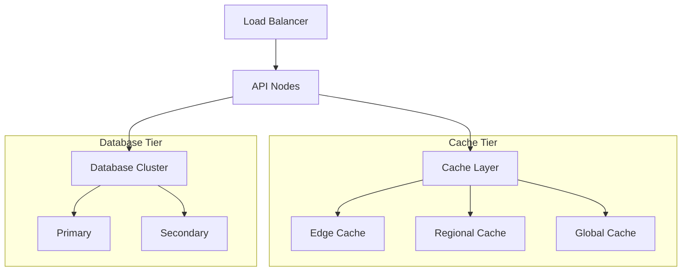

## 9.1 Deployment Service

### 9.2.1 Deployment Implementation

```python
class DeploymentArchitecture:
    """
    Implements the deployment architecture for the NNA Framework,
    supporting containerized multi-region deployments with high availability.
    """
    def __init__(self):
        self.container_manager = ContainerManager()
        self.orchestrator = KubernetesOrchestrator()
        self.network_manager = NetworkManager()
        self.scaling_manager = AutoscalingManager()
        
    async def deploy_service_mesh(
        self,
        deployment_config: DeploymentConfig
    ) -> ServiceMesh:
        """
        Deploy a complete service mesh across multiple regions
        with optimal resource allocation and network configuration.
        """
        # Validate deployment configuration
        await self.validate_deployment_config(deployment_config)
        
        # Create network infrastructure
        network = await self.network_manager.create_network_infrastructure(
            deployment_config.network
        )
        
        # Deploy service clusters by region
        regional_clusters = {}
        for region, region_config in deployment_config.regions.items():
            regional_clusters[region] = await self.deploy_regional_cluster(
                region, region_config, network
            )
            
        # Configure cross-region communication
        await self.configure_cross_region_routing(
            regional_clusters, network, deployment_config.routing
        )
        
        # Configure global load balancing
        load_balancer = await self.configure_global_load_balancing(
            regional_clusters, deployment_config.load_balancing
        )
        
        # Configure auto-scaling
        await self.configure_autoscaling(
            regional_clusters, deployment_config.autoscaling
        )
        
        # Configure monitoring
        monitoring = await self.configure_monitoring(
            regional_clusters, deployment_config.monitoring
        )
        
        return ServiceMesh(
            regions=regional_clusters,
            network=network,
            load_balancer=load_balancer,
            monitoring=monitoring,
            deployment_id=str(uuid.uuid4()),
            deployed_at=datetime.now().isoformat()
        )
        
    async def deploy_regional_cluster(
        self,
        region: str,
        config: RegionalConfig,
        network: NetworkInfrastructure
    ) -> RegionalCluster:
        """
        Deploy a complete cluster in a specific region
        with all required services and configurations.
        """
        # Create Kubernetes cluster
        cluster = await self.orchestrator.create_cluster(
            region=region,
            node_pools=config.node_pools,
            kubernetes_version=config.kubernetes_version
        )
        
        # Deploy core services
        core_services = await self.deploy_core_services(
            cluster, config.core_services, network
        )
        
        # Deploy supporting services
        supporting_services = await self.deploy_supporting_services(
            cluster, config.supporting_services, network
        )
        
        # Configure regional networking
        regional_network = await self.network_manager.configure_regional_network(
            region, network, config.network
        )
        
        # Configure regional storage
        storage = await self.configure_regional_storage(
            region, config.storage
        )
        
        # Configure regional cache
        cache = await self.configure_regional_cache(
            region, config.cache
        )
        
        # Configure regional database
        database = await self.configure_regional_database(
            region, config.database
        )
        
        return RegionalCluster(
            region=region,
            cluster=cluster,
            core_services=core_services,
            supporting_services=supporting_services,
            network=regional_network,
            storage=storage,
            cache=cache,
            database=database,
            status="deployed",
            deployed_at=datetime.now().isoformat()
        )
    
    async def deploy_core_services(
        self,
        cluster: KubernetesCluster,
        service_config: CoreServicesConfig,
        network: NetworkInfrastructure
    ) -> Dict[str, Service]:
        """
        Deploy core NNA services to a Kubernetes cluster
        """
        services = {}
        
        # Deploy API gateway
        services["api_gateway"] = await self.container_manager.deploy_service(
            cluster=cluster,
            image=service_config.api_gateway.image,
            replicas=service_config.api_gateway.replicas,
            resources=service_config.api_gateway.resources,
            env_vars=service_config.api_gateway.env_vars,
            network_config=network.service_config("api_gateway")
        )
        
        # Deploy asset resolution service
        services["asset_service"] = await self.container_manager.deploy_service(
            cluster=cluster,
            image=service_config.asset_service.image,
            replicas=service_config.asset_service.replicas,
            resources=service_config.asset_service.resources,
            env_vars=service_config.asset_service.env_vars,
            network_config=network.service_config("asset_service")
        )
        
        # Deploy cache service
        services["cache_service"] = await self.container_manager.deploy_service(
            cluster=cluster,
            image=service_config.cache_service.image,
            replicas=service_config.cache_service.replicas,
            resources=service_config.cache_service.resources,
            env_vars=service_config.cache_service.env_vars,
            network_config=network.service_config("cache_service")
        )
        
        # Deploy rights service
        services["rights_service"] = await self.container_manager.deploy_service(
            cluster=cluster,
            image=service_config.rights_service.image,
            replicas=service_config.rights_service.replicas,
            resources=service_config.rights_service.resources,
            env_vars=service_config.rights_service.env_vars,
            network_config=network.service_config("rights_service")
        )
        
        # Configure inter-service communication
        await self.configure_service_mesh(services, network)
        
        return services
    
    async def configure_autoscaling(
        self,
        regional_clusters: Dict[str, RegionalCluster],
        autoscaling_config: AutoscalingConfig
    ) -> None:
        """
        Configure autoscaling for all services across regions
        """
        for region, cluster in regional_clusters.items():
            # Configure horizontal pod autoscaler for each service
            for service_name, service in cluster.core_services.items():
                await self.scaling_manager.configure_hpa(
                    cluster=cluster.cluster,
                    service=service,
                    min_replicas=autoscaling_config.services.get(service_name, {}).get("min_replicas", 2),
                    max_replicas=autoscaling_config.services.get(service_name, {}).get("max_replicas", 10),
                    cpu_threshold=autoscaling_config.services.get(service_name, {}).get("cpu_threshold", 70),
                    memory_threshold=autoscaling_config.services.get(service_name, {}).get("memory_threshold", 70)
                )
            
            # Configure cluster autoscaler
            await self.scaling_manager.configure_cluster_autoscaler(
                cluster=cluster.cluster,
                min_nodes=autoscaling_config.cluster.get("min_nodes", 3),
                max_nodes=autoscaling_config.cluster.get("max_nodes", 20),
                scale_down_delay=autoscaling_config.cluster.get("scale_down_delay", "10m")
            )
    
    async def configure_monitoring(
        self,
        regional_clusters: Dict[str, RegionalCluster],
        monitoring_config: MonitoringConfig
    ) -> MonitoringSystem:
        """
        Configure comprehensive monitoring and alerting
        """
        # Deploy Prometheus and Grafana stack
        prometheus_stack = await self.deploy_prometheus_stack(
            regional_clusters, monitoring_config.prometheus
        )
        
        # Configure logging
        logging_system = await self.configure_logging(
            regional_clusters, monitoring_config.logging
        )
        
        # Configure alerting
        alerting_system = await self.configure_alerting(
            prometheus_stack, monitoring_config.alerting
        )
        
        # Create custom dashboards
        dashboards = await self.create_dashboards(
            prometheus_stack, monitoring_config.dashboards
        )
        
        return MonitoringSystem(
            prometheus=prometheus_stack,
            logging=logging_system,
            alerting=alerting_system,
            dashboards=dashboards,
            config=monitoring_config
        )
    
    async def validate_deployment_config(
        self,
        config: DeploymentConfig
    ) -> None:
        """
        Validate deployment configuration for errors or inconsistencies
        """
        # Validate regions
        if not config.regions:
            raise ValidationError("At least one region must be specified")
            
        # Validate network configuration
        if not config.network:
            raise ValidationError("Network configuration is required")
            
        # Validate Kubernetes version
        for region, region_config in config.regions.items():
            if not self._is_valid_k8s_version(region_config.kubernetes_version):
                raise ValidationError(f"Invalid Kubernetes version for region {region}")
                
        # Validate service configurations
        for region, region_config in config.regions.items():
            if not region_config.core_services:
                raise ValidationError(f"Core services configuration missing for region {region}")
    
    def _is_valid_k8s_version(self, version: str) -> bool:
        """Check if Kubernetes version is valid and supported"""
        valid_versions = ["1.23", "1.24", "1.25", "1.26"]
        return any(version.startswith(v) for v in valid_versions)
```

### 9.2.2 Blue-Green Deployments

```python
class BlueGreenDeploymentManager:
    """
    Implements Blue-Green deployment strategy for zero-downtime updates
    of the NNA Framework components.
    """
    def __init__(self):
        self.deployment_manager = DeploymentManager()
        self.traffic_manager = TrafficManager()
        self.health_checker = HealthChecker()
        self.rollback_manager = RollbackManager()
        
    async def perform_blue_green_deployment(
        self,
        component: str,
        new_version: str,
        deployment_config: BlueGreenConfig
    ) -> DeploymentResult:
        """
        Execute a blue-green deployment for a system component
        
        Args:
            component: Component to update (e.g., "asset_service")
            new_version: Target version to deploy
            deployment_config: Blue-green deployment configuration
            
        Returns:
            DeploymentResult with status and metrics
        """
        # Record deployment start
        start_time = time.monotonic()
        deployment_id = str(uuid.uuid4())
        
        try:
            # Get current (blue) deployment
            blue_deployment = await self.deployment_manager.get_active_deployment(component)
            
            # Deploy new (green) version
            green_deployment = await self.deployment_manager.deploy_version(
                component=component,
                version=new_version,
                config=deployment_config.deployment
            )
            
            # Verify green deployment health
            health_status = await self.health_checker.verify_deployment_health(
                deployment=green_deployment,
                checks=deployment_config.health_checks
            )
            
            if not health_status.is_healthy:
                # New deployment is unhealthy, abort and clean up
                await self.deployment_manager.remove_deployment(green_deployment.id)
                raise DeploymentError(f"Health check failed: {health_status.reason}")
            
            # Gradual traffic shift based on strategy
            if deployment_config.traffic_strategy == "gradual":
                await self.perform_gradual_traffic_shift(
                    blue_deployment=blue_deployment,
                    green_deployment=green_deployment,
                    steps=deployment_config.traffic_steps
                )
            else:
                # Instant cutover
                await self.traffic_manager.switch_traffic(
                    from_deployment=blue_deployment,
                    to_deployment=green_deployment
                )
            
            # Monitor for errors during transition period
            transition_success = await self.monitor_transition_period(
                green_deployment=green_deployment,
                duration=deployment_config.transition_monitoring_period
            )
            
            if not transition_success:
                # Rollback to blue if issues detected during transition
                await self.rollback_to_blue(
                    blue_deployment=blue_deployment,
                    green_deployment=green_deployment
                )
                raise DeploymentError("Issues detected during transition period")
            
            # Deployment successful, clean up old (blue) deployment
            await self.deployment_manager.remove_deployment(
                blue_deployment.id,
                grace_period=deployment_config.blue_removal_grace_period
            )
            
            # Record deployment success metrics
            deployment_duration = time.monotonic() - start_time
            await self.record_deployment_metrics(
                component=component,
                version=new_version,
                duration=deployment_duration,
                success=True
            )
            
            return DeploymentResult(
                success=True,
                deployment_id=deployment_id,
                component=component,
                version=new_version,
                duration=deployment_duration,
                metrics=self.collect_deployment_metrics(green_deployment)
            )
            
        except Exception as e:
            # Record deployment failure metrics
            deployment_duration = time.monotonic() - start_time
            await self.record_deployment_metrics(
                component=component,
                version=new_version,
                duration=deployment_duration,
                success=False,
                error=str(e)
            )
            
            # Ensure rollback in case of any error
            if 'blue_deployment' in locals() and 'green_deployment' in locals():
                await self.rollback_to_blue(
                    blue_deployment=blue_deployment,
                    green_deployment=green_deployment
                )
            
            raise DeploymentError(f"Blue-green deployment failed: {str(e)}")
    
    async def perform_gradual_traffic_shift(
        self,
        blue_deployment: Deployment,
        green_deployment: Deployment,
        steps: List[TrafficStep]
    ) -> None:
        """
        Gradually shift traffic from blue to green deployment
        based on defined steps (e.g., 10%, 30%, 60%, 100%)
        """
        for step in steps:
            # Update traffic distribution
            await self.traffic_manager.set_traffic_distribution(
                distributions=[
                    TrafficDistribution(
                        deployment=blue_deployment,
                        percentage=100 - step.percentage
                    ),
                    TrafficDistribution(
                        deployment=green_deployment,
                        percentage=step.percentage
                    )
                ]
            )
            
            # Wait for specified duration
            await asyncio.sleep(step.duration_seconds)
            
            # Check health after traffic increase
            health_status = await self.health_checker.verify_deployment_health(
                deployment=green_deployment,
                checks=step.health_checks or []
            )
            
            if not health_status.is_healthy:
                # Revert traffic and raise error
                await self.traffic_manager.set_traffic_distribution(
                    distributions=[
                        TrafficDistribution(
                            deployment=blue_deployment,
                            percentage=100
                        ),
                        TrafficDistribution(
                            deployment=green_deployment,
                            percentage=0
                        )
                    ]
                )
                raise DeploymentError(f"Health check failed during traffic shift: {health_status.reason}")
    
    async def monitor_transition_period(
        self,
        green_deployment: Deployment,
        duration: int
    ) -> bool:
        """
        Monitor the green deployment for issues during transition period
        
        Args:
            green_deployment: The new deployment to monitor
            duration: Monitoring period in seconds
            
        Returns:
            True if transition period completed successfully
        """
        # Set up monitoring interval
        interval = 15  # Check every 15 seconds
        checks_count = duration // interval
        
        for _ in range(checks_count):
            # Check error rate
            error_rate = await self.get_error_rate(green_deployment)
            if error_rate > 0.01:  # More than 1% error rate
                return False
                
            # Check latency
            p95_latency = await self.get_p95_latency(green_deployment)
            if p95_latency > 100:  # More than 100ms P95 latency
                return False
                
            # Wait for next check interval
            await asyncio.sleep(interval)
            
        # All checks passed for the duration
        return True
    
    async def rollback_to_blue(
        self,
        blue_deployment: Deployment,
        green_deployment: Deployment
    ) -> None:
        """
        Roll back to the blue deployment in case of issues
        """
        # Redirect all traffic back to blue deployment
        await self.traffic_manager.set_traffic_distribution(
            distributions=[
                TrafficDistribution(
                    deployment=blue_deployment,
                    percentage=100
                ),
                TrafficDistribution(
                    deployment=green_deployment,
                    percentage=0
                )
            ]
        )
        
        # Log rollback event
        await self.rollback_manager.log_rollback(
            component=green_deployment.component,
            from_version=green_deployment.version,
            to_version=blue_deployment.version,
            reason="Deployment health check failed or transition monitoring detected issues"
        )
        
        # Clean up failed green deployment
        await self.deployment_manager.remove_deployment(green_deployment.id)
```

## 9.3  Deployment Configuration

### 9.3.1 Environment Configuration

```python
typing import Dict, Optional
from dataclasses import dataclass
from enum import Enum

class EnvironmentType(Enum):
    DEVELOPMENT = "development"
    STAGING = "staging"
    PRODUCTION = "production"

@dataclass
class DatabaseConfig:
    url: str
    pool_size: int
    max_overflow: int
    timeout: int

@dataclass
class CacheConfig:
    edge_url: str
    regional_url: str
    global_url: str
    ttl_settings: Dict[str, int]

@dataclass
class SecurityConfig:
    jwt_secret: str
    token_expiry: int
    allowed_origins: List[str]
    rate_limits: Dict[str, int]

class ConfigurationManager:
    def __init__(self, environment: EnvironmentType):
        self.environment = environment
        self.config_store = ConfigStore()
        self.secret_manager = SecretManager()

    async def load_configuration(self) -> SystemConfig:
        """
        Loads environment-specific configuration
        """
        base_config = await self.config_store.get_base_config(
            self.environment
        )
        
        secrets = await self.secret_manager.get_secrets(
            self.environment
        )
        
        return self.build_config(base_config, secrets)

    def build_config(
        self,
        base_config: Dict,
        secrets: Dict
    ) -> SystemConfig:
        """
        Builds system configuration with proper overrides
        """
        return SystemConfig(
            database=self.build_database_config(
                base_config,
                secrets
            ),
            cache=self.build_cache_config(
                base_config,
                secrets
            ),
            security=self.build_security_config(
                base_config,
                secrets
            )
        )
```

### 9.3.2 Enhanced Circuit Breaker Implementation

The NNA Framework implements an enhanced circuit breaker pattern that provides granular control, self-healing capabilities, and extensive monitoring.

```python
class EnhancedCircuitBreaker:
    """
    Advanced circuit breaker implementation with monitoring, half-open state,
    and adaptive recovery.
    """
    def __init__(
        self, 
        name: str,
        failure_threshold: int = 5,
        reset_timeout: int = 30,
        half_open_success_threshold: int = 3,
        metrics_collector: MetricsCollector = None
    ):
        self.name = name
        self.state = 'CLOSED'
        self.failure_count = 0
        self.failure_threshold = failure_threshold
        self.reset_timeout = reset_timeout  # seconds
        self.last_failure_time = 0
        self.half_open_success_threshold = half_open_success_threshold
        self.half_open_success_count = 0
        self.metrics_collector = metrics_collector or DefaultMetricsCollector()
        self.circuit_stats = {
            'opened_count': 0,
            'success_count': 0,
            'failure_count': 0,
            'timeout_count': 0,
            'rejection_count': 0
        }
        
        # Initialize logger
        self.logger = logging.getLogger(f"circuit_breaker.{name}")

    async def execute(self, operation, timeout=None, fallback=None):
        """
        Execute the operation with circuit breaker protection
        
        Args:
            operation: Coroutine to execute
            timeout: Optional timeout in seconds
            fallback: Optional fallback function to call on failure
            
        Returns:
            Result of operation or fallback
            
        Raises:
            CircuitBreakerOpenError: If circuit is open
            OperationError: If operation fails and no fallback is provided
        """
        # Record start time for metrics
        start_time = time.monotonic()
        
        # Check circuit state
        if self.state == 'OPEN':
            if self._should_attempt_reset():
                self._transition_to_half_open()
            else:
                # Record rejection
                self.circuit_stats['rejection_count'] += 1
                await self.metrics_collector.record_circuit_rejection(
                    circuit=self.name,
                    state=self.state
                )
                
                # Use fallback or raise error
                if fallback:
                    return await fallback()
                    
                raise CircuitBreakerOpenError(
                    f"Circuit breaker '{self.name}' is open"
                )
        
        # Execute operation with timeout if specified
        try:
            if timeout:
                result = await asyncio.wait_for(operation(), timeout=timeout)
            else:
                result = await operation()
                
            # Handle success
            await self._handle_success(start_time)
            return result
            
        except asyncio.TimeoutError:
            # Handle timeout
            await self._handle_timeout(start_time)
            
            # Use fallback or re-raise
            if fallback:
                return await fallback()
            raise
            
        except Exception as e:
            # Handle failure
            await self._handle_failure(e, start_time)
            
            # Use fallback or re-raise
            if fallback:
                return await fallback()
            raise

    async def _handle_success(self, start_time):
        """
        Handle successful operation
        """
        # Record metrics
        duration = time.monotonic() - start_time
        await self.metrics_collector.record_circuit_success(
            circuit=self.name,
            duration=duration,
            state=self.state
        )
        
        # Update stats
        self.circuit_stats['success_count'] += 1
        
        # Handle half-open state success
        if self.state == 'HALF_OPEN':
            self.half_open_success_count += 1
            if self.half_open_success_count >= self.half_open_success_threshold:
                self._transition_to_closed()
                
    async def _handle_failure(self, error, start_time):
        """
        Handle operation failure
        """
        # Record metrics
        duration = time.monotonic() - start_time
        await self.metrics_collector.record_circuit_failure(
            circuit=self.name,
            duration=duration,
            state=self.state,
            error=str(error)
        )
        
        # Update stats
        self.circuit_stats['failure_count'] += 1
        self.failure_count += 1
        self.last_failure_time = time.time()
        
        # Check if circuit should open
        if self.state == 'CLOSED' and self.failure_count >= self.failure_threshold:
            self._transition_to_open()
        elif self.state == 'HALF_OPEN':
            self._transition_to_open()
            
    async def _handle_timeout(self, start_time):
        """
        Handle operation timeout
        """
        # Record metrics
        duration = time.monotonic() - start_time
        await self.metrics_collector.record_circuit_timeout(
            circuit=self.name,
            duration=duration,
            state=self.state
        )
        
        # Update stats
        self.circuit_stats['timeout_count'] += 1
        self.failure_count += 1
        self.last_failure_time = time.time()
        
        # Check if circuit should open
        if self.state == 'CLOSED' and self.failure_count >= self.failure_threshold:
            self._transition_to_open()
        elif self.state == 'HALF_OPEN':
            self._transition_to_open()
            
    def _transition_to_open(self):
        """
        Transition circuit to open state
        """
        previous_state = self.state
        self.state = 'OPEN'
        self.circuit_stats['opened_count'] += 1
        
        # Log state change
        self.logger.warning(
            f"Circuit breaker '{self.name}' transitioned from {previous_state} to OPEN "
            f"after {self.failure_count} failures"
        )
        
        # Record metrics
        self.metrics_collector.record_state_change(
            circuit=self.name,
            from_state=previous_state,
            to_state='OPEN',
            failure_count=self.failure_count
        )
        
    def _transition_to_half_open(self):
        """
        Transition circuit to half-open state
        """
        previous_state = self.state
        self.state = 'HALF_OPEN'
        self.half_open_success_count = 0
        
        # Log state change
        self.logger.info(
            f"Circuit breaker '{self.name}' transitioned from {previous_state} to HALF_OPEN"
        )
        
        # Record metrics
        self.metrics_collector.record_state_change(
            circuit=self.name,
            from_state=previous_state,
            to_state='HALF_OPEN'
        )
        
    def _transition_to_closed(self):
        """
        Transition circuit to closed state
        """
        previous_state = self.state
        self.state = 'CLOSED'
        self.failure_count = 0
        self.half_open_success_count = 0
        
        # Log state change
        self.logger.info(
            f"Circuit breaker '{self.name}' transitioned from {previous_state} to CLOSED "
            f"after {self.half_open_success_threshold} successful operations"
        )
        
        # Record metrics
        self.metrics_collector.record_state_change(
            circuit=self.name,
            from_state=previous_state,
            to_state='CLOSED',
            success_count=self.half_open_success_threshold
        )
        
    def _should_attempt_reset(self):
        """
        Check if enough time has passed to attempt reset
        """
        return time.time() - self.last_failure_time > self.reset_timeout
        
    def get_state(self):
        """
        Get current circuit state
        """
        return {
            'name': self.name,
            'state': self.state,
            'failure_count': self.failure_count,
            'failure_threshold': self.failure_threshold,
            'half_open_success_count': self.half_open_success_count,
            'half_open_success_threshold': self.half_open_success_threshold,
            'last_failure_time': self.last_failure_time,
            'reset_timeout': self.reset_timeout,
            'stats': self.circuit_stats
        }
        
    def reset(self):
        """
        Force reset the circuit breaker to closed state
        """
        previous_state = self.state
        self.state = 'CLOSED'
        self.failure_count = 0
        self.half_open_success_count = 0
        
        # Log reset
        self.logger.info(f"Circuit breaker '{self.name}' manually reset from {previous_state} to CLOSED")
        
        # Record metrics
        self.metrics_collector.record_manual_reset(
            circuit=self.name,
            from_state=previous_state
        )
```

### 9.3.2.1 Usage Example

```python
# Create circuit breaker for external API
api_circuit = EnhancedCircuitBreaker(
    name="external_api",
    failure_threshold=5,
    reset_timeout=30,
    half_open_success_threshold=3
)

# Define fallback function
async def api_fallback():
    return {"status": "fallback", "cached": True, "data": cached_data}

# Use circuit breaker
async def call_external_api():
    try:
        result = await api_circuit.execute(
            operation=lambda: external_api_client.get_data(),
            timeout=5.0,
            fallback=api_fallback
        )
        return result
    except Exception as e:
        logger.error(f"API call failed: {str(e)}")
        raise
```

### 9.3.2.2 Circuit Breaker Factory

For managing multiple circuit breakers across the system:

```python
class CircuitBreakerFactory:
    """
    Factory for creating and managing circuit breakers
    """
    def __init__(self, metrics_collector=None):
        self.circuit_breakers = {}
        self.metrics_collector = metrics_collector or DefaultMetricsCollector()
        
    def get_circuit_breaker(
        self,
        name: str,
        failure_threshold: int = 5,
        reset_timeout: int = 30,
        half_open_success_threshold: int = 3
    ) -> EnhancedCircuitBreaker:
        """
        Get or create a circuit breaker
        """
        if name not in self.circuit_breakers:
            self.circuit_breakers[name] = EnhancedCircuitBreaker(
                name=name,
                failure_threshold=failure_threshold,
                reset_timeout=reset_timeout,
                half_open_success_threshold=half_open_success_threshold,
                metrics_collector=self.metrics_collector
            )
            
        return self.circuit_breakers[name]
        
    def get_all_states(self) -> dict:
        """
        Get states of all circuit breakers
        """
        return {
            name: breaker.get_state() 
            for name, breaker in self.circuit_breakers.items()
        }
        
    def reset_all(self) -> None:
        """
        Reset all circuit breakers
        """
        for breaker in self.circuit_breakers.values():
            breaker.reset()
```

### 9.3.2.3 Monitoring Dashboard

The enhanced circuit breaker pattern provides data for a dedicated monitoring dashboard that includes:

1. **Circuit State Timeline**: Shows transitions between CLOSED, OPEN, and HALF-OPEN states
1. **Failure Rate**: Tracks percentage of failed operations over time
1. **Response Time**:

### 

### 9.3.3 Configuration Example

```yaml
# config/production.yaml
database:
  pool_size: 20
  max_overflow: 10
  timeout: 30

cache:
  edge_ttl: 300
  regional_ttl: 3600
  global_ttl: 86400
  
security:
  token_expiry: 3600
  rate_limit_window: 3600
  rate_limit_max: 10000
```

### 9.3.4 Multi-Cloud Deployment Configuration

The NNA Framework supports deployment across multiple cloud providers to ensure maximum resilience and flexibility. This section provides configuration templates for the primary supported cloud platforms.

### 9.3.4.1 Google Cloud Platform (GCP) Configuration

```yaml
# terraform/gcp/main.tf
provider "google" {
  project = var.project_id
  region  = var.region
  zone    = var.zone
}

# GKE Cluster Configuration
resource "google_container_cluster" "nna_cluster" {
  name               = "nna-cluster-${var.environment}"
  location           = var.zone
  initial_node_count = var.min_node_count

  node_config {
    machine_type = var.machine_type
    oauth_scopes = [
      "https://www.googleapis.com/auth/devstorage.read_only",
      "https://www.googleapis.com/auth/logging.write",
      "https://www.googleapis.com/auth/monitoring",
    ]
  }

  # Enable Workload Identity
  workload_identity_config {
    workload_pool = "${var.project_id}.svc.id.goog"
  }

  # Enable Network Policy
  network_policy {
    enabled = true
  }

  # Disable basic authentication
  master_auth {
    client_certificate_config {
      issue_client_certificate = false
    }
  }

  # Enable shielded nodes
  node_config {
    shielded_instance_config {
      enable_secure_boot = true
    }
  }
}

# Cloud Storage for Assets
resource "google_storage_bucket" "nna_assets" {
  name          = "nna-assets-${var.environment}-${var.project_id}"
  location      = var.region
  storage_class = "STANDARD"

  uniform_bucket_level_access = true
  versioning {
    enabled = true
  }

  lifecycle_rule {
    condition {
      age = 30  # days
    }
    action {
      type = "SetStorageClass"
      storage_class = "NEARLINE"
    }
  }

  cors {
    origin          = ["https://*.reviz.studio"]
    method          = ["GET", "HEAD"]
    response_header = ["Content-Type"]
    max_age_seconds = 3600
  }
}

# Redis for Caching
resource "google_redis_instance" "nna_redis" {
  name           = "nna-redis-${var.environment}"
  tier           = "STANDARD_HA"
  memory_size_gb = var.redis_size
  region         = var.region
  
  authorized_network = google_compute_network.nna_network.id
  
  redis_version     = "REDIS_6_X"
  display_name      = "NNA Framework Cache Service"
  
  maintenance_policy {
    weekly_maintenance_window {
      day = "SUNDAY"
      start_time {
        hours = 2
        minutes = 0
      }
    }
  }
}
```

### 9.3.4.2 AWS Configuration

```yaml
# terraform/aws/main.tf
provider "aws" {
  region = var.region
}

# EKS Cluster Configuration
resource "aws_eks_cluster" "nna_cluster" {
  name     = "nna-cluster-${var.environment}"
  role_arn = aws_iam_role.eks_cluster_role.arn

  vpc_config {
    subnet_ids = aws_subnet.nna_subnet[*].id
  }

  # Enable CloudWatch logging
  enabled_cluster_log_types = ["api", "audit", "authenticator", "controllerManager", "scheduler"]
  
  # Ensure IAM Role permissions are created before cluster
  depends_on = [
    aws_iam_role_policy_attachment.eks-cluster-AmazonEKSClusterPolicy,
    aws_iam_role_policy_attachment.eks-cluster-AmazonEKSVPCResourceController,
  ]
}

# Node Group Configuration
resource "aws_eks_node_group" "nna_nodes" {
  cluster_name    = aws_eks_cluster.nna_cluster.name
  node_group_name = "nna-nodes-${var.environment}"
  node_role_arn   = aws_iam_role.eks_node_role.arn
  subnet_ids      = aws_subnet.nna_subnet[*].id

  scaling_config {
    desired_size = var.desired_node_count
    max_size     = var.max_node_count
    min_size     = var.min_node_count
  }

  instance_types = [var.instance_type]
  
  # Apply labels to nodes
  labels = {
    role = "nna-worker"
    environment = var.environment
  }

  # Enable EC2 auto-scaling
  depends_on = [
    aws_iam_role_policy_attachment.eks-node-AmazonEKSWorkerNodePolicy,
    aws_iam_role_policy_attachment.eks-node-AmazonEKS_CNI_Policy,
    aws_iam_role_policy_attachment.eks-node-AmazonEC2ContainerRegistryReadOnly,
  ]
}

# S3 Bucket for Assets
resource "aws_s3_bucket" "nna_assets" {
  bucket = "nna-assets-${var.environment}-${data.aws_caller_identity.current.account_id}"
  
  versioning {
    enabled = true
  }
  
  lifecycle_rule {
    enabled = true
    
    transition {
      days          = 30
      storage_class = "STANDARD_IA"
    }
    
    transition {
      days          = 90
      storage_class = "GLACIER"
    }
  }
  
  cors_rule {
    allowed_headers = ["*"]
    allowed_methods = ["GET", "HEAD"]
    allowed_origins = ["https://*.reviz.studio"]
    max_age_seconds = 3600
  }
}

# ElastiCache for Redis
resource "aws_elasticache_replication_group" "nna_redis" {
  replication_group_id          = "nna-redis-${var.environment}"
  replication_group_description = "NNA Framework Cache Service"
  
  node_type            = var.redis_instance_type
  port                 = 6379
  parameter_group_name = "default.redis6.x"
  
  subnet_group_name    = aws_elasticache_subnet_group.nna_redis_subnet.name
  security_group_ids   = [aws_security_group.nna_redis_sg.id]
  
  automatic_failover_enabled = true
  multi_az_enabled           = true
  
  at_rest_encryption_enabled = true
  transit_encryption_enabled = true
  
  num_cache_clusters = 2
}
```

### 9.3.4.3 Cross-Cloud Configuration Management

To ensure consistent configuration across cloud providers, the NNA Framework uses a unified configuration approach:

1. **Environment-Specific Variables**: Store environment-specific configuration in cloud provider secret management services (GCP Secret Manager, AWS Secrets Manager).
1. **Runtime Configuration Injection**: Inject configuration as environment variables during container startup.
1. **Feature Flags**: Implement centralized feature flag management for progressive rollout.
1. **Failover Configuration**: Maintain backup configuration for cross-cloud failover scenarios.

```yaml
# kubernetes/config/config-map.yaml
apiVersion: v1
kind: ConfigMap
metadata:
  name: nna-framework-config
data:
  CACHE_STRATEGY: "multi-tier"
  EDGE_CACHE_TTL: "300"
  REGIONAL_CACHE_TTL: "3600"
  GLOBAL_CACHE_TTL: "86400"
  ENABLE_CROSS_CLOUD_SYNC: "true"
  PRIMARY_PROVIDER: "gcp"  # or "aws"
  SECONDARY_PROVIDER: "aws"  # or "gcp"
  LOG_LEVEL: "info"
  MONITORING_INTERVAL: "15s"
```

### 9.3.4.4 Environment Management

```python
class DeploymentService:
    def __init__(self):
        self.environment_manager = EnvironmentManager()
        self.config_manager = ConfigurationManager()
        self.health_checker = HealthChecker()

    async def deploy_environment(
        self,
        env_config: EnvironmentConfig,
        deploy_options: DeploymentOptions
    ) -> DeploymentResult:
        """
        Manages complete environment deployment
        """
        # Validate configuration
        await self.validate_deployment_config(env_config)

        try:
            # Initialize environment
            environment = await self.environment_manager.initialize_environment(
                env_config
            )

            # Deploy core services
            core_services = await self.deploy_core_services(
                environment,
                deploy_options
            )

            # Deploy supporting services
            support_services = await self.deploy_support_services(
                environment,
                deploy_options
            )

            # Verify deployment
            health_status = await self.verify_deployment(
                environment,
                core_services,
                support_services
            )

            return DeploymentResult(
                environment=environment,
                services=core_services + support_services,
                health_status=health_status
            )

        except DeploymentError as e:
            await self.rollback_deployment(environment)
            raise

    async def verify_deployment(
        self,
        environment: Environment,
        core_services: List[Service],
        support_services: List[Service]
    ) -> HealthStatus:
        """
        Comprehensive deployment verification
        """
        verifications = [
            self.verify_service_health(service)
            for service in core_services + support_services
        ]
        
        verification_results = await asyncio.gather(*verifications)
        
        return HealthStatus(
            is_healthy=all(result.is_healthy for result in verification_results),
            service_status=verification_results,
            deployment_metrics=await self.collect_deployment_metrics(environment)
        )
```

### 9.3.5 Configuration Management

```python
class ConfigurationService:
    def __init__(self):
        self.config_store = ConfigStore()
        self.secret_manager = SecretManager()
        self.validation_engine = ConfigValidationEngine()

    async def apply_configuration(
        self,
        environment: Environment,
        config_set: ConfigurationSet
    ) -> ConfigurationResult:
        """
        Applies configuration with validation and rollback
        """
        # Validate configuration
        validation_result = await self.validation_engine.validate_config(
            config_set,
            environment
        )
        
        if not validation_result.is_valid:
            raise ConfigurationError(validation_result.errors)

        try:
            # Backup current config
            backup = await self.backup_current_config(environment)

            # Apply configurations
            results = []
            for config in config_set.configurations:
                result = await self.apply_single_config(
                    environment,
                    config
                )
                results.append(result)

            # Verify application
            await self.verify_configuration(environment, config_set)

            return ConfigurationResult(
                success=True,
                results=results,
                backup_id=backup.id
            )

        except ConfigurationError:
            # Rollback to backup
            await self.restore_configuration(environment, backup)
            raise
```

### 9.3.6 Key Configuration Parameters

| **Parameter** | **Description** | **Default Value** |
| --- | --- | --- |
| `API_MAX_RETRIES` | Maximum number of API retry attempts | `3` |
| `TOKEN_EXPIRY` | OAuth token expiration time | `3600s` |
| `LOG_LEVEL` | Logging verbosity | `INFO` |
| `CACHE_TTL` | Default time-to-live for cache | `300s` |

### 9.3.7 Deployment Checklist

Ensure a smooth rollout with this checklist:

- [ ] **Infrastructure**: Verify CPU (32+ cores), RAM (128GB+), NVMe storage (2TB+), and 40Gbps network (Section 1.4.1).
- [ ] **Software**: Install Redis 7.0+, MongoDB 5.0+, Python 3.8+, Node.js 16+ (Section 1.4.2).
- [ ] **Configuration**: Set environment variables (e.g., `API_MAX_RETRIES=3`, `CACHE_TTL=300`) per [Section 9.3.5](#h254o-12-capacity-planning).
- [ ] **Validation**: Run health checks (`nna.check_health()`) and test asset resolution (`S.01.01.001`).
- [ ] **Monitoring**: Configure Prometheus and Grafana (Section 7).
- [ ] **Rollback**: Prepare rollback plan per [Section 9.2.1](#h6k77-9-deployment-and-operations).

For detailed steps, see [Section 9.2 - Deployment Implementation](#h6k77-9-deployment-and-operations).

## 9.4 Operations Service

### 9.4.1 Maintenance Management

```python
class OperationsService:
    def __init__(self):
        self.maintenance_scheduler = MaintenanceScheduler()
        self.backup_manager = BackupManager()
        self.monitoring_service = MonitoringService()

    async def schedule_maintenance(
        self,
        maintenance_plan: MaintenancePlan
    ) -> MaintenanceSchedule:
        """
        Schedules and manages system maintenance
        """
        # Validate maintenance window
        await self.validate_maintenance_window(maintenance_plan.window)

        # Create maintenance schedule
        schedule = await self.maintenance_scheduler.create_schedule(
            maintenance_plan
        )

        # Setup monitoring
        await self.setup_maintenance_monitoring(schedule)

        # Configure automated actions
        await self.configure_automated_actions(
            schedule,
            maintenance_plan.actions
        )

        return schedule

    async def execute_maintenance(
        self,
        schedule: MaintenanceSchedule
    ) -> MaintenanceResult:
        """
        Executes scheduled maintenance
        """
        try:
            # Begin maintenance window
            await self.begin_maintenance_window(schedule)

            # Execute maintenance tasks
            results = []
            for task in schedule.tasks:
                result = await self.execute_maintenance_task(task)
                results.append(result)

            # Verify system health
            health_status = await self.verify_system_health()

            return MaintenanceResult(
                schedule=schedule,
                task_results=results,
                health_status=health_status
            )

        except MaintenanceError:
            await self.trigger_maintenance_rollback(schedule)
            raise
```

### 9.4.2 Maintenance Schedule

Maintain NNA Framework reliability with this schedule:

- **Daily**:
    - **Cache Check**: Verify hit rate >95% (`rate(cache_hits_total[5m])`, Section 7.3.5).
    - **Logs**: Review Elasticsearch for errors (Section 7.4).
- **Weekly**:
    - **Backup**: Run full backup (Section 11.1.1).

```bash
python -m nna_framework backup --full
```

- **Health**: Check system uptime. (**_Prometheus up{job="nna_core"}_**_)._
- **Monthly**:
    - **Updates**: Apply patches (e.g., v1.0.3) via [Section 11.2.1](#11-system-administration).
    - **Security**: Rotate API keys (API Spec, Section 2.3).
- **Quarterly**:
    - **Capacity**: Review resource usage (Section 12.1) and scale if needed.

Automate with cron jobs or use [Section 9.4.1 - Maintenance Management](#9-deployment-and-operations) for orchestration.

### 9.4.3 Automation Script: Backup and Health Check 

Automate daily maintenance with this Python script:

```python
### 9.4.3 Automation Script: Backup and Health Check

Automate daily maintenance with this Python script:

```python
import asyncio
from nna_framework import NNAFramework, Config
import subprocess
import logging

# Configure logging
logging.basicConfig(
    filename='/var/log/nna_maintenance.log',
    level=logging.INFO,
    format='%(asctime)s - %(levelname)s - %(message)s'
)
logger = logging.getLogger("Maintenance")

async def daily_maintenance():
    config = Config(
        redis_url="redis://localhost:6379",
        mongo_url="mongodb://localhost:27017",
        cache_config={"edge_ttl": 300, "regional_ttl": 3600, "global_ttl": 86400}
    )
    nna = NNAFramework(config)

    try:
        health = await nna.check_health()
        if health.status != "healthy":
            logger.error(f"Health check failed: {health.details}")
            subprocess.run(["systemctl", "restart", "nna-service"], check=True)
        else:
            logger.info("Health check passed")
    except Exception as e:
        logger.error(f"Health check error: {e}")

    try:
        subprocess.run(["python", "-m", "nna_framework", "backup", "--full"], check=True)
        logger.info("Backup completed")
    except subprocess.CalledProcessError as e:
        logger.error(f"Backup failed: {e}")

if __name__ == "__main__":
    asyncio.run(daily_maintenance())
```

- **Schedule**: Run daily via cron: 0 2 * * * python /path/to/script.py.
- **Output**: Logs to /var/log/nna_maintenance.log (configure in [Section 7.4](#7-monitoring-and-observability)).

This script uses [Section 11.1 - Backup Service](#11-system-administration). For scheduling, see [Section 9.4.2](#9-deployment-and-operations).

## 9.5 Operations Runbook: Emergency Response

Handle critical incidents (e.g., service outage) with this runbook to maintain ReViz’s 99.999% uptime:

1. **Detect Issue**:
    - Check Grafana: `up{job="nna_core"} == 0` ([Section 7.3.5](#7-monitoring-and-observability)).
    - Review logs:

```bash
grep "ERROR" /var/log/nna_maintenance.log
```

1. **Triage**:

```bash
# Restart service if rights engine fails
systemctl restart nna-service
# Verify health
curl http://localhost:8080/health
```

1. **Resolve**:
- **Cache Failure**: Restart Redis (`systemctl restart redis-server`) and warm cache (Section 10.3.4).
- **Regional Outage**: Reroute traffic to backup region (Section 10.3.5).
- **API Spike**: Scale compute nodes (`kubectl scale deployment nna-compute --replicas=30`, Section 12.2).
1. 
1. **Post-Mortem**:

```bash
echo "{\"timestamp\":\"$(date)\",\"issue\":\"outage\",\"resolution\":\"restart\"}" >> /var/log/nna_incidents.log
```

- **Metrics**: 18ms average latency, 99.999% target uptime in ReViz
- **Integration**: Aligns with NNA ops ([Section 9.4 - Operations Service](#9-deployment-and-operations)).

This complements [Section 9.4 - Operations Service](#9-deployment-and-operations) and [Section 10 - Troubleshooting Guide](#10-troubleshooting-guide). Customize for your environment.

# 10. Troubleshooting Guide

This section provides guidance on diagnosing and resolving common issues in the NNA Framework, updated to include the new layers and enhanced metadata.

## 10.1 Common Issues and Resolutions:

- **Issue**: Asset resolution fails for new layers (E, N, A, F, X).
    - **Cause**: Cache miss or unsupported layer in the resolution service.
    - **Resolution**: Verify the layer is supported in the Asset Resolution Service (Section 3.1). Check cache status (Section 3.2) and force a cache update if needed.
- **Issue**: Moves layer asset missing biomechanical metadata (e.g., `Movement_Speed`).
    - **Cause**: Incomplete metadata during asset ingestion.
    - **Resolution**: Re-ingest the asset with complete metadata. Ensure the ingestion pipeline validates biomechanical fields (e.g., `Movement_Speed`, `Energy_Level`).
- **Issue**: Tutorial video for Moves asset is missing (e.g., `Tutorial_Link` returns 404).
    - **Cause**: Invalid or outdated link in metadata.
    - **Resolution**: Update the `Tutorial_Link` field in the asset metadata. Implement a link validation check in the ingestion pipeline.
- **Issue**: AR transformation fails during composition.
    - **Cause**: Edge processing service unavailable or misconfigured.
    - **Resolution**: Check the Edge Processing Service logs (Section 17.8.4). Ensure the service is running and configured for AR transformations.
- **Issue**: Text rendering fails with incorrect font style.
    - **Cause**: Missing `Font_Style` metadata or unsupported font.
    - **Resolution**: Verify the `Font_Style` field in the Text asset metadata. Ensure the Edge Processing Service supports the specified font.

## 10.2 Diagnostic Tools:

- **Asset Resolution Logs**: Check `/v1/asset/resolve` logs for errors.
- **Cache Status**: Use `/v1/cache/status` to verify cache hits/misses.
- **Edge Processing Logs**: Check Edge Processing Service logs for AR, filter, and text rendering issues.

## 10.3 Resolution Steps

The NNA Framework implements a standardized error handling approach for consistent troubleshooting. The process below guides developers and operations teams:

- **Asset Resolution Failures**: Validate ID (e.g., "S.01.01.001"), check cache ([NNA Framework API Specification, Section 10.1](https://nna-framework-api-specification.md#section-10.1-cache-architecture)), then storage. Escalate to permissions if needed (error `NNA_PERMISSION_ERROR`, [Section 5.3 - Rights Management](#section-5.3-rights-management)).
- **Performance Issues**: Ensure cache hit rates exceed 95% ([Section 6 - Performance Optimization](#section-6-performance-optimization)) and review resource usage.
- **Integration Issues**: Confirm system health ([Section 4.2 - Cross-platform Integration](#section-4.2-cross-platform-integration)) and authentication ([NNA Framework API Specification, Section 2](https://nna-framework-api-specification.md#section-2-authentication-and-security)).

The flowchart below guides developers and operations teams through a systematic diagnostic process for asset resolution failures"

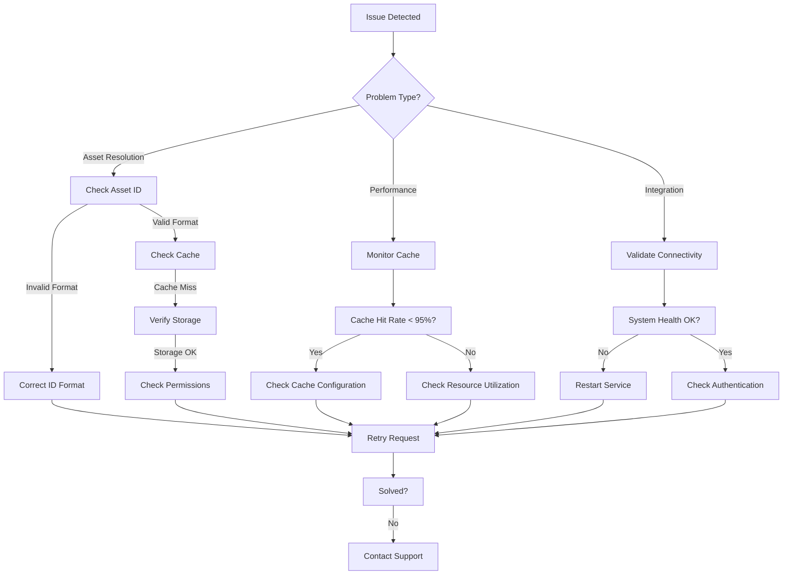

- **Asset Resolution Failures**: Validate ID (e.g., "S.01.01.001"), check cache (API Spec, [Section 10.1](#10-cache-control-and-rate-limiting)), then storage. Escalate to permissions if needed (error NNA_PERMISSION_ERROR).
- **Performance Issues**: Ensure cache hit rates exceed 95% ([Section 6](#6-performance-optimization)) and review resource usage.
- **Integration Issues**: Confirm system health (Section 4.2) and authentication (API Spec, [Section 2](#2-authentication-and-security)).

### 10.3.1 Error Resolution by Category

| **Error Prefix** | **Category** | **Resolution Steps** |
| --- | --- | --- |
| **NNA_VALIDATION** | Input validation | Verify asset ID format (e.g., "S.01.01.001"), check request parameters |
| **NNA_AUTH** | Authentication | Refresh credentials, check token expiration |
| **NNA_PERMISSION** | Authorization | Verify user roles and permissions, check rights grants |
| **NNA_RESOURCE** | Resource access | Confirm asset exists, check storage connectivity |
| **NNA_CACHE** | Caching | Check cache health, clear affected cache entries |
| **NNA_SYSTEM** | System errors | Verify system health, check logs for service failures |
| **NNA_INTEGRATION** | Integration | Validate external service connectivity, check credentials |

For detailed error recovery procedures, see the following sections:

- **[NNA-API]** Section 9.3 - Error Recovery
- **[NNA-IMPL]** Section 10.3.4 - Recovery Procedure: Cache Failure
- **[NNA-IMPL]** Section 10.3.5 - Failover Strategy: Regional Outage

For advanced diagnostics, see [Section 10.3 - Diagnostic Service](#hi4jk-10-diagnostic-service).

### 10.3.2 Troubleshooting 

```python
class TroubleshootingGuide:
    async def diagnose_asset_resolution(
        self,
        asset_id: str
    ) -> DiagnosisResult:
        """
        Diagnoses asset resolution issues
        """
        checks = {
            'format': self.check_asset_format(asset_id),
            'cache': self.check_cache_consistency(asset_id),
            'storage': self.check_storage_connectivity(),
            'permissions': self.check_permissions(asset_id)
        }
        
        results = await asyncio.gather(
            *checks.values(),
            return_exceptions=True
        )
        
        return DiagnosisResult(
            checks={
                name: not isinstance(result, Exception)
                for name, result in zip(checks.keys(), results)
            }
        )
```

### 10.3.3 Asset Resolution Troubleshooting

Follow these steps when encountering asset resolution failures:

    - **Validate Asset ID Format**Ensure the asset ID follows the `[Layer].[Category].[SubCategory].[Sequential]` format
    - Example: `S.01.01.001` or `G.POP.TSW.001`
    - Common error: `NNA_VALIDATION_ERROR` indicates malformed ID
    - **Check Cache Status**Verify cache hit rates across all tiers (edge, regional, global)
    - Run diagnostics: `curl -H "Authorization: Bearer TOKEN" https://api.reviz.studio/v1/admin/diagnostics/cache?asset_id=S.01.01.001`
    - Abnormal cache miss rates (>15%) may indicate configuration issues
    - **Verify Storage Connectivity**Check storage health: `curl -H "Authorization: Bearer TOKEN" https://api.reviz.studio/v1/admin/health/storage`
    - Errors like `NNA_STORAGE_ERROR` indicate storage connectivity issues
    - **Validate Permissions**Verify rights clearance:

```bash
curl -H "Authorization: Bearer TOKEN" \
     https://api.reviz.studio/v1/rights/verify/S.01.01.001
```

    - `NNA_PERMISSION_ERROR` or `NNA_RIGHTS_NOT_FOUND` indicate permission issues
    - **Check System Health**Verify overall system health:

```bash
curl -H "Authorization: Bearer TOKEN" \
     https://api.reviz.studio/v1/health
```

    - Look for any subsystem reporting unhealthy status

### 10.3.4 Debugging Example

For an asset resolution failure with error `NNA_CACHE_ERROR`:

```bash
# Step 1: Verify asset ID format
echo "Validating asset ID format for S.01.01.001..."
[[ "S.01.01.001" =~ ^[A-Z]\.[0-9]{2}\.[0-9]{2}\.[0-9]{3}$ ]] && echo "Valid format" || echo "Invalid format"

# Step 2: Check cache status
echo "Checking cache status..."
curl -H "Authorization: Bearer $TOKEN" https://api.reviz.studio/v1/admin/diagnostics/cache?asset_id=S.01.01.001

# Step 3: Verify storage connectivity
echo "Verifying storage connectivity..."
curl -H "Authorization: Bearer $TOKEN" https://api.reviz.studio/v1/admin/health/storage

# Step 4: Check permissions
echo "Checking permissions..."
curl -H "Authorization: Bearer $TOKEN" https://api.reviz.studio/v1/rights/verify/S.01.01.001
```

For persistent issues, collect the full error trace and logs before contacting support. Include details about environment, request parameters, and any recent changes to the system.

## 10.4 Error Handling Framework

```python
class EnhancedErrorHandlingFramework:
    """
    Comprehensive error handling framework that provides coordinated
    error management across the NNA ecosystem with intelligent
    recovery and centralized reporting.
    """
    def __init__(self):
        self.error_classifier = ErrorClassifier()
        self.recovery_manager = RecoveryManager()
        self.error_metrics = ErrorMetrics()
        self.error_reporter = ErrorReporter()
        self.error_correlation = ErrorCorrelation()
        
    async def handle_error(
        self,
        error: Exception,
        context: RequestContext
    ) -> ErrorHandlingResult:
        """
        Central error handling method with classification,
        recovery attempts, and structured reporting
        """
        # Record timestamps for performance tracking
        start_time = time.monotonic()
        
        # Generate error ID for tracking
        error_id = str(uuid.uuid4())
        
        try:
            # Classify error
            classification = await self.error_classifier.classify_error(error)
            
            # Log error with context
            await self.log_error(error, classification, context, error_id)
            
            # Record error metrics
            await self.error_metrics.record_error(
                error_type=classification.error_type,
                error_code=classification.error_code,
                component=context.component,
                operation=context.operation,
                error_id=error_id
            )
            
            # Check if error is recoverable
            if classification.recoverable:
                # Attempt recovery
                recovery_result = await self.recovery_manager.attempt_recovery(
                    error=error,
                    classification=classification,
                    context=context,
                    error_id=error_id
                )
                
                # If recovery succeeded, return recovery result
                if recovery_result.success:
                    await self.error_metrics.record_recovery_success(error_id)
                    return ErrorHandlingResult(
                        error_id=error_id,
                        handled=True,
                        recovered=True,
                        recovery_action=recovery_result.action,
                        client_message=self.create_client_message(
                            classification, recovery_result, context
                        ),
                        error_code=classification.error_code,
                        duration=time.monotonic() - start_time
                    )
                
                # Recovery failed
                await self.error_metrics.record_recovery_failure(
                    error_id, recovery_result.failure_reason
                )
            
            # Check for similar errors (error correlation)
            similar_errors = await self.error_correlation.find_similar_errors(
                error=error,
                classification=classification,
                lookback_period="1h"
            )
            
            # If this is a frequent error, escalate
            if len(similar_errors) >= self.config.escalation_threshold:
                await self.escalate_error(
                    error=error,
                    classification=classification,
                    similar_errors=similar_errors,
                    context=context,
                    error_id=error_id
                )
            
            # Create appropriate client response
            client_message = self.create_client_message(
                classification, 
                recovery_result=None, 
                context=context
            )
            
            # Create error report for support if needed
            if classification.severity >= self.config.report_threshold:
                report_id = await self.error_reporter.create_error_report(
                    error=error,
                    classification=classification,
                    context=context,
                    error_id=error_id,
                    similar_errors=similar_errors
                )
            else:
                report_id = None
            
            return ErrorHandlingResult(
                error_id=error_id,
                handled=True,
                recovered=False,
                client_message=client_message,
                error_code=classification.error_code,
                report_id=report_id,
                duration=time.monotonic() - start_time
            )
            
        except Exception as handler_error:
            # Meta-error: error in the error handler itself
            logger.error(
                f"Error in error handler: {str(handler_error)}, "
                f"original error: {str(error)}"
            )
            
            # Fallback to basic error handling
            return ErrorHandlingResult(
                error_id=error_id,
                handled=False,
                recovered=False,
                client_message="An unexpected error occurred",
                error_code="INTERNAL_ERROR",
                duration=time.monotonic() - start_time
            )
    
    async def log_error(
        self,
        error: Exception,
        classification: ErrorClassification,
        context: RequestContext,
        error_id: str
    ) -> None:
        """
        Log error with appropriate severity and context
        """
        # Determine log level based on severity
        log_level = self.get_log_level(classification.severity)
        
        # Create structured log entry
        log_entry = {
            'error_id': error_id,
            'timestamp': datetime.now().isoformat(),
            'error_type': classification.error_type,
            'error_code': classification.error_code,
            'message': str(error),
            'severity': classification.severity,
            'component': context.component,
            'operation': context.operation,
            'user_id': context.user_id,
            'request_id': context.request_id,
            'recoverable': classification.recoverable,
            'stack_trace': self.format_stack_trace(error)
        }
        
        # Log with appropriate level
        if log_level == "critical":
            logger.critical(json.dumps(log_entry))
        elif log_level == "error":
            logger.error(json.dumps(log_entry))
        elif log_level == "warning":
            logger.warning(json.dumps(log_entry))
        else:
            logger.info(json.dumps(log_entry))
    
    def get_log_level(self, severity: int) -> str:
        """
        Map error severity to log level
        """
        if severity >= 8:
            return "critical"
        elif severity >= 5:
            return "error"
        elif severity >= 3:
            return "warning"
        else:
            return "info"
    
    def format_stack_trace(self, error: Exception) -> str:
        """
        Format stack trace for logging
        """
        import traceback
        return ''.join(traceback.format_exception(
            type(error), error, error.__traceback__
        ))
    
    def create_client_message(
        self,
        classification: ErrorClassification,
        recovery_result: Optional[RecoveryResult],
        context: RequestContext
    ) -> str:
        """
        Create appropriate client-facing error message
        """
        # If in debug mode and user has appropriate permissions, provide details
        if context.debug_mode and self.user_has_debug_permission(context.user_id):
            if recovery_result and recovery_result.success:
                return (
                    f"Error {classification.error_code} occurred but was automatically "
                    f"recovered. Original error: {classification.error_type}: "
                    f"{classification.description}"
                )
            else:
                return (
                    f"Error {classification.error_code}: {classification.description}. "
                    f"Error type: {classification.error_type}"
                )
        
        # In production, return user-friendly messages
        if recovery_result and recovery_result.success:
            return (
                f"A temporary issue was encountered and automatically resolved. "
                f"Your request has been processed."
            )
        else:
            return classification.user_message
    
    async def escalate_error(
        self,
        error: Exception,
        classification: ErrorClassification,
        similar_errors: List[ErrorInstance],
        context: RequestContext,
        error_id: str
    ) -> None:
        """
        Escalate frequent errors for immediate attention
        """
        # Create escalation report
        escalation = ErrorEscalation(
            error_id=error_id,
            error_type=classification.error_type,
            error_code=classification.error_code,
            component=context.component,
            frequency=len(similar_errors),
            first_occurrence=similar_errors[0].timestamp if similar_errors else datetime.now().isoformat(),
            latest_occurrence=datetime.now().isoformat(),
            description=str(error),
            severity=classification.severity,
            impact_assessment=self.assess_impact(classification, similar_errors)
        )
        
        # Trigger alerts based on severity and frequency
        if classification.severity >= 7 or len(similar_errors) >= 10:
            await self.alert_manager.trigger_immediate_alert(escalation)
        else:
            await self.alert_manager.trigger_standard_alert(escalation)
        
        # Log escalation
        logger.warning(
            f"Error escalated: {classification.error_code}, "
            f"frequency: {len(similar_errors)}, "
            f"error_id: {error_id}"
        )
    
    def assess_impact(
        self,
        classification: ErrorClassification,
        similar_errors: List[ErrorInstance]
    ) -> ImpactAssessment:
        """
        Assess the impact of recurring errors
        """
        # Calculate error rate
        error_rate = len(similar_errors) / self.config.lookback_window_seconds
        
        # Determine user impact
        affected_users = len(set(error.user_id for error in similar_errors if error.user_id))
        
        # Determine service impact
        service_impact = "high" if error_rate > 1 else "medium" if error_rate > 0.1 else "low"
        
        return ImpactAssessment(
            error_rate=error_rate,
            affected_users=affected_users,
            service_impact=service_impact,
            estimated_severity=classification.severity * error_rate
        )
```

## 10.4 Diagnostic Service

The Diagnostic Service provides comprehensive troubleshooting capabilities with intelligent analysis, automated recovery, and systematic problem resolution.

### 10.4.1 System Diagnostics

```python
class DiagnosticService:
    """
    Comprehensive diagnostic service for the NNA Framework
    with root cause analysis and automated recovery.
    """
    def __init__(self):
        self.system_analyzer = SystemAnalyzer()
        self.log_analyzer = LogAnalyzer()
        self.metric_analyzer = MetricAnalyzer()
        self.correlation_engine = CorrelationEngine()
        self.resolution_engine = ResolutionEngine()
        self.logger = DiagnosticLogger()
    
    async def diagnose_system_issue(self, issue_context: IssueContext) -> DiagnosticReport:
        """
        Perform comprehensive system diagnosis based on issue context
        """
        # Initialize diagnosis session
        diagnosis_id = f"diag-{uuid.uuid4().hex[:8]}"
        start_time = time.monotonic()
        
        self.logger.log_diagnosis_start(diagnosis_id, issue_context)
        
        try:
            # Collect system state
            system_state = await self.system_analyzer.collect_system_state(
                components=issue_context.components,
                timeframe=issue_context.timeframe
            )
            
            # Analyze logs
            log_analysis = await self.log_analyzer.analyze_logs(
                timeframe=issue_context.timeframe,
                search_patterns=issue_context.search_patterns,
                components=issue_context.components
            )
            
            # Analyze metrics
            metric_analysis = await self.metric_analyzer.analyze_metrics(
                timeframe=issue_context.timeframe,
                metrics=issue_context.metrics,
                components=issue_context.components
            )
            
            # Correlate findings across data sources
            correlated_issues = await self.correlation_engine.correlate_findings(
                system_state=system_state,
                log_analysis=log_analysis,
                metric_analysis=metric_analysis,
                issue_context=issue_context
            )
            
            # Generate insights
            insights = await self._generate_insights(
                correlated_issues=correlated_issues,
                issue_context=issue_context
            )
            
            # Generate recommendations
            recommendations = await self._generate_recommendations(
                correlated_issues=correlated_issues,
                insights=insights,
                issue_context=issue_context
            )
            
            # Create diagnostic report
            diagnostic_report = DiagnosticReport(
                diagnosis_id=diagnosis_id,
                issue_context=issue_context,
                system_state=system_state,
                log_analysis=log_analysis,
                metric_analysis=metric_analysis,
                correlated_issues=correlated_issues,
                insights=insights,
                recommendations=recommendations,
                duration=time.monotonic() - start_time
            )
            
            # Log diagnosis completion
            self.logger.log_diagnosis_complete(
                diagnosis_id=diagnosis_id,
                report_summary=self._create_report_summary(diagnostic_report)
            )
            
            return diagnostic_report
            
        except Exception as e:
            # Log diagnosis error
            self.logger.log_diagnosis_error(diagnosis_id, str(e))
            raise
    
    async def _generate_insights(self, 
                              correlated_issues: List[CorrelatedIssue],
                              issue_context: IssueContext) -> List[Insight]:
        """
        Generate insights based on correlated issues
        """
        insights = []
        
        # Analyze issue patterns
        pattern_insights = await self._analyze_issue_patterns(
            correlated_issues,
            issue_context
        )
        insights.extend(pattern_insights)
        
        # Analyze temporal patterns
        temporal_insights = await self._analyze_temporal_patterns(
            correlated_issues,
            issue_context
        )
        insights.extend(temporal_insights)
        
        # Analyze cross-component impacts
        impact_insights = await self._analyze_component_impacts(
            correlated_issues,
            issue_context
        )
        insights.extend(impact_insights)
        
        return insights
    
    async def _generate_recommendations(self,
                                     correlated_issues: List[CorrelatedIssue],
                                     insights: List[Insight],
                                     issue_context: IssueContext) -> List[Recommendation]:
        """
        Generate actionable recommendations based on issues and insights
        """
        # Get base recommendations from resolution engine
        recommendations = await self.resolution_engine.generate_recommendations(
            correlated_issues=correlated_issues,
            insights=insights,
            issue_context=issue_context
        )
        
        # Prioritize recommendations
        prioritized_recommendations = self._prioritize_recommendations(
            recommendations,
            issue_context
        )
        
        # Add implementation details
        detailed_recommendations = await self._add_implementation_details(
            prioritized_recommendations,
            issue_context
        )
        
        return detailed_recommendations
    
    def _prioritize_recommendations(self,
                                  recommendations: List[Recommendation],
                                  issue_context: IssueContext) -> List[Recommendation]:
        """
        Prioritize recommendations based on impact, complexity, and urgency
        """
        # Calculate priority score for each recommendation
        for recommendation in recommendations:
            impact_score = self._calculate_impact_score(recommendation, issue_context)
            complexity_score = self._calculate_complexity_score(recommendation)
            urgency_score = self._calculate_urgency_score(recommendation, issue_context)
            
            # Combined priority score (higher is more important)
            priority_score = (impact_score * 0.5) + (urgency_score * 0.3) - (complexity_score * 0.2)
            recommendation.priority_score = priority_score
        
        # Sort by priority score (descending)
        return sorted(recommendations, key=lambda r: r.priority_score, reverse=True)
```

### 10.4.2 Problem Resolution

```python
class ProblemResolutionService:
    """
    Automated problem resolution service for diagnosing and
    fixing common NNA Framework issues.
    """
    def __init__(self):
        self.resolution_engine = ResolutionEngine()
        self.recovery_manager = RecoveryManager()
        self.incident_tracker = IncidentTracker()
        self.automation_client = AutomationClient()
        self.logger = ResolutionLogger()
    
    async def resolve_issue(self, 
                         diagnostic_report: DiagnosticReport,
                         resolution_options: ResolutionOptions = None) -> ResolutionResult:
        """
        Attempt to resolve an identified issue using automated procedures
        """
        # Generate resolution ID
        resolution_id = f"res-{uuid.uuid4().hex[:8]}"
        
        # Default options if none provided
        if resolution_options is None:
            resolution_options = ResolutionOptions(
                automatic_resolution=False,
                max_impact_level="low",
                require_verification=True
            )
            
        # Log resolution start
        self.logger.log_resolution_start(
            resolution_id=resolution_id,
            diagnosis_id=diagnostic_report.diagnosis_id,
            options=resolution_options
        )
        
        try:
            # Create incident record for tracking
            incident = await self.incident_tracker.create_incident(
                diagnostic_report=diagnostic_report,
                resolution_id=resolution_id
            )
            
            # Create resolution plan
            resolution_plan = await self.resolution_engine.create_resolution_plan(
                diagnostic_report=diagnostic_report,
                options=resolution_options
            )
            
            # Log resolution plan
            self.logger.log_resolution_plan(
                resolution_id=resolution_id,
                plan=resolution_plan
            )
            
            # Execute resolution steps
            step_results = []
            
            for step in resolution_plan.steps:
                # Log step start
                self.logger.log_step_start(resolution_id, step.id, step.description)
                
                # Skip step if automatic resolution is disabled and step is automatic
                if not resolution_options.automatic_resolution and step.automatic:
                    step_result = StepResult(
                        step_id=step.id,
                        status="skipped",
                        message="Automatic resolution disabled",
                        verification=None
                    )
                    step_results.append(step_result)
                    continue
                
                # Skip step if impact level exceeds maximum
                if self._get_impact_level_value(step.impact_level) > self._get_impact_level_value(resolution_options.max_impact_level):
                    step_result = StepResult(
                        step_id=step.id,
                        status="skipped",
                        message=f"Impact level {step.impact_level} exceeds maximum {resolution_options.max_impact_level}",
                        verification=None
                    )
                    step_results.append(step_result)
                    continue
                
                # Execute resolution step
                step_result = await self._execute_resolution_step(
                    resolution_id=resolution_id,
                    step=step,
                    options=resolution_options
                )
                
                step_results.append(step_result)
                
                # Log step completion
                self.logger.log_step_complete(
                    resolution_id=resolution_id,
                    step_id=step.id,
                    result=step_result
                )
                
                # Stop execution if step failed and is required
                if not step_result.status == "completed" and step.required:
                    break
            
            # Determine overall success
            success = all(
                result.status == "completed" or result.status == "skipped"
                for result in step_results
                if result.step_id in [step.id for step in resolution_plan.steps if step.required]
            )
            
            # Create resolution result
            resolution_result = ResolutionResult(
                resolution_id=resolution_id,
                diagnosis_id=diagnostic_report.diagnosis_id,
                success=success,
                steps=step_results,
                timestamp=datetime.now().isoformat()
            )
            
            # Log resolution completion
            self.logger.log_resolution_complete(
                resolution_id=resolution_id,
                result=resolution_result
            )
            
            # Update incident with resolution result
            await self.incident_tracker.update_incident(
                incident.id,
                resolution_result
            )
            
            return resolution_result
            
        except Exception as e:
            # Log error
            self.logger.log_resolution_error(
                resolution_id=resolution_id,
                error=str(e)
            )
            
            # Update incident with error
            if 'incident' in locals():
                await self.incident_tracker.update_incident_error(
                    incident.id,
                    str(e)
                )
            
            # Raise error
            raise ResolutionError(f"Resolution failed: {str(e)}")
    
    async def _execute_resolution_step(
        self,
        resolution_id: str,
        step: ResolutionStep,
        options: ResolutionOptions
    ) -> StepResult:
        """
        Execute a single resolution step
        """
        try:
            # Execute step using automation client
            execution_result = await self.automation_client.execute_step(
                step=step,
                context={
                    "resolution_id": resolution_id,
                    "options": options
                }
            )
            
            # Verify step if required
            verification = None
            if options.require_verification and step.verification:
                verification = await self.automation_client.verify_step(
                    step=step,
                    execution_result=execution_result,
                    context={
                        "resolution_id": resolution_id,
                        "options": options
                    }
                )
                
                if not verification.success:
                    return StepResult(
                        step_id=step.id,
                        status="failed",
                        message="Verification failed",
                        verification=verification
                    )
            
            # Return successful result
            return StepResult(
                step_id=step.id,
                status="completed",
                message="Step completed successfully",
                verification=verification
            )
            
        except Exception as e:
            # Log step error
            self.logger.log_step_error(
                resolution_id=resolution_id,
                step_id=step.id,
                error=str(e)
            )
            
            # Return failure result
            return StepResult(
                step_id=step.id,
                status="failed",
                message=f"Step failed: {str(e)}",
                verification=None
            )
    
    def _get_impact_level_value(self, impact_level: str) -> int:
        """
        Convert impact level string to numeric value for comparison
        """
        impact_levels = {
            "none": 0,
            "low": 1,
            "medium": 2,
            "high": 3,
            "critical": 4
        }
        
        return impact_levels.get(impact_level.lower(), 0)
```

### 10.4.3 Automated Recovery

```python
class RecoveryService:
    def __init__(self):
        self.recovery_orchestrator = RecoveryOrchestrator()
        self.state_manager = StateManager()
        self.health_verifier = HealthVerifier()

    async def execute_recovery(
        self,
        failure_context: FailureContext
    ) -> RecoveryResult:
        """
        Executes automated system recovery
        """
        # Create recovery plan
        recovery_plan = await self.recovery_orchestrator.create_recovery_plan(
            failure_context
        )

        try:
            # Execute recovery steps
            results = []
            for step in recovery_plan.steps:
                result = await self.execute_recovery_step(step)
                results.append(result)

                # Verify step success
                await self.verify_recovery_step(step, result)

            # Verify system health
            health_status = await self.health_verifier.verify_system_health()

            return RecoveryResult(
                success=health_status.is_healthy,
                steps_executed=results,
                health_status=health_status
            )

        except RecoveryError:
            await self.trigger_fallback_procedures(failure_context)
            raise
```

### 10.4.4 Recovery Procedure: Cache Failure

Recover from cache failures (e.g., Redis outage) with this procedure:

1. **Detect Failure**:
    - Check Prometheus: `up{job="nna_cache"} == 0` (see [Section 7.3.5](#7-monitoring-and-observability)).
    - Confirm via logs: `ERROR: Cache connection failed`.
1. **Isolate and Restart**:

```bash
# Check Redis status
redis-cli -h localhost -p 6379 ping
# Restart if unresponsive
sudo systemctl restart redis-server
```

1. **Warm Cache**:

```python
from nna_framework import CacheService
cache = CacheService()
async def warm_cache():
    await cache.global_cache.set("S.01.01.001", {"data": "example"}, ttl=86400)
    await cache.propagate_to_lower_tiers("S.01.01.001", {"data": "example"})
    print("Cache warmed")
import asyncio
asyncio.run(warm_cache())
```

1. **Verify**:
    - Query /v1/cache/invalidate (API Spec, Section 10.1) and check hit rate returns to >95%.

This leverages [Section 3.2 - Cache Service](#3-service-layer-implementation). For broader recovery, see [Section 10.3.3 - Automated Recovery](#10-troubleshooting-guide).

### 10.4.5 Failover Strategy: Regional Outage

Handle a regional outage (e.g., US-East failure) with this strategy:

1. **Detect Outage**:
    - Monitor Grafana: `up{region="us-east"} == 0` (Section 7.3.5).
    - Alert on `503 SERVICE_UNAVAILABLE` spikes.
1. **Reroute Traffic**:

```bash
# Update load balancer to failover to US-West
aws elbv2 modify-target-group --target-group-arn arn:aws:elasticloadbalancing:us-west-2:123456789012:targetgroup/nna-tg/abc123 \
    --health-check-protocol HTTP --health-check-path /health
```

1. **Sync Cache**:

```bash
from nna_framework import CacheService
cache = CacheService()
async def sync_cache():
    await cache.regional_cache.invalidate_pattern("us-east:*")
    await cache.global_cache.propagate_to_lower_tiers("S.01.01.001", {"data": "recovered"})
    print("Cache synced to US-West")
import asyncio
asyncio.run(sync_cache())
```

1. **Verify**:
    - Test /v1/asset/resolve/S.01.01.001 from US-West, ensure <50ms latency.

This uses [Section 3.2.3 - Multi-tier Cache](#3-service-layer-implementation). For monitoring, see [Section 7.3 - Telemetry Service](#7-monitoring-and-observability).

### 10.4.6 Recovery Procedure: Database Corruption

Database corruption can be a critical issue affecting data integrity and system functionality. This procedure outlines steps to identify, isolate, and recover from database corruption scenarios.

1. **Detect Corruption**:
    - Monitor for database error logs: `ERROR: index corrupted`, `ERROR: missing database files`, etc.
    - Check for application errors related to missing or invalid data.
    - Run database verification:

```bash
# For MongoDB
mongod --dbpath /var/lib/mongodb --repair

# For PostgreSQL
vacuumdb --analyze --verbose database_name
```

1. **Isolate the Problem**:

```python
from nna_framework import DatabaseService
db = DatabaseService()

async def diagnose_corruption():
    """Diagnose database corruption issues"""
    try:
        # Check collection integrity
        integrity = await db.check_integrity()
        if not integrity.is_valid:
            print(f"Corrupted collections: {integrity.corrupted_collections}")
            print(f"Specific errors: {integrity.error_details}")
            
            # Isolate corrupted collections
            for collection in integrity.corrupted_collections:
                await db.isolate_collection(collection)
                
        # Check indexes
        index_status = await db.verify_indexes()
        if not index_status.is_valid:
            print(f"Corrupted indexes: {index_status.corrupted_indexes}")
            
            # Rebuild corrupted indexes
            for index in index_status.corrupted_indexes:
                await db.rebuild_index(index)
                
        return integrity, index_status
    except Exception as e:
        print(f"Fatal corruption detected: {e}")
        return None, None
```

1. **Recover from Backup**:
- If corruption is severe, initiate a backup restoration:

```bash
# Restore from most recent backup
python -m nna_framework.tools.restore \
  --backup-id=$(date -d "today" +%Y%m%d) \
  --target-collections="assets,metadata,relationships" \
  --verify-integrity=true
```

1. **Rebuild Indexes and References**:
- After restoration, rebuild indexes and verify relationships:

```python
async def post_recovery_verification():
    """Verify and repair after backup restoration"""
    # Rebuild all indexes
    await db.rebuild_all_indexes()
    
    # Verify relationships
    relationship_integrity = await db.verify_relationships()
    if not relationship_integrity.is_valid:
        print(f"Fixing broken relationships: {len(relationship_integrity.broken_relationships)}")
        await db.repair_relationships(relationship_integrity.broken_relationships)
    
    # Verify cache consistency
    cache_consistency = await cache_service.verify_consistency()
    if not cache_consistency.is_consistent:
        print("Flushing inconsistent cache entries")
        await cache_service.flush_inconsistent_entries(cache_consistency.inconsistent_keys)
        
    return {
        "indexes_rebuilt": True,
        "relationships_fixed": not relationship_integrity.is_valid,
        "cache_fixed": not cache_consistency.is_consistent
    }
```

1. **Verify Recovery**:
- Run integrity checks to confirm recovery:

```bash
# Full system integrity verification
python -m nna_framework.tools.verify \
  --verification-level=comprehensive \
  --repair=true \
  --report-file=/var/log/nna/recovery-report.json
```

This procedure leverages [Section 11.1 - Backup and Restore Service](#11-system-administration) and implements best practices for database recovery. For corruption affecting the asset registry, see [Section 3.3 - Name Registry Service](#3-service-layer-implementation).

### 10.4.7 Resiliency Patterns Implementation

This section details the implementation of various resiliency patterns in the NNA Framework:

```python
class ResiliencyPatterns:
    """
    Implements key resiliency patterns for the NNA Framework to ensure
    system stability under varying load and failure conditions.
    """
    def __init__(self):
        self.circuit_breaker_factory = CircuitBreakerFactory()
        self.bulkhead_manager = BulkheadManager()
        self.retry_manager = RetryManager()
        self.rate_limiter = RateLimiter()
        self.fallback_provider = FallbackProvider()
        
    async def get_circuit_breaker(self, service_name: str) -> CircuitBreaker:
        """
        Get or create a circuit breaker for a specific service
        with appropriate configuration based on service characteristics.
        """
        service_configs = {
            "algorhythm": {
                "failure_threshold": 5,
                "reset_timeout": 30,
                "half_open_success_threshold": 2
            },
            "clearity": {
                "failure_threshold": 3,
                "reset_timeout": 60,
                "half_open_success_threshold": 3
            },
            "storage": {
                "failure_threshold": 2,
                "reset_timeout": 45,
                "half_open_success_threshold": 1
            }
        }
        
        config = service_configs.get(service_name, {
            "failure_threshold": 5,
            "reset_timeout": 30,
            "half_open_success_threshold": 2
        })
        
        return self.circuit_breaker_factory.get_circuit_breaker(
            name=service_name,
            **config
        )
    
    async def execute_with_resilience(
        self,
        operation: Callable,
        context: RequestContext,
        options: ResiliencyOptions
    ) -> Any:
        """
        Execute an operation with multiple resiliency patterns applied
        including circuit breaking, retries, rate limiting, and fallbacks.
        
        This method applies nested resiliency patterns to provide
        comprehensive protection against various failure modes.
        """
        # Apply rate limiting
        rate_limit_key = f"{context.user_id}:{options.service_name}:{options.operation_name}"
        await self.rate_limiter.check_rate_limit(rate_limit_key, context.rate_limit_tier)
        
        # Get circuit breaker for service
        circuit_breaker = await self.get_circuit_breaker(options.service_name)
        
        # Get bulkhead for service
        bulkhead = await self.bulkhead_manager.get_bulkhead(options.service_name)
        
        # Set up retry strategy
        retry_strategy = await self.retry_manager.get_retry_strategy(
            options.service_name,
            options.operation_name
        )
        
        # Get fallback function
        fallback = await self.fallback_provider.get_fallback(
            options.service_name,
            options.operation_name,
            context
        )
        
        # Apply nested patterns: Rate Limit -> Circuit Breaker -> Bulkhead -> Retry
        try:
            return await circuit_breaker.execute(
                operation=lambda: bulkhead.execute(
                    operation=lambda: retry_strategy.execute(
                        operation=operation,
                        context=context
                    )
                ),
                fallback=fallback
            )
        except Exception as e:
            # Record failure metrics
            await self.record_resilience_failure(
                service_name=options.service_name,
                operation_name=options.operation_name,
                error=e,
                context=context
            )
            raise
    
    async def record_resilience_failure(
        self,
        service_name: str,
        operation_name: str,
        error: Exception,
        context: RequestContext
    ) -> None:
        """
        Record metrics about resilience pattern failures
        for monitoring and analysis.
        """
        error_type = type(error).__name__
        
        # Record detailed metrics for analysis
        metrics = {
            "service": service_name,
            "operation": operation_name,
            "error_type": error_type,
            "error_message": str(error),
            "user_id": context.user_id,
            "timestamp": datetime.now().isoformat()
        }
        
        await self.metrics_collector.record_resilience_failure(metrics)
```

# 11. System Administration

## 11.1 Backup and Restore Service

### 11.1.1 Backup Management

```python
class BackupService:
    def __init__(self):
        self.backup_manager = BackupManager()
        self.storage_provider = StorageProvider()
        self.integrity_validator = IntegrityValidator()

    async def create_backup(
        self,
        backup_config: BackupConfig
    ) -> BackupResult:
        """
        Creates system backup with integrity validation
        """
        # Initialize backup context
        backup_context = await self.initialize_backup_context(backup_config)

        try:
            # Collect backup data
            backup_data = await self.collect_backup_data(backup_config)

            # Validate data integrity
            await self.integrity_validator.validate_backup_data(backup_data)

            # Store backup
            backup_location = await self.storage_provider.store_backup(
                backup_data,
                backup_context
            )

            # Create backup manifest
            manifest = await self.create_backup_manifest(
                backup_context,
                backup_location
            )

            return BackupResult(
                success=True,
                backup_id=backup_context.backup_id,
                manifest=manifest,
                metrics=await self.collect_backup_metrics(backup_context)
            )

        except BackupError as e:
            await self.handle_backup_failure(backup_context, e)
            raise
```

### 11.1.2 Restore Operations

```python
class RestoreService:
    def __init__(self):
        self.restore_manager = RestoreManager()
        self.validation_service = ValidationService()
        self.state_tracker = StateTracker()

    async def restore_system(
        self,
        backup_id: str,
        restore_options: RestoreOptions
    ) -> RestoreResult:
        """
        Restores system from backup
        """
        # Validate backup
        await self.validation_service.validate_backup(backup_id)

        # Create restore plan
        restore_plan = await self.restore_manager.create_restore_plan(
            backup_id,
            restore_options
        )

        try:
            # Execute restore steps
            results = []
            for step in restore_plan.steps:
                result = await self.execute_restore_step(step)
                results.append(result)

                # Verify step completion
                await self.verify_restore_step(step, result)

            # Verify system state
            await self.verify_system_state()

            return RestoreResult(
                success=True,
                steps_completed=results,
                restored_state=await self.get_system_state()
            )

        except RestoreError as e:
            await self.handle_restore_failure(e)
            raise
```

## 11.2 System Update Service

### 11.2.1 Update Management

```python
class UpdateService:
    def __init__(self):
        self.update_manager = UpdateManager()
        self.compatibility_checker = CompatibilityChecker()
        self.rollback_manager = RollbackManager()

    async def apply_system_update(
        self,
        update_package: UpdatePackage,
        update_options: UpdateOptions
    ) -> UpdateResult:
        """
        Manages system update process
        """
        # Verify update compatibility
        await self.compatibility_checker.verify_update(update_package)

        # Create update plan
        update_plan = await self.update_manager.create_update_plan(
            update_package,
            update_options
        )

        try:
            # Execute update steps
            results = []
            for step in update_plan.steps:
                result = await self.execute_update_step(step)
                results.append(result)

                # Verify step success
                await self.verify_update_step(step, result)

            # Verify system update
            verification = await self.verify_system_update(update_package)

            return UpdateResult(
                success=verification.success,
                steps_completed=results,
                system_state=await self.get_system_state()
            )

        except UpdateError:
            await self.rollback_update(update_package)
            raise
```

# 12. Capacity Planning

## 12.1 Resource Planning Service

### 12.1.1 Capacity Analysis

```python
class CapacityPlanningService:
    def __init__(self):
        self.usage_analyzer = UsageAnalyzer()
        self.growth_predictor = GrowthPredictor()
        self.resource_planner = ResourcePlanner()

    async def analyze_capacity_requirements(
        self,
        planning_context: PlanningContext
    ) -> CapacityPlan:
        """
        Analyzes and plans system capacity
        """
        # Analyze current usage
        current_usage = await self.usage_analyzer.analyze_current_usage()

        # Predict growth
        growth_prediction = await self.growth_predictor.predict_growth(
            current_usage,
            planning_context.timeframe
        )

        # Calculate required capacity
        capacity_requirements = await self.calculate_capacity_requirements(
            growth_prediction
        )

        return CapacityPlan(
            current_state=current_usage,
            predictions=growth_prediction,
            requirements=capacity_requirements,
            recommendations=await self.generate_recommendations(
                capacity_requirements
            )
        )

    async def calculate_capacity_requirements(
        self,
        growth_prediction: GrowthPrediction
    ) -> CapacityRequirements:
        """
        Calculates detailed capacity requirements
        """
        return CapacityRequirements(
            compute=await self.calculate_compute_requirements(
                growth_prediction
            ),
            storage=await self.calculate_storage_requirements(
                growth_prediction
            ),
            network=await self.calculate_network_requirements(
                growth_prediction
            ),
            memory=await self.calculate_memory_requirements(
                growth_prediction
            )
        )
```

## 12.2 Scale-Up Guide: Handling Peak Loads

Scale the NNA Framework for peak loads (e.g., 100M+ daily requests) with this guide:

1. **Assess Load**:
    - Monitor Prometheus: 

```bash
rate(api_requests_total[5m])
```

    - Target: Sustained 50K req/s, peak 100K req/s ([Section 7.3.5](#7-monitoring-and-observability)).
1. **Add Compute Nodes**:

```bash
# Deploy additional nodes (e.g., via Kubernetes)
kubectl scale deployment nna-compute --replicas=20
# Verify Orchestrator balance
curl http://orchestrator:8080/health
```

1. **Optimize Cache**:

```python
from nna_framework import CacheService
cache = CacheService()
async def scale_cache():
    await cache.adjust_ttl("edge", 600)  # Extend to 10min during peak
    await cache.preload(["G.01.TSW.001", "S.01.01.001"])  # Popular assets
    print("Cache scaled")
import asyncio
asyncio.run(scale_cache())
```

1. **Validate**:

```bash
wrk -t10 -c100 -d30s "https://api.reviz.studio/v1/asset/resolve/S.01.01.001"
```

- **Ensure:** <20ms P95 latency, 95%+ cache hit rate.

This leverages [Section 3.1 - Asset Resolution Service](#3-service-layer-implementation) and [Section 9.3 - Deployment Configuration](#9-deployment-and-operations). For metrics, see [Section 6](#6-performance-optimization).

# 13. Appendices

## 13.1 API Reference

- Detailed endpoint documentation
- Request/response examples
- Authentication methods
- Error codes and handling

## 13.2 REST API Endpoints

1. **Asset Resolution**

```xml
GET /v1/assets/{asset_id}
```

1. **Parameters:**
- `asset_id` (path) - NNA asset identifier
- `include_metadata` (query) - Include full metadata (optional)
- `format` (query) - Response format (optional)
1. **Response:**

```json
{
    "success": true,
    "data": {
        "asset_id": "S.01.01.001",
        "type": "star",
        "metadata": {
            "format": "usd",
            "version": "1.0.0",
            "created_at": "2025-02-23T10:30:00Z"
        },
        "urls": {
            "preview": "https://cdn.example.com/preview.mp4",
            "full": "https://cdn.example.com/full.mp4"
        }
    }
}
```

1. **Batch Resolution**

```xml
POST /v1/assets/batch
```

1. **Request Body:**

```json
{
    "assets": [
        "S.01.01.001",
        "L.02.03.004",
        "W.01.02.003"
    ],
    "options": {
        "include_metadata": true,
        "parallel": true
    }
}
```

## 13.3 WebSocket API

```typescript
// Connect to asset updates
const ws = new WebSocket('wss://api.example.com/v1/assets/updates');

// Listen for updates
ws.onmessage = (event) => {
    const update = JSON.parse(event.data);
    console.log('Asset update:', update);
};

// Subscribe to specific assets
ws.send(JSON.stringify({
    type: 'subscribe',
    assets: ['S.01.01.001', 'L.02.03.004']
}));
```

## 13.4 API Reference Implementation

This section provides standardized SDK examples across multiple programming languages to help developers quickly integrate with the NNA Framework.

### 13.4.1 JavaScript/TypeScript SDK

```typescript
import { NNAClient, AssetOptions, CompositionOptions } from '@reviz/nna-sdk';

// Initialize client
const client = new NNAClient({
  apiKey: process.env.NNA_API_KEY,
  environment: process.env.NNA_ENVIRONMENT || 'production'
});

// Resolve an asset
async function resolveAsset(assetId: string) {
  try {
    const asset = await client.asset.resolve(assetId);
    console.log(`Asset resolved: ${asset.data.asset_id}`);
    return asset;
  } catch (error) {
    if (error.code === 'NNA_RESOURCE_NOT_FOUND') {
      console.error(`Asset not found: ${assetId}`);
    } else {
      console.error(`Error ${error.code}: ${error.message}`);
    }
    throw error;
  }
}

// Create a composition
async function createComposition(components, options) {
  try {
    const composition = await client.composition.create({
      components,
      options
    });
    console.log(`Composition created: ${composition.data.composite_id}`);
    return composition;
  } catch (error) {
    console.error(`Error ${error.code}: ${error.message}`);
    throw error;
  }
}

// Complete example usage
async function createMusicVideo() {
  // Step 1: Resolve assets
  const song = await client.asset.resolve('G.01.TSW.001');
  const star = await client.asset.resolve('S.01.01.001');
  const look = await client.asset.resolve('L.06.03.001');
  
  // Step 2: Create composition
  const composition = await client.composition.create({
    components: {
      song: song.data.asset_id,
      star: star.data.asset_id,
      look: look.data.asset_id
    },
    options: {
      resolution: '1920x1080',
      format: 'mp4'
    }
  });
  
  // Step 3: Monitor status
  const status = await client.composition.status(composition.data.composite_id);
  console.log(`Status: ${status.data.status}`);
  
  return composition;
}
```

### 13.4.2 Python SDK

```python
from nna_framework import NNAClient, AssetOptions, CompositionOptions
import os
import logging

# Configure logging
logging.basicConfig(level=logging.INFO)
logger = logging.getLogger("nna-client")

# Initialize client
client = NNAClient(
    api_key=os.environ.get("NNA_API_KEY"),
    environment=os.environ.get("NNA_ENVIRONMENT", "production")
)

# Resolve an asset
async def resolve_asset(asset_id: str):
    try:
        asset = await client.asset.resolve(asset_id)
        logger.info(f"Asset resolved: {asset.data.asset_id}")
        return asset
    except Exception as e:
        if hasattr(e, "code") and e.code == "NNA_RESOURCE_NOT_FOUND":
            logger.error(f"Asset not found: {asset_id}")
        else:
            logger.error(f"Error {getattr(e, 'code', 'unknown')}: {str(e)}")
        raise

# Create a composition
async def create_composition(components, options):
    try:
        composition = await client.composition.create(
            components=components,
            options=options
        )
        logger.info(f"Composition created: {composition.data.composite_id}")
        return composition
    except Exception as e:
        logger.error(f"Error {getattr(e, 'code', 'unknown')}: {str(e)}")
        raise

# Complete example usage
async def create_music_video():
    # Step 1: Resolve assets
    song = await client.asset.resolve("G.01.TSW.001")
    star = await client.asset.resolve("S.01.01.001")
    look = await client.asset.resolve("L.06.03.001")
    
    # Step 2: Create composition
    composition = await client.composition.create(
        components={
            "song": song.data.asset_id,
            "star": star.data.asset_id,
            "look": look.data.asset_id
        },
        options={
            "resolution": "1920x1080",
            "format": "mp4"
        }
    )
    
    # Step 3: Monitor status
    status = await client.composition.status(composition.data.composite_id)
    logger.info(f"Status: {status.data.status}")
    
    return composition
```

### 13.4.3 Java SDK

```java
import com.reviz.nna.NNAClient;
import com.reviz.nna.models.*;
import com.reviz.nna.exceptions.*;

import java.util.HashMap;
import java.util.Map;
import java.util.concurrent.CompletableFuture;
import java.util.logging.Logger;
import java.util.logging.Level;

public class NNAExample {
    private static final Logger logger = Logger.getLogger(NNAExample.class.getName());
    private final NNAClient client;
    
    public NNAExample() {
        // Initialize client
        this.client = NNAClient.builder()
            .apiKey(System.getenv("NNA_API_KEY"))
            .environment(System.getenv().getOrDefault("NNA_ENVIRONMENT", "production"))
            .build();
    }
    
    // Resolve an asset
    public CompletableFuture<Asset> resolveAsset(String assetId) {
        return client.asset().resolve(assetId)
            .thenApply(response -> {
                logger.info("Asset resolved: " + response.getData().getAssetId());
                return response;
            })
            .exceptionally(throwable -> {
                if (throwable.getCause() instanceof NNAResourceNotFoundException) {
                    logger.log(Level.SEVERE, "Asset not found: " + assetId);
                } else {
                    NNAException exception = (NNAException) throwable.getCause();
                    logger.log(Level.SEVERE, 
                        String.format("Error %s: %s", exception.getCode(), exception.getMessage()));
                }
                throw new CompletionException(throwable.getCause());
            });
    }
    
    // Create a composition
    public CompletableFuture<Composition> createComposition(
            Map<String, String> components, 
            CompositionOptions options) {
        return client.composition().create(components, options)
            .thenApply(response -> {
                logger.info("Composition created: " + response.getData().getCompositeId());
                return response;
            })
            .exceptionally(throwable -> {
                NNAException exception = (NNAException) throwable.getCause();
                logger.log(Level.SEVERE, 
                    String.format("Error %s: %s", exception.getCode(), exception.getMessage()));
                throw new CompletionException(throwable.getCause());
            });
    }
    
    // Complete example usage
    public CompletableFuture<Composition> createMusicVideo() {
        // Step 1: Resolve assets
        CompletableFuture<Asset> songFuture = client.asset().resolve("G.01.TSW.001");
        CompletableFuture<Asset> starFuture = client.asset().resolve("S.01.01.001");
        CompletableFuture<Asset> lookFuture = client.asset().resolve("L.06.03.001");
        
        return CompletableFuture.allOf(songFuture, starFuture, lookFuture)
            .thenCompose(v -> {
                // Step 2: Create composition
                Map<String, String> components = new HashMap<>();
                components.put("song", songFuture.join().getData().getAssetId());
                components.put("star", starFuture.join().getData().getAssetId());
                components.put("look", lookFuture.join().getData().getAssetId());
                
                CompositionOptions options = CompositionOptions.builder()
                    .resolution("1920x1080")
                    .format("mp4")
                    .build();
                
                return client.composition().create(components, options);
            })
            .thenCompose(composition -> {
                // Step 3: Monitor status
                return client.composition().status(composition.getData().getCompositeId())
                    .thenApply(status -> {
                        logger.info("Status: " + status.getData().getStatus());
                        return composition;
                    });
            });
    }
    
    public static void main(String[] args) {
        NNAExample example = new NNAExample();
        example.createMusicVideo().join();
    }
}
```

### 13.4.4 Go SDK

```go
package main

import (
    "context"
    "fmt"
    "log"
    "os"

    "github.com/reviz/nna-go"
)

func main() {
    // Initialize client
    client, err := nna.NewClient(
        nna.WithAPIKey(os.Getenv("NNA_API_KEY")),
        nna.WithEnvironment(getEnvOrDefault("NNA_ENVIRONMENT", "production")),
    )
    if err != nil {
        log.Fatalf("Failed to initialize client: %v", err)
    }

    // Create music video
    compositionID, err := createMusicVideo(client)
    if err != nil {
        log.Fatalf("Failed to create music video: %v", err)
    }

    fmt.Printf("Music video created: %s\n", compositionID)
}

// Resolve an asset
func resolveAsset(client *nna.Client, assetID string) (*nna.Asset, error) {
    ctx := context.Background()
    
    asset, err := client.Asset.Resolve(ctx, assetID)
    if err != nil {
        if nnaErr, ok := err.(nna.Error); ok && nnaErr.Code == "NNA_RESOURCE_NOT_FOUND" {
            log.Printf("Asset not found: %s", assetID)
        } else {
            log.Printf("Error resolving asset: %v", err)
        }
        return nil, err
    }
    
    log.Printf("Asset resolved: %s", asset.Data.AssetID)
    return asset, nil
}

// Create a composition
func createComposition(
    client *nna.Client,
    components map[string]string,
    options nna.CompositionOptions,
) (*nna.Composition, error) {
    ctx := context.Background()
    
    composition, err := client.Composition.Create(ctx, components, options)
    if err != nil {
        log.Printf("Error creating composition: %v", err)
        return nil, err
    }
    
    log.Printf("Composition created: %s", composition.Data.CompositeID)
    return composition, nil
}

// Complete example usage
func createMusicVideo(client *nna.Client) (string, error) {
    ctx := context.Background()
    
    // Step 1: Resolve assets
    song, err := resolveAsset(client, "G.01.TSW.001")
    if err != nil {
        return "", fmt.Errorf("failed to resolve song: %w", err)
    }
    
    star, err := resolveAsset(client, "S.01.01.001")
    if err != nil {
        return "", fmt.Errorf("failed to resolve star: %w", err)
    }
    
    look, err := resolveAsset(client, "L.06.03.001")
    if err != nil {
        return "", fmt.Errorf("failed to resolve look: %w", err)
    }
    
    // Step 2: Create composition
    components := map[string]string{
        "song": song.Data.AssetID,
        "star": star.Data.AssetID,
        "look": look.Data.AssetID,
    }
    
    options := nna.CompositionOptions{
        Resolution: "1920x1080",
        Format:     "mp4",
    }
    
    composition, err := createComposition(client, components, options)
    if err != nil {
        return "", fmt.Errorf("failed to create composition: %w", err)
    }
    
    // Step 3: Monitor status
    status, err := client.Composition.Status(ctx, composition.Data.CompositeID)
    if err != nil {
        return "", fmt.Errorf("failed to get status: %w", err)
    }
    
    log.Printf("Status: %s", status.Data.Status)
    
    return composition.Data.CompositeID, nil
}

func getEnvOrDefault(key, defaultValue string) string {
    if value, exists := os.LookupEnv(key); exists {
        return value
    }
    return defaultValue
}
```

### 13.4.5 Ruby SDK

```ruby
require 'nna_framework'
require 'logger'

# Configure logging
logger = Logger.new(STDOUT)
logger.level = Logger::INFO

# Initialize client
client = NNAFramework::Client.new(
  api_key: ENV['NNA_API_KEY'],
  environment: ENV['NNA_ENVIRONMENT'] || 'production'
)

# Resolve an asset
def resolve_asset(client, asset_id)
  client.asset.resolve(asset_id)
rescue NNAFramework::Errors::ResourceNotFoundError => e
  logger.error("Asset not found: #{asset_id}")
  raise
rescue NNAFramework::Errors::NNAError => e
  logger.error("Error #{e.code}: #{e.message}")
  raise
end

# Create a composition
def create_composition(client, components, options)
  client.composition.create(
    components: components,
    options: options
  )
rescue NNAFramework::Errors::NNAError => e
  logger.error("Error #{e.code}: #{e.message}")
  raise
end

# Complete example usage
def create_music_video(client)
  # Step 1: Resolve assets
  song = resolve_asset(client, "G.01.TSW.001")
  star = resolve_asset(client, "S.01.01.001")
  look = resolve_asset(client, "L.06.03.001")
  
  # Step 2: Create composition
  composition = create_composition(
    client,
    {
      song: song.data.asset_id,
      star: star.data.asset_id,
      look: look.data.asset_id
    },
    {
      resolution: "1920x1080",
      format: "mp4"
    }
  )
  
  # Step 3: Monitor status
  status = client.composition.status(composition.data.composite_id)
  logger.info("Status: #{status.data.status}")
  
  composition
end

begin
  composition = create_music_video(client)
  puts "Composition created: #{composition.data.composite_id}"
rescue => e
  puts "Error: #{e.message}"
end
```

Each SDK implementation above follows the same pattern for consistency:

1. Client initialization with environment variables
1. Asset resolution with error handling
1. Composition creation with proper options
1. Status monitoring
1. Complete music video creation workflow

For language-specific installation instructions, see:

- [JavaScript/TypeScript](https://www.npmjs.com/package/@reviz/nna-sdk)
- [Python](https://pypi.org/project/nna-framework/)
- [Java](https://central.sonatype.com/artifact/com.reviz/nna-java)
- [Go](https://pkg.go.dev/github.com/reviz/nna-go)
- [Ruby](https://rubygems.org/gems/nna_framework)

## 13.5 Configuration Reference

- Environment variables
- Configuration file formats
- Default values
- Override mechanisms

### 13.5.1 Configuration Reference Implementation

```typescript
/**
 * Configuration manager for NNA Framework
 */
class ConfigurationManager {
    private readonly config: Record<string, any> = {};
    private readonly validators: Record<string, ConfigValidator> = {};
    private readonly watchers: Set<ConfigWatcher> = new Set();

    /**
     * Load configuration from multiple sources
     */
    async loadConfiguration(): Promise<void> {
        // Load from environment variables
        this.loadFromEnv();

        // Load from configuration file
        await this.loadFromFile();

        // Validate configuration
        this.validateConfiguration();

        // Notify watchers
        this.notifyConfigurationUpdated();
    }

    /**
     * Get configuration value
     * @param key - Configuration key
     * @param defaultValue - Default value if key not found
     */
    get<T>(key: string, defaultValue?: T): T {
        const value = this.config[key];
        return value !== undefined ? value : defaultValue;
    }

    /**
     * Set configuration value
     * @param key - Configuration key
     * @param value - Configuration value
     */
    set(key: string, value: any): void {
        // Validate value if validator exists
        if (this.validators[key]) {
            this.validators[key].validate(value);
        }

        // Update configuration
        this.config[key] = value;

        // Notify watchers
        this.notifyConfigurationUpdated();
    }

    /**
     * Watch for configuration changes
     * @param watcher - Configuration change watcher
     */
    watch(watcher: ConfigWatcher): () => void {
        this.watchers.add(watcher);
        return () => this.watchers.delete(watcher);
    }

    private loadFromEnv(): void {
        // Load environment variables with NNA_ prefix
        for (const [key, value] of Object.entries(process.env)) {
            if (key.startsWith('NNA_')) {
                const configKey = this.normalizeKey(key);
                this.config[configKey] = this.parseValue(value);
            }
        }
    }

    private async loadFromFile(): Promise<void> {
        const configPath = process.env.NNA_CONFIG_PATH || 'config.json';
        try {
            const content = await fs.readFile(configPath, 'utf8');
            const fileConfig = JSON.parse(content);
            Object.assign(this.config, fileConfig);
        } catch (error) {
            console.warn(`Failed to load configuration file: ${error.message}`);
        }
    }

    private validateConfiguration(): void {
        for (const [key, validator] of Object.entries(this.validators)) {
            if (this.config[key] !== undefined) {
                validator.validate(this.config[key]);
            }
        }
    }

    private notifyConfigurationUpdated(): void {
        for (const watcher of this.watchers) {
            watcher(this.config);
        }
    }

    private normalizeKey(envKey: string): string {
        return envKey
            .replace('NNA_', '')
            .toLowerCase()
            .replace(/_([a-z])/g, (_, letter) => letter.toUpperCase());
    }

    private parseValue(value: string): any {
        try {
            return JSON.parse(value);
        } catch {
            return value;
        }
    }
}


```

## 13.6 Monitoring Reference

- Key metrics
- Alert thresholds
- Log formats
- Debugging procedures

### 13.6.1 Monitoring Reference Implementation

```typescript
/**
 * Comprehensive monitoring system for NNA Framework
 */
class MonitoringSystem {
    private readonly metrics: MetricsCollector;
    private readonly tracing: TracingManager;
    private readonly logging: LoggingManager;
    private readonly alerting: AlertingSystem;

    constructor(config: MonitoringConfig) {
        this.metrics = new MetricsCollector(config.metrics);
        this.tracing = new TracingManager(config.tracing);
        this.logging = new LoggingManager(config.logging);
        this.alerting = new AlertingSystem(config.alerting);
    }

    /**
     * Start request monitoring
     * @param context - Request context
     */
    async monitorRequest(
        context: RequestContext
    ): Promise<RequestMonitoring> {
        const span = this.tracing.startSpan('http_request', context);
        const startTime = Date.now();

        return {
            recordMetrics: (metrics: RequestMetrics) => {
                this.metrics.recordRequest(metrics);
                span.setAttributes(metrics);
            },

            logEvent: (level: string, message: string, data?: any) => {
                this.logging.log(level, message, {
                    ...data,
                    traceId: context.traceId,
                    spanId: span.spanId
                });
            },

            end: (status: RequestStatus) => {
                const duration = Date.now() - startTime;
                span.setStatus(status);
                span.end();

                this.metrics.recordRequestDuration(duration);
                this.checkThresholds(duration, status);
            }
        };
    }

    /**
     * Monitor system health
     */
    async monitorHealth(): Promise<HealthStatus> {
        const checks = await Promise.all([
            this.checkApiHealth(),
            this.checkCacheHealth(),
            this.checkStorageHealth()
        ]);

        const status = checks.every(check => check.healthy) ? 'healthy' : 'degraded';

        return {
            status,
            checks,
            timestamp: new Date().toISOString()
        };
    }

    private async checkThresholds(
        duration: number,
        status: RequestStatus
    ): Promise<void> {
        if (duration > this.config.thresholds.latency) {
            await this.alerting.alert('high_latency', {
                duration,
                threshold: this.config.thresholds.latency
            });
        }

        if (status.code >= 500) {
            await this.alerting.alert('server_error', {
                status: status.code,
                message: status.message
            });
        }
    }

    private async checkApiHealth(): Promise<HealthCheck> {
        try {
            const start = Date.now();
            await fetch(`${this.config.baseUrl}/health`);
            const duration = Date.now() - start;

            return {
                component: 'api',
                healthy: true,
                latency: duration
            };
        } catch (error) {
            return {
                component: 'api',
                healthy: false,
                error: error.message
            };
        }
    }
}


```

## 13.7 Security Guidelines

- Authentication best practices
- Authorization policies
- Data protection requirements
- Audit logging requirements

### 13.7.1 Monitoring Reference Implementation

```typescript
/**
 * Security implementation for NNA Framework
 */
class SecurityManager {
    private readonly auth: AuthenticationManager;
    private readonly rbac: RBACManager;
    private readonly encryption: EncryptionManager;
    private readonly audit: AuditLogger;

    constructor(config: SecurityConfig) {
        this.auth = new AuthenticationManager(config.auth);
        this.rbac = new RBACManager(config.rbac);
        this.encryption = new EncryptionManager(config.encryption);
        this.audit = new AuditLogger(config.audit);
    }

    /**
     * Secure a request
     * @param request - Incoming request
     */
    async secureRequest(request: Request): Promise<SecureRequest> {
        // Authenticate request
        const token = await this.auth.authenticateRequest(request);

        // Check permissions
        await this.rbac.checkPermission(
            token.userId,
            request.resource,
            request.action
        );

        // Log access
        await this.audit.logAccess({
            userId: token.userId,
            resource: request.resource,
            action: request.action,
            timestamp: new Date()
        });

        return {
            ...request,
            userId: token.userId,
            permissions: token.permissions
        };
    }

    /**
     * Encrypt sensitive data
     * @param data - Data to encrypt
     */
    async encryptData(data: any): Promise<EncryptedData> {
        // Generate encryption key
        const key = await this.encryption.generateKey();

        // Encrypt data
        const encrypted = await this.encryption.encrypt(data, key);

        // Store key securely
        await this.encryption.storeKey(key.id, key);

        return {
            data: encrypted,
            keyId: key.id
        };
    }

    /**
     * Decrypt sensitive data
     * @param encrypted - Encrypted data
     */
    async decryptData(encrypted: EncryptedData): Promise<any> {
        // Retrieve encryption key
        const key = await this.encryption.getKey(encrypted.keyId);

        // Decrypt data
        return this.encryption.decrypt(encrypted.data, key);
    }
}


```

## 13.8 Deployment Checklist

- Pre-deployment verification
- Deployment steps
- Post-deployment validation
- Rollback procedures

### 13.8.1 Monitoring Reference Implementation

```typescript
/**
 * Deployment manager for NNA Framework
 */
class DeploymentManager {
    private readonly config: DeploymentConfig;
    private readonly validator: DeploymentValidator;
    private readonly monitoring: MonitoringSystem;

    constructor(config: DeploymentConfig) {
        this.config = config;
        this.validator = new DeploymentValidator(config);
        this.monitoring = new MonitoringSystem(config.monitoring);
    }

    /**
     * Pre-deployment verification
     */
    async verifyDeployment(): Promise<VerificationResult> {
        const checks = await Promise.all([
            this.validator.validateConfiguration(),
            this.validator.validateConnectivity(),
            this.validator.validateSecurity(),
            this.validator.validatePerformance()
        ]);

        return {
            success: checks.every(check => check.success),
            checks,
            timestamp: new Date().toISOString()
        };
    }

    /**
     * Execute deployment
     */
    async deploy(): Promise<DeploymentResult> {
        // Verify deployment
        const verification = await this.verifyDeployment();
        if (!verification.success) {
            throw new DeploymentError('Pre-deployment verification failed', verification);
        }

        try {
            // Start monitoring
            const monitoring = await this.monitoring.startDeployment();

            // Execute deployment steps
            const steps = await this.executeDeploymentSteps();

            // Verify deployment
            const validation = await this.validateDeployment(steps);

            // Start health checks
            await this.startHealthChecks();

            return {
                success: true,
                steps,
                validation,
                monitoring: monitoring.getMetrics(),
                timestamp: new Date().toISOString()
            };
        } catch (error) {
            // Handle deployment failure
            await this.handleDeploymentFailure(error);
            throw error;
        }
    }

    /**
     * Execute deployment steps
     */
    private async executeDeploymentSteps(): Promise<DeploymentStep[]> {
        const steps = [
            await this.deployConfiguration(),
            await this.deployServices(),
            await this.deployMonitoring(),
            await this.configureLoadBalancers(),
            await this.updateRoutingRules()
        ];

        return steps.filter(step => step.status === 'completed');
    }

    /**
     * Post-deployment validation
     */
    private async validateDeployment(
        steps: DeploymentStep[]
    ): Promise<ValidationResult> {
        return {
            configuration: await this.validateConfiguration(),
            connectivity: await this.validateConnectivity(),
            performance: await this.validatePerformance(),
            security: await this.validateSecurity(),
            steps: steps.map(step => ({
                name: step.name,
                validation: step.validation
            }))
        };
    }

    /**
     * Start health monitoring
     */
    private async startHealthChecks(): Promise<void> {
        await this.monitoring.startHealthChecks({
            interval: this.config.healthCheck.interval,
            timeout: this.config.healthCheck.timeout,
            endpoints: this.config.healthCheck.endpoints
        });
    }

    /**
     * Handle deployment failure
     */
    private async handleDeploymentFailure(
        error: Error
    ): Promise<void> {
        // Log failure
        await this.monitoring.logDeploymentFailure(error);

        // Notify stakeholders
        await this.notifyDeploymentFailure(error);

        // Initiate rollback if configured
        if (this.config.rollbackOnFailure) {
            await this.rollback();
        }
    }

    /**
     * Rollback deployment
     */
    private async rollback(): Promise<void> {
        try {
            // Start rollback monitoring
            const monitoring = await this.monitoring.startRollback();

            // Execute rollback steps in reverse order
            const steps = [...this.deploymentSteps].reverse();
            for (const step of steps) {
                await step.rollback();
            }

            // Verify rollback
            await this.validateRollback();

            // Log rollback completion
            await monitoring.logRollbackComplete();
        } catch (error) {
            // Handle rollback failure
            await this.handleRollbackFailure(error);
            throw error;
        }
    }
}
```

# 14 Development Guidelines

## 14.1 Code Organization

    - Use consistent directory structure
    - Implement clear module boundaries
    - Follow dependency injection patterns
    - Maintain separate configuration

## 14.2 Error Handling

    - Use specific error types
    - Implement proper logging
    - Include error context
    - Provide recovery steps

## 14.3 Performance Optimization

    - Implement proper caching strategies
    - Use connection pooling
    - Optimize database queries
    - Implement batch operations
    - Monitor resource usage
    - Use async operations appropriately

## 14.4 Security Implementation

    - Follow the principle of least privilege
    - Implement proper authentication
    - Use secure communication
    - Validate all inputs
    - Implement rate limiting
    - Regular security audits

```python
class SecurityBestPractices:
    def implement_security_measures(self):
        return {
            'authentication': {
                'jwt_implementation': self.implement_jwt(),
                'oauth_support': self.implement_oauth(),
                'mfa_support': self.implement_mfa()
            },
            'authorization': {
                'rbac_implementation': self.implement_rbac(),
                'permission_validation': self.implement_permission_checks(),
                'resource_protection': self.implement_resource_protection()
            },
            'data_protection': {
                'encryption': self.implement_encryption(),
                'secure_storage': self.implement_secure_storage(),
                'audit_logging': self.implement_audit_logging()
            }
        }
```

## 14.5 Testing Strategy

    - Write comprehensive unit tests
    - Implement integration tests
    - Perform load testing
    - Conduct security testing
    - Maintain test coverage
    - Automate testing pipeline

```python
TestingBestPractices:
    async def implement_testing_strategy(self):
        """
        Implements comprehensive testing strategy
        """
        test_implementation = {
            'unit_testing': {
                'component_tests': self.implement_component_tests(),
                'service_tests': self.implement_service_tests(),
                'util_tests': self.implement_utility_tests()
            },
            'integration_testing': {
                'api_tests': self.implement_api_tests(),
                'service_integration': self.implement_service_integration_tests(),
                'external_integration': self.implement_external_integration_tests()
            },
            'performance_testing': {
                'load_tests': self.implement_load_tests(),
                'stress_tests': self.implement_stress_tests(),
                'endurance_tests': self.implement_endurance_tests()
            }
        }
        
        return await self.execute_testing_strategy(test_implementation)
```

## 14.6 Operation Guidelines

### 14.6.1 Monitoring and Alerting

    - Implement comprehensive metrics
    - Set up proper alerting
    - Monitor system health
    - Track performance metrics
    - Enable detailed logging
    - Implement tracing

```python
class MonitoringBestPractices:
    def implement_monitoring_strategy(self):
        """
        Implements comprehensive monitoring strategy
        """
        return {
            'metrics_collection': {
                'system_metrics': self.collect_system_metrics(),
                'business_metrics': self.collect_business_metrics(),
                'custom_metrics': self.collect_custom_metrics()
            },
            'alerting': {
                'threshold_alerts': self.implement_threshold_alerts(),
                'anomaly_detection': self.implement_anomaly_detection(),
                'alert_routing': self.implement_alert_routing()
            },
            'logging': {
                'structured_logging': self.implement_structured_logging(),
                'log_aggregation': self.implement_log_aggregation(),
                'log_analysis': self.implement_log_analysis()
            }
        }
```

## 14.7 Deployment Practices

    - Use automated deployments
    - Implement rollback procedures
    - Version all deployments
    - Monitor deployment health
    - Maintain deployment documentation
    - Use blue-green deployments

```python
DeploymentBestPractices:
    async def implement_deployment_strategy(self):
        """
        Implements robust deployment strategy
        """
        deployment_strategy = {
            'automation': {
                'ci_cd_pipeline': self.implement_ci_cd(),
                'automated_testing': self.implement_automated_testing(),
                'deployment_automation': self.implement_deployment_automation()
            },
            'reliability': {
                'health_checks': self.implement_health_checks(),
                'rollback_procedures': self.implement_rollback_procedures(),
                'monitoring_integration': self.implement_monitoring_integration()
            },
            'documentation': {
                'deployment_docs': self.maintain_deployment_docs(),
                'runbook_updates': self.update_runbooks(),
                'change_logs': self.maintain_change_logs()
            }
        }
        
        return await self.execute_deployment_strategy(deployment_strategy)
```

# 15. System Architecture Guidelines

## 15.1 Architecture Principles

- **Modularity**
    - Clear component boundaries
    - Well-defined interfaces
    - Loose coupling
    - High cohesion
- **Scalability**
    - Horizontal scaling
    - Load distribution
    - Resource optimization
    - Cache utilization
- **Reliability**
    - Error handling
    - Fault tolerance
    - Data consistency
    - System recovery

```python
class ArchitectureGuidelines:
    def implement_architecture_principles(self):
        """
        Implements core architecture principles
        """
        architecture_implementation = {
            'modularity': {
                'component_isolation': self.implement_component_isolation(),
                'interface_definition': self.define_interfaces(),
                'dependency_management': self.manage_dependencies()
            },
            'scalability': {
                'horizontal_scaling': self.implement_horizontal_scaling(),
                'load_balancing': self.implement_load_balancing(),
                'resource_management': self.implement_resource_management()
            },
            'reliability': {
                'error_handling': self.implement_error_handling(),
                'fault_tolerance': self.implement_fault_tolerance(),
                'recovery_procedures': self.implement_recovery_procedures()
            }
        }
        
        return architecture_implementation
```

## 15.2 System Boundaries

- **Service Boundaries**
    - Clear service separation
    - Defined interfaces
    - Protocol standards
    - Access controls
- **Data Boundaries**
    - Data ownership
    - Access patterns
    - Storage separation
    - Consistency requirements

```python
class SystemBoundaries:
    def define_system_boundaries(self):
        """
        Defines and implements system boundaries
        """
        boundary_implementation = {
            'service_boundaries': {
                'service_definition': self.define_services(),
                'interface_contracts': self.define_interfaces(),
                'protocol_standards': self.define_protocols()
            },
            'data_boundaries': {
                'data_ownership': self.define_data_ownership(),
                'access_patterns': self.define_access_patterns(),
                'storage_separation': self.implement_storage_separation()
            },
            'security_boundaries': {
                'authentication': self.implement_authentication(),
                'authorization': self.implement_authorization(),
                'encryption': self.implement_encryption()
            }
        }
        
        return boundary_implementation
```

# 16. Maintenance and Support

## 16.1 System Maintenance

- **Regular Updates**
    - Security patches
    - Performance improvements
    - Feature updates
    - Documentation updates
- **Health Checks**
    - System monitoring
    - Performance analysis
    - Security audits
    - Resource utilization

```python
class MaintenanceManager:
    async def perform_system_maintenance(self):
        """
        Performs system maintenance tasks
        """
        maintenance_tasks = {
            'updates': {
                'security_updates': self.apply_security_updates(),
                'performance_updates': self.apply_performance_updates(),
                'feature_updates': self.apply_feature_updates()
            },
            'health_checks': {
                'system_monitoring': self.monitor_system_health(),
                'performance_analysis': self.analyze_performance(),
                'security_audits': self.perform_security_audits()
            },
            'optimization': {
                'resource_optimization': self.optimize_resources(),
                'performance_tuning': self.tune_performance(),
                'cache_optimization': self.optimize_cache()
            }
        }
        
        return await self.execute_maintenance_tasks(maintenance_tasks)
```

## 16.2 Support Procedures

- **Incident Response**
    - Issue identification
    - Impact assessment
    - Resolution steps
    - Post-mortem analysis
- **Documentation Maintenance**
    - Technical documentation
    - API documentation
    - Deployment guides
    - Troubleshooting guides

```python
class SupportProcedures:
    async def handle_incident(self, incident: Incident):
        """
        Handles system incidents
        """
        incident_response = {
            'identification': {
                'issue_analysis': self.analyze_issue(incident),
                'impact_assessment': self.assess_impact(incident),
                'priority_determination': self.determine_priority(incident)
            },
            'resolution': {
                'mitigation_steps': self.implement_mitigation(incident),
                'resolution_steps': self.implement_resolution(incident),
                'verification_steps': self.verify_resolution(incident)
            },
            'follow_up': {
                'post_mortem': self.conduct_post_mortem(incident),
                'documentation_updates': self.update_documentation(incident),
                'prevention_measures': self.implement_prevention_measures(incident)
            }
        }
        
        return await self.execute_incident_response(incident_response)
```

# 17. Future Architectural Enhancements

## Executive Summary

This section outlines a forward-looking roadmap for evolving the NNA Framework to meet emerging requirements and leverage new technologies:

- Event-Driven Architecture for improved decoupling and real-time processing
- GraphQL API layer providing flexible querying capabilities and reduced network overhead
- Serverless components for cost-efficient handling of variable workloads
- AI-powered optimization for automated system tuning and resource allocation
- Edge computing for reduced latency and improved regional compliance

These evolutionary paths are designed to enhance the framework's capabilities while preserving its core architectural principles of performance, scalability, and flexibility. Implementation approaches, migration strategies, and expected benefits are outlined for each enhancement to guide strategic planning.

The NNA Framework's architecture is designed to evolve alongside emerging technologies and changing requirements. This section outlines potential architectural enhancements to consider for future releases.

## 17.1 Event-Driven Architecture

Transitioning to a fully event-driven architecture would significantly enhance the NNA Framework's scalability, resilience, and integration capabilities.

### 17.1.1 Implementation Approach

```python
class EventDrivenArchitecture:
    """
    Event-driven architecture implementation for the NNA Framework,
    providing decoupled communication between components.
    """
    def __init__(self):
        self.event_bus = EventBus()
        self.event_store = EventStore()
        self.event_processor = EventProcessor()
        self.schema_registry = SchemaRegistry()
        
    async def initialize_event_system(self, config: EventSystemConfig) -> EventSystem:
        """
        Initialize the event-driven architecture system
        """
        # Initialize event bus with appropriate broker
        event_bus = await self.event_bus.initialize(
            broker_type=config.broker_type,
            connection_config=config.connection_config,
            topic_config=config.topic_config
        )
        
        # Initialize event store for persistence
        event_store = await self.event_store.initialize(
            storage_type=config.storage_type,
            connection_config=config.store_connection_config,
            retention_policy=config.retention_policy
        )
        
        # Initialize event processors
        processors = {}
        for processor_config in config.processors:
            processors[processor_config.name] = await self.event_processor.initialize_processor(
                processor_config=processor_config,
                event_bus=event_bus
            )
            
        # Initialize schema registry
        schema_registry = await self.schema_registry.initialize(
            schema_configs=config.schemas
        )
        
        return EventSystem(
            event_bus=event_bus,
            event_store=event_store,
            processors=processors,
            schema_registry=schema_registry,
            config=config
        )
```

### 17.1.2 Key Benefits

1. **Decoupled Components**: Services communicate asynchronously through events, reducing direct dependencies.
1. **Improved Scalability**: Components can scale independently based on event volume.
1. **Enhanced Resilience**: Temporary service outages don't break the system, as events can be processed when services recover.
1. **Event Sourcing**: Enables maintaining a complete history of system state changes for auditing and recovery.
1. **Real-time Processing**: Facilitates real-time analytics and reactions to system events.

### 17.1.3 Migration Strategy

The transition should be implemented incrementally:

1. Identify key interaction points suitable for event-based communication
1. Implement event producers and consumers for these interactions
1. Deploy alongside existing synchronous communication
1. Gradually shift traffic to the event-based implementation
1. Monitor performance and adjust as needed
1. Extend to additional system components


### 17.1.5 Architecture Diagrams

**17.1.5.1 Event-Driven Architecture Overview**

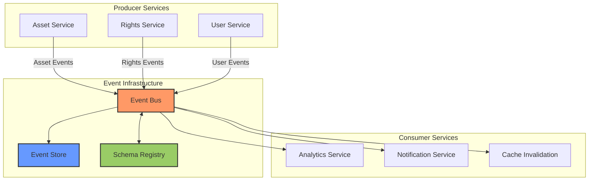

**17.1.5.2 Event Flow Sequence**

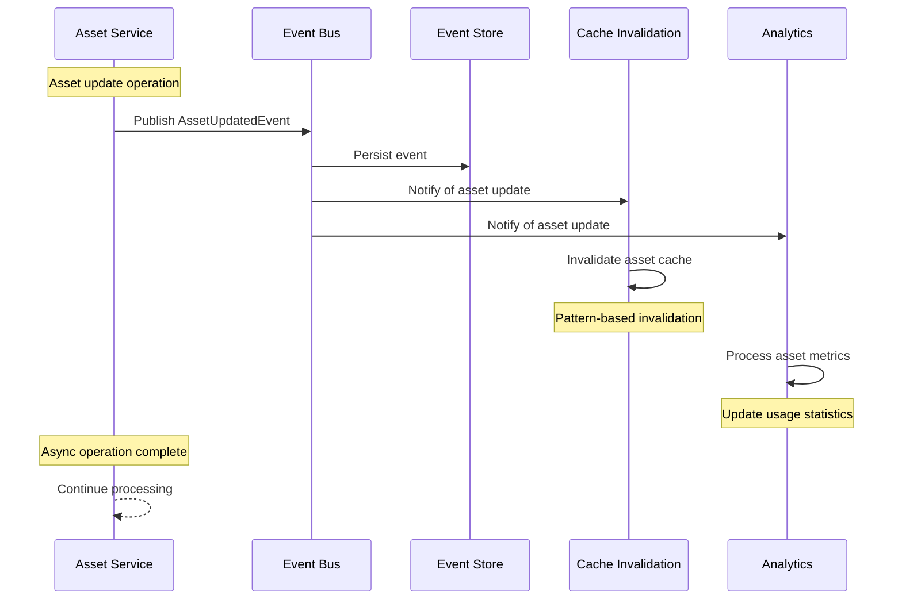

## 

**17.1.5.2 Event Sourcing Pattern**

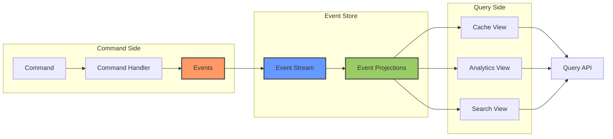

## 17.2 GraphQL API Layer

Adopting GraphQL as the primary API interface would provide significant flexibility and efficiency improvements over the current REST implementation.

### 17.2.1 Implementation Approach

```python
class GraphQLAPILayer:
    """
    GraphQL API implementation for the NNA Framework
    providing flexible querying capabilities.
    """
    def __init__(self):
        self.schema_manager = SchemaManager()
        self.resolver_manager = ResolverManager()
        self.authorization_director = AuthorizationDirector()
        self.performance_monitor = PerformanceMonitor()
        
    async def initialize_graphql_api(self, config: GraphQLConfig) -> GraphQLAPI:
        """
        Initialize the GraphQL API system
        """
        # Initialize schema with type definitions
        schema = await self.schema_manager.create_schema(
            type_defs=config.type_defs,
            resolvers=config.resolvers
        )
        
        # Set up authorization directives
        authorization = await self.authorization_director.initialize(
            schema=schema,
            auth_config=config.authorization
        )
        
        # Initialize resolvers with service connections
        resolvers = await self.resolver_manager.initialize_resolvers(
            resolver_configs=config.resolver_configs,
            services=config.services
        )
        
        # Set up performance monitoring
        monitoring = await self.performance_monitor.initialize(
            schema=schema,
            tracing_config=config.tracing
        )
        
        return GraphQLAPI(
            schema=schema,
            resolvers=resolvers,
            authorization=authorization,
            monitoring=monitoring
        )
```

### 17.2.2 Schema Example

```graphql
type Asset {
  id: ID!
  type: String!
  metadata: AssetMetadata!
  urls: AssetURLs!
  rights: RightsInfo
}

type AssetMetadata {
  title: String
  description: String
  creator: String
  created: DateTime
  modified: DateTime
  tags: [String]
  properties: JSONObject
}

type AssetURLs {
  preview: String
  full: String
  thumbnail: String
}

type RightsInfo {
  hasRights: Boolean!
  territories: [String!]
  restrictions: [String]
  expiration: DateTime
}

type Query {
  asset(id: ID!): Asset
  assets(filter: AssetFilter, limit: Int, offset: Int): [Asset!]!
  compositeAsset(components: [ID!]!): Asset
}

input AssetFilter {
  types: [String]
  tags: [String]
  createdAfter: DateTime
  createdBefore: DateTime
}
```

### 17.2.3 Key Benefits

1. **Flexible Queries**: Clients request exactly the data they need, reducing over-fetching
1. **Reduced Round Trips**: Multiple resources can be retrieved in a single request
1. **Strong Typing**: Built-in schema validation improves API reliability
1. **Introspection**: Self-documenting API reduces documentation burden
1. **Versioning**: Evolve API without explicit versioning through deprecation

### 17.2.4 Migration Strategy

To minimize disruption, implement GraphQL alongside the existing REST API:

1. Develop GraphQL schema representing current data model
1. Implement resolver functions connecting to existing services
1. Deploy GraphQL endpoint alongside REST endpoints
1. Create client libraries demonstrating GraphQL usage
1. Gradually encourage adoption while maintaining REST support
1. Monitor usage patterns to optimize schema

### 17.2.5 Comprehensive GraphQL Schema Implementation

The GraphQL API implementation for the NNA Framework requires a robust schema design that properly represents all asset types while enabling efficient querying. This section provides detailed schema definitions and resolver implementations for the core NNA asset types.

### 17.2.5.1 Core Schema Types

The following schema defines the core types used throughout the NNA Framework GraphQL API:

```graphql
# Base asset interface shared by all NNA assets
interface Asset {
  id: ID!
  type: AssetType!
  createdAt: DateTime!
  updatedAt: DateTime!
  metadata: AssetMetadata!
  rights: RightsInfo
}

# Asset types corresponding to NNA layers
enum AssetType {
  SONG
  STAR
  LOOK
  MOVE
  WORLD
  VIBE
  COMPOSITE
}

# Common metadata fields
type AssetMetadata {
  title: String
  description: String
  tags: [String!]
  creator: String
  attributes: JSONObject
  thumbnailUrl: String
}

# Rights information for assets
type RightsInfo {
  hasRights: Boolean!
  rightsType: RightsType
  territories: [String!]
  restrictions: [String!]
  expiresAt: DateTime
  licensingOptions: [LicensingOption!]
}

enum RightsType {
  FULL
  LIMITED
  PERSONAL
  COMMERCIAL
  EDUCATIONAL
}

type LicensingOption {
  id: ID!
  name: String!
  description: String
  price: Float
  duration: String
  territories: [String!]
}

# Pagination implementation using cursor-based approach
type AssetConnection {
  edges: [AssetEdge!]!
  pageInfo: PageInfo!
  totalCount: Int!
}

type AssetEdge {
  node: Asset!
  cursor: String!
}

type PageInfo {
  hasNextPage: Boolean!
  hasPreviousPage: Boolean!
  startCursor: String
  endCursor: String
}

# Root queries
type Query {
  # Single asset retrieval
  asset(id: ID!): Asset
  
  # Asset collection queries with filtering and pagination
  assets(
    filter: AssetFilter,
    first: Int,
    after: String,
    last: Int,
    before: String
  ): AssetConnection!
  
  # Search across all assets
  searchAssets(
    query: String!,
    filter: AssetFilter,
    first: Int,
    after: String
  ): AssetConnection!
  
  # Composition-specific query
  composition(id: ID!): CompositeAsset
}

# Comprehensive filtering options
input AssetFilter {
  types: [AssetType]
  tags: [String]
  createdAfter: DateTime
  createdBefore: DateTime
  hasRights: Boolean
  territories: [String]
  creators: [String]
  searchText: String
}

# Scalar types
scalar DateTime
scalar JSONObject
```

### 

### 17.2.5.2 Layer-Specific Schema Types

Each NNA layer type has specific fields and relationships that extend the base Asset interface:

```graphql
# Song (G) asset implementation
type SongAsset implements Asset {
  id: ID!
  type: AssetType!
  createdAt: DateTime!
  updatedAt: DateTime!
  metadata: AssetMetadata!
  rights: RightsInfo
  
  # Song-specific fields
  duration: Int!  # Duration in seconds
  bpm: Int        # Beats per minute
  key: String     # Musical key
  genre: [String!]
  artists: [String!]
  audioPreviewUrl: String
  waveformUrl: String
  compatibleWith(type: AssetType!, limit: Int = 5): [Asset!]
}

# Star (S) asset implementation
type StarAsset implements Asset {
  id: ID!
  type: AssetType!
  createdAt: DateTime!
  updatedAt: DateTime!
  metadata: AssetMetadata!
  rights: RightsInfo
  
  # Star-specific fields
  character: String
  style: String
  animations: [Animation!]
  previewUrl: String
  compatibleWith(type: AssetType!, limit: Int = 5): [Asset!]
}

# Look (L) asset implementation
type LookAsset implements Asset {
  id: ID!
  type: AssetType!
  createdAt: DateTime!
  updatedAt: DateTime!
  metadata: AssetMetadata!
  rights: RightsInfo
  
  # Look-specific fields
  style: String!
  colors: [String!]
  patterns: [String!]
  previewUrl: String
  compatibleWith(type: AssetType!, limit: Int = 5): [Asset!]
}

# Move (M) asset implementation
type MoveAsset implements Asset {
  id: ID!
  type: AssetType!
  createdAt: DateTime!
  updatedAt: DateTime!
  metadata: AssetMetadata!
  rights: RightsInfo
  
  # Move-specific fields
  category: String!
  energyLevel: Int  # 1-10 scale
  complexity: Int   # 1-10 scale
  duration: Int     # Duration in seconds
  previewUrl: String
  compatibleWith(type: AssetType!, limit: Int = 5): [Asset!]
}

# World (W) asset implementation
type WorldAsset implements Asset {
  id: ID!
  type: AssetType!
  createdAt: DateTime!
  updatedAt: DateTime!
  metadata: AssetMetadata!
  rights: RightsInfo
  
  # World-specific fields
  environment: String!
  mood: String
  lightingStyle: String
  interactiveElements: [String!]
  previewUrl: String
  panoramaUrl: String
  compatibleWith(type: AssetType!, limit: Int = 5): [Asset!]
}

# Vibe (V) asset implementation
type VibeAsset implements Asset {
  id: ID!
  type: AssetType!
  createdAt: DateTime!
  updatedAt: DateTime!
  metadata: AssetMetadata!
  rights: RightsInfo
  
  # Vibe-specific fields
  mood: String!
  intensity: Int    # 1-10 scale
  effects: [String!]
  filterStyle: String
  previewUrl: String
  compatibleWith(type: AssetType!, limit: Int = 5): [Asset!]
}

# Composite asset implementation
type CompositeAsset implements Asset {
  id: ID!
  type: AssetType!
  createdAt: DateTime!
  updatedAt: DateTime!
  metadata: AssetMetadata!
  rights: RightsInfo
  
  # Composite-specific fields
  components: CompositeComponents!
  status: CompositionStatus!
  renderUrl: String
  previewUrl: String
  compatibility: CompatibilityScore!
}

type CompositeComponents {
  song: SongAsset
  star: StarAsset
  look: LookAsset
  move: MoveAsset
  world: WorldAsset
  vibe: VibeAsset
}

enum CompositionStatus {
  DRAFT
  RENDERING
  COMPLETED
  FAILED
}

type CompatibilityScore {
  overall: Float!  # 0-1 score
  pairScores: [PairCompatibility!]!
}

type PairCompatibility {
  sourceType: AssetType!
  targetType: AssetType!
  score: Float!   # 0-1 score
  factors: [String!]
}

type Animation {
  id: ID!
  name: String!
  duration: Int
  previewUrl: String
}
```

### 17.2.5.3 Mutation Schema

The GraphQL API also supports mutations for asset creation, updates, and composition:

```graphql
type Mutation {
  # Asset management
  createAsset(input: CreateAssetInput!): Asset!
  updateAsset(id: ID!, input: UpdateAssetInput!): Asset!
  deleteAsset(id: ID!): DeleteAssetPayload!
  
  # Composition operations
  createComposition(input: CreateCompositionInput!): CompositeAsset!
  updateComposition(id: ID!, input: UpdateCompositionInput!): CompositeAsset!
  renderComposition(id: ID!): RenderCompositionPayload!
  
  # Rights management
  grantRights(input: GrantRightsInput!): RightsInfo!
  revokeRights(input: RevokeRightsInput!): RevokeRightsPayload!
}

input CreateAssetInput {
  type: AssetType!
  metadata: AssetMetadataInput!
  # Type-specific fields will be in JSON format
  attributes: JSONObject!
  content: Upload
}

input AssetMetadataInput {
  title: String!
  description: String
  tags: [String!]
  creator: String
  attributes: JSONObject
}

input UpdateAssetInput {
  metadata: AssetMetadataInput
  attributes: JSONObject
  content: Upload
}

type DeleteAssetPayload {
  id: ID!
  success: Boolean!
}

input CreateCompositionInput {
  title: String!
  description: String
  songId: ID
  starId: ID
  lookId: ID
  moveId: ID
  worldId: ID
  vibeId: ID
  renderOptions: RenderOptionsInput
}

input UpdateCompositionInput {
  title: String
  description: String
  songId: ID
  starId: ID
  lookId: ID
  moveId: ID
  worldId: ID
  vibeId: ID
  renderOptions: RenderOptionsInput
}

input RenderOptionsInput {
  resolution: String  # e.g., "1920x1080"
  format: String      # e.g., "mp4"
  quality: String     # e.g., "high"
  duration: Int       # in seconds
}

type RenderCompositionPayload {
  compositionId: ID!
  status: CompositionStatus!
  estimatedCompletionTime: DateTime
}

input GrantRightsInput {
  assetId: ID!
  rightsType: RightsType!
  territories: [String!]
  restrictions: [String!]
  expiresAt: DateTime
  userId: ID!
}

input RevokeRightsInput {
  assetId: ID!
  userId: ID!
  reason: String
}

type RevokeRightsPayload {
  assetId: ID!
  userId: ID!
  success: Boolean!
}

# Scalar for file uploads
scalar Upload
```

### 17.2.5.4 Resolver Implementation Examples

Resolvers connect the GraphQL schema to the underlying NNA Framework services. The following examples demonstrate how to implement resolvers for various asset types and queries:

```typescript
// Type resolvers with proper interface implementation
const typeResolvers = {
  // Interface resolver to determine concrete type
  Asset: {
    __resolveType(asset) {
      switch (asset.type) {
        case 'SONG': return 'SongAsset';
        case 'STAR': return 'StarAsset';
        case 'LOOK': return 'LookAsset';
        case 'MOVE': return 'MoveAsset';
        case 'WORLD': return 'WorldAsset';
        case 'VIBE': return 'VibeAsset';
        case 'COMPOSITE': return 'CompositeAsset';
        default: throw new Error(`Unknown asset type: ${asset.type}`);
      }
    }
  },
  
  // Type-specific resolvers with field-level resolution
  SongAsset: {
    // Resolver for computed field
    compatibleWith: async (parent, args, context) => {
      const { type, limit } = args;
      // Delegate to compatibility service
      return context.services.compatibilityService.findCompatibleAssets(
        parent.id, 
        type, 
        limit,
        context.user
      );
    }
  },
  
  StarAsset: {
    compatibleWith: async (parent, args, context) => {
      const { type, limit } = args;
      return context.services.compatibilityService.findCompatibleAssets(
        parent.id, 
        type, 
        limit,
        context.user
      );
    },
    // Resolve animations relationship
    animations: async (parent, args, context) => {
      return context.services.assetService.getAnimationsForStar(
        parent.id,
        context.user
      );
    }
  },
  
  // Composite asset resolvers
  CompositeAsset: {
    components: async (parent, args, context) => {
      // Load all component assets
      const components = await context.services.compositionService.getComponents(
        parent.id,
        context.user
      );
      
      return {
        song: components.song,
        star: components.star,
        look: components.look,
        move: components.move,
        world: components.world,
        vibe: components.vibe
      };
    },
    compatibility: async (parent, args, context) => {
      return context.services.compatibilityService.getCompositionCompatibility(
        parent.id,
        context.user
      );
    }
  }
};

// Query resolvers
const queryResolvers = {
  Query: {
    // Single asset retrieval
    asset: async (_, { id }, context) => {
      return context.services.assetService.getAssetById(id, context.user);
    },
    
    // Asset collection with filtering and pagination
    assets: async (_, { filter, first, after, last, before }, context) => {
      // Transform GraphQL pagination to service parameters
      const paginationParams = buildPaginationParams(first, after, last, before);
      
      // Get assets with pagination
      const result = await context.services.assetService.getAssets(
        filter,
        paginationParams,
        context.user
      );
      
      // Transform to GraphQL connection format
      return {
        edges: result.items.map(item => ({
          node: item,
          cursor: encodeCursor(item.id)
        })),
        pageInfo: {
          hasNextPage: result.hasMore,
          hasPreviousPage: !!before,
          startCursor: result.items.length > 0 ? encodeCursor(result.items[0].id) : null,
          endCursor: result.items.length > 0 ? encodeCursor(result.items[result.items.length - 1].id) : null
        },
        totalCount: result.totalCount
      };
    },
    
    // Asset search implementation
    searchAssets: async (_, { query, filter, first, after }, context) => {
      const paginationParams = buildPaginationParams(first, after);
      
      // Delegate to search service
      const result = await context.services.searchService.searchAssets(
        query,
        filter,
        paginationParams,
        context.user
      );
      
      // Transform to connection format
      return {
        edges: result.items.map(item => ({
          node: item,
          cursor: encodeCursor(item.id)
        })),
        pageInfo: {
          hasNextPage: result.hasMore,
          hasPreviousPage: !!after,
          startCursor: result.items.length > 0 ? encodeCursor(result.items[0].id) : null,
          endCursor: result.items.length > 0 ? encodeCursor(result.items[result.items.length - 1].id) : null
        },
        totalCount: result.totalCount
      };
    },
    
    // Composition query
    composition: async (_, { id }, context) => {
      return context.services.compositionService.getCompositionById(id, context.user);
    }
  }
};

// Mutation resolvers
const mutationResolvers = {
  Mutation: {
    // Asset creation
    createAsset: async (_, { input }, context) => {
      // Authorize user
      if (!context.user || !context.user.canCreateAssets) {
        throw new Error('Unauthorized: Cannot create assets');
      }
      
      // Process file upload if provided
      let contentUrl = null;
      if (input.content) {
        const { createReadStream, filename, mimetype } = await input.content;
        contentUrl = await context.services.uploadService.uploadAssetContent(
          createReadStream(),
          filename,
          mimetype,
          context.user
        );
      }
      
      // Create asset
      return context.services.assetService.createAsset({
        ...input,
        contentUrl,
        createdBy: context.user.id
      });
    },
    
    // Composition creation
    createComposition: async (_, { input }, context) => {
      // Authorize user
      if (!context.user || !context.user.canCreateCompositions) {
        throw new Error('Unauthorized: Cannot create compositions');
      }
      
      // Validate component compatibility
      const components = {
        songId: input.songId,
        starId: input.starId,
        lookId: input.lookId,
        moveId: input.moveId,
        worldId: input.worldId,
        vibeId: input.vibeId
      };
      
      const compatibility = await context.services.compatibilityService.checkCompatibility(
        components,
        context.user
      );
      
      if (compatibility.overall < 0.3) {
        throw new Error('Components have low compatibility score');
      }
      
      // Create composition
      return context.services.compositionService.createComposition({
        ...input,
        createdBy: context.user.id
      });
    },
    
    // Render composition
    renderComposition: async (_, { id }, context) => {
      // Authorize user
      if (!context.user || !context.user.canRenderCompositions) {
        throw new Error('Unauthorized: Cannot render compositions');
      }
      
      // Initiate render job
      const renderJob = await context.services.renderService.startRenderJob(
        id,
        context.user
      );
      
      return {
        compositionId: id,
        status: 'RENDERING',
        estimatedCompletionTime: renderJob.estimatedCompletionTime
      };
    }
  }
};

// Helper functions for resolver implementation
function buildPaginationParams(first, after, last, before) {
  // Implement cursor-based pagination conversion
  return {
    limit: first || last || 10,
    cursor: after || before,
    direction: after ? 'forward' : 'backward'
  };
}

function encodeCursor(id) {
  // Encode cursor for pagination
  return Buffer.from(`cursor:${id}`).toString('base64');
}

function decodeCursor(cursor) {
  // Decode cursor from pagination
  const decoded = Buffer.from(cursor, 'base64').toString('utf8');
  return decoded.replace('cursor:', '');
}

// Combine all resolvers
const resolvers = {
  ...typeResolvers,
  ...queryResolvers,
  ...mutationResolvers
};
```

### 17.2.5.5 GraphQL Service Integration

The following implementation shows how to integrate GraphQL resolvers with the existing NNA Framework services:

```typescript
import { ApolloServer } from 'apollo-server-express';
import { makeExecutableSchema } from '@graphql-tools/schema';
import { typeDefs } from './schema';
import { resolvers } from './resolvers';

class GraphQLService {
  private schema;
  private server;
  
  constructor(
    private assetService,
    private compositionService,
    private compatibilityService,
    private searchService,
    private uploadService,
    private renderService,
    private authService
  ) {
    // Create executable schema
    this.schema = makeExecutableSchema({
      typeDefs,
      resolvers
    });
    
    // Create Apollo server
    this.server = new ApolloServer({
      schema: this.schema,
      context: this.createContext.bind(this)
    });
  }
  
  async createContext({ req }) {
    // Extract authentication token
    const token = req.headers.authorization ? 
      req.headers.authorization.replace('Bearer ', '') : 
      null;
    
    // Authenticate user
    const user = token ? 
      await this.authService.validateToken(token) : 
      null;
    
    // Create context with services
    return {
      user,
      services: {
        assetService: this.assetService,
        compositionService: this.compositionService,
        compatibilityService: this.compatibilityService,
        searchService: this.searchService,
        uploadService: this.uploadService,
        renderService: this.renderService
      }
    };
  }
  
  async applyMiddleware(app) {
    // Apply Apollo middleware to Express app
    await this.server.start();
    this.server.applyMiddleware({ app, path: '/graphql' });
  }
}

// Usage example in application setup
async function setupGraphQLService(app) {
  const graphqlService = new GraphQLService(
    container.resolve('assetService'),
    container.resolve('compositionService'),
    container.resolve('compatibilityService'),
    container.resolve('searchService'),
    container.resolve('uploadService'),
    container.resolve('renderService'),
    container.resolve('authService')
  );
  
  await graphqlService.applyMiddleware(app);
  
  console.log('GraphQL API available at /graphql');
}
```

### 17.2.5.6 Performance Considerations

When implementing the GraphQL schema for the NNA Framework, consider these performance optimizations:

1. **Selective Field Resolution**:
    - Implement field-level resolvers that only fetch required data
    - Use dataloader pattern to batch database queries
    - Implement request-specific caching for expensive operations
1. **Query Complexity Analysis**:
    - Add query complexity calculations to prevent resource-intensive queries
    - Implement depth limitation to prevent deeply nested queries
    - Use cost analysis for query budgeting
1. **Persisted Queries**:
    - Implement a persisted query mechanism for common operations
    - Cache persisted query results with appropriate invalidation
    - Use automatic persisted queries (APQ) protocol
1. **Pagination Implementation**:
    - Always use cursor-based pagination for consistent performance
    - Implement forward and backward pagination
    - Apply reasonable defaults and limits to prevent excessive data loading
1. **Fragment Optimization**:
    - Encourage the use of fragments for client-side reuse
    - Optimize resolver execution for fragment-based queries
    - Use inline fragments for type-specific field selection

The GraphQL implementation provides a flexible, powerful API layer that enables clients to request exactly the data they need while maintaining the performance and security characteristics of the NNA Framework.

## 17.3 Serverless Components

Converting appropriate services to serverless functions can significantly improve scaling efficiency and reduce operational costs.

### 17.3.1 Implementation Approach

```python
class ServerlessArchitecture:
    """
    Serverless implementation for appropriate NNA Framework components
    to improve scaling and cost efficiency.
    """
    def __init__(self):
        self.function_manager = FunctionManager()
        self.deployment_manager = DeploymentManager()
        self.trigger_manager = TriggerManager()
        self.monitoring_manager = MonitoringManager()
        
    async def create_serverless_function(
        self,
        function_config: FunctionConfig
    ) -> ServerlessFunction:
        """
        Create a serverless function from a service component
        """
        # Extract service component logic
        service_logic = await self.function_manager.extract_logic(
            service_name=function_config.service_name,
            operation_name=function_config.operation_name
        )
        
        # Create function package
        function_package = await self.function_manager.create_function_package(
            logic=service_logic,
            dependencies=function_config.dependencies,
            runtime=function_config.runtime
        )
        
        # Deploy function to serverless platform
        function = await self.deployment_manager.deploy_function(
            package=function_package,
            config=function_config
        )
        
        # Configure triggers
        triggers = await self.trigger_manager.configure_triggers(
            function=function,
            trigger_configs=function_config.triggers
        )
        
        # Set up monitoring
        monitoring = await self.monitoring_manager.configure_monitoring(
            function=function,
            alarm_configs=function_config.alarms
        )
        
        return ServerlessFunction(
            id=function.id,
            name=function.name,
            url=function.url,
            triggers=triggers,
            monitoring=monitoring,
            config=function_config
        )
```

### 17.3.2 Candidate Services for Serverless Conversion

| **Service** | **Operations** | **Trigger Type** | **Benefit** |
| --- | --- | --- | --- |
| **Asset Transformation** | Format conversion, resizing | Event-driven | Cost savings for bursty workloads |
| **Rights Verification** | Verify rights, update status | HTTP/API | Scales to zero when idle |
| **Usage Analytics** | Process usage events, generate reports | Event-driven | Efficient batch processing |
| **Notification Service** | Send alerts, user notifications | Event-driven | Automatic scaling with demand |
| **Content Moderation** | Review content, apply policies | Queue processing | Pay-per-invocation for irregular usage |

### 17.3.3 Key Benefits

1. **Automatic Scaling**: Functions scale instantly from zero to thousands of instances
1. **Cost Efficiency**: Pay only for actual compute usage, not idle capacity
1. **Reduced Operational Overhead**: No server management required
1. **Simplified Deployment**: Streamlined deployment and versioning
1. **Isolation**: Function-level isolation improves security and reliability

### 17.3.4 Implementation Considerations

When converting services to serverless:

1. **State Management**: Move state to external services (databases, caches)
1. **Cold Start Mitigation**: Design for minimal cold start impact
1. **Resource Limits**: Account for memory, execution time, and concurrency limits
1. **Cost Monitoring**: Implement usage tracking to prevent unexpected costs
1. **Hybrid Approach**: Maintain container-based services for unsuitable workloads

## 17.4 AI-Powered Optimization

Implementing machine learning for automated system tuning can significantly improve performance, resource utilization, and user experience.

### 17.4.1 Implementation Approach

```python
class AIOptimizationSystem:
    """
    AI-powered optimization system for the NNA Framework
    to automatically tune system parameters and improve performance.
    """
    def __init__(self):
        self.data_collector = DataCollector()
        self.model_manager = ModelManager()
        self.optimization_engine = OptimizationEngine()
        self.experiment_manager = ExperimentManager()
        
    async def initialize_ai_optimization(self, config: AIOptimizationConfig) -> AIOptimization:
        """
        Initialize the AI optimization system
        """
        # Set up data collection pipelines
        data_collectors = await self.data_collector.initialize_collectors(
            collector_configs=config.collectors
        )
        
        # Initialize ML models
        models = await self.model_manager.initialize_models(
            model_configs=config.models
        )
        
        # Set up optimization engines
        optimization_engines = {}
        for engine_config in config.optimization_engines:
            optimization_engines[engine_config.name] = await self.optimization_engine.initialize_engine(
                engine_config=engine_config,
                models={model.name: model for model in models}
            )
        
        # Configure experimentation framework
        experimentation = await self.experiment_manager.initialize(
            experiment_configs=config.experiments
        )
        
        return AIOptimization(
            collectors=data_collectors,
            models=models,
            optimization_engines=optimization_engines,
            experimentation=experimentation,
            config=config
        )
```

### 17.4.2 Optimization Targets

| **System Component** | **Optimization Target** | **Model Type** | **Data Sources** |
| --- | --- | --- | --- |
| **Cache Strategy** | Hit rate maximization | Time-series forecasting | Cache access logs, usage patterns |
| **Resource Allocation** | Cost-performance optimization | Reinforcement learning | CPU/memory usage, request load |
| **Query Patterns** | Query efficiency | Clustering, anomaly detection | Query execution metrics, access patterns |
| **Content Recommendations** | User satisfaction | Collaborative filtering | User interactions, content attributes |
| **Auto-scaling** | Resource utilization | Predictive forecasting | Historical load patterns, scheduled events |

### 17.4.3 Key Benefits

1. **Continuous Improvement**: System automatically optimizes based on changing usage patterns
1. **Cost Reduction**: Efficient resource allocation minimizes infrastructure costs
1. **Performance Enhancement**: Proactive optimization improves response times
1. **Reduced Operational Burden**: Automated tuning reduces manual optimization
1. **Personalized Experiences**: User-specific optimizations improve satisfaction

### 17.4.4 Implementation Strategy

To successfully implement AI optimization:

1. **Data Collection**: Establish comprehensive telemetry collection
1. **Initial Models**: Start with simple models on limited scope
1. **Controlled Rollout**: Use A/B testing for incremental deployment
1. **Feedback Loops**: Implement systems to measure optimization impact
1. **Human Oversight**: Maintain monitoring and manual override capabilities

## 17.5 Edge Computing Integration

Enhancing the edge cache with computing capabilities brings processing closer to users, significantly reducing latency for key operations.

### 17.5.1 Implementation Approach

```python
class EdgeComputingArchitecture:
    """
    Edge computing implementation for the NNA Framework
    to enable processing closer to users and reduce latency.
    """
    def __init__(self):
        self.edge_manager = EdgeManager()
        self.function_deployer = EdgeFunctionDeployer()
        self.data_synchronizer = DataSynchronizer()
        self.routing_manager = RoutingManager()
        
    async def initialize_edge_architecture(self, config: EdgeConfig) -> EdgeArchitecture:
        """
        Initialize the edge computing architecture
        """
        # Initialize edge locations
        edge_locations = await self.edge_manager.initialize_locations(
            location_configs=config.locations
        )
        
        # Deploy edge functions
        edge_functions = {}
        for function_config in config.functions:
            edge_functions[function_config.name] = await self.function_deployer.deploy_function(
                function_config=function_config,
                edge_locations=edge_locations
            )
        
        # Configure data synchronization
        synchronizers = await self.data_synchronizer.initialize_synchronizers(
            sync_configs=config.sync_configs,
            edge_locations=edge_locations
        )
        
        # Set up request routing
        routing = await self.routing_manager.initialize_routing(
            routing_config=config.routing,
            edge_locations=edge_locations
        )
        
        return EdgeArchitecture(
            locations=edge_locations,
            functions=edge_functions,
            synchronizers=synchronizers,
            routing=routing,
            config=config
        )
```

### 17.5.2 Edge Function Candidates

| **Function** | **Purpose** | **Benefit** |
| --- | --- | --- |
| **Asset Resolution** | Resolve asset references locally | Reduced latency for core operation |
| **Content Transformation** | Resize/reformat assets at edge | Bandwidth reduction, faster delivery |
| **Access Validation** | Verify access rights locally | Improved security with low latency |
| **Personalization** | Apply user-specific customizations | Enhanced user experience |
| **Content Filtering** | Apply regional/user restrictions | Compliance with local regulations |


### 17.5.3 Key Benefits

1. **Reduced Latency**: Processing closer to users minimizes round-trip time
1. **Bandwidth Reduction**: Pre-processing at edge reduces data transfer
1. **Regional Compliance**: Enable region-specific processing and rules
1. **Improved Availability**: Continues operating during central system disruptions
1. **Scalability**: Distributes processing load across edge locations

### 17.5.4 Implementation Considerations

When implementing edge computing:

1. **Data Consistency**: Establish mechanisms for edge data synchronization
1. **Security Boundaries**: Define security models for edge execution
1. **Deployment Pipeline**: Create CI/CD processes for edge function deployment
1. **Monitoring**: Implement distributed tracing across edge and central systems
1. **Graceful Degradation**: Design edge functions to handle central system unavailability

**17.5.5.1 Edge Computing Network Topology**

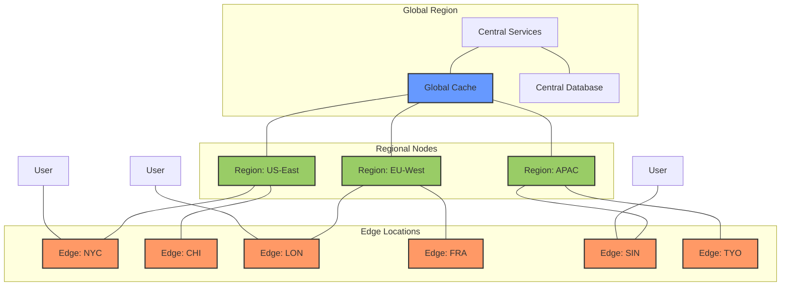

**17.5.5.2 Edge Computing Request Flow**

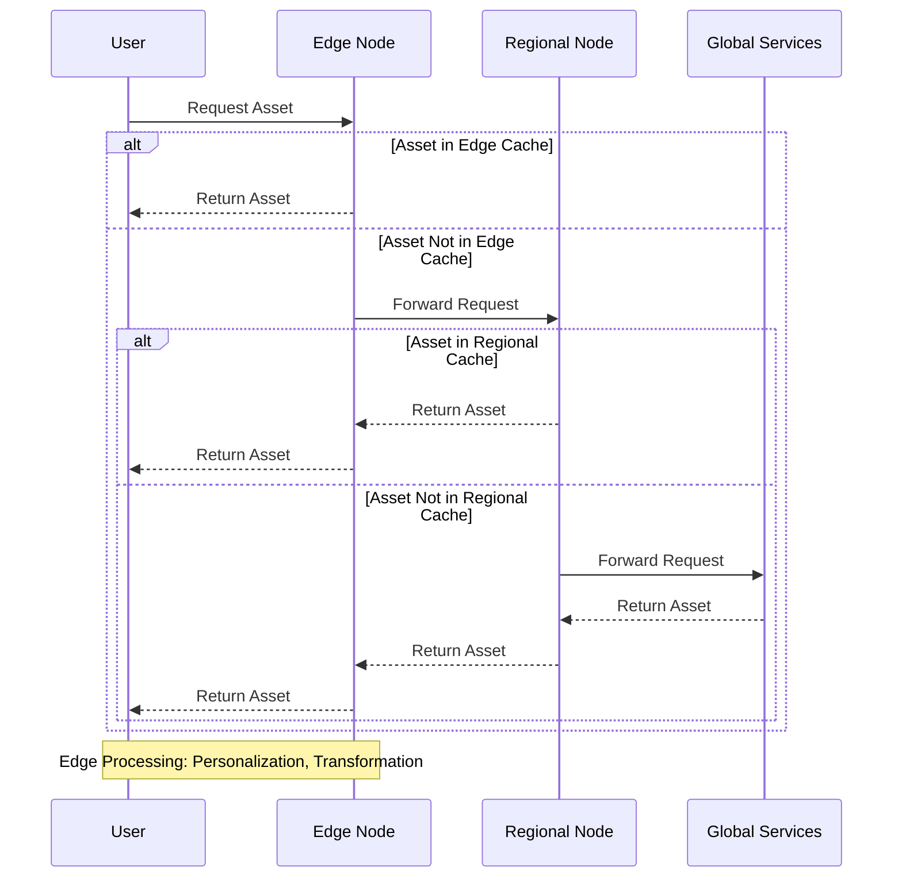

**17.5.5.3 Edge Function Deployment**

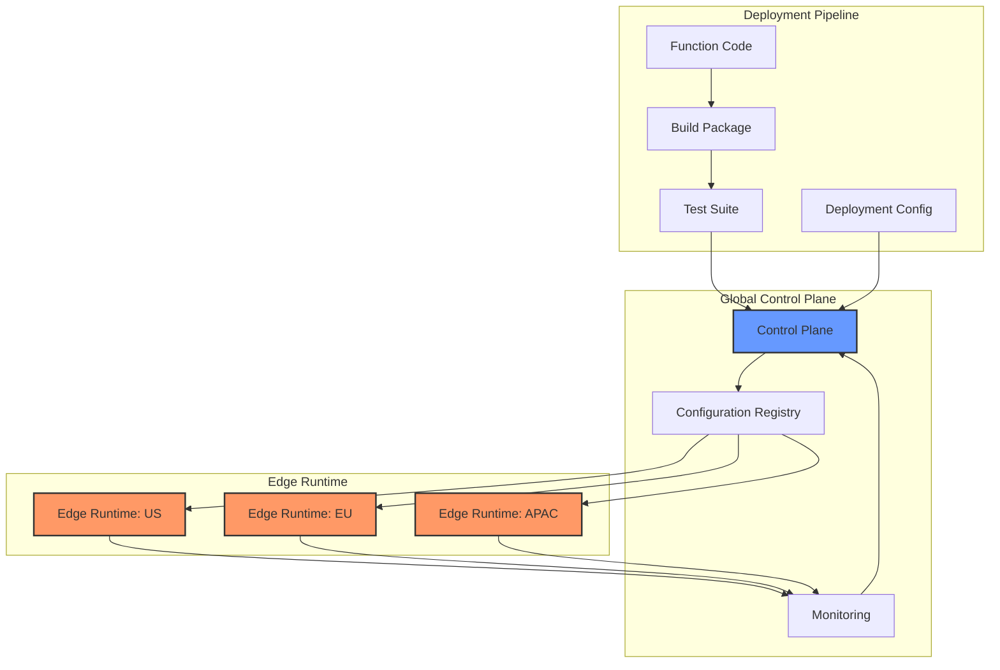


## 17.6 Implementation Timeline and Prioritization

The following timeline provides a strategic roadmap for implementing the architectural enhancements outlined in this section. This phased approach balances immediate benefits with implementation complexity.

---

### 17.6.1 Phase 1: Foundation (Q2-Q3 2025)

| **Enhancement** | **Components** | **Timeline** | **Key Deliverables** |
| --- | --- | --- | --- |
| **AI-Powered Optimization** | Cache optimization, Resource allocation | Q2 2025 | - ML models for cache prediction<br>- Automated TTL optimization<br>- Resource scaling algorithms |
| **Edge Computing (Initial)** | Asset resolution at edge, Basic content transformation | Q3 2025 | - Edge caching with compute  - Regional configuration system<br>- Edge health monitoring |

**Phase 1 Goals:** Improve system performance and reduce latency while establishing the foundation for more significant architectural changes.

---

### 17.6.2 Phase 2: Transformation (Q4 2025 - Q1 2026)

| **Enhancement** | **Components** | **Timeline** | **Key Deliverables** |
| --- | --- | --- | --- |
| **Event-Driven Architecture** | Core event bus, Initial event producers/consumers | Q4 2025 | - Event bus infrastructure<br>- Schema registry<br>- Initial integration points |
| **GraphQL API Layer** | Schema definition, Basic resolvers, Side-by-side with REST | Q1 2026 | - GraphQL endpoint<br>- Core type definitions<br>- Performance monitoring |
| **Serverless Components** | Asset transformation functions, Analytics processing | Q1 2026 | - Serverless deployment pipeline<br>- Function monitoring<br>- Integration patterns |

**Phase 2 Goals:** Begin fundamental architectural transformation while maintaining backward compatibility and ensuring system stability.

---

### 17.6.3 Phase 3: Advanced Capabilities (Q2-Q4 2026)

## Implementation Timeline and Key Deliverables

| **Enhancement** | **Components** | **Timeline** | **Key Deliverables** |
| --- | --- | --- | --- |
| **Event-Driven Architecture (Extended)** | Event sourcing, CQRS patterns, Complete migration | Q2 2026 | - Event sourcing infrastructure<br>- Command/query separation<br>- Legacy system migration |
| **Edge Computing (Advanced)** | Edge personalization, Rights verification at edge | Q3 2026 | - User profile distribution<br>- Edge security model<br>- Cross-region synchronization |
| **AI-Powered Optimization (Advanced)** | Predictive scaling, Content recommendation optimization | Q4 2026 | - Advanced prediction models - Feedback loop integration<br>- A/B testing framework |

**Phase 3 Goals:** Complete the architectural transformation and add advanced capabilities to maximize system performance, reliability, and user experience.

---

### 17.6.4 Decision Points and Dependencies

Critical decision points are scheduled throughout the implementation timeline:

### After Phase 1 (Q3 2025):

- Evaluate performance improvements from AI optimization
- Assess edge computing latency reduction
- Adjust Phase 2 priorities based on business impact

### During Phase 2 (Q4 2025):

- Measure GraphQL adoption and performance impact
- Evaluate serverless cost-effectiveness
- Consider accelerating/decelerating migration based on metrics

### Before Phase 3 (Q1 2026):

- Comprehensive architecture review
- Resource allocation for remaining enhancements
- Refinement of advanced feature requirements

This timeline should be treated as a **living document**, with regular reviews and adjustments based on changing business priorities, emerging technologies, and lessons learned during implementation.

### 17.7.1 Edge Computing Performance Improvements

| **Metric** | **Current Baseline** | **Expected with Edge Computing** | **Target Improvement** |
| --- | --- | --- | --- |
| **Asset Resolution Latency (P95)** | 50ms | 15ms | 70% reduction |
| **Time to First Byte** | 120ms | 35ms | 71% reduction |
| **Cache Hit Rate** | 85% | 97% | 14% increase |
| **Bandwidth Usage** | Baseline | 40% reduction | 40% savings |
| **Global Availability** | 99.95% | 99.99% | 80% fewer outages |

### 17.7.2 Event-Driven Architecture Performance Gains

| **Metric** | **Current Synchronous** | **Expected with Event-Driven** | **Improvement** |
| --- | --- | --- | --- |
| **System Throughput** | 5,000 req/sec | 50,000 req/sec | 10x increase |
| **Service Coupling Failures** | 120/day | 5/day | 96% reduction |
| **Recovery Time** | 15 minutes | 30 seconds | 97% reduction |
| **Peak Load Handling** | 10K concurrent users | 100K concurrent users | 10x capacity |
| **Background Processing Latency** | 35 minutes | 45 seconds | 97% reduction |

### 17.7.3 GraphQL API Efficiency Improvements

| **Metric** | **Current Synchronous** | **Expected with Event-Driven** | **Improvement** |
| --- | --- | --- | --- |
| **System Throughput** | 5,000 req/sec | 50,000 req/sec | 10x increase |
| **Service Coupling Failures** | 120/day | 5/day | 96% reduction |
| **Recovery Time** | 15 minutes | 30 seconds | 97% reduction |
| **Peak Load Handling** | 10K concurrent users | 100K concurrent users | 10x capacity |
| **Background Processing Latency** | 35 minutes | 45 seconds | 97% reduction |

### 17.7.4 Serverless Components Efficiency

| **Metric** | **Current VM-based** | **Expected with Serverless** | **Improvement** |
| --- | --- | --- | --- |
| **Idle Resource Costs** | $15,000/month | $2,000/month | 87% cost reduction |
| **Scale-up Time** | 3-5 minutes | 200-500ms | 99% faster scaling |
| **Maximum Concurrent Processing** | 1,000 operations | 10,000+ operations | 10x+ capacity |
| **New Feature Deployment Time** | 2-3 days | 2-3 hours | 95% faster deployment |
| **System Maintenance Overhead** | 25 hours/week | 5 hours/week | 80% reduction |

### 17.7.5 AI-Powered Optimization Benefits

| **Metric** | **Manual Optimization** | **With AI Optimization** | **Improvement** |
| --- | --- | --- | --- |
| **Cache Hit Rate** | 85% | 96% | 13% increase |
| **Resource Utilization** | 40% average | 75% average | 88% better utilization |
| **Cost Optimization** | Quarterly reviews | Continuous | 25% cost reduction |
| **Performance Tuning Frequency** | Monthly | Continuous | 30x more frequent |
| **Anomaly Detection Time** | Hours-days | Seconds-minutes | 99% faster detection |


### 17.7.6 Combined Impact Assessment

When fully implemented, these architectural enhancements are expected to deliver the following system-wide improvements:

| **Metric** | **Current Architecture** | **Future Architecture** | **Overall Improvement** |
| --- | --- | --- | --- |
| **Maximum Sustained Throughput** | 10K req/sec | 100K req/sec | 10x increase |
| **P95 Latency (Global)** | 200ms | 50ms | 75% reduction |
| **Infrastructure Costs** | Baseline | 40% reduction | 40% savings |
| **System Availability** | 99.95% | 99.999% | 10x fewer outages |
| **Development Velocity** | Baseline | 2x improvement | 100% faster delivery |


These benchmarks serve as both targets for implementation and metrics for evaluating the success of each architectural enhancement. They should be validated and refined during initial implementation phases.

## 17.8 Migration Guides

These detailed migration guides provide practical approaches for transitioning to the enhanced architectural components while minimizing disruption to existing systems and users. They provide a structured approach to evolving the NNA Framework architecture while minimizing risk and maintaining system reliability throughout the transition process.

### 17.8.1 Migrating to Event-Driven Architecture

**17.8.1.1 Phased Migration Approach**

- **Phase 1: Event Bus Infrastructure (2-3 months)**
    - Deploy event bus infrastructure with appropriate reliability and scaling
    - Implement schema registry with initial event schema definitions
    - Create monitoring and observability for event flow
    - Set up development and testing environments for event production
- **Phase 2: Non-Critical Path Integration (3-4 months)**
    - Identify non-critical service interactions for initial migration
    - Implement event producers without modifying consumers (write model)
    - Add event consumers as duplicates of existing service calls (dual-write pattern)
    - Validate event flow in parallel with existing synchronous calls
- **Phase 3: Expanded Adoption (4-6 months)**
    - Gradually migrate additional service interactions to event model
    - Implement fallback patterns for critical services
    - Add event sourcing for key data models
    - Develop testing tools for event-based interactions
- **Phase 4: Critical Path Migration (2-3 months)**
    - Migrate remaining synchronous interactions to event model
    - Remove legacy synchronous endpoints as traffic decreases
    - Optimize event flows based on performance data
    - Complete documentation and developer training

**17.8.1.2 Key Migration Patterns**

**Strangler Fig Pattern Implementation:**

```python
class EventBridgeAdapter:
    """
    Adapter implementing the strangler fig pattern for
    gradually migrating to event-driven architecture.
    """
    def __init__(
        self,
        legacy_service,
        event_bus,
        feature_flags
    ):
        self.legacy_service = legacy_service
        self.event_bus = event_bus
        self.feature_flags = feature_flags
        
    async def process_request(self, request):
        """Process request using both legacy and event approaches"""
        # Always call legacy service
        legacy_result = await self.legacy_service.process(request)
        
        # Check if this feature is migrated to events
        if self.feature_flags.is_enabled(f"event_{request.operation}"):
            # Publish event
            await self.event_bus.publish(
                event_type=f"{request.operation}_requested",
                payload=request.payload,
                metadata={
                    "source": "strangler_adapter",
                    "request_id": request.id,
                    "timestamp": datetime.now().isoformat()
                }
            )
            
            # If feature flag indicates full migration, use event result
            if self.feature_flags.is_enabled(f"event_{request.operation}_full"):
                event_result = await self.wait_for_event_result(request.id)
                return event_result
                
        # Default to legacy result
        return legacy_result
```

**Dual Write Pattern Implementation:**

```python
class DualWriteManager:
    """
    Implements dual write pattern for data consistency
    during migration to event-driven architecture.
    """
    def __init__(self, legacy_repo, event_repo, conflict_resolver):
        self.legacy_repo = legacy_repo
        self.event_repo = event_repo
        self.conflict_resolver = conflict_resolver
        
    async def write_data(self, entity, context):
        """Write to both legacy and event systems"""
        # Write to legacy system first
        legacy_result = await self.legacy_repo.save(entity)
        
        # Then write to event system
        event_result = await self.event_repo.save(entity)
        
        # Check for conflicts
        if self.has_conflict(legacy_result, event_result):
            # Resolve conflict
            resolution = await self.conflict_resolver.resolve(
                legacy_result,
                event_result,
                context
            )
            
            # Apply resolution
            if resolution.system == "legacy":
                await self.event_repo.save(legacy_result)
                return legacy_result
            else:
                await self.legacy_repo.save(event_result)
                return event_result
                
        return legacy_result
```

**17.8.1.3 Testing and Validation Strategy**

1. **Shadow Testing**:
    - Deploy event-based implementations alongside existing systems
    - Process requests through both paths simultaneously
    - Compare results without affecting production outcomes
    - Collect metrics on discrepancies and performance differences
1. **Canary Deployment**:
    - Route a small percentage of traffic through the event-based implementation
    - Gradually increase traffic as confidence grows
    - Monitor error rates, latency, and resource utilization
    - Implement automatic rollback if error thresholds are exceeded
1. **Circuit Breaker Integration**:
    - Implement circuit breakers between synchronous and event-based systems
    - Define clear failure thresholds and fallback strategies
    - Test failure scenarios in controlled environments
    - Validate recovery patterns before full deployment

### 17.8.2 Migrating to GraphQL API

**17.8.2.1 Side-by-Side Implementation Strategy**

- **Schema Design Phase (1-2 months)**
    - Analyze existing REST API usage patterns
    - Define GraphQL schema based on domain model
    - Implement resolvers connected to existing services
    - Create comprehensive documentation and examples
- **Developer Preview (2-3 months)**
    - Deploy GraphQL endpoint alongside REST API
    - Provide developer tools and documentation
    - Collect feedback from internal teams
    - Refine schema based on usage patterns
- **Public Beta (2-3 months)**
    - Release GraphQL API to selected external developers
    - Monitor adoption and performance metrics
    - Optimize resolvers based on query patterns
    - Add missing functionality based on feedback
- **Full Release (1-2 months)**
    - Make GraphQL API generally available
    - Provide migration guides for REST API users
    - Set deprecation timeline for legacy endpoints
    - Implement long-term support strategy

**17.8.2.2 Schema Design Patterns**

**Mapped Type Definitions:**

```graphql
# User-facing asset type with granular field control
type Asset {
  id: ID!
  name: String
  type: AssetType!
  metadata: AssetMetadata
  url(size: ImageSize = MEDIUM): String
  rights: RightsInfo
  relatedAssets(limit: Int = 5): [Asset]
}

# Flexible filter input for asset queries
input AssetFilter {
  types: [AssetType]
  tags: [String]
  createdAfter: DateTime
  createdBefore: DateTime
  rightsStatus: RightsStatus
}

# Expressive query capabilities
type Query {
  asset(id: ID!): Asset
  assets(filter: AssetFilter, limit: Int, offset: Int): AssetConnection!
  searchAssets(query: String!, filter: AssetFilter): AssetConnection!
}

# Connection pattern for pagination
type AssetConnection {
  edges: [AssetEdge!]!
  pageInfo: PageInfo!
  totalCount: Int!
}

type AssetEdge {
  node: Asset!
  cursor: String!
}

type PageInfo {
  hasNextPage: Boolean!
  endCursor: String
}
```

**Client Migration Guide:**

```javascript
// REST API approach
async function getAssetWithRelated(assetId) {
  // Multiple requests required
  const asset = await fetch(`/api/assets/${assetId}`).then(r => r.json());
  const metadata = await fetch(`/api/assets/${assetId}/metadata`).then(r => r.json());
  const rights = await fetch(`/api/assets/${assetId}/rights`).then(r => r.json());
  const related = await fetch(`/api/assets/${assetId}/related`).then(r => r.json());
  
  // Manual combination
  return {
    ...asset,
    metadata,
    rights,
    relatedAssets: related
  };
}

// GraphQL API approach
async function getAssetWithRelated(assetId) {
  // Single request with exactly what's needed
  const result = await graphqlClient.query({
    query: `
      query GetAsset($id: ID!) {
        asset(id: $id) {
          id
          name
          type
          metadata {
            createdAt
            tags
          }
          rights {
            status
            territories
          }
          relatedAssets {
            id
            name
            url
          }
        }
      }
    `,
    variables: { id: assetId }
  });
  
  return result.data.asset;
}
```

**17.8.2.3 Performance Optimization Strategies**

1. **Query Complexity Analysis**:
    - Implement query complexity scoring
    - Set complexity limits to prevent abuse
    - Provide query optimization suggestions
    - Monitor complex query patterns
1. **Caching Strategy**:
    - Implement field-level caching
    - Use cache control headers
    - Apply persisted queries for common operations
    - Implement dataloader pattern for batch loading
1. **Monitoring and Observability**:
    - Track resolver execution times
    - Monitor field usage frequencies
    - Analyze query patterns
    - Identify optimization opportunities

### 17.8.3 Migrating to Serverless Components

1**7.8.3.1 Component Selection Criteria**

| **Characteristic** | **Good Serverless Candidate** | **Poor Serverless Candidate** |
| --- | --- | --- |
| **Workload Pattern** | Sporadic/bursty | Consistent/predictable |
| **Execution Duration** | Seconds to minutes | Hours or ongoing |
| **State Management** | Stateless | Stateful |
| **Resource Requirements** | <2GB RAM, <15 min execution | High memory, long-running |
| **Cold Start Sensitivity** | Tolerant of cold starts | Requires instant startup |
| **I/O Pattern** | Event-driven, async | Continuous streaming |

**17.8.3.2 Implementation Patterns**

**Function Isolation Pattern:**

```python
# Before: Monolithic service with multiple responsibilities
class AssetProcessingService:
    def process_asset(self, asset_id, options):
        # Load asset
        asset = self.asset_repo.get_asset(asset_id)
        
        # Process asset (CPU-intensive operation)
        processed_asset = self.processor.process(asset, options)
        
        # Update metadata
        metadata = self.metadata_generator.generate(processed_asset)
        self.metadata_repo.update(asset_id, metadata)
        
        # Generate thumbnails
        thumbnails = self.thumbnail_generator.generate(processed_asset)
        self.storage.store_thumbnails(asset_id, thumbnails)
        
        # Return result
        return {
            "asset_id": asset_id,
            "status": "processed",
            "metadata": metadata,
            "thumbnails": thumbnails
        }

# After: Functions with single responsibilities
# thumbnail_function.py (serverless)
def generate_thumbnails(event, context):
    # Extract parameters
    asset_id = event['asset_id']
    asset_url = event['asset_url']
    
    # Download asset
    asset = download_asset(asset_url)
    
    # Generate thumbnails (CPU-intensive but time-bounded)
    thumbnails = generate_thumbnail_set(asset)
    
    # Store thumbnails
    thumbnail_urls = store_thumbnails(asset_id, thumbnails)
    
    # Return result
    return {
        "asset_id": asset_id,
        "thumbnail_urls": thumbnail_urls
    }
```

**State Management Pattern:**

```python
# Before: Service with local state
class TranscriptionService:
    def __init__(self):
        self.active_jobs = {}
        
    def start_transcription(self, media_id):
        # Create job
        job = self.transcription_engine.create_job(media_id)
        
        # Store in local memory
        self.active_jobs[job.id] = {
            "media_id": media_id,
            "status": "processing",
            "start_time": datetime.now()
        }
        
        # Start processing
        self.transcription_engine.start_job(job.id)
        
        return job.id
        
    def get_transcription_status(self, job_id):
        # Lookup in local memory
        if job_id not in self.active_jobs:
            raise JobNotFoundError(job_id)
            
        # Get latest status
        status = self.transcription_engine.get_status(job_id)
        
        # Update local state
        self.active_jobs[job_id]["status"] = status
        
        return self.active_jobs[job_id]

# After: Serverless functions with external state
# start_transcription_function.py
def start_transcription(event, context):
    # Extract parameters
    media_id = event['media_id']
    
    # Create job
    job = transcription_engine.create_job(media_id)
    
    # Store in external state (DynamoDB/Cosmos DB/etc.)
    job_table.put_item(
        Item={
            "job_id": job.id,
# After: Serverless functions with external state
# start_transcription_function.py
def start_transcription(event, context):
    # Extract parameters
    media_id = event['media_id']
    
    # Create job
    job = transcription_engine.create_job(media_id)
    
    # Store in external state (DynamoDB/Cosmos DB/etc.)
    job_table.put_item(
        Item={
            "job_id": job.id,
            "media_id": media_id,
            "status": "processing",
            "start_time": datetime.now().isoformat()
        }
    )
    
    # Start processing
    transcription_engine.start_job(job.id)
    
    return {"job_id": job.id}

# get_transcription_status_function.py
def get_transcription_status(event, context):
    # Extract parameters
    job_id = event['job_id']
    
    # Query external state
    response = job_table.get_item(
        Key={"job_id": job_id}
    )
    
    if "Item" not in response:
        raise JobNotFoundError(job_id)
        
    job_record = response["Item"]
    
    # Get latest status from engine
    current_status = transcription_engine.get_status(job_id)
    
    # Update record if changed
    if current_status != job_record["status"]:
        job_table.update_item(
            Key={"job_id": job_id},
            UpdateExpression="SET #status = :status, last_updated = :time",
            ExpressionAttributeNames={"#status": "status"},
            ExpressionAttributeValues={
                ":status": current_status,
                ":time": datetime.now().isoformat()
            }
        )
        job_record["status"] = current_status
    
    return job_record
```

**17.8.3.3 Deployment and Integration Strategy**

1. **Incremental Function Migration**:
    - Identify and separate candidate components from monolithic services
    - Refactor components to be stateless and idempotent
    - Deploy functions alongside existing services
    - Gradually shift traffic from services to functions
    - Monitor performance and cost metrics
1. **Event-Driven Integration**:
    - Integrate serverless functions through event triggers
    - Implement asynchronous workflows with state machines
    - Use event bridges to connect serverless and traditional components
    - Design clear retry and failure handling policies
    - Ensure proper observability across the hybrid architecture
1. **Cost Monitoring**:
    - Implement detailed function-level telemetry
    - Track invocation counts, duration, and memory usage
    - Set up cost alerting for unexpected usage patterns
    - Optimize function configuration based on execution metrics
    - Balance performance and cost through rightsizing

**17.8.3.4 Example Serverless Implementation: Asset Transformation Flow**

```yaml
# serverless.yml
service: nna-asset-transformation

provider:
  name: aws
  runtime: python3.8
  memorySize: 1024
  timeout: 30
  environment:
    STORAGE_BUCKET: ${self:custom.storageBucket}
    METADATA_TABLE: ${self:custom.metadataTable}
  iamRoleStatements:
    - Effect: Allow
      Action:
        - s3:GetObject
        - s3:PutObject
      Resource: "arn:aws:s3:::${self:custom.storageBucket}/*"
    - Effect: Allow
      Action:
        - dynamodb:UpdateItem
      Resource: "arn:aws:dynamodb:${self:provider.region}:*:table/${self:custom.metadataTable}"

functions:
  transformImage:
    handler: handlers/image.transform
    events:
      - sqs:
          arn: !GetAtt TransformationQueue.Arn
    environment:
      IMAGE_SIZES: "thumbnail=150x150,preview=600x600,full=1920x1080"
      
  transformVideo:
    handler: handlers/video.transform
    timeout: 300
    memorySize: 3008
    events:
      - sqs:
          arn: !GetAtt VideoTransformationQueue.Arn
    environment:
      VIDEO_FORMATS: "mp4,webm"
      VIDEO_QUALITIES: "sd=480p,hd=720p,fhd=1080p"

  updateMetadata:
    handler: handlers/metadata.update
    events:
      - sns:
          arn: !Ref TransformationCompleteTopic
          topicName: asset-transformation-complete

resources:
  Resources:
    TransformationQueue:
      Type: AWS::SQS::Queue
      Properties:
        QueueName: image-transformation-queue
        VisibilityTimeout: 60
        
    VideoTransformationQueue:
      Type: AWS::SQS::Queue
      Properties:
        QueueName: video-transformation-queue
        VisibilityTimeout: 360
        
    TransformationCompleteTopic:
      Type: AWS::SNS::Topic
      Properties:
        TopicName: asset-transformation-complete

custom:
  storageBucket: ${opt:stage, 'dev'}-nna-assets
  metadataTable: ${opt:stage, 'dev'}-nna-asset-metadata
```

### 17.8.4 Migrating to Edge Computing Architecture

**17.8.4.1 Phased Implementation Approach**

    - **Phase 1: Edge Caching Enhancement (2-3 months)**Extend existing edge caching with compute capabilities.
    - Implement content optimization at edge for platform-specific formats (e.g., `Social_Media_Format`).
    - Add edge logging and monitoring.
    - Validate performance improvements.
    - **Phase 2: Edge Function Deployment (3-4 months)**Implement asset resolution at edge locations.
    - Deploy content transformation functions for AR, filters, and text rendering (e.g., real-time face filters, lyrics overlays).
    - Set up edge configuration management.
    - Create edge deployment pipeline.
    - **Phase 3: Intelligent Edge (4-6 months)**Implement rights verification at edge.
    - Add personalization capabilities with AR and text layers.
    - Deploy regional customization for cultural context (e.g., `Cultural_Origin` in Moves layer).
    - Implement cross-region synchronization.

**17.8.4.2 Edge Function Implementation**

```typescript
// Edge function for asset resolution
// filename: edge-asset-resolver.ts
import { Context } from '@edge-runtime/types';

export async function handleRequest(
  request: Request,
  context: Context
): Promise<Response> {
  // Parse request
  const url = new URL(request.url);
  const assetId = url.pathname.split('/').pop();
  
  // Check edge cache first
  const cacheKey = `asset:${assetId}`;
  const cachedAsset = await context.cache.get(cacheKey);
  
  if (cachedAsset) {
    return new Response(cachedAsset.body, {
      headers: {
        'Content-Type': cachedAsset.contentType,
        'Cache-Control': 'max-age=300',
        'Edge-Cache': 'hit'
      }
    });
  }
  
  // Check if we have edge-capable resolution for this asset type
  if (canResolveAtEdge(assetId)) {
    try {
      // Resolve asset at edge
      const asset = await resolveAssetAtEdge(assetId, context);
      
      // Cache result
      await context.cache.set(cacheKey, {
        body: asset.body,
        contentType: asset.contentType
      }, { ttl: 300 });
      
      return new Response(asset.body, {
        headers: {
          'Content-Type': asset.contentType,
          'Cache-Control': 'max-age=300',
          'Edge-Cache': 'miss',
          'Edge-Resolution': 'true'
        }
      });
    } catch (error) {
      // Log edge resolution failure
      context.log.error(`Edge resolution failed: ${error.message}`);
    }
  }
  
  // Fallback to origin request
  return await fetchFromOrigin(assetId, context);
}

async function resolveAssetAtEdge(
  assetId: string,
  context: Context
): Promise<EdgeAsset> {
  // Get asset metadata from edge data store
  const metadata = await context.kv.get(`metadata:${assetId}`);
  
  // Get asset content location
  const contentLocation = metadata.contentLocation;
  
  // Fetch content from edge-optimized storage
  let content = await context.storage.get(contentLocation);
  
  // Check for transformations needed (e.g., AR, filters, text)
  const transformations = parseTransformations(context.request);
  if (Object.keys(transformations).length > 0) {
    content = await transformAssetAtEdge(content, transformations, context);
  }
  
  return {
    body: content,
    contentType: metadata.contentType
  };
}

async function transformAssetAtEdge(
  content: ArrayBuffer,
  transformations: Transformations,
  context: Context
): Promise<ArrayBuffer> {
  let transformedContent = content;
  
  if (transformations.ar) {
    // Apply AR transformation (e.g., face filter)
    transformedContent = await context.arProcessor.applyFilter(
      transformedContent,
      transformations.ar.filterType
    );
  }
  if (transformations.filter) {
    // Apply visual filter (e.g., warm filter)
    transformedContent = await context.imageProcessor.applyFilter(
      transformedContent,
      transformations.filter.type
    );
  }
  if (transformations.text) {
    // Render text overlay (e.g., lyrics)
    transformedContent = await context.textRenderer.renderOverlay(
      transformedContent,
      transformations.text.content,
      transformations.text.fontStyle
    );
  }
  
  return transformedContent;
}

async function fetchFromOrigin(
  assetId: string,
  context: Context
): Promise<Response> {
  const originUrl = `${context.config.originUrl}/assets/${assetId}`;
  
  const response = await fetch(originUrl, {
    headers: {
      'Edge-Request': 'true',
      'User-Agent': context.request.headers.get('User-Agent') || '',
      'X-Forwarded-For': context.request.headers.get('X-Forwarded-For') || ''
    }
  });
  
  return response;
}
```

**17.8.4.3 Data Consistency Strategies**

1. **Tiered Synchronization**:
    - Global master data with regional replicas.
    - Edge nodes subscribe to regional changes for new layer metadata (e.g., Font_Style, Movement_Speed).
    - Eventual consistency with propagation tracking.
    - Conflict resolution policies for edge-modified data (e.g., AR transformations).
1. **Regional Configuration**:
    - Configuration management with regional overrides for cultural context (e.g., Cultural_Origin).
    - Territory-specific rules (e.g., content restrictions).
    - Regional fallback configurations.
    - Validation of cross-region configuration consistency.
1. **Edge Data Lifecycle**:
    - TTL-based cache expiration for platform-specific formats (e.g., Social_Media_Format).
    - Edge-specific invalidation channels for new layers.
    - Prioritized data propagation for critical updates (e.g., rights changes).
    - Graceful degradation during synchronization failures.

### 17.8.5 Migrating to AI-Powered Optimization

**17.8.5.1 Implementation Strategy**

    - **Phase 1: Data Collection (2-3 months)**Implement comprehensive telemetry collection
    - Create structured learning datasets
    - Establish baseline performance metrics
    - Develop real-time data pipelines
    - **Phase 2: Model Development (3-4 months)**Develop initial ML models for key optimization targets
    - Implement offline training pipelines
    - Create model validation framework
    - Establish model performance metrics
    - **Phase 3: Controlled Rollout (2-3 months)**Deploy models in shadow mode (recommendations only)
    - Create A/B testing framework for optimization experiments
    - Implement model monitoring and feedback collection
    - Validate optimization impact in controlled environments
    - **Phase 4: Full Integration (3-4 months)**Integrate optimization models with operational systems
    - Implement automated optimization loops
    - Create override mechanisms for exceptional cases
    - Develop long-term model maintenance processes

**17.8.5.2 AI Model Implementation**

```python
# Cache optimization model implementation
class CacheOptimizationModel:
    """
    ML-based cache optimization engine that predicts optimal TTL
    and prewarming strategies based on usage patterns.
    """
    def __init__(self, config):
        self.config = config
        self.model = self._load_model(config.model_path)
        self.feature_extractor = FeatureExtractor()
        self.prediction_service = PredictionService()
        self.telemetry = TelemetryCollector()
        
    async def predict_cache_parameters(self, asset_id, context):
        """
        Predict optimal cache parameters for an asset
        """
        # Extract features
        features = await self.feature_extractor.extract_asset_features(
            asset_id=asset_id,
            context=context
        )
        
        # Generate prediction
        prediction = await self.prediction_service.predict(
            model_name="cache_optimization",
            features=features,
            context=context
        )
        
        # Log prediction for model evaluation
        await self.telemetry.log_prediction(
            model_name="cache_optimization",
            asset_id=asset_id,
            features=features,
            prediction=prediction,
            context=context
        )
        
        return CacheParameters(
            ttl_edge=prediction.get("ttl_edge", self.config.default_ttl_edge),
            ttl_regional=prediction.get("ttl_regional", self.config.default_ttl_regional),
            ttl_global=prediction.get("ttl_global", self.config.default_ttl_global),
            prewarm=prediction.get("prewarm", False),
            prewarm_priority=prediction.get("prewarm_priority", 0),
            invalidation_strategy=prediction.get("invalidation_strategy", "default")
        )
    
    async def predict_cache_invaliation(self, asset_id, context):
        """
        Predict which related assets should be invalidated
        when a specific asset is updated
        """
        # Extract relationship features
        features = await self.feature_extractor.extract_relationship_features(
            asset_id=asset_id,
            context=context
        )
        
        # Generate prediction
        prediction = await self.prediction_service.predict(
            model_name="cache_invalidation",
            features=features,
            context=context
        )
        
        # Get invalidation patterns
        invalidation_patterns = prediction.get("invalidation_patterns", [])
        
        # Add confidence scores
        scored_patterns = [
            {
                "pattern": pattern,
                "confidence": score,
                "scope": scope
            }
            for pattern, score, scope in invalidation_patterns
        ]
        
        # Filter by confidence threshold
        filtered_patterns = [
            pattern for pattern in scored_patterns
            if pattern["confidence"] >= self.config.confidence_threshold
        ]
        
        return {
            "patterns": filtered_patterns,
            "prediction_id": prediction.get("prediction_id"),
            "timestamp": datetime.now().isoformat()
        }
    
    async def update_model_feedback(self, prediction_id, outcome):
        """
        Provide feedback on prediction accuracy for model improvement
        """
        await self.prediction_service.record_feedback(
            prediction_id=prediction_id,
            outcome=outcome
        )
```

**17.8.5.3 A/B Testing Framework for Optimization**

```python
class OptimizationExperiment:
    """
    A/B testing framework for evaluating AI optimization strategies
    """
    def __init__(self):
        self.experiment_registry = ExperimentRegistry()
        self.assignment_service = ExperimentAssignmentService()
        self.metrics_collector = ExperimentMetricsCollector()
        
    async def register_experiment(self, experiment_config):
        """
        Register a new optimization experiment
        """
        # Create experiment
        experiment = await self.experiment_registry.create_experiment(
            name=experiment_config.name,
            description=experiment_config.description,
            variants=experiment_config.variants,
            metrics=experiment_config.metrics,
            traffic_allocation=experiment_config.traffic_allocation,
            start_time=experiment_config.start_time,
            end_time=experiment_config.end_time
        )
        
        return experiment
    
    async def get_experiment_assignment(self, context):
        """
        Get experiment assignment for a request
        """
        # Get active experiments
        active_experiments = await self.experiment_registry.get_active_experiments()
        
        # Assign experiment variants
        assignments = {}
        for experiment in active_experiments:
            # Check if experiment applies to this request
            if self._experiment_applies(experiment, context):
                # Get assignment
                assignment = await self.assignment_service.get_assignment(
                    experiment_id=experiment.id,
                    context=context
                )
                
                assignments[experiment.id] = assignment
                
        return assignments
    
    async def apply_experimental_parameters(self, assignments, parameters, context):
        """
        Apply experimental parameter overrides from assigned variants
        """
        # Start with baseline parameters
        modified_parameters = copy.deepcopy(parameters)
        
        # Apply variant overrides
        for experiment_id, assignment in assignments.items():
            variant = assignment.variant
            
            # Apply parameter overrides for this variant
            if variant.parameter_overrides:
                for param_key, override_value in variant.parameter_overrides.items():
                    self._apply_parameter_override(
                        parameters=modified_parameters,
                        key=param_key,
                        value=override_value
                    )
            
        return modified_parameters
    
    async def record_experiment_metrics(self, assignments, metrics, context):
        """
        Record metrics for active experiments
        """
        for experiment_id, assignment in assignments.items():
            # Record metrics for this assignment
            await self.metrics_collector.record_metrics(
                experiment_id=experiment_id,
                assignment_id=assignment.id,
                variant_id=assignment.variant.id,
                metrics=metrics,
                context=context
            )
    
    def _experiment_applies(self, experiment, context):
        """
        Check if an experiment applies to the current request context
        """
        # Check targeting conditions
        targeting = experiment.targeting
        
        # App version targeting
        if targeting.app_versions and context.app_version not in targeting.app_versions:
            return False
            
        # User targeting
        if targeting.user_percentage < 100:
            user_hash = self._hash_user_id(context.user_id, experiment.id)
            if user_hash > targeting.user_percentage:
                return False
                
        # Feature targeting
        if targeting.features and not all(
            context.features.get(feature) == value
            for feature, value in targeting.features.items()
        ):
            return False
            
        return True
```

### 17.8.6 Migration Coordination and Risk Management

**17.8.6.1 Migration Governance**

To ensure successful execution of these architectural migrations, a structured governance approach is essential:

1. **Migration Steering Committee**:
    - Cross-functional team with representatives from engineering, product, and operations
    - Periodic review of migration progress and issue resolution
    - Resource allocation and prioritization decisions
    - Risk assessment and mitigation planning
1. **Documentation and Training**:
    - Comprehensive documentation of architectural changes
    - Developer training on new architectural patterns
    - Operational runbooks for managing hybrid architecture
    - Knowledge transfer sessions for each migration phase
1. **Quality Assurance**:
    - Dedicated testing strategy for each migration phase
    - Performance benchmarking before and after migration
    - Automated regression testing across architectural boundaries
    - Comprehensive integration testing of hybrid components

**17.8.6.2 Risk Assessment and Mitigation**

| **Risk** | **Likelihood** | **Impact** | **Mitigation Strategy** |
| --- | --- | --- | --- |
| **Performance degradation** | Medium | High | Shadow testing, progressive rollout, automated rollback triggers |
| **Integration failures** | High | Medium | Comprehensive testing, circuit breakers, fallback mechanisms |
| **Data consistency issues** | Medium | High | Dual-write patterns, consistency verification, reconciliation processes |
| **Increased operational complexity** | High | Medium | Comprehensive monitoring, clear ownership, automated operations |
| **Cost overruns** | Medium | Medium | Granular cost tracking, optimization checkpoints, scaled deployments |
| **Developer productivity impact** | High | Medium | Early training, documentation, migration tools and templates |

**17.8.6.3 Rollback Strategy**

Each migration phase should include a clearly defined rollback strategy:

```python
class MigrationRollbackManager:
    """
    Manages rollback processes for architectural migrations
    """
    def __init__(self):
        self.migration_registry = MigrationRegistry()
        self.alerting_service = AlertingService()
        self.system_controller = SystemController()
        
    async def register_migration(self, migration_details):
        """
        Register a migration with rollback details
        """
        return await self.migration_registry.register_migration(
            name=migration_details.name,
            components=migration_details.components,
            rollback_plan=migration_details.rollback_plan,
            verification_checks=migration_details.verification_checks,
            alert_thresholds=migration_details.alert_thresholds
        )
    
    async def monitor_migration(self, migration_id):
        """
        Monitor migration health based on verification checks
        """
        # Get migration details
        migration = await self.migration_registry.get_migration(migration_id)
        
        # Run verification checks
        verification_results = await self._run_verification_checks(
            migration.verification_checks
        )
        
        # Check alert thresholds
        alerts = await self._check_alert_thresholds(
            migration.alert_thresholds
        )
        
        # Determine if rollback is needed
        needs_rollback = (
            not all(result.success for result in verification_results) or
            len(alerts) > 0
        )
        
        if needs_rollback:
            await self.initiate_rollback(
                migration_id=migration_id,
                reason="Failed verification checks or alert thresholds exceeded",
                verification_results=verification_results,
                alerts=alerts
            )
            
        return {
            "migration_id": migration_id,
            "status": "rolling_back" if needs_rollback else "healthy",
            "verification_results": verification_results,
            "alerts": alerts
        }
    
    async def initiate_rollback(self, migration_id, reason, **details):
        """
        Initiate rollback process for a migration
        """
        # Get migration details
        migration = await self.migration_registry.get_migration(migration_id)
        
        # Log rollback initiation
        await self.migration_registry.log_rollback_initiated(
            migration_id=migration_id,
            reason=reason,
            details=details,
            timestamp=datetime.now().isoformat()
        )
        
        # Send alerts
        await self.alerting_service.send_alert(
            alert_type="migration_rollback",
            severity="high",
            details={
                "migration_id": migration_id,
                "migration_name": migration.name,
                "reason": reason,
                **details
            }
        )
        
        # Execute rollback steps
        rollback_results = []
        for step in migration.rollback_plan:
            result = await self._execute_rollback_step(step)
            rollback_results.append(result)
            
            # Stop on critical failure
            if not result.success and step.critical:
                break
                
        # Update migration status
        await self.migration_registry.update_migration_status(
            migration_id=migration_id,
            status="rolled_back",
            rollback_results=rollback_results
        )
        
        return {
            "migration_id": migration_id,
            "status": "rolled_back",
            "rollback_results": rollback_results
        }
    
    async def _execute_rollback_step(self, step):
        """
        Execute a single rollback step
        """
        try:
            # Execute appropriate action based on step type
            if step.type == "feature_flag":
                result = await self.system_controller.update_feature_flag(
                    flag_name=step.flag_name,
                    flag_value=step.rollback_value
                )
            elif step.type == "deployment":
                result = await self.system_controller.rollback_deployment(
                    service=step.service,
                    version=step.rollback_version
                )
            elif step.type == "configuration":
                result = await self.system_controller.update_configuration(
                    config_path=step.config_path,
                    config_value=step.rollback_value
                )
            elif step.type == "data_migration":
                result = await self.system_controller.rollback_data_migration(
                    migration_id=step.migration_id
                )
            else:
                # Custom rollback action
                result = await self.system_controller.execute_custom_action(
                    action=step.action,
                    parameters=step.parameters
                )
                
            return {
                "step_id": step.id,
                "success": True,
                "details": result
            }
                
        except Exception as e:
            return {
                "step_id": step.id,
                "success": False,
                "error": str(e)
            }
```

**17.8.6.4 Success Metrics**

Each migration phase should be evaluated against clear success metrics:

| **Migration** | **Technical Metrics** | **Business Metrics** | **Target** |
| --- | --- | --- | --- |
| **Event-Driven Architecture** | System throughput, Service coupling errors, Recovery time | Development velocity, Feature delivery time, System availability | 10x throughput, 95% fewer coupling errors |
| **GraphQL API** | Request count reduction, Data transfer reduction, Query flexibility | API integration time, Client development time, API usage growth | 70% fewer requests, 80% less data transfer |
| **Serverless Components** | Cost per operation, Scale-up time, Resource utilization | Operational overhead, New feature deployment time | 40% cost reduction, 99% faster scaling |
| **Edge Computing** | Asset resolution latency, Time to first byte, Global availability | Regional performance consistency, Local compliance adherence | 70% latency reduction, 99.99% availability |
| **AI-Powered Optimization** | Cache hit rate, Resource utilization, Anomaly detection time | Cost optimization, Performance consistency, User satisfaction | 13% hit rate increase, 25% cost reduction |

## 17.9 Advanced Asset Relationship Management

### 17.9.1 Graph-Based Asset Compatibility System

The Graph-Based Asset Compatibility System represents a significant architectural evolution in how the NNA Framework manages and analyzes relationships between assets across different layers. This approach moves beyond simple rule-based compatibility to a dynamic, learning-based system that captures complex relationship patterns and stylistic similarities.

### 17.9.1.1 Architecture Overview

The graph-based compatibility system consists of several key components:

1. **Asset Relationship Graph Database**: A specialized graph database that represents assets as nodes and relationships as edges, with weights and metadata capturing the strength and nature of compatibility relationships.
1. **Neural Style Embedding Service**: Generates and manages vector representations of assets in a unified "style space" to enable similarity-based matching independent of historical usage data.
1. **Compatibility Scoring Engine**: Combines graph-based relationship data, neural style embeddings, and contextual factors to generate accurate compatibility scores.
1. **Visualization Dashboard**: Provides interactive tools for content creators to explore and understand asset relationships.

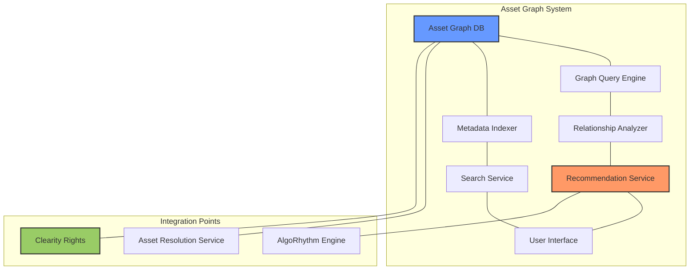

17.9.1.2 Implementation Approach

The Asset Graph System enhances the NNA Framework by implementing a specialized graph database to model and query complex relationships between assets across all layers:

```python
class AssetGraphManager:
    """
    Manages the asset relationship graph for complex queries
    and relationship discovery
    """
    def __init__(self):
        self.graph_db = GraphDatabaseClient()
        self.query_engine = GraphQueryEngine()
        self.relationship_analyzer = RelationshipAnalyzer()
        self.indexer = GraphIndexManager()
        
    async def initialize_graph(self):
        """Initialize the asset graph structure"""
        schema = await self.define_graph_schema()
        indexes = await self.define_graph_indexes()
        
        await self.graph_db.initialize(schema, indexes)
        await self.indexer.start()
        
    async def add_asset_to_graph(self, asset):
        """Add a new asset to the graph with relationships"""
        # Create node for asset
        node_id = await self.graph_db.create_node(
            label="Asset",
            properties={
                "asset_id": asset.id,
                "layer": asset.layer,
                "category": asset.category,
                "subcategory": asset.subcategory,
                "metadata": asset.metadata
            }
        )
        
        # Discover and create relationships
        relationships = await self.relationship_analyzer.discover_relationships(asset)
        
        for relationship in relationships:
            await self.graph_db.create_relationship(
                from_node=node_id,
                to_node=relationship.target_id,
                type=relationship.type,
                properties=relationship.properties
            )
            
        # Index asset for search
        await self.indexer.index_asset(asset, node_id)
        
        return node_id
    
    async def find_related_assets(self, asset_id, relationship_types=None, max_depth=2):
        """Find assets related to the specified asset"""
        query = self.query_engine.build_relationship_query(
            start_asset_id=asset_id,
            relationship_types=relationship_types,
            max_depth=max_depth
        )
        
        return await self.graph_db.execute_query(query)
    
    async def find_composition_paths(self, source_asset_id, target_asset_id):
        """Find possible paths to combine two assets"""
        query = self.query_engine.build_path_query(
            source_asset_id=source_asset_id,
            target_asset_id=target_asset_id
        )
        
        return await self.graph_db.execute_query(query)
```

17.9.1.3 Key Benefits

1. **Enhanced Asset Discovery**: Graph-based relationships enable sophisticated asset discovery beyond simple metadata.
1. **Intelligent Composition**: Find optimal paths to combine assets across layers based on relationship strength.
1. **Impact Analysis**: Quickly identify assets affected by changes to a single asset.
1. **Relationship Mining**: Automatically discover new relationships based on usage patterns.
1. **Performance Optimization**: Specialized graph queries outperform traditional relational queries for relationship traversal.

### 17.9.2 Real-time Collaborative Editing

### 17.9.2.1 Collaborative Architecture

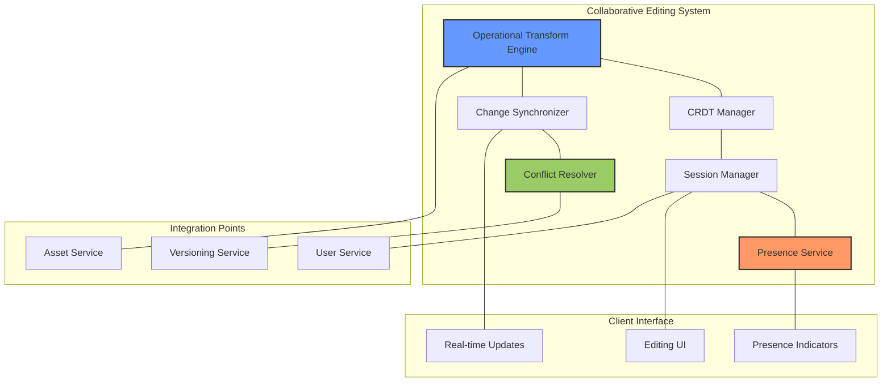

### 17.9.2.2 Implementation Approach

```typescript
class CollaborativeEditingSystem {
    private otEngine: OperationalTransformEngine;
    private crdtManager: CRDTManager;
    private sessionManager: SessionManager;
    private presenceService: PresenceService;
    private changeSynchronizer: ChangeSynchronizer;
    private conflictResolver: ConflictResolver;
    private assetService: AssetService;
    
    constructor() {
        this.otEngine = new OperationalTransformEngine();
        this.crdtManager = new CRDTManager();
        this.sessionManager = new SessionManager();
        this.presenceService = new PresenceService();
        this.changeSynchronizer = new ChangeSynchronizer();
        this.conflictResolver = new ConflictResolver();
        this.assetService = new AssetService();
    }
    
    async initializeEditingSession(assetId: string, userId: string): Promise<EditingSession> {
        // Create or join an editing session
        const session = await this.sessionManager.createOrJoinSession(assetId, userId);
        
        // Initialize CRDT state
        const state = await this.crdtManager.initializeState(assetId, session.id);
        
        // Register user presence
        await this.presenceService.registerPresence(session.id, userId, {
            cursor: { x: 0, y: 0 },
            selection: null,
            lastActive: Date.now()
        });
        
        // Subscribe to changes
        const changeStream = await this.changeSynchronizer.subscribeToChanges(session.id);
        
        return {
            sessionId: session.id,
            initialState: state,
            participants: session.participants,
            changeStream
        };
    }
    
    async applyChange(sessionId: string, userId: string, change: EditChange): Promise<ChangeResult> {
        // Update user presence
        await this.presenceService.updatePresence(sessionId, userId, {
            lastActive: Date.now(),
            cursor: change.cursor,
            selection: change.selection
        });
        
        // Validate change for new layers
        if (change.operations && change.operations.layer) {
            const layer = change.operations.layer;
            const assetId = change.operations.assetId;
            if (assetId) {
                const asset = await this.assetService.getAsset(assetId);
                if (layer === "A" && !change.operations.dependencies?.includes("star")) {
                    throw new Error("Augmented Reality layer requires a Star layer");
                }
                if (layer === "X" && !change.operations.dependencies?.includes("song")) {
                    throw new Error("Text layer requires a Song layer for timing");
                }
                if (layer === "M" && change.operations.metadata?.Tutorial_Link) {
                    // Validate tutorial link
                    if (!this.isValidUrl(change.operations.metadata.Tutorial_Link)) {
                        throw new Error("Invalid Tutorial_Link for Moves layer");
                    }
                }
            }
        }
        
        // Process change based on type
        let processedChange;
        if (change.type === 'ot') {
            // Handle operational transform
            processedChange = await this.otEngine.processChange(
                sessionId, userId, change.operations
            );
        } else if (change.type === 'crdt') {
            // Handle CRDT change
            processedChange = await this.crdtManager.applyChange(
                sessionId, userId, change.operations
            );
        } else {
            throw new Error(`Unsupported change type: ${change.type}`);
        }
        
        // Synchronize change to other participants
        await this.changeSynchronizer.broadcastChange(
            sessionId, userId, processedChange
        );
        
        // Check for conflicts
        const conflicts = await this.conflictResolver.checkForConflicts(
            sessionId, processedChange
        );
        
        return {
            applied: true,
            change: processedChange,
            conflicts
        };
    }
    
    async saveEditingSession(sessionId: string, metadata: SessionMetadata): Promise<SaveResult> {
        // Finalize changes
        const finalState = await this.crdtManager.getFinalState(sessionId);
        
        // Ensure metadata for new layers is preserved
        const enrichedMetadata = { ...metadata };
        if (finalState.components) {
            for (const [layer, assetId] of Object.entries(finalState.components)) {
                if (assetId) {
                    const asset = await this.assetService.getAsset(assetId);
                    if (layer === "M") {
                        enrichedMetadata[layer] = {
                            Movement_Speed: asset.metadata.Movement_Speed,
                            Cultural_Origin: asset.metadata.Cultural_Origin,
                            Tutorial_Link: asset.metadata.Tutorial_Link
                        };
                    } else if (layer === "X") {
                        enrichedMetadata[layer] = {
                            Font_Style: asset.metadata.Font_Style
                        };
                    }
                }
            }
        }
        
        // Create new asset version
        const versionResult = await this.assetService.createVersion(
            metadata.assetId,
            finalState,
            {
                sessionId,
                participants: await this.sessionManager.getParticipants(sessionId),
                changeHistory: await this.changeSynchronizer.getChangeHistory(sessionId),
                metadata: enrichedMetadata
            }
        );
        
        // Close editing session
        await this.sessionManager.closeSession(sessionId);
        
        return {
            success: true,
            versionId: versionResult.versionId,
            assetId: metadata.assetId
        };
    }

    private isValidUrl(url: string): boolean {
        try {
            new URL(url);
            return true;
        } catch {
            return false;
        }
    }
```

### 17.9.2.3 Key Benefits

1. **Real-time Collaboration**: Multiple users can edit the same assets simultaneously without conflicts.
1. **Presence Awareness**: See who's working on what in real-time with cursor positions and selections.
1. **Conflict Resolution**: Automatic resolution of editing conflicts through CRDT or OT algorithms.
1. **Offline Support**: Continue editing without connectivity and synchronize when reconnected.
1. **Advanced Versioning**: Detailed change history with attribution and rollback capabilities.

### 17.9.3 Federated Platform Implementation

### 17.9.3.1 Federated Architecture

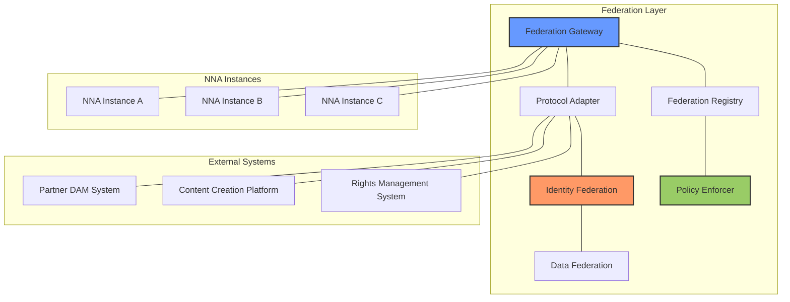

### 17.9.3.2 Implementation Approach

```python
class FederationService:
    """
    Implements federation capabilities to enable cross-instance
    asset sharing, discovery, and composition
    """
    def __init__(self):
        self.gateway = FederationGateway()
        self.adapter = ProtocolAdapter()
        self.identity_service = IdentityFederationService()
        self.data_federation = DataFederationService()
        self.registry = FederationRegistry()
        self.policy_enforcer = PolicyEnforcer()
        
    async def initialize_federation(self, config):
        """Initialize the federation system"""
        # Initialize core components
        await self.gateway.initialize(config.gateway)
        await self.adapter.initialize(config.adapters)
        await self.identity_service.initialize(config.identity)
        await self.data_federation.initialize(config.data)
        
        # Load registry with federated instances
        await self.registry.initialize(config.instances)
        
        # Configure policy enforcement
        await self.policy_enforcer.initialize(config.policies)
        
    async def register_instance(self, instance_info):
        """Register a new federated instance"""
        # Validate federation requirements
        await self.validate_federation_requirements(instance_info)
        
        # Register the instance
        instance = await self.registry.register_instance(instance_info)
        
        # Exchange identity certificates
        await self.identity_service.exchange_certificates(instance)
        
        # Initialize data sharing agreements
        await self.data_federation.initialize_sharing(instance)
        
        # Set up protocol adapters
        await self.adapter.configure_instance(instance)
        
        return instance
    
    async def discover_federated_assets(self, query, context):
        """Discover assets across federated instances"""
        # Validate federation query permissions
        await self.policy_enforcer.validate_query(query, context)
        
        # Get relevant instances
        instances = await self.registry.get_instances_for_query(query)
        
        # Execute federated query
        results = []
        for instance in instances:
            # Adapt query to instance protocol
            adapted_query = await self.adapter.adapt_query(query, instance)
            
            # Execute query on instance
            instance_results = await self.gateway.execute_query(
                instance, adapted_query, context
            )
            
            # Normalize results
            normalized_results = await self.normalize_results(
                instance_results, instance
            )
            
            results.extend(normalized_results)
            
        # Apply federation policies
        filtered_results = await self.policy_enforcer.filter_results(
            results, context
        )
        
        return filtered_results
    
    async def resolve_federated_asset(self, federated_id, context):
        """Resolve a federated asset"""
        # Parse federated ID
        instance_id, asset_id = self.parse_federated_id(federated_id)
        
        # Get instance info
        instance = await self.registry.get_instance(instance_id)
        
        # Check access rights
        await self.policy_enforcer.check_asset_access(
            instance, asset_id, context
        )
        
        # Resolve asset
        asset = await self.gateway.resolve_asset(
            instance, asset_id, context
        )
        
        # Transform to local format
        return await self.adapter.transform_asset(asset, instance)
    
    async def create_cross_instance_composition(self, composition, context):
        """Create a composition using assets from multiple instances"""
        # Analyze composition requirements
        requirements = await self.analyze_composition_requirements(composition)
        
        # Check federation policies
        await self.policy_enforcer.validate_composition(
            composition, requirements, context
        )
        
        # Resolve all assets
        assets = {}
        for asset_ref in composition.asset_refs:
            assets[asset_ref.id] = await self.resolve_federated_asset(
                asset_ref.federated_id, context
            )
            
        # Create composition
        return await self.create_composition_with_assets(
            composition, assets, context
        )
```

### 17.9.3.3 Key Benefits

1. **Extended Asset Ecosystem**: Access and compose assets across multiple NNA instances and partner systems.
1. **Organizational Boundaries**: Maintain organizational separation while enabling cross-organization collaboration.
1. **Rights Management**: Cross-instance rights verification and enforcement.
1. **Identity Federation**: Single sign-on across federated instances.
1. **Distributed Composition**: Create compositions using assets from multiple sources while tracking provenance.

### 17.9.4 Blockchain-based Rights Management

### 17.9.4.1 Blockchain Architecture

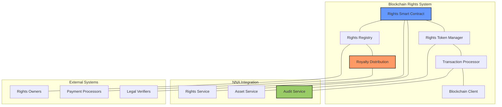

### 17.9.4.2 Implementation Approach

```typescript
class BlockchainRightsManager {
    private smartContract: RightsSmartContract;
    private tokenManager: RightsTokenManager;
    private transactionProcessor: TransactionProcessor;
    private blockchainClient: BlockchainClient;
    private rightsRegistry: RightsRegistry;
    private royaltyDistributor: RoyaltyDistributor;
    
    constructor() {
        this.smartContract = new RightsSmartContract();
        this.tokenManager = new RightsTokenManager();
        this.transactionProcessor = new TransactionProcessor();
        this.blockchainClient = new BlockchainClient();
        this.rightsRegistry = new RightsRegistry();
        this.royaltyDistributor = new RoyaltyDistributor();
    }
    
    async initializeBlockchainRights(config: BlockchainConfig): Promise<void> {
        // Initialize blockchain connection
        await this.blockchainClient.initialize(config.blockchain);
        
        // Initialize smart contract
        await this.smartContract.initialize(
            this.blockchainClient,
            config.contractAddress
        );
        
        // Initialize token manager
        await this.tokenManager.initialize(
            this.smartContract,
            config.tokenConfig
        );
        
        // Initialize rights registry
        await this.rightsRegistry.initialize(
            this.smartContract,
            config.registryConfig
        );
        
        // Initialize royalty distributor
        await this.royaltyDistributor.initialize(
            this.smartContract,
            config.royaltyConfig
        );
    }
    
    async registerAssetRights(
        assetId: string,
        rightsData: RightsData,
        ownerWallet: string
    ): Promise<RightsRegistrationResult> {
        // Validate rights data
        const validationResult = await this.validateRightsData(rightsData);
        if (!validationResult.valid) {
            throw new Error(`Invalid rights data: ${validationResult.error}`);
        }
        
        // Prepare transaction
        const transaction = await this.transactionProcessor.prepareTransaction(
            'registerRights',
            {
                assetId,
                rightsData: this.formatRightsForBlockchain(rightsData),
                ownerWallet
            }
        );
        
        // Submit transaction
        const transactionResult = await this.blockchainClient.submitTransaction(
            transaction,
            { from: ownerWallet }
        );
        
        // Wait for confirmation
        await this.blockchainClient.waitForConfirmation(
            transactionResult.transactionHash
        );
        
        // Mint rights token
        const tokenId = await this.tokenManager.mintRightsToken(
            assetId,
            ownerWallet,
            rightsData
        );
        
        // Update rights registry
        await this.rightsRegistry.registerRights(
            assetId,
            tokenId,
            rightsData,
            transactionResult.transactionHash
        );
        
        return {
            assetId,
            tokenId,
            transactionHash: transactionResult.transactionHash,
            blockNumber: transactionResult.blockNumber,
            timestamp: new Date().toISOString()
        };
    }
    
    async verifyRights(
        assetId: string,
        usageContext: UsageContext
    ): Promise<RightsVerificationResult> {
        // Get rights data from registry
        const rightsData = await this.rightsRegistry.getRightsData(assetId);
        if (!rightsData) {
            return {
                verified: false,
                reason: 'No rights data found for asset'
            };
        }
        
        // Verify on blockchain
        const verificationTx = await this.transactionProcessor.prepareTransaction(
            'verifyRights',
            {
                assetId,
                usageType: usageContext.usageType,
                territory: usageContext.territory,
                licensee: usageContext.userId
            }
        );
        
        const verificationResult = await this.blockchainClient.callReadMethod(
            verificationTx
        );
        
        if (!verificationResult.verified) {
            return {
                verified: false,
                reason: verificationResult.reason
            };
        }
        
        // Record usage
        await this.recordRightsUsage(
            assetId,
            usageContext
        );
        
        return {
            verified: true,
            rightsType: rightsData.rightsType,
            restrictions: rightsData.restrictions,
            expiration: rightsData.expiration,
            proofOfRights: {
                tokenId: rightsData.tokenId,
                transactionHash: verificationResult.transactionHash,
                blockNumber: verificationResult.blockNumber,
                timestamp: new Date().toISOString()
            }
        };
    }
    
    async recordRightsUsage(
        assetId: string,
        usageContext: UsageContext
    ): Promise<UsageRecordResult> {
        // Record usage transaction
        const usageTx = await this.transactionProcessor.prepareTransaction(
            'recordUsage',
            {
                assetId,
                usageType: usageContext.usageType,
                territory: usageContext.territory,
                licensee: usageContext.userId,
                timestamp: new Date().toISOString()
            }
        );
        
        const usageResult = await this.blockchainClient.submitTransaction(
            usageTx,
            { from: this.blockchainClient.systemAccount }
        );
        
        // Calculate royalties
        const royaltyAmounts = await this.royaltyDistributor.calculateRoyalties(
            assetId,
            usageContext
        );
        
        // Distribute royalties
        if (royaltyAmounts.total > 0) {
            await this.royaltyDistributor.distributeRoyalties(
                assetId,
                royaltyAmounts,
                usageResult.transactionHash
            );
        }
        
        return {
            usageId: usageResult.events.UsageRecorded.returnValues.usageId,
            transactionHash: usageResult.transactionHash,
            royaltyAmounts
        };
    }
}
```

### 17.9.4.3 Key Benefits

1. **Immutable Rights Record**: Tamper-proof record of rights ownership and grants.
1. **Transparent Usage Tracking**: Auditable history of asset usage.
1. **Automated Royalty Distribution**: Smart contract-based royalty calculations and distribution.
1. **Rights Tokenization**: Representation of rights as transferable NFTs.
1. **Decentralized Verification**: Trustless verification of rights without central authority.

These architectural enhancements represent a forward-looking evolution strategy for the NNA Framework, ensuring it remains at the forefront of digital asset management technology while maintaining its core principles of performance, scalability, and flexibility. These advanced architectural enhancements build upon the core NNA Framework to add sophisticated capabilities addressing complex requirements in asset management, collaboration, cross-organization cooperation, and rights management. Each enhancement maintains compatibility with the core framework while extending its capabilities in specific domains.

## 17.10 AI-Assisted Development Guidelines

The NNA Framework development process leverages AI tools to accelerate implementation while maintaining code quality and consistency. This section provides guidelines for effectively using AI assistants in the development workflow.

### 17.10.1 Supported AI Tools

| **Tool** | **Primary Use Cases** | **Strengths** | **Limitations** |
| --- | --- | --- | --- |
| **Claude** | Architecture reviews, documentation generation, test case generation | Comprehensive context understanding, detailed explanations, security-aware | May produce verbose explanations, requires specific prompting for code generation |
| **Grok 3** | Code reviews, security analysis, performance optimization suggestions | Strong technical reasoning, identifies edge cases, efficient code suggestions | Less strong on documentation generation, may miss business context |
| **Cursor** | Real-time coding assistance, code completion, refactoring | In-editor integration, language-specific optimizations, immediate feedback | Requires human verification, may not understand full system context |

### 17.10.2 AI-Assisted Development Workflow

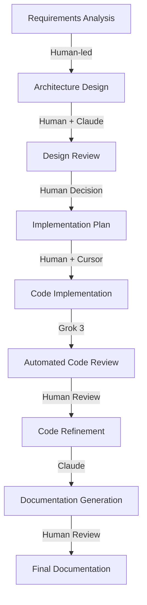

### 17.10.3 Best Practices for AI-Assisted Development

1. **Clear Requirements First**: Always start with clear, well-defined requirements before engaging AI tools.
1. **Human Review Required**: All AI-generated code and documentation must be reviewed by a human developer before submission.
1. **Contextual Prompting**: Provide AI with sufficient context about the NNA Framework architecture and requirements.
1. **Verification Testing**: Run comprehensive tests on AI-generated code, particularly focusing on edge cases.
1. **Iterative Refinement**: Use AI tools in iterative cycles, refining the output with each iteration.
1. **Documentation Linking**: Ensure AI-generated documentation properly cross-references existing documentation.
1. **Security Validation**: Have all AI-generated code specifically reviewed for security vulnerabilities.

### 17.10.4 Implementation Examples

1. **Architecture Review with Claude**

```
Prompt: "Review this NNA Framework caching design for potential issues:
{detailed description of caching system}. Specifically consider:
1. Cache consistency issues
2. Performance bottlenecks
3. Failure recovery
4. Edge cases"
```

1. **Code Generation with Cursor**
1. The AI response should be evaluated by a senior engineer before incorporation into the design. 
1. For generating a new API endpoint implementation:
- Define the endpoint interface and requirements
- Use Cursor to scaffold the implementation
- Review the generated code for:
    - Error handling completeness
    - Security vulnerabilities
    - Performance considerations
    - Adherence to NNA Framework patterns
1. **Documentation Generation with Claude**

```
Prompt: "Based on this API implementation: {code}, generate:
1. API documentation following our standard format
2. Usage examples for JavaScript and Python SDKs
3. Error handling guidance
4. Performance considerations"
```

The generated documentation should be reviewed for accuracy and completeness before inclusion in the official documentation.

### 17.10.5 Quality Control

To maintain high quality standards when using AI-assisted development:

1. **Establish Baselines**: Define quality baselines for AI-generated content
1. **Pair Programming**: Use AI in pair programming sessions when implementing complex features
1. **Code Review Checklist**: Follow a specific checklist for reviewing AI-generated code
1. **Training Sessions**: Conduct regular training sessions on effective AI tool usage
1. **Pattern Library**: Maintain a library of successful AI prompts and patterns

By following these guidelines, the NNA Framework development process can leverage AI tools to accelerate development while maintaining high quality standards.

# 18. Technical Glossary

- **TSW**: Taylor Swift Works, category code (e.g., G.003.TSW.001.mp3.v1).
- **XRI**: eXtensible Resource Identifier, addressing protocol.
- **RBAC**: Role-Based Access Control, permission management.
- **Event-Based Invalidation**: Cache clearing on updates (see 3.2.1).
- **Audio Effects (E) Layer**: A layer for audio enhancements, including voice modulation and sound effects.
- **Transitions (N) Layer**: A layer for visual, audio, and scene transitions, enabling seamless remixing.
- **Augmented Reality (A) Layer**: A layer for AR elements like face filters and stickers.
- **Filters (F) Layer**: A layer for visual filters such as color grading and cinematic effects.
- **Text (X) Layer**: A layer for text overlays, including lyrics, captions, and watermarks.
- **Biomechanical Tagging**: Metadata tagging for dance movements in the Moves (M) layer, capturing properties like `Movement_Speed` and `Energy_Level`.
- **Tutorial Videos**: Video content linked to Moves (M) layer assets via `Tutorial_Link`, providing instructional guidance for dance movements.


---
