## An internet-scale Digital Asset Management system for AI-Powered Video Remixing

**Document Version**: 1.0.4

**Last Updated**: April 5, 2025

**Previous Update**: March 25, 2025

**Status**: Published Draft


### ChangeLog

- **Updated Document Purpose**: Expanded to include support for ReViz’s enhanced requirements for branded content and personalization.
- **Updated Section 1.1 Core Innovation**: Added details on the Branded (B) and Personalize (P) layers, including their integration with the NNA addressing scheme.
- **Updated Section 1.3.2 Core Layer Integration**: Expanded layer definitions to include Branded (B) and Personalize (P) layers, with updated dependencies.
- **New Section 1.3.3 Metadata Structure**: Added a new subsection to detail the enhanced metadata structure, including fields like Training_Set_ID, Source, Target_Asset, Premium, Tags, Provenance, and Rights_Split.
- **Updated Section 2.3.2 Layer Configuration**: Revised to include Branded (B), Personalize (P), Training_Data (T), Composites (C), and Rights (R) layers, with updated naming conventions and examples.
- **Updated Section 3.2.1 Layer Structure**: Expanded the layer table to include Branded (B) and Personalize (P) layers, with updated purposes and dependencies.
- **Updated Section 3.2.2 Layer Implementation**: Added TypeScript interfaces for Branded (B) and Personalize (P) layers, including metadata fields.
- **New Section 3.2.4 On-Device Processing**: Added a new subsection to describe on-device processing for personalization, focusing on privacy and edge inferencing.
- **Updated Section 6.6 Feature Matrix**: Expanded the feature matrix to include Branded (B) and Personalize (P) layers, with updated capabilities.
- **Updated Section 7.6 ReViz: Music Video Remix**: Revised the example to include Branded (B) and Personalize (P) layers, with updated composite naming and metadata.
- **Updated Section 11 Glossary of Terms**: Added definitions for Branded (B) Layer, Personalize (P) Layer, Training_Set, Premium, and Edge Inferencing.
- **Updated Section 1.3.3 Metadata Structure**: Expanded the Moves layer metadata to include biomechanical, cultural, and instructional fields (e.g., Movement_Speed, Cultural_Origin, Tutorial_Link).
- **Updated Section 3.2.1 Layer Structure**: Updated the Moves (M) layer purpose to reflect biomechanical and cultural classifications.
- **Updated Section 7.6 ReViz: Music Video Remix**: Updated the example remix to use a Moves asset from the Social_Media_Trending category (Woah dance) with biomechanical metadata.

**Previous Versions**:

- **Version 1.0.3** - March 25, 2025
    - Initial release of the NNA Framework Whitepaper with core architecture, integration details, and use cases.
- **Version 1.0.2** - February 22, 2025
    - Minor updates to performance metrics and implementation guidelines.

## Document Purpose

This whitepaper describes the ReViz Naming, Numbering, and Addressing (NNA) Framework, a breakthrough system for managing digital assets in AI-powered video generation and remixing platforms. The NNA Framework has been enhanced to support ReViz’s requirements, including the integration of branded content through the Branded (B) layer, user personalization via the Personalize (P) layer, training datasets for AI models (T layer), and advanced video editing capabilities through new layers like Audio Effects (E), Transitions (N), Augmented Reality (A), Filters (F), and Text (X). The Moves (M) layer now includes biomechanical and cultural classifications to enhance dance movement recommendations and user learning. The framework provides a scalable, performant, and interoperable solution for asset management, rights tracking, and on-device processing, ensuring seamless integration with AlgoRhythm (AI recommendations) and Clearity (rights management).

## Target Audience

- System architects
- Product managers
- Technical decision makers
- Integration partners

## Related Documents:

1. [ReViz NNA Framework WhitePaper](https://celerity.slab.com/posts/nna-framework-whitepaper-0jsj4gsl)
    - System architecture overview
    - Core concepts and principles
1. [NNA Framework API Specification](https://celerity.slab.com/posts/nna-framework-api-specification-1fupkzwa)
    - Detailed API documentation
    - Integration guidelines
1. [NNA Framework Implementation](https://celerity.slab.com/posts/nna-framework-technical-implementation-xfxe04qg)
    - Technical implementation details
    - Best practices and examples
1. [ALGORHYTHM AI-Recommendation Engine](https://celerity.slab.com/posts/a-l-g-o-r-h-y-t-h-m-4w561767)
    - AI/ML integration points
    - Performance optimization
1. [CLEARITY Rights Management](https://celerity.slab.com/posts/clearity-rights-clearance-platform-8ft1v300)
    - Rights management integration
    - Compliance requirements

##  Table of Contents

1. [Executive Summary](https://celerity.slab.com/posts/nna-framework-whitepaper-0jsj4gsl#ha6cb-1-executive-summary)
1. [Introduction](https://celerity.slab.com/posts/nna-framework-whitepaper-0jsj4gsl#hewv8-2-introduction)
1. [System Architecture](https://celerity.slab.com/posts/nna-framework-whitepaper-0jsj4gsl#hqh5z-3-system-architecture)
1. [Integration Architecture](https://celerity.slab.com/posts/nna-framework-whitepaper-0jsj4gsl#h5dui-4-integration-architecture)
1. [Implementation Guide](https://celerity.slab.com/posts/nna-framework-whitepaper-0jsj4gsl#hraaw-5-system-architecture-diagrams)
1. [Core Benefits](https://celerity.slab.com/posts/nna-framework-whitepaper-0jsj4gsl#hm219-6-core-benefits)
1. [Use Cases](https://celerity.slab.com/posts/nna-framework-whitepaper-0jsj4gsl#h0eol-7-use-cases)
1. [Future Directions](https://celerity.slab.com/posts/nna-framework-whitepaper-0jsj4gsl#henfv-8-future-directions)
1. [Implementation Strategy](https://celerity.slab.com/posts/nna-framework-whitepaper-0jsj4gsl#hai6v-9-implementation-strategy)
1. [Documentation Standards](https://celerity.slab.com/posts/nna-framework-whitepaper-0jsj4gsl#hu8r0-10-documentation-standards)
1. [Glossary of Terms](https://celerity.slab.com/posts/nna-framework-whitepaper-0jsj4gsl#h0ldi-11-glossary-of-terms)
1. [Cross-Document Index](#12-cross-document-index)

## 1. Executive Summary

The  **Naming, Numbering, and Addressing (NNA) Framework** represents a breakthrough in digital asset management for AI-powered video remixing and content creation platforms. This comprehensive system addresses the growing complexity of managing, tracking, and compositing digital assets in real-time content creation and distribution environments.


The NNA Framework is an open-source digital asset management system designed for AI-powered video remixing. It integrates with[ **AlgoRhythm** ](https://celerity.slab.com/posts/a-l-g-o-r-h-y-t-h-m-4w561767)for AI-based recommendations and [**Clearity**](https://celerity.slab.com/posts/clearity-rights-clearance-platform-8ft1v300) for rights clearance. This ensures seamless asset discovery, composition, monetization, and compliance.

## 1.1 Core Innovation

NNA Framework introduces a unified approach to asset management and seamless integration with AI-powered recommendation engines through three key components:

- A human-readable naming convention that reflects asset relationships and characteristics, now extended to support Branded (B), Personalize (P), Audio Effects (E), Transitions (N), Augmented Reality (A), Filters (F), and Text (X) layers for virtual product placement, user customization, and advanced video editing.
- A systematic numbering scheme that ensures unique identification across distributed systems, including Composites (C) for aggregated assets, Rights (R) for provenance tracking, and an enhanced Moves (M) layer with biomechanical and cultural classifications.
- A hierarchical addressing system that enables efficient asset resolution and relationship tracking, with support for Training_Data (T) sets to facilitate AI model training.

The NNA Framework implements a dual addressing approach:

1. **Human-Friendly Names**: Three-letter alphabetic codes for categories and subcategories, designed for user readability and intuitive understanding (e.g., G.POP.TSW.001 for a Taylor Swift pop song, B.L.GUC.BAG.001 for a Gucci bag in the Look layer, M.017.002.001 for a Woah dance in the Moves layer).
1. **NNA Addresses**: Three-digit numeric codes for efficient machine processing (e.g., G.003.042.001 for the same song).

This approach, similar to how DNS maps domain names to IP addresses, enables both human-centric interaction and machine-efficient processing. New enhancements include:

- **Branded (B) Layer**: Supports virtual product placement with premium assets (e.g., B.L.GUC.BAG.001), marked as Premium: Yes in metadata.
- **Personalize (P) Layer**: Allows user uploads for customization (e.g., P.S.FAC.001 for a face swap), with on-device processing for privacy.
- **Training_Data (T) Layer**: Manages datasets for AI training (e.g., T.P.S.FAC.001.set), ensuring extensibility for user and ReViz-generated data.
- **Audio Effects (E) Layer**: Adds audio enhancements like voice modulation and sound effects (e.g., E.001.002.001 for a Pitch Shift effect).
- **Transitions (N) Layer**: Enables seamless visual and audio transitions (e.g., N.001.002.001 for a Fade transition).
- **Augmented Reality (A) Layer**: Integrates AR elements like face filters and stickers (e.g., A.001.002.001 for a Mask filter).
- **Filters (F) Layer**: Provides visual filters like color grading (e.g., F.001.002.001 for a Warm filter).
- **Text (X) Layer**: Supports text overlays like lyrics and captions (e.g., X.001.001.001 for a Lyrics overlay).
- **Enhanced Moves (M) Layer**: Includes biomechanical and cultural classifications (e.g., Movement_Speed, Cultural_Origin) for better dance movement recommendations.
- **Metadata Enhancements**: Includes fields like Training_Set_ID, Source ("ReViz", "User", "Brand"), Target_Asset, Premium, Tags, Provenance, Rights_Split, Popularity_Score, Social_Media_Format, and layer-specific fields like Movement_Speed for Moves.

The NNA Framework is tightly integrated with [**AlgoRhythm**](https://celerity.slab.com/posts/a-l-g-o-r-h-y-t-h-m-4w561767), ReViz's AI recommendation engine. While AlgoRhythm provides the intelligence for asset selection and compatibility analysis, the NNA Framework provides the foundational infrastructure for asset and rights management, addressing, and relationships.

For details on the recommendation engine, refer to [AlgoRhythm’s AI Integration](#algorhythm-ai-integration).

## 1.2 Future-Ready Design

The NNA Framework is designed for extensibility and growth:

- Support for emerging asset types
- Integration with new AI technologies
- Cross-platform compatibility
- Blockchain/Web3 readiness
- Extended reality (XR) support
- Digital Rights Clearance platforms

## 1.3 Core Features and Benefits

The NNA Framework integrates with [**AlgoRhythm**](https://celerity.slab.com/posts/a-l-g-o-r-h-y-t-h-m-4w561767)**,** an AI-powered recommendation system that evaluates NNA-layered assets for optimal selection, ensuring seamless compatibility and remix potential. This evaluation of  NNA-layered assets ensures optimal selection based on compatibility scores, historical user engagement, and AI-driven pattern recognition. Each NNA layer—Song, Star, Look, Moves, World, and Vibe—is analyzed for content alignment and remix potential.

In summary,it provides:The NNA Framework provides a unified platform for asset management and remixing, with key capabilities including:

### 1.3.1 Core Capabilities

- Asset resolution with sub-20ms latency
- AI-powered compatibility analysis (via AlgoRhythm’s two-tower model, see [AlgoRhythm, Section 5.1](https://algorhythm.md#section-5.1))
- Real-time preview generation
- Automated rights management (via Clearity, see [Clearity, Section 3](https://clearity.md#section-3))
- Performance-optimized processing

### 1.3.2 Core Layer Integration

Each layer in the NNA Framework serves a specific purpose, now expanded to include new layers for enhanced video remixing capabilities:

| **Layer** | **Code** | **Purpose** | **Primary Dependencies** |
| --- | --- | --- | --- |
| Song | G | Music tracks & audio | None |
| Star | S | Performance avatars | Song |
| Look | L | Costumes & styling | Star |
| Moves | M | Choreography with biomechanical and cultural classifications | Star |
| World | W | Environments | Independent |
| Vibe | V | Mood & effects | All layers |
| Branded | B | Virtual product placement (e.g., branded outfits, accessories, moves, sponsored stages, events) | Star, Look, Moves, World |
| Personalize | P | User-uploaded customizations (e.g., face, voice, dress, dance, stage) | Star, Look, Moves, World |
| Training_Data | T | Datasets for AI training | All layers |
| Composites | C | Aggregated multi-layer assets | All layers |
| Rights | R | Provenance and rights tracking | All layers |
| Audio Effects | E | Audio enhancements (e.g., voice modulation, sound effects, ambience) | Song, Star, Personalize |
| Transitions | N | Visual, audio, and scene transitions for seamless remixing | All layers |
| Augmented Reality | A | AR elements (e.g., face filters, stickers, background overlays) | Star, Look, World, Personalize |
| Filters | F | Visual filters (e.g., color grading, cinematic effects) | Star, Look, World |
| Text | X | Text overlays (e.g., lyrics, captions, watermarks) | All layers |

This structured approach ensures that content creators receive optimized, data-driven recommendations with minimal manual effort, while supporting branded content, user personalization, and advanced video editing capabilities.

### 1.3.3 Metadata Structure

The NNA Framework includes an enhanced metadata structure to support asset tracking, recommendations, rights management, and advanced video editing. Each asset includes the following metadata fields, with layer-specific fields applied as needed (e.g., Moves layer includes biomechanical data):

| **Field** | **Description** | **Example** |
| --- | --- | --- |
| Training_Set_ID | Links to the training dataset used for AI processing | T.P.S.FAC.001.set |
| Source | Origin of the asset | "ReViz", "User", "Brand" |
| Target_Asset | The asset being customized or referenced | S.POP.PNK.001 |
| Premium | Indicates if the asset is premium (branded) | "Yes" for B.L.GUC.BAG.001 |
| Tags | Keywords for AlgoRhythm recommendations | "Pop", "Dance", "Gucci" |
| Provenance | Tracks the asset’s origin and transformations | "Created by ReViz, remixed by User123" |
| Rights_Split | Revenue distribution for monetization | "IP Holders: 25%, ReViz: 25%, Remixer: 50%" |
| Popularity_Score | Numerical rating (0-100) based on views, likes, shares | 85 |
| Trending_Factor | Growth rate of asset usage over time | 2.5% daily increase |
| Engagement_Rate | Percentage of users who interact after viewing | 65% |
| Creator_Boost | Engagement multiplier when used by verified creators | 1.2x |
| Version | Asset version | "v1" |
| Deprecated | Boolean indicating if asset is deprecated | false |
| Replacement | Reference to replacement asset if deprecated | "G.016.004" |
| License_Expiration | Date when branded content licenses expire | "2025-12-31" |
| Seasonal_Relevance | Periods when content is most relevant | "Summer", "Holiday" |
| Content_Rating | Age appropriateness rating | "Everyone" |
| Cultural_Context | Cultural significance or origin | "Festival" |
| Regional_Popularity | Regions where asset is most popular | "US", "JP" |
| Demographic_Appeal | Age groups that engage most | "13-18", "18-24" |
| Festival_Relevance | Associated cultural celebrations | "Diwali", "Carnival" |
| Locale | Geographic area of relevance or origin | "US" |
| Cache_Priority | Priority for caching strategies | "High" |
| File_Size | Size of the asset in MB | 5.2 MB |
| Duration | Length of the asset in seconds (for time-based assets) | 30 |
| Resolution | Visual resolution (for visual assets) | "1920x1080" |
| Social_Media_Format | Platform-specific formatting requirements | TikTok: {"aspect_ratio": "9:16", "max_duration": 60} |
| Export_Settings | Platform-specific export settings | TikTok: {"format": "mp4", "bitrate": "high"} |
| Hashtags_Suggested | Suggested hashtags for social sharing | "#ReVizRemix", "#GucciStyle" |

**Layer-Specific Metadata (Example for Moves Layer):**

For the Moves (M) layer, additional metadata fields provide biomechanical, cultural, and instructional details to enhance AI recommendations and user learning:

| **Field** | **Description** | **Example** |
| --- | --- | --- |
| Movement_Speed | Tempo of movement execution | "Fast" |
| Energy_Level | Dynamic quality of movement | "High" |
| Movement_Plane | Primary plane of movement | "Sagittal" |
| Complexity_Level | Technical difficulty | "Intermediate" |
| Primary_Body_Parts | List of primary body parts involved | "Arms", "Legs" |
| Movement_Quality | Character of movement | "Sharp" |
| Weight_Transfer | How weight shifts during movement | "Left to Right" |
| Spatial_Pattern | Movement pattern in space | "Circular" |
| Learning_Difficulty | How challenging to learn (1-5 scale) | 3 |
| Tutorial_Available | Boolean indicating if tutorial is available | true |
| Tutorial_Link | Link to tutorial content for this move | "[https://reviz.co/tutorials/moves/M.001.002.001](https://reviz.co/tutorials/moves/M.001.002.001)" |
| Breakdown_Steps | Array of step-by-step instructions | "Step 1: Position arms", "Step 2: Shift weight" |
| Cultural_Origin | Origin of the dance movement | "African" |
| Historical_Context | Historical background of the movement | "Originated in 1980s hip-hop culture" |
| Associated_Music | Music genres typically associated with this move | "Hip-Hop" |
| Common_Errors | Typical mistakes made when learning this move | "Incorrect weight distribution" |
| Preparation_Moves | Movements that typically precede this one | "M.001.001.001" |
| Follow_Up_Moves | Movements that naturally follow this one | "M.001.003.001" |
| Compatible_Moves | Other moves that blend well with this one | "M.002.001.001" |

This metadata ensures seamless integration with AlgoRhythm for recommendations, Clearity for rights management, and supports ReViz’s monetization model while enhancing user experience through detailed dance movement data.

The NNA Framework includes an enhanced metadata structure to support asset tracking, recommendations, and rights management. Each asset includes the following metadata fields:

| **Field** | **Description** | **Example** |
| --- | --- | --- |
| Training_Set_ID | Links to the training dataset used for AI processing | T.P.S.FAC.001.set |
| Source | Origin of the asset | "ReViz", "User", "Brand" |
| Target_Asset | The asset being customized or referenced | S.POP.PNK.001 |
| Premium | Indicates if the asset is premium (branded) | "Yes" for B.L.GUC.BAG.001 |
| Tags | Keywords for AlgoRhythm recommendations | "Pop", "Dance", "Gucci" |
| Provenance | Tracks the asset’s origin and transformations | "Created by ReViz, remixed by User123" |
| Rights_Split | Revenue distribution for monetization | "IP Holders: 25%, ReViz: 25%, Remixer: 50%" |

This metadata ensures seamless integration with AlgoRhythm for recommendations and Clearity for rights management, while supporting ReViz’s monetization model.

### 1.3.4 System Benefits

- **Performance**: Sub-20ms asset resolution
- **Scalability**: Support for 10M+ concurrent users
- **Reliability**: 99.999% system availability
- **Efficiency**: 40% lower resource utilization
- **Integration**: Seamless AI recommendation support

## 1.4 System Benefits 

The NNA Framework delivers transformative business value across multiple dimensions:

### 1.4.1 Business Benefits:

    - Accelerated content creation through AI-powered recommendations
    - Reduced technical complexity for creators
    - Automated rights management and tracking
    - Scalable asset management infrastructure

### 1.4.2 Technical Benefits:

    - Sub-20ms asset resolution times
    - 95%+ cache hit rates for popular assets
    - Support for 10M+ concurrent users
    - Real-time composition validation

### 1.4.3 Target Business Impact

    - 70% reduction in asset management overhead
    - 85% faster content creation workflows
    - 60% decrease in rights management complexity
    - 95% automation of compatibility checking

## 1.5 Quick Navigation

This Whitepaper serves multiple stakeholders. Use the links below to jump to sections most relevant to your needs:

- **System Architects**: [Section 3 - System Architecture](#hqh5z-3-system-architecture) for technical overview and design principles.
- **Product Managers**: [Section 6 - Core Benefits](#hm219-6-core-benefits) for business value and feature capabilities.
- **Marketing Teams**: [Section 1 - Executive Summary](#ha6cb-1-executive-summary) for key differentiators and benefits.
- **Integration Partners**: [Section 4 - Integration Architecture](#h5dui-4-integration-architecture) for ecosystem connectivity details.

For practical implementation, see the [Technical Implementation Guide](#link-to-implementation-guide), and for API details, consult the [API Specification](#link-to-api-spec).

## 1.6 Benefits Summary

The NNA Framework delivers transformative value for AI-powered content creation platforms through a comprehensive set of technical and business benefits:

### Technical Excellence

- **Unmatched Performance**: 90% faster asset resolution (<20ms) compared to traditional DAM systems (200ms+)
- **Intelligent Caching**: Multi-tier caching achieves 95%+ hit rates through predictive warming and smart invalidation
- **Massive Scalability**: Supports 10M+ concurrent users and 100M+ daily requests with minimal infrastructure footprint
- **Resource Efficiency**: 40% lower compute and storage requirements through optimized asset delivery
- **Reliability**: 99.999% uptime through redundant architecture and automated recovery mechanisms

### Business Impact

- **Accelerated Content Creation**: 85% reduction in workflow time through AI-powered asset recommendations
- **Streamlined Rights Management**: Automated clearance reduces compliance overhead by 60%
- **Cost Optimization**: Infrastructure savings of 40% through intelligent resource allocation
- **Rapid Deployment**: Implementation in weeks rather than months through standardized APIs and SDKs
- **Future-Proof Design**: Extensible architecture accommodating emerging technologies (XR, real-time rendering)

### Quantifiable Results

| **Metric** | **Before NNA** | **With NNA** | **Target Improvement** |
| --- | --- | --- | --- |
| Asset Resolution Time | 200ms | <20ms | 90% faster |
| Content Creation Workflow | 4 hours | 35 minutes | 85% faster |
| Infrastructure Costs | Baseline | -40% | 40% savings |
| Cache Hit Rate | 70% | 95%+ | 35% increase |
| Concurrent Users | 100K | 10M+ | 100x capacity |

The NNA Framework's integration with AlgoRhythm (AI recommendations) and Clearity (rights management) creates a unified ecosystem that eliminates traditional bottlenecks in digital content creation while ensuring legal compliance and maximizing creative potential.

For detailed implementation specifications, see the [Technical Implementation Guide](#link-to-implementation-guide) and [API Specification](#link-to-api-spec).

## 1.6 Benefits Summary

The NNA Framework delivers transformative value for AI-powered content creation platforms through a comprehensive set of technical and business benefits:

### Technical Excellence

- **Unmatched Performance**: 90% faster asset resolution (<20ms) compared to traditional DAM systems (200ms+)
- **Intelligent Caching**: Multi-tier caching achieves 95%+ hit rates through predictive warming and smart invalidation
- **Massive Scalability**: Supports 10M+ concurrent users and 100M+ daily requests with minimal infrastructure footprint
- **Resource Efficiency**: 40% lower compute and storage requirements through optimized asset delivery
- **Reliability**: 99.999% uptime through redundant architecture and automated recovery mechanisms

### Business Impact

- **Accelerated Content Creation**: 85% reduction in workflow time through AI-powered asset recommendations
- **Streamlined Rights Management**: Automated clearance reduces compliance overhead by 60%
- **Cost Optimization**: Infrastructure savings of 40% through intelligent resource allocation
- **Rapid Deployment**: Implementation in weeks rather than months through standardized APIs and SDKs
- **Future-Proof Design**: Extensible architecture accommodating emerging technologies (XR, real-time rendering)

### Quantifiable Results

| **Metric** | **Before NNA** | **With NNA** | **Target Improvement** |
| --- | --- | --- | --- |
| Asset Resolution Time | 200ms | <20ms | 90% faster |
| Content Creation Workflow | 4 hours | 35 minutes | 85% faster |
| Infrastructure Costs | Baseline | -40% | 40% savings |
| Cache Hit Rate | 70% | 95%+ | 35% increase |
| Concurrent Users | 100K | 10M+ | 100x capacity |

The NNA Framework's integration with AlgoRhythm (AI recommendations) and Clearity (rights management) creates a unified ecosystem that eliminates traditional bottlenecks in digital content creation while ensuring legal compliance and maximizing creative potential.

This one-stop platform accelerates production, cuts costs, and ensures reliability at scale. For details, see [Section 6 - Core Benefits](#6-core-benefits). For detailed implementation specifications, see the [Technical Implementation Guide](https://nna-technical-implementation-guide.md) and [API Specification](https://nna-framework-api-specification.md).

## 1.7 Getting Started

To begin using the NNA Framework, refer to the [NNA Technical Implementation Guide, Section 1.6 - Quick Start](https://nna-technical-implementation-guide.md#section-1.6-quick-start) for setup instructions and the [NNA Framework API Specification, Section 1.2 - Getting Started](https://nna-framework-api-specification.md#section-1.2-getting-started) for integration details. These resources provide a streamlined path for architects, developers, and integrators to adopt the framework efficiently. **Next Steps**: Architects can deploy a local instance ([Section 1.6](#section-1.6-quick-start)), developers can test endpoints with the SDK ([NNA Framework API Specification, Section 6.3](#section-6.3-sdk-implementation)), and integrators can explore [Section 4 - Integration Architecture](#section-4-integration-architecture).

## 1.8 Visual Summary: NNA Framework at a Glance

This diagram encapsulates the NNA Framework’s core strengths:

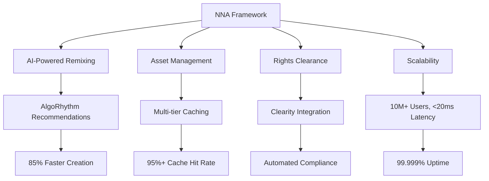
```mermaid
graph TD
    A[NNA Framework] --> B[AI-Powered Remixing]
    A --> C[Asset Management]
    A --> D[Rights Clearance]
    A --> E[Scalability]
    
    B --> F[AlgoRhythm Recommendations]
    C --> G[Multi-tier Caching]
    D --> H[Clearity Integration]
    E --> I[10M+ Users, <20ms Latency]
    
    F --> J[85% Faster Creation]
    G --> K[95%+ Cache Hit Rate]
    H --> L[Automated Compliance]
    I --> M[99.999% Uptime]
```

- **Key Benefits**: 85% faster workflows, 40% lower costs, scalable to millions (see [Section 6 - Core Benefits](#6-core-benefits)).
- **Components**: Integrates AI (AlgoRhythm), caching, and rights management (see [Section 3 - System Architecture](#3-system-architecture)).
- **Use Case**: Enables rapid music video remixing (see [Section 7.6 - ReViz: Music Video Remix](#7-use-cases)).

This visual ties together the framework’s value proposition. Explore detailed sections for implementation and integration specifics.

# 2. Introduction 

The  Naming and Numbering Architecture (NNA) provides a unified framework for managing digital assets across the ReViz platform. This document outlines the core principles, implementation guidelines, and best practices for utilizing the NNA system.

**Key Benefits**

- Standardized asset identification and retrieval
- Scalable organization of multimedia components
- Efficient cross-system integration
- Automated asset relationship management

## 2.1 Background and Challenges

The emergence of AI-powered video remixing platforms has exposed critical gaps in traditional digital asset management (DAM) systems, presenting unprecedented challenges:

- **Asset Complexity**: Multi-layer asset relationships, real-time composition needs, and rights management across derivative works.
- **Technical Limitations**: Traditional DAMs cannot handle layered assets, lack real-time capabilities, and struggle with rights for remixing.
- **Scalability**: Performance demands at internet scale (100M+ daily requests) exceed current systems’ capacity.
- **Integration**: AI model integration, cross-platform compatibility, and distributed asset resolution are unsupported.
- **Content Creation Barriers**: Manual asset discovery, complex rights clearance, limited previews, and inefficient relationship management slow workflows.

The NNA Framework addresses these through a unified naming, numbering, and addressing system inspired by internet infrastructure like DNS and XRI.


### 2.1.1 Layer Configuration

The naming convention balances human readability and machine efficiency. NNA implements a dual addressing system:

1. **Human-Friendly Names**
- **Format:** `[Layer].[CategoryCode].[SubCategoryCode].[Sequential]` 
- **Example:** `G.POP.TSW.001` (Song layer, Pop category, Taylor Swift Works subcategory, first asset)
1. **NNA Addresses**
- **Format:** `[Layer].[CategoryNum].[SubCategoryNum].[Sequential]` 
- **Example:** `G.003.042.001` (Song layer, category 003, subcategory 042, first asset)

The registry maintains a 1:1 mapping between Human-Friendly Names and NNA Addresses, with each three-letter code mapped to a unique three-digit numeric code. This system supports up to 1,000 registered codes per category and subcategory in its initial implementation (v1), with provisions for expansion to support additional codes in future versions if needed.

## 2.2 Problem Statement

Modern content creation platforms face several critical challenges that traditional asset management systems cannot address:

### 2.2.1 Technical Challenges

- Multi-layer asset relationships requiring real-time composition
- Complex rights management across derivative works
- Performance demands at internet scale (100M+ daily requests)
- Real-time preview generation requirements

### 2.2.2 Integration Challenges

- AI model integration for content recommendations
- Cross-platform compatibility requirements
- Rights clearance automation
- Distributed asset resolution

### 2.2.3 Scalability Challenges

- Handling complex relationship queries
- Managing distributed cache consistency
- Supporting concurrent content creation
- Maintaining sub-20ms response times at scale

### 2.2.4 Content Creation Barriers

- Manual asset discovery and compatibility checking
- Complex rights clearance processes
- Limited real-time preview capabilities
- Inefficient asset relationship management

## 2.3 NNA Framework Foundation

The NNA Framework addresses these through a unified naming, numbering, and addressing system inspired by proven internet infrastructure like DNS and XRI. It provides a unified solution for naming, numbering, and addressing digital assets, the framework enables efficient asset management while supporting the dynamic needs of AI-powered content creation.

- Internet's [Domain Naming System](https://en.wikipedia.org/w/index.php?title=Domain_Name_System&t=)
- ITU's [Network and Network Architecture for Autonomous Networks](https://www.ietf.org/lib/dt/documents/LIAISON/liaison-2023-11-09-itu-t-sg-13-ietf-ls-on-the-consent-of-draft-new-recommendation-itu-t-y3061-ex-yan-arch-fw-autonomous-networks-architecture-fr-attachment-1.pdf?t)
- ITU's [Next-Generation Network Architecture](https://www.ietf.org/lib/dt/documents/LIAISON/liaison-2023-11-09-itu-t-sg-13-ietf-ls-on-the-consent-of-draft-new-recommendation-itu-t-y3061-ex-yan-arch-fw-autonomous-networks-architecture-fr-attachment-1.pdf?t) Framework
- ITU's [Naming, Numbering, and Addressing](https://www.ntt-review.jp/archive/ntttechnical.php?contents=ntr202201gls.html&t) framework
- Oasis' XRI ([eXtensible Resource Identifier](https://en.wikipedia.org/w/index.php?title=Extensible_Resource_Identifier&t=)) protocol
- Linux Foundation's [Trust over IP ](https://www.trustoverip.org)Protocol

## 2.3 Design Philosophy

The NNA Framework's design synthesizes proven principles from established network architectures while introducing innovations specific to creative content management:

### 2.3.1 Core Design Principles

The NNA Framework is built on a foundation inspired by internet-scale systems like DNS and XRI, tailored for creative content management. Its core principles ensure scalability, integration, and usability across diverse audiences:

- **Hierarchical Resolution**: Assets resolves through a distributed, multi-tier cache system (Edge, Regional, Global) for sub-20ms latency, similar to DNS lookups. See Implementation Guide, Section 3.2.3 for details.
- **Creative Workflow Integration**: Structured layers (Song, Star, Look, etc.) enable AI-driven recommendations via AlgoRhythm, simplifying content creation. For example, selecting Song "G.01.TSW.001" triggers compatible Star "S.01.01.001" suggestions.
- **Future-Ready Extensibility**: Designed for emerging technologies (e.g., XR, Web3), ensuring adaptability without compromising core functionality.

These principles balance technical robustness for developers and operational teams with intuitive workflows for creators and product managers. Refer to Section 3 (System Architecture) for a deeper technical overview and the API Specification, Section 1.2, for integration specifics.

1. **Applied Innovation Example**

Consider a music video creation workflow:

- **Asset Input**: Song "Shake It Off" (G.01.TSW.001, where "TSW" denotes Taylor Swift Works).
- **AI Recommendation**: Compatible Star: Pop Dance Avatar (S.01.01.001), Matching Look: Modern Performance Outfit (L.06.03.001), Synchronized Moves: Contemporary Dance Routine (M.04.01.001).
- **Real-time Composition**: Instant preview generation, compatibility scoring, rights verification.
- **Derivative Creation**: Preserves original asset relationships, tracks usage and transformations.

By building on the foundations of established network and addressing systems while introducing specific innovations for creative content management, the NNA Framework provides a robust, scalable, and future-proof solution for AI-powered content creation platforms.

### 2.3.2 Layer Configuration

The NNA Framework implements a dual addressing system that balances human readability with machine efficiency, now extended to include new layers for advanced video remixing:

1. **Human-Friendly Names**: User-facing identifiers with alphabetic codes

**Format:** [Layer].[CategoryCode].[SubCategoryCode].[Sequential].[Type]

1. **Examples:**
- G.POP.TSW.001.mp3.v1 (Song layer, Pop category, Taylor Swift Works subcategory, first asset, MP3 format, version 1)
- B.L.GUC.BAG.001.png.v1 (Branded layer, Look category, Gucci brand, Bag product, first asset, PNG format, version 1)
- P.S.FAC.001.png.v1 (Personalize layer, Star category, Face subcategory, first asset, PNG format, version 1)
- T.S.POP.PNK.001.set.v1 (Training_Data layer, Star category, Pop subcategory, Pink dataset, first asset, set format, version 1)
- C.001.001.001:G.POP.TSW.001+S.POP.PNK.001+...mp4.v1 (Composites layer, first composite with specified components, MP4 format, version 1)
- R.001.001.001.json.v1 (Rights layer, first rights record, JSON format, version 1)
- E.001.002.001.mp3.v1 (Audio Effects layer, Voice Modulation category, Pitch Shift subcategory, first asset, MP3 format, version 1)
- N.001.002.001.mp4.v1 (Transitions layer, Visual Transitions category, Fade subcategory, first asset, MP4 format, version 1)
- A.001.002.001.png.v1 (Augmented Reality layer, Face Filters category, Masks subcategory, first asset, PNG format, version 1)
- F.001.002.001.mp4.v1 (Filters layer, Color Grading category, Warm subcategory, first asset, MP4 format, version 1)
- X.001.001.001.txt.v1 (Text layer, Text category, Lyrics subcategory, first asset, text format, version 1)
1. **NNA Addresses**: System-level identifiers with numeric codes
    - **Format:** [Layer].[CategoryNum].[SubCategoryNum].[Sequential].[Type]
    - **Example:** G.003.042.001.mp3 (Song layer, category 003, subcategory 042, first asset, MP3 format)

The registry maintains a 1:1 mapping between Human-Friendly Names and NNA Addresses, with each three-letter code mapped to a unique three-digit numeric code. This system allocates up to 1,000 unique codes for each category (000-999) and another 1,000 codes for each subcategory (000-999), providing a total capacity of 1,000,000 potential category/subcategory combinations per layer. This is significantly more than the initial requirement and allows for extensive future expansion.

**Address Space Planning:** The initial NNA v1 addressing scheme supports up to ~6 billion unique assets across all layers, with a clear evolution path to NNA v2 when capacity requirements grow. This approach follows the proven evolution model of internet protocols like IPv4 to IPv6, ensuring both simplicity in current implementation and scalability for future growth.

### 2.3.3 Comparative Analysis

The NNA Framework offers significant advantages over traditional Digital Asset Management (DAM) systems, particularly in the context of AI-powered content creation:

| **Feature** | **Traditional DAM** | **NNA Framework** | **Advantage** |
| --- | --- | --- | --- |
| Asset Addressing | Flat or limited hierarchy | Multi-layer addressing | Supports complex relationships |
| Cache Architecture | Single-tier | Three-tier hierarchy | 10x performance improvement |
| AI Integration | Add-on or external | Native integration | Seamless recommendations |
| Rights Management | Manual or basic | Automated with territory support | Streamlined compliance |
| Real-time Processing | Limited | Core capability | Instant preview and remix |
| Scalability | Thousands of users | Millions of concurrent users | Internet-scale performance |

Unlike traditional DAM systems that focus on storage and retrieval, the NNA Framework is designed from the ground up for real-time composition and AI-assisted creation. While systems like Adobe Experience Manager or Aprimo offer robust asset management, they lack the specialized addressing schema and performance optimizations needed for real-time video remixing at scale.

The NNA Framework's DNS-inspired architecture also differentiates it from blockchain-based asset management solutions, offering superior performance while maintaining the provenance and rights tracking capabilities that make blockchain solutions attractive for rights management.

## 2.4 System Requirements

### 2.4.1 Infrastructure Requirements

| **Component** | **Minimum** | **Recommended** |
| --- | --- | --- |
| CPU Cores | 16 | 32+ |
| RAM | 64GB | 128GB+ |
| Storage | 1TB NVMe | 2TB+ NVMe RAID |
| Network | 10Gbps | 40Gbps |
| Database | Distributed NoSQL | Multi-region NoSQL |
| Cache | In-memory | Multi-tier distributed |

### 2.4.2 Software Requirements

- Redis 6.0+ (7.0+ recommended for clustering)
- MongoDB 4.4+ (5.0+ with replication recommended)
- Python 3.8+
- Node.js 16+

# 3. System Architecture

## Executive Summary

The NNA Framework implements a comprehensive system architecture enabling efficient asset management, seamless integration, and scalable operations across distributed systems. This document details the core architectural components, their interactions, and implementation patterns.

**Key Architectural Principles:**

- Hierarchical asset management with distributed resolution
- Multi-tier caching with intelligent invalidation
- Event-driven integration with external systems
- Comprehensive rights management and tracking
- Real-time performance optimization

For an in-depth technical breakdown, including deployment patterns and code examples, refer to the [**NNA Technical Implementation Guide**](#link-to-implementation-guide).

## 3.1 Core Architecture

### 3.1.1 System Overview


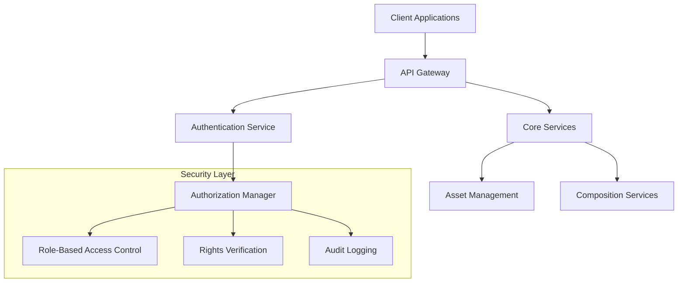
```mermaid
graph TD
    A[Client Applications] --> B[API Gateway]
    B --> C[Authentication Service]
    C --> D[Authorization Manager]
    
    subgraph Security Layer
        D --> E[Role-Based Access Control]
        D --> F[Rights Verification]
        D --> G[Audit Logging]
    end
    
    B --> H[Core Services]
    H --> I[Asset Management]
    H --> J[Composition Services]
```

### 3.1.2 Key Components

The NNA Framework comprises three interconnected layers:

1. **API Gateway**: The entry point for all requests, handling authentication, rate limiting, and routing. It ensures secure, efficient access to services (e.g., resolving "S.01.01.001").
1. **Core Services**: Manages asset resolution, composition, and rights verification. Includes:
    - **Compute Nodes**: Process tasks like rendering or caching, distributed for scalability.
    - **Orchestrator**: Coordinates workloads across Compute Nodes, ensuring fault tolerance and performance.
1. **Security Layer**: Enforces authentication (OAuth 2.0), authorization (RBAC), and audit logging, safeguarding all operations.

These components work together to deliver sub-20ms asset resolution and 10M+ user scalability. For implementation details, see [Implementation Guide, Section 3 - Service Layer](#3-service-layer-implementation).

### 3.1.3 Compute and Data Flow

The NNA Framework efficiently distributes and processes tasks through a Compute-Orchestrated Model, ensuring high availability, performance, and scalability. The architecture is designed for modular interactions between compute nodes, data storage, and system services, facilitating dynamic resource allocation and real-time processing.

The following diagram illustrates how different components interact within the Compute and Data Layers:

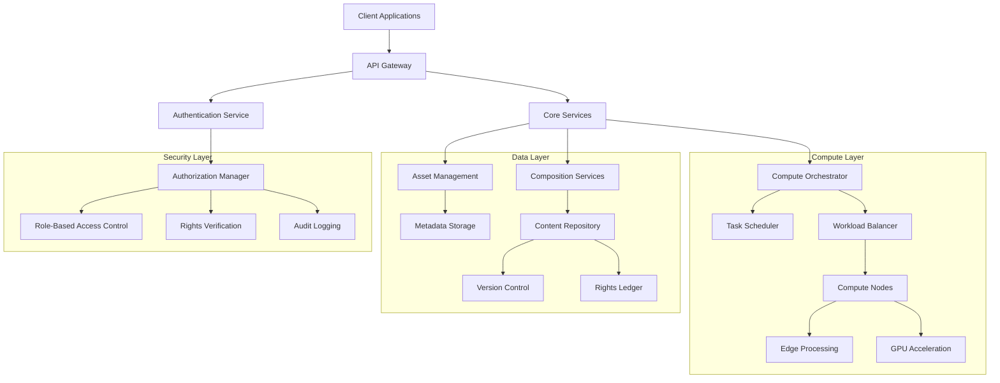
```mermaid
graph TD
    A[Client Applications] --> B[API Gateway]
    B --> C[Authentication Service]
    C --> D[Authorization Manager]

    subgraph Security Layer
        D --> E[Role-Based Access Control]
        D --> F[Rights Verification]
        D --> G[Audit Logging]
    end

    B --> H[Core Services]
    H --> I[Asset Management]
    H --> J[Composition Services]
    H --> K[Compute Orchestrator]

    subgraph Compute Layer
        K --> L[Task Scheduler]
        K --> M[Workload Balancer]
        M --> N[Compute Nodes]
        N --> O[Edge Processing]
        N --> P[GPU Acceleration]
    end

    subgraph Data Layer
        I --> Q[Metadata Storage]
        J --> R[Content Repository]
        R --> S[Version Control]
        R --> T[Rights Ledger]
    end
```

- **API Gateway**: Handles request validation, authentication, and routing to the Orchestrator.
- **Compute Orchestrator:** is responsible for:
    1. **Task Scheduling** – Distributing workloads across Compute Nodes.
    1. **Workload Balancing** – Adjusting resource allocation dynamically.
    1. **Resource Provisioning** – Allocating necessary compute resources (e.g., GPU vs. CPU-based processing).
    1. **Failure Recovery** – Detecting and redistributing failed tasks.

### 3.1.3.1 API-driven Interactions between Components

The Compute Nodes, Orchestrator, and API Gateway interact through a standardized REST API:

1. **Task Submission API**:

```
CopyPOST /v1/tasks
```

Submits processing tasks to the Orchestrator with resource requirements, priority, and dependencies.

1. **Task Status API**:

```
CopyGET /v1/tasks/{task_id}/status
```

Retrieves real-time status information including progress, resource utilization, and estimated completion.

1. **Resource Management API**:

```
CopyPATCH /v1/resources/{node_id}
```

Dynamically adjusts resource allocation based on system demands.

1. **Failure Handling API**:

```
CopyPOST /v1/tasks/{task_id}/recover
```

Initiates recovery procedures for failed tasks, including automatic retry with different resource allocations.

### 3.1.3.2 Sequence Flow for Task Processing

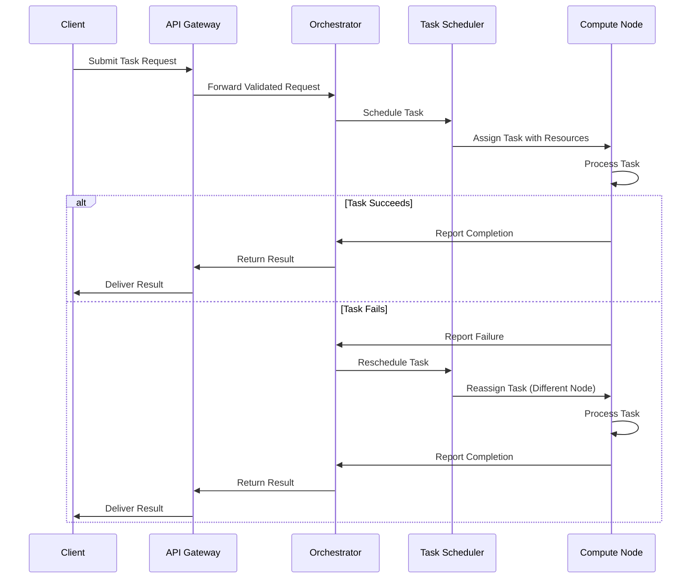
```mermaid
sequenceDiagram
    participant Client
    participant Gateway as API Gateway
    participant Orchestrator
    participant Scheduler as Task Scheduler
    participant Node as Compute Node
    
    Client->>Gateway: Submit Task Request
    Gateway->>Orchestrator: Forward Validated Request
    Orchestrator->>Scheduler: Schedule Task
    Scheduler->>Node: Assign Task with Resources
    Node->>Node: Process Task
    
    alt Task Succeeds
        Node->>Orchestrator: Report Completion
        Orchestrator->>Gateway: Return Result
        Gateway->>Client: Deliver Result
    else Task Fails
        Node->>Orchestrator: Report Failure
        Orchestrator->>Scheduler: Reschedule Task
        Scheduler->>Node: Reassign Task (Different Node)
        Node->>Node: Process Task
        Node->>Orchestrator: Report Completion
        Orchestrator->>Gateway: Return Result
        Gateway->>Client: Deliver Result
    end
```

For detailed implementation patterns including optimal task distribution algorithms, workload prediction models, and dynamic scaling techniques, refer to the [NNA Technical Implementation Guide, Section 4.3 - Compute Management Architecture](https://nna-technical-implementation-guide.md#section-4.3).

For in-depth implementation patterns, refer to the [**NNA Technical Implementation Guide - Compute Management**](#link-to-implementation-guide-compute).

For a detailed breakdown of **API-driven interactions between Compute Nodes, Orchestrator, and the API Gateway**, refer to the [**NNA API Specification**](#link-to-api-spec).

For implementation details on **Compute Task Scheduling, Workload Balancing, and Deployment Patterns**, including  **Sequence diagrams** and **real-world examples**, refer to the [**NNA Technical Implementation Guide**](#link-to-implementation-guide).

### 3.1.4 Component Interactions

```typescript
interface CoreSystemInteraction {
    // Request handling
    requestProcessing: {
        validation: RequestValidator;
        transformation: RequestTransformer;
        routing: RequestRouter;
    };

    // Core operations
    coreOperations: {
        assetResolution: AssetResolver;
        rightsVerification: RightsVerifier;
        cacheCoordination: CacheCoordinator;
    };

    // Security operations
    securityOperations: {
        authentication: AuthenticationService;
        authorization: AuthorizationService;
        auditLogging: AuditLogger;
    };
}
```

## 3.2 Framework Components

### 3.2.1 Layer Structure

The NNA Framework implements a layered architecture reflecting the natural structure of video content creation, now expanded to include new layers for advanced remixing:

1. **Core Layers**

| **Layer** | **Code** | **Purpose** | **Dependencies** |
| --- | --- | --- | --- |
| Song | G | Music tracks & audio | None |
| Star | S | Performance avatars | Song |
| Look | L | Costumes & styling | Star |
| Moves | M | Choreography with biomechanical and cultural classifications | Star |
| World | W | Environments | Independent |
| Vibe | V | Mood & effects | All layers |
| Branded | B | Virtual product placement (e.g., branded outfits, stages, events) | Star, Look, Moves, World |
| Personalize | P | User-uploaded customizations (e.g., face, voice, dress, dance, stage) | Star, Look, Moves, World |
| Training_Data | T | Datasets for AI training | All layers |
| Composites | C | Aggregated multi-layer assets | All layers |
| Rights | R | Provenance and rights tracking | All layers |
| Audio Effects | E | Audio enhancements (e.g., voice modulation, sound effects) | Song, Star, Personalize |
| Transitions | N | Visual, audio, and scene transitions | All layers |
| Augmented Reality | A | AR elements (e.g., face filters, stickers) | Star, Look, World, Personalize |
| Filters | F | Visual filters (e.g., color grading, cinematic effects) | Star, Look, World |
| Text | X | Text overlays (e.g., lyrics, captions, watermarks) | All layers |

1. **Direct Dependencies**
- Star (S) → Song (G)
- Look (L) → Star (S)
- Moves (M) → Star (S)
- Branded (B) → Star (S), Look (L), Moves (M), World (W)
- Personalize (P) → Star (S), Look (L), Moves (M), World (W)
1. **Indirect Dependencies**
- Vibe (V) ←→ World (W)
- Look (L) ←→ World (W)
- Branded (B) ←→ Personalize (P)

### 3.2.2 Layer Implementation

```typescript
interface LayerDefinition {
    // Layer identification
    id: string;                // Layer code (G, S, L, etc.)
    name: string;             // Human-readable name
    version: string;          // Layer version
    
    // Layer characteristics
    characteristics: {
        dependencies: string[];    // Required layers
        restrictions: string[];    // Usage restrictions
        compatibility: string[];   // Compatible layers
    };
    
    // Technical specifications
    specifications: {
        format: string[];         // Supported formats
        resolution: Resolution;    // Required resolution
        performance: Performance;  // Performance requirements
    };
    
    // Metadata for enhanced tracking
    metadata: {
        trainingSetId?: string;   // Links to training dataset (e.g., T.P.S.FAC.001.set)
        source: string;           // "ReViz", "User", "Brand"
        targetAsset?: string;     // Asset being customized (e.g., S.POP.PNK.001)
        premium: string;          // "Yes" for branded assets
        tags: string[];           // Keywords for recommendations (e.g., "Pop", "Dance")
        provenance: string;       // Tracks origin and transformations
        rightsSplit: string;      // Revenue distribution (e.g., "IP Holders: 25%, ReViz: 25%, Remixer: 50%")
    };
}

// Example: Branded Layer
interface BrandedLayer extends LayerDefinition {
    id: "B";
    name: "Branded";
    characteristics: {
        dependencies: ["S", "L", "M", "W"];
        restrictions: ["Premium Access"];
        compatibility: ["G", "S", "L", "M", "W"];
    };
    specifications: {
        format: ["png", "mp4"];
        resolution: { width: 1920, height: 1080 };
        performance: { latency: "<20ms" };
    };
    metadata: {
        source: "Brand";
        premium: "Yes";
        tags: ["Branded", "Fashion", "Gucci"];
        provenance: "Licensed by Gucci";
        rightsSplit: "IP Holders: 25%, ReViz: 25%, Remixer: 50%";
    };
}

// Example: Personalize Layer
interface PersonalizeLayer extends LayerDefinition {
    id: "P";
    name: "Personalize";
    characteristics: {
        dependencies: ["S", "L", "M", "W"];
        restrictions: ["User Upload"];
        compatibility: ["G", "S", "L", "M", "W"];
    };
    specifications: {
        format: ["png", "mp4"];
        resolution: { width: 1920, height: 1080 };
        performance: { latency: "<20ms" };
    };
    metadata: {
        trainingSetId: "T.P.S.FAC.001.set";
        source: "User";
        targetAsset: "S.POP.PNK.001";
        premium: "No";
        tags: ["Personalized", "Face Swap"];
        provenance: "Uploaded by User123";
        rightsSplit: "IP Holders: 25%, ReViz: 25%, Remixer: 50%";
    };
}
```

## 3.2.3 Cache Architecture

**_Summary_:** The NNA Framework uses a three-tier caching system (Edge, Regional, Global) to achieve sub-20ms asset resolution, balancing speed, geographic distribution, and resource efficiency. See below for technical details.

The system employs Edge Cache (5-minute TTL, LRU), Regional Cache (1-hour TTL, LFU), and Global Cache (24-hour TTL, ARC) for optimal performance. _Note_: Detailed diagrams illustrating this architecture will be added in v1.0.4. For implementation specifics, see the [NNA Technical Implementation Guide, Section 3.2](https://nna-technical-implementation-guide.md#section-3.2).

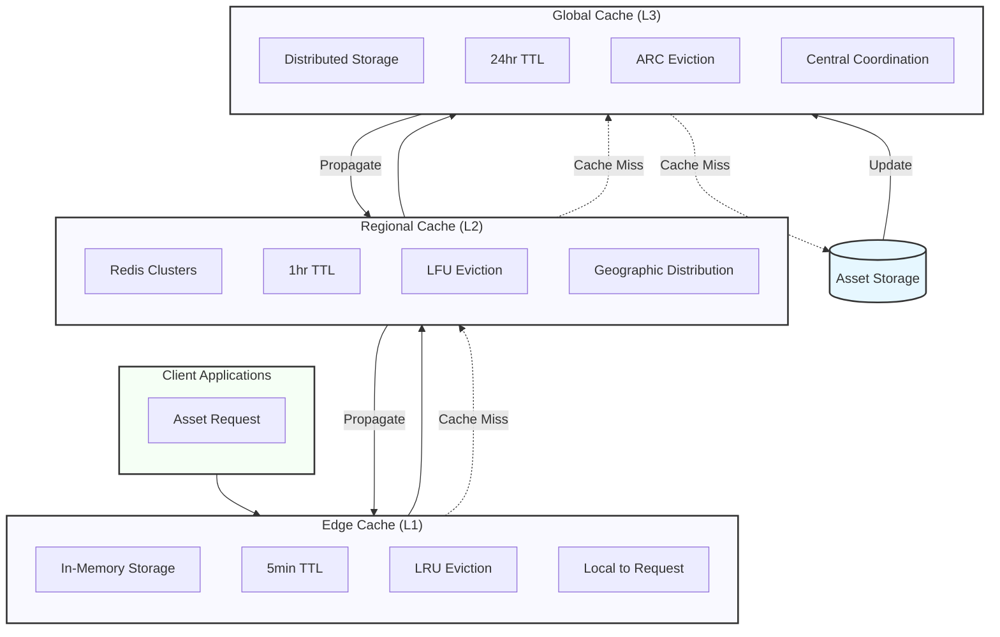
```mermaid
flowchart TD
    subgraph Client ["Client Applications"]
        direction TB
        R[Asset Request]
    end

    subgraph EdgeCache ["Edge Cache (L1)"]
        direction TB
        E1[In-Memory Storage]
        E2[5min TTL]
        E3[LRU Eviction]
        E4[Local to Request]
    end

    subgraph RegionalCache ["Regional Cache (L2)"]
        direction TB
        R1[Redis Clusters]
        R2[1hr TTL]
        R3[LFU Eviction]
        R4[Geographic Distribution]
    end

    subgraph GlobalCache ["Global Cache (L3)"]
        direction TB
        G1[Distributed Storage]
        G2[24hr TTL]
        G3[ARC Eviction]
        G4[Central Coordination]
    end

    Client --> EdgeCache
    EdgeCache --> RegionalCache
    RegionalCache --> GlobalCache

    %% Cache Miss Flows
    EdgeCache -..->|Cache Miss| RegionalCache
    RegionalCache -..->|Cache Miss| GlobalCache
    GlobalCache -..->|Cache Miss| S[(Asset Storage)]

    %% Propagation Flows
    S -->|Update| GlobalCache
    GlobalCache -->|Propagate| RegionalCache
    RegionalCache -->|Propagate| EdgeCache

    classDef cache fill:#f9f9ff,stroke:#333,stroke-width:2px
    classDef storage fill:#e6f7ff,stroke:#333,stroke-width:2px
    classDef client fill:#f5fff5,stroke:#333,stroke-width:2px

    class EdgeCache,RegionalCache,GlobalCache cache
    class S storage
    class Client client

```

### 3.2.3.1  Cache Architecture

Diagram below illustrates the multi-tiered caching strategy used for optimizing asset delivery.

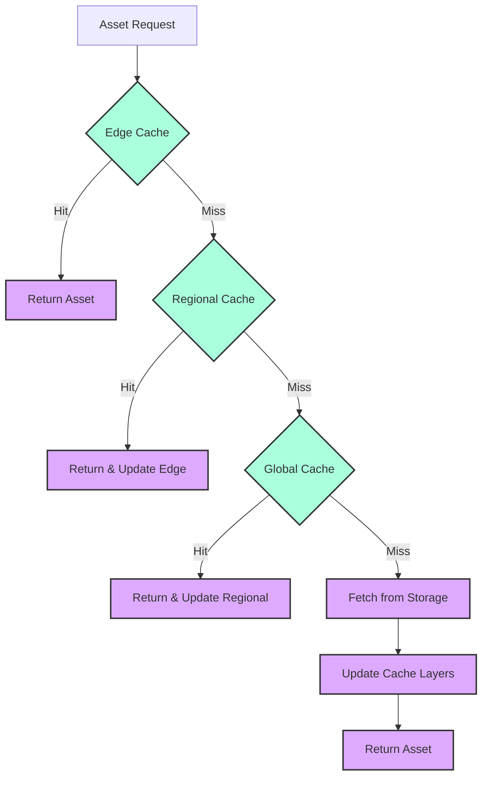
```mermaid
graph TD
    A[Asset Request] --> B{Edge Cache}
    B -->|Hit| C[Return Asset]
    B -->|Miss| D{Regional Cache}
    
    D -->|Hit| E[Return & Update Edge]
    D -->|Miss| F{Global Cache}
    
    F -->|Hit| G[Return & Update Regional]
    F -->|Miss| H[Fetch from Storage]
    
    H --> I[Update Cache Layers]
    I --> J[Return Asset]
    
    classDef cache fill:#afd,stroke:#333,stroke-width:2px
    classDef action fill:#daf,stroke:#333,stroke-width:2px
    
    class B,D,F cache
    class C,E,G,H,I,J action
```

For implementation details, see the [NNA Technical Implementation Guide, Section 3.2](https://nna-technical-implementation-guide.md#section-3.2).

### 3.2.3.2 Cache Tier Characteristics

Each tier is optimized for specific performance and distribution requirements:

| **Tier** | **TTL** | **Storage** | **Strategy** | **Purpose** |
| --- | --- | --- | --- | --- |
| Edge (L1) | 300s (5 min) | Application memory | LRU | Hot assets |
| Regional (L2) | 3600s (1hr) | Redis clusters | LFU | Geographic optimization |
| Global(L3) | 86400s (24 hr) | Distributed storage | ARC | Base layer |

- **Edge Cache**: Fastest, closest to user, 5-minute TTL.
- **Regional Cache**: Mid-tier, regional optimization, 1-hour TTL.
- **Global Cache**: Highest capacity, central storage, 24-hour TTL.
- **Event-Based Invalidation**: Triggered by asset updates or rights changes.

### 3.2.3.3 Cache Strategies

The NNA Framework employs different eviction strategies for each tier based on access patterns:

- **LRU (Least Recently Used)**: Edge caches favor recently accessed assets to maximize performance for active sessions
- **LFU (Least Frequently Used)**: Regional caches optimize for popular content within geographic regions
- **ARC (Adaptive Replacement Cache)**: Global cache balances recency and frequency for optimal long-term performance

### 3.2.3.4 Event-Based Invalidation

Cache consistency is maintained through event-based invalidation triggered by:

- Asset updates or modifications
- Rights changes affecting asset availability
- Relationship modifications that impact dependencies
- Administrative cache flush operations

This sophisticated cache architecture enables the NNA Framework to achieve sub-20ms asset resolution times at global scale while maintaining data consistency and minimizing storage requirements.

### 3.2.3.5 Cache Configuration

```typescript
cache_config = {
    "edge": {
        "ttl": 300,          # 5 minutes
        "max_size": "10GB",
        "strategy": "LRU",
        "sync_interval": 60  # 1 minute
    },
    "regional": {
        "ttl": 3600,        # 1 hour
        "max_size": "100GB",
        "strategy": "LFU",
        "sync_interval": 300 # 5 minutes
    },
    "global": {
        "ttl": 86400,       # 24 hours
        "max_size": "1TB",
        "strategy": "ARC",
        "sync_interval": 900 # 15 minutes
    }
}


```

1. **Edge Cache (L1)**

```typescript
interface EdgeCacheConfig {
    storage: {
        type: 'memory';
        maxSize: '10GB';
        evictionPolicy: 'LRU';
    };
    ttl: {
        default: 300;  // 5 minutes
        min: 60;       // 1 minute
        max: 3600;     // 1 hour
    };
    prefetch: {
        enabled: true;
        threshold: 0.8;    // Prefetch at 80% probability
        maxItems: 1000;    // Max items to prefetch
    };
}
```

1. **Regional  Cache (L2)**

```typescript
interface RegionalCacheConfig {
    storage: {
        type: 'redis-cluster';
        nodes: 3;
        replication: true;
        maxSize: '100GB';
    };
    ttl: {
        default: 3600;     // 1 hour
        min: 300;          // 5 minutes
        max: 86400;        // 24 hours
    };
    sharding: {
        strategy: 'consistent-hashing';
        virtualNodes: 256;
        rebalanceThreshold: 0.2;
    };
}

```

### 3.2.3.6 Advanced Cache Configuration

```typescript
interface CacheConfiguration {
    edge: {
        ttl: 300,              // 5 minutes
        maxSize: '10GB',
        strategy: 'LRU',
        prefetch: {
            enabled: true,
            threshold: 0.8,    // Prefetch at 80% probability
            maxItems: 1000     // Max items to prefetch
        }
    },
    regional: {
        ttl: 3600,            // 1 hour
        maxSize: '100GB',
        strategy: 'LFU',
        sharding: {
            strategy: 'consistent-hashing',
            virtualNodes: 256,
            rebalanceThreshold: 0.2
        }
    },
    global: {
        ttl: 86400,           // 24 hours
        maxSize: '1TB',
        strategy: 'ARC',
        replication: {
            factor: 3,
            consistency: 'quorum'
        }
    }
}
```

### 3.2.4 On-Device Processing

The NNA Framework supports on-device processing for the Personalize (P) layer, enabling users to upload and process custom assets (e.g., face, voice, dress, dance, stage) directly on their mobile devices or browsers. This is achieved through edge inferencing with AI models for tasks like face swapping and lip-syncing, ensuring user privacy by avoiding data transmission to external servers.

**Key Features:**

- **Privacy**: All personalization processing (e.g., face swaps, lip-syncing) occurs on-device, reducing the risk of data exposure.
- **Performance**: Edge inferencing leverages device hardware (e.g., GPU, NPU) to achieve low-latency processing, with previews generated in under 2 seconds.
- **Supported Formats**: Images (.PNG) for face, dress, and stage; audio/video (.MP4) for voice and dance.

**Implementation Example:**

```typescript
interface OnDeviceProcessing {
    // Processing configuration
    config: {
        model: string;            // AI model for processing (e.g., "FaceSwap_v1")
        hardware: string;         // "GPU", "NPU", "CPU"
        latencyTarget: number;    // Target latency in ms (e.g., 2000)
    };
    
    // Supported operations
    operations: {
        faceSwap: {
            input: { format: "png", source: "P.S.FAC.001.png" };
            target: "S.POP.PNK.001";
            output: { format: "png", resolution: "1920x1080" };
        };
        lipSync: {
            input: { format: "mp4", source: "P.S.VOI.001.mp4" };
            target: "G.POP.TSW.001";
            output: { format: "mp4", resolution: "1920x1080" };
        };
    };
    
    // Privacy controls
    privacy: {
        onDevice: boolean;        // True for edge inferencing
        dataRetention: string;    // "None" for no data storage
        encryption: boolean;      // True for local data encryption
    };
}
```

This capability ensures that ReViz users can personalize their remixes securely and efficiently, aligning with privacy best practices.

## 3.3 Integration Architecture

### 3.3.1 AlgoRhythm Integration

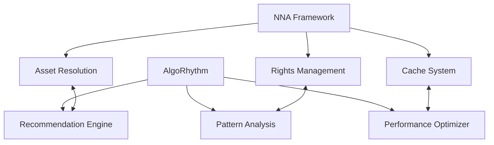
```mermaid
graph TD
    A[NNA Framework] --> B[Asset Resolution]
    A --> C[Rights Management]
    A --> D[Cache System]
    
    E[AlgoRhythm] --> F[Recommendation Engine]
    E --> G[Pattern Analysis]
    E --> H[Performance Optimizer]
    
    B <--> F
    C <--> G
    D <--> H
```

Integration Implementation:

```typescript
interface AlgoRhythmIntegration {
    // Recommendation system
    recommendations: {
        getRecommendations(context: Context): Promise<Recommendation[]>;
        updateRecommendations(feedback: Feedback): Promise<void>;
        trackPerformance(metrics: Metrics): Promise<void>;
    };

    // Pattern analysis
    patterns: {
        analyzeUsage(data: UsageData): Promise<Analysis>;
        predictTrends(history: History): Promise<Prediction>;
        optimizePerformance(metrics: Metrics): Promise<Optimization>;
    };
}
```

### 3.3.2 Rights Management Integration

Rights Resolution Flow:

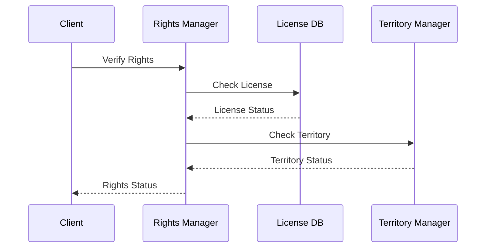
```mermaid
sequenceDiagram
    participant Client
    participant Rights Manager
    participant License DB
    participant Territory Manager
    
    Client->>Rights Manager: Verify Rights
    Rights Manager->>License DB: Check License
    License DB-->>Rights Manager: License Status
    Rights Manager->>Territory Manager: Check Territory
    Territory Manager-->>Rights Manager: Territory Status
    Rights Manager-->>Client: Rights Status
```

### 3.3.3 Cross-Platform Integration

Integration Points:

```typescript
interface CrossPlatformIntegration {
    // Platform adapters
    platforms: {
        web: WebPlatformAdapter;
        mobile: MobilePlatformAdapter;
        desktop: DesktopPlatformAdapter;
    };

    // Content delivery
    delivery: {
        optimize(content: Content, platform: Platform): Promise<OptimizedContent>;
        transform(content: Content, format: Format): Promise<TransformedContent>;
        validate(content: Content, requirements: Requirements): Promise<ValidationResult>;
    };

    // Performance monitoring
    monitoring: {
        trackPerformance(metrics: PlatformMetrics): Promise<void>;
        alertAnomalies(thresholds: Thresholds): Promise<void>;
        generateReports(criteria: ReportCriteria): Promise<Report>;
    };
}
```

## 3.4 System Diagrams and Flows

### 3.4.1 Request Processing Flow

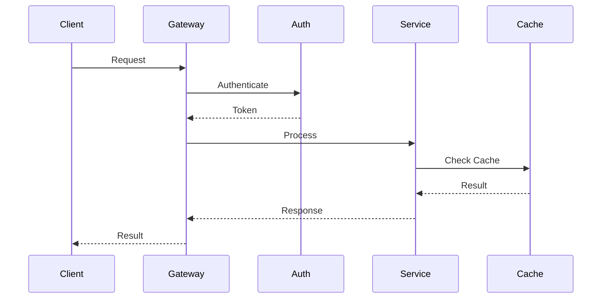
```mermaid
sequenceDiagram
    participant Client
    participant Gateway
    participant Auth
    participant Service
    participant Cache
    
    Client->>Gateway: Request
    Gateway->>Auth: Authenticate
    Auth-->>Gateway: Token
    Gateway->>Service: Process
    Service->>Cache: Check Cache
    Cache-->>Service: Result
    Service-->>Gateway: Response
    Gateway-->>Client: Result
```

### 3.4.2 Asset Resolution Flow

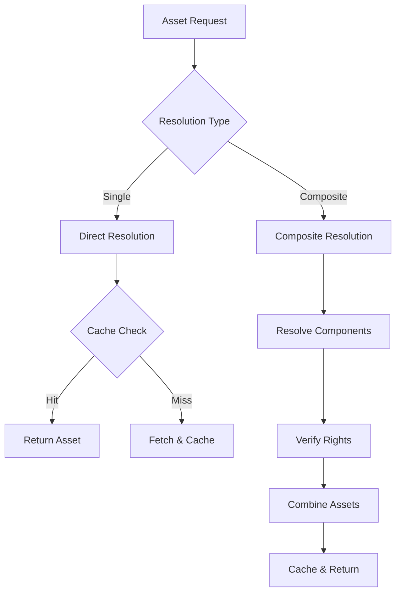
```mermaid
graph TD
    A[Asset Request] --> B{Resolution Type}
    B -->|Single| C[Direct Resolution]
    B -->|Composite| D[Composite Resolution]
    
    C --> E{Cache Check}
    D --> F[Resolve Components]
    
    E -->|Hit| G[Return Asset]
    E -->|Miss| H[Fetch & Cache]
    
    F --> I[Verify Rights]
    I --> J[Combine Assets]
    J --> K[Cache & Return]
```

### 3.4.3 Performance Optimization Flow

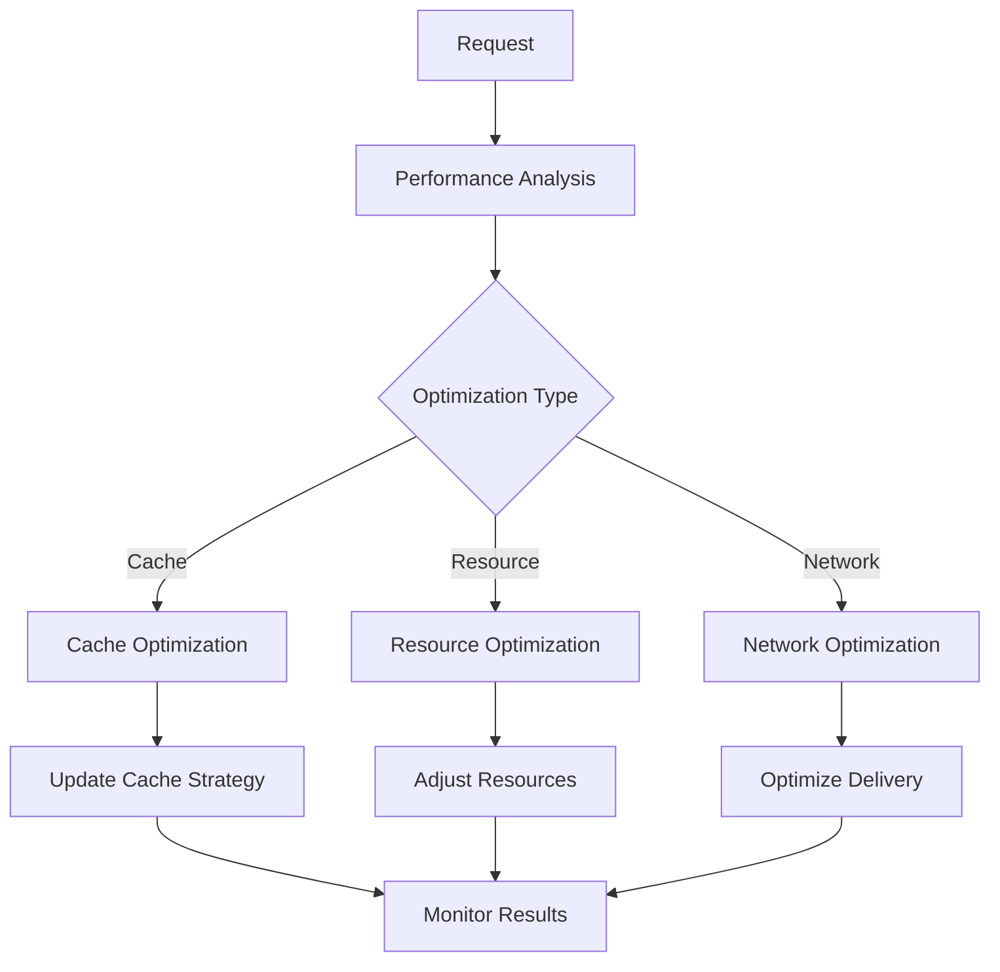
```mermaid
graph TD
    A[Request] --> B[Performance Analysis]
    B --> C{Optimization Type}
    C -->|Cache| D[Cache Optimization]
    C -->|Resource| E[Resource Optimization]
    C -->|Network| F[Network Optimization]
    
    D --> G[Update Cache Strategy]
    E --> H[Adjust Resources]
    F --> I[Optimize Delivery]
    
    G --> J[Monitor Results]
    H --> J
    I --> J
```

## 3.5 Performance Architecture

### 3.5.1 Performance Targets

| **Metric** | **Target** | **SLA** | **Measurement** |
| --- | --- | --- | --- |
| Response Time | <20ms | 99.9% | P95 latency |
| Cache Hit Rate | >95% | 99% | Rolling 5-min |
| Concurrent Users | 10M+ | 99.999% | Peak load |
| Asset Resolution | 1920x1080 | 100% | Output quality |

### 3.5.2 Performance Implementation

```typescript
interface PerformanceManager {
    // Resource management
    resources: {
        monitor(usage: ResourceUsage): Promise<ResourceMetrics>;
        optimize(metrics: ResourceMetrics): Promise<OptimizationResult>;
        scale(demand: ScalingDemand): Promise<ScalingResult>;
    };

    // Performance tracking
    tracking: {
        collectMetrics(context: Context): Promise<PerformanceMetrics>;
        analyzeBottlenecks(metrics: PerformanceMetrics): Promise<Analysis>;
        generateReport(criteria: ReportCriteria): Promise<Report>;
    };

    // Optimization engine
    optimization: {
        optimizeCache(metrics: CacheMetrics): Promise<CacheOptimization>;
        optimizeResources(usage: ResourceUsage): Promise<ResourceOptimization>;
        optimizeNetwork(traffic: NetworkTraffic): Promise<NetworkOptimization>;
    };
}
```

### 3.5.3 Performance Benchmarks

| **Test Scenario** | **Load** | **Duration** | **Target Metrics** |
| --- | --- | --- | --- |
| Baseline | 10K req/s | 1 hour | <20ms P95 latency |
| Peak Load | 100K req/s | 30 min | <50ms P95 latency |
| Burst | 200K req/s | 5 min | <100ms P95 latency |
| Sustained | 50K req/s | 24 hours | <30ms P95 latency |

Testing Environment Specifications:

```typescript
interface TestEnvironment {
    compute: {
        instance: 'c6i.32xlarge';
        vcpus: 128;
        memory: '256GB';
        network: '50Gbps';
    };
    storage: {
        type: 'io2 Block Express';
        iops: 256000;
        throughput: '4000MB/s';
    };
    database: {
        type: 'MongoDB Atlas';
        tier: 'M80';
        shards: 3;
    };
    cache: {
        type: 'ElastiCache';
        instance: 'r6g.16xlarge';
        nodes: 6;
    }
}
```

## 3.6 Security Framework

### 3.6.1 Security and Authentication

The NNA Framework employs OAuth 2.0 for secure authentication and authorization. Clients must first obtain an authentication token, which is used to access protected endpoints. For further details, refer to the [NNA Framework API Specification](#section-3-core-apis), which includes endpoint definitions and sample request/response payloads.

### 3.6.2 Security Architecture

The NNA Framework’s security is proactive and layered:

- **Authentication**: Enforces OAuth 2.0 and JWT with 1-hour token expiry.
- **Authorization**: Uses Role-Based Access Control (RBAC) and Access Control Lists (ACL) for granular permissions.
- **Monitoring**: AI-powered anomaly detection flags unusual patterns (e.g., excessive 429 RATE_LIMITED errors).
- This ensures robust protection with real-time oversight. See [Section 3.6.2 - Authentication Flow](#section-3.6.2-authentication-flow) and [NNA Technical Implementation Guide, Section 5](#section-5-security-implementation) for details.

The NNA Framework’s security is proactive and layered:

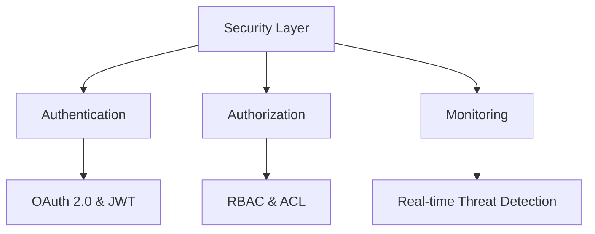
```mermaid
graph TD
    A[Security Layer] --> B[Authentication]
    A --> C[Authorization]
    A --> D[Monitoring]
    
    B --> E[OAuth 2.0 & JWT]
    C --> F[RBAC & ACL]
    D --> G[Real-time Threat Detection]
```

- **Authentication**: Enforces OAuth 2.0 and JWT with 1-hour token expiry.
- **Authorization**: Uses Role-Based Access Control (RBAC) and Access Control Lists (ACL) for granular permissions.
- **Monitoring**: AI-powered anomaly detection flags unusual patterns (e.g., excessive 429 RATE_LIMITED errors).

This ensures robust protection with real-time oversight. See [Section 3.6.2 - Authentication Flow](#3-system-architecture) and [Implementation Guide, Section 5](#5-security-implementation) for details.

### 3.6.3 Authentication Flow

1. **Client Requests Token**
1. The client sends a request to the authentication endpoint with valid credentials.
1. **Token Issuance**
1. The system validates the credentials and issues a time-limited **OAuth token**.
1. **API Access**
1. The client includes the **Bearer token** in the `Authorization` header to access protected resources.
1. **Token Expiry & Refresh**
1. Tokens expire after a set duration. Clients must refresh tokens using the **refresh token endpoint**.
1. **Authentication Flow**

```typescript
interface AuthenticationFlow {
    // Primary authentication
    primaryAuth: {
        method: 'OAuth2.0' | 'API Key' | 'JWT';
        expiration: number;  // seconds
        refresh: boolean;
    };
    
    // Secondary verification
    secondaryAuth?: {
        method: 'MFA' | 'Hardware Token';
        timeout: number;     // seconds
    };
    
    // Session management
    session: {
        duration: number;    // seconds
        extendable: boolean;
        maxExtensions: number;
    };
}
```

### 3.6.4 Security Implementation

```typescript
interface SecurityFramework {
    // Authentication
    authentication: {
        methods: {
            oauth: OAuth2Config;
            apiKey: APIKeyConfig;
            jwt: JWTConfig;
        };
        validation: {
            validateToken(token: string): Promise<ValidationResult>;
            validateScope(scope: string[]): Promise<ScopeValidation>;
            validateContext(context: AuthContext): Promise<ContextValidation>;
        };
    };

    // Authorization
    authorization: {
        rbac: {
            checkPermission(user: User, resource: Resource): Promise<boolean>;
            validateRole(role: Role, action: Action): Promise<boolean>;
            updatePermissions(updates: PermissionUpdates): Promise<void>;
        };
        acl: {
            checkAccess(entity: Entity, resource: Resource): Promise<boolean>;
            updateAcl(updates: ACLUpdates): Promise<void>;
        };
    };

    // Audit logging
    audit: {
        logAccess(access: AccessLog): Promise<void>;
        logSecurity(event: SecurityEvent): Promise<void>;
        generateReport(criteria: AuditCriteria): Promise<AuditReport>;
    };
}
```

### 3.6.5 Advanced Security Controls

```typescript
interface SecurityControls {
    authentication: {
        mfa: {
            required: boolean;
            methods: ['totp', 'hardware-token', 'biometric'];
            graceWindow: number;  // seconds
        };
        session: {
            duration: number;     // seconds
            extendable: boolean;
            maxExtensions: number;
        };
        rateLimit: {
            window: number;       // seconds
            maxAttempts: number;
            penaltyDuration: number;
        }
    };
    monitoring: {
        realtime: {
            anomalyDetection: boolean;
            patternRecognition: boolean;
            alertThresholds: {
                warning: number;
                critical: number;
            }
        };
        audit: {
            retention: number;    // days
            encryption: boolean;
            compression: boolean;
        }
    }
}
```

### 3.6.6 Access Control Matrix

| **Role** | **Asset Creation** | **Asset Modification** | **Rights Management** | **System Config** | **Audit Trail** |
| --- | --- | --- | --- | --- | --- |
| **Super Admin** | Full | Full | Full | Full | Full |
| **Admin** | Full | Full | Full | Partial | Full |
| **Creator** | Layer-specific | Own Assets | View Own | None | Partial |
| **Viewer** | None | None | View Limited | None | None |
| **API Client** | Configurable | Configurable | Limited | None | Partial |

**Additional Attributes:**

- Granular permission levels
- Time-based access controls
- IP and device restrictions
- Temporary elevation mechanisms

## 3.7 Monitoring Framework

### 3.7.1 Monitoring & Logging Best Practices

Effective system monitoring and logging are critical for maintaining the performance and reliability of the NNA Framework.

**3.7.2 Logging Standards**

- Uses **structured logging (JSON format)** for machine-readable logs.
- Includes **timestamp, log level, request ID, and error codes** in every log entry.
- Stores logs in a **centralized log management system** for analysis.

**3.7.3 Monitoring Tools**

- Utilizes **Prometheus** for real-time metric collection and alerting.
- Uses **Grafana dashboards** for visualizing performance trends.
- Employs **ELK Stack (Elasticsearch, Logstash, Kibana)** for log aggregation and searchability.

**3.7.4 Error Reporting**

- Implements **automated alerts** for critical failures.
- Uses **webhooks** to send real-time error notifications to external monitoring services.
- Defines **retry policies** for transient errors.

For implementation details, refer to the [**NNA Technical Implementation Guide**](#link-to-implementation-guide).

### 3.7.5 Monitoring Architecture

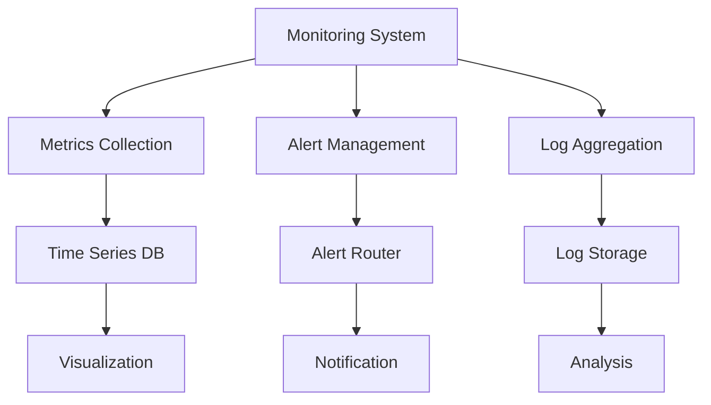
```mermaid
graph TD
    A[Monitoring System] --> B[Metrics Collection]
    A --> C[Alert Management]
    A --> D[Log Aggregation]
    
    B --> E[Time Series DB]
    C --> F[Alert Router]
    D --> G[Log Storage]
    
    E --> H[Visualization]
    F --> I[Notification]
    G --> J[Analysis]
```

### 3.7.6 Monitoring Implementation

```typescript
interface MonitoringSystem {
    // Metrics collection
    metrics: {
        collect(source: MetricSource): Promise<MetricData>;
        aggregate(metrics: MetricData[]): Promise<AggregatedMetrics>;
        analyze(metrics: AggregatedMetrics): Promise<Analysis>;
    };

    // Alert management
    alerts: {
        evaluate(metrics: MetricData): Promise<AlertEvaluation>;
        route(alert: Alert): Promise<RoutingResult>;
        notify(notification: Notification): Promise<NotificationResult>;
    };

    // Log management
    logging: {
        collect(logs: LogData): Promise<void>;
        process(logs: LogData): Promise<ProcessedLogs>;
        analyze(logs: ProcessedLogs): Promise<LogAnalysis>;
    };

    // Visualization
    visualization: {
        generateDashboard(config: DashboardConfig): Promise<Dashboard>;
        updateMetrics(metrics: LiveMetrics): Promise<void>;
        createReport(criteria: ReportCriteria): Promise<Report>;
    };
}
```

## 3.8 Error Handling

NNA implements **structured error handling** across all API interactions and system workflows. Errors are classified into **client errors, system errors, and transient failures**.

### 3.8.1 Error Classification

| **Category** | **Code Range** | **Description** | **Example** |
| --- | --- | --- | --- |
| Validation | 1000-1999 | Input validation | Invalid asset ID |
| Authentication | 2000-2999 | Auth failures | Invalid token |
| Resource | 3000-3999 | Resource access | Asset not found |
| System | 4000-4999 | Internal errors | Cache failure |

- **Client Errors (4xx)** – Invalid requests, authentication failures.
- **System Errors (5xx)** – Internal failures, resource unavailability.
- **Transient Failures** – Network disruptions, timeouts.

### 3.8.2 Error Codes

| **Category** | **HTTP Code** | **Description** | **Recovery** |
| --- | --- | --- | --- |
| Validation | 400 | Invalid input | Client retry with correction |
| Authentication | 401 | Auth failed | Refresh credentials |
| Authorization | 403 | Insufficient rights | Request access |
| Resource | 404 | Asset not found | Check asset ID |
| Conflict | 409 | Version conflict | Resolve conflicts |
| System | 500 | Internal error | Automatic retry |

For a detailed breakdown of error response formats and recovery strategies, refer to the [**NNA API Specification - Error Handling Section**](#link-to-api-spec-error-handling)**.**

### 3.8.4 Error Handling Implementation

```typescript
interface ErrorHandler {
    // Error processing
    processing: {
        handle(error: Error, context: Context): Promise<ErrorResolution>;
        categorize(error: Error): Promise<ErrorCategory>;
        resolve(error: Error): Promise<Resolution>;
    };

    // Recovery procedures
    recovery: {
        attemptRecovery(error: Error): Promise<RecoveryResult>;
        fallback(error: Error): Promise<FallbackResult>;
        notify(error: Error): Promise<NotificationResult>;
    };

    // Error tracking
    tracking: {
        log(error: Error): Promise<void>;
        analyze(errors: Error[]): Promise<ErrorAnalysis>;
        report(criteria: ReportCriteria): Promise<ErrorReport>;
    };
}
```

### 3.8.4 Cross-Platform Error Handling

```python
class UnifiedErrorHandler:
    """
    Centralized error handling across NNA Framework, AlgoRhythm, and Clearity
    """
    def __init__(self):
        self.nna_handler = NNAErrorHandler()
        self.algo_handler = AlgoRhythmErrorHandler()
        self.clearity_handler = ClearityErrorHandler()
        self.metrics = ErrorMetrics()

    async def handle_error(
        self,
        error: Exception,
        context: ErrorContext
    ) -> ErrorResolution:
        """
        Coordinated error handling across platforms
        """
        # Determine error origin
        origin = self.determine_error_origin(error)
        
        # Handle based on origin
        match origin:
            case 'nna':
                resolution = await self.handle_nna_error(error)
            case 'algorhythm':
                resolution = await self.handle_algo_error(error)
            case 'clearity':
                resolution = await self.handle_clearity_error(error)
            case _:
                resolution = await self.handle_cross_platform_error(error)

        # Record error metrics
        await self.metrics.record_error(error, resolution, context)
        
        return resolution

    async def handle_cross_platform_error(
        self,
        error: Exception
    ) -> ErrorResolution:
        """
        Handle errors affecting multiple platforms
        """
        # Initiate recovery procedures
        recovery_attempts = await asyncio.gather(
            self.nna_handler.attempt_recovery(error),
            self.algo_handler.attempt_recovery(error),
            self.clearity_handler.attempt_recovery(error)
        )

        if any(attempt.successful for attempt in recovery_attempts):
            return ErrorResolution(
                resolved=True,
                recovery_details=recovery_attempts
            )

        # Fall back to degraded service
        return ErrorResolution(
            resolved=False,
            fallback=await self.initiate_fallback_procedures(error)
        )
```

## 3.9 Cross-Platform Support

### 3.9.1 Platform Support Matrix

| **Platform** | **Asset Format** | **Max Resolution** | **Target Latency** |
| --- | --- | --- | --- |
| Web | MP4/WebM | 1080p | <50ms |
| Mobile | HLS/DASH | 720p | <100ms |
| Desktop | MP4/ProRes | 4K | <200ms |
| XR | USDZ/glTF | Platform-specific | <20ms |

### 3.9.2 Platform Integration

```typescript
interface PlatformSupport {
    // Platform adaptation
    adaptation: {
        adaptContent(content: Content, platform: Platform): Promise<AdaptedContent>;
        optimizeDelivery(content: Content, platform: Platform): Promise<OptimizedContent>;
        validateCompatibility(content: Content, platform: Platform): Promise<ValidationResult>;
    };

    // Format handling
    formats: {
        convert(content: Content, format: Format): Promise<ConvertedContent>;
        validate(content: Content, format: Format): Promise<ValidationResult>;
        optimize(content: Content, format: Format): Promise<OptimizedContent>;
    };

    // Performance optimization
    performance: {
        monitorPlatform(platform: Platform): Promise<PlatformMetrics>;
        optimizePlatform(metrics: PlatformMetrics): Promise<OptimizationResult>;
        reportPerformance(platform: Platform): Promise<PerformanceReport>;
    };
}
```

## 3.10 System Boundaries

### 3.10.1 Technical Limits

| **Component** | **Soft Limit** | **Hard Limit** | **Notes** |
| --- | --- | --- | --- |
| Asset Size | 5GB | 10GB | Per individual asset |
| Composite Layers | 6 | 8 | Per composition |
| Cache TTL | 24h | 48h | Global cache |
| API Rate | 10K/s | 20K/s | Per client |
| Batch Size | 100 | 250 | Per request |

### 3.10.2 Operating Parameters

```typescript
interface SystemBoundaries {
    // System limits
    limits: {
        asset: {
            maxSize: number;        // Maximum asset size in bytes
            maxLayers: number;      // Maximum composite layers
            maxBatchSize: number;   // Maximum batch operations
        };
        performance: {
            maxLatency: number;     // Maximum allowed latency
            maxConcurrent: number;  // Maximum concurrent requests
            maxQueueSize: number;   // Maximum queue size
        };
        cache: {
            maxTTL: number;         // Maximum cache TTL
            maxSize: number;        // Maximum cache size
            maxEntries: number;     // Maximum cache entries
        };
    };

    // Operational thresholds
    thresholds: {
        scaling: {
            cpu: number;           // CPU utilization threshold
            memory: number;        // Memory utilization threshold
            requests: number;      // Request rate threshold
        };
        alerts: {
            error: number;         // Error rate threshold
            latency: number;       // Latency threshold
            availability: number;  // Availability threshold
        };
    };
}
```

## 3.11 Data Management

### 3.11.1 Data Architecture

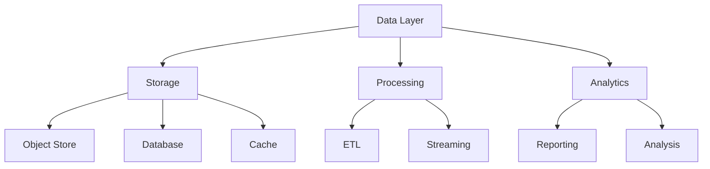
```mermaid
graph TD
    A[Data Layer] --> B[Storage]
    A --> C[Processing]
    A --> D[Analytics]
    
    B --> E[Object Store]
    B --> F[Database]
    B --> G[Cache]
    
    C --> H[ETL]
    C --> I[Streaming]
    
    D --> J[Reporting]
    D --> K[Analysis]
```

### 3.11.2 Data Management Implementation

```typescript
interface DataManager {
    // Storage management
    storage: {
        store(data: Data, options: StorageOptions): Promise<StorageResult>;
        retrieve(id: string): Promise<Data>;
        manage(operations: StorageOperations): Promise<ManagementResult>;
    };

    // Processing pipeline
    processing: {
        process(data: RawData): Promise<ProcessedData>;
        transform(data: Data, transformation: Transformation): Promise<TransformedData>;
        validate(data: Data): Promise<ValidationResult>;
    };

    // Analytics system
    analytics: {
        analyze(data: Data): Promise<Analysis>;
        report(criteria: ReportCriteria): Promise<Report>;
        predict(data: HistoricalData): Promise<Prediction>;
    };
}
```

## 3.12 Integration Patterns

### 3.12.1 Event-Driven Integration

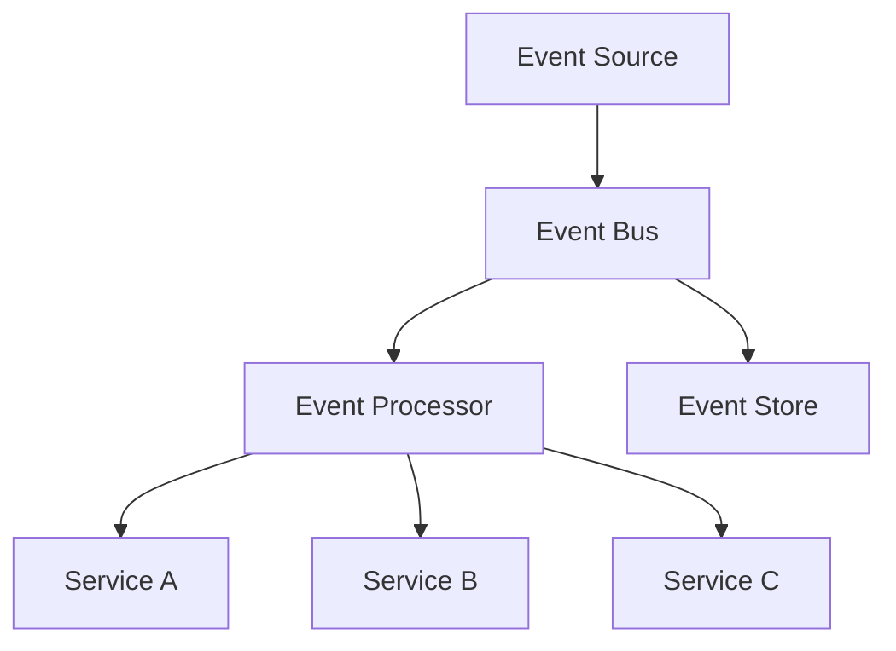
```mermaid
graph TD
    A[Event Source] --> B[Event Bus]
    B --> C[Event Processor]
    B --> D[Event Store]
    
    C --> E[Service A]
    C --> F[Service B]
    C --> G[Service C]
```

### 3.12.2 Integration Implementation

```typescript
interface IntegrationPatterns {
    // Event handling
    events: {
        publishEvent(event: Event): Promise<PublishResult>;
        subscribeToTopic(topic: string, handler: EventHandler): Promise<Subscription>;
        processEvent(event: Event): Promise<ProcessingResult>;
    };

    // Service integration
    services: {
        registerService(service: Service): Promise<RegistrationResult>;
        discoverServices(criteria: DiscoveryCriteria): Promise<Service[]>;
        sendMessage(service: Service, message: Message): Promise<Response>;
    };

    // Data synchronization
    sync: {
        synchronizeData(data: Data): Promise<SyncResult>;
        verifySync(syncId: string): Promise<VerificationResult>;
        resolveConflict(conflict: Conflict): Promise<Resolution>;
    };
}
```

## 3.13 Deployment Architecture

### 3.13.1 Deployment Model

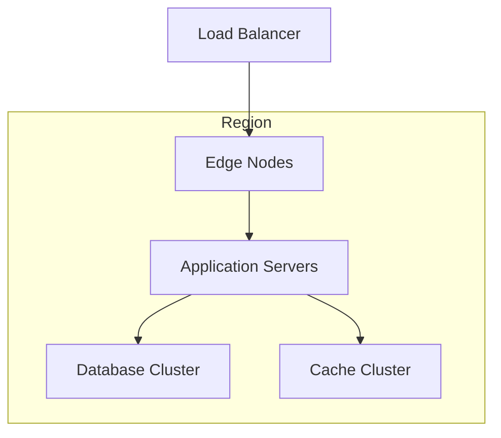
```mermaid
graph TD
    A[Load Balancer] --> B[Edge Nodes]
    B --> C[Application Servers]
    C --> D[Database Cluster]
    C --> E[Cache Cluster]
    
    subgraph "Region"
        B
        C
        D
        E
    end
```

### 3.13.2 Deployment Implementation

```typescript
interface DeploymentManager {
    // Infrastructure management
    infrastructure: {
        provision(resources: Resources): Promise<ProvisionResult>;
        configure(config: Configuration): Promise<ConfigResult>;
        monitor(infrastructure: Infrastructure): Promise<Metrics>;
    };

    // Deployment operations
    operations: {
        deploy(artifact: Artifact): Promise<DeploymentResult>;
        rollback(deployment: Deployment): Promise<RollbackResult>;
        scale(criteria: ScalingCriteria): Promise<ScalingResult>;
    };

    // Health management
    health: {
        check(component: Component): Promise<HealthStatus>;
        recover(issue: Issue): Promise<RecoveryResult>;
        report(criteria: ReportCriteria): Promise<HealthReport>;
    };
}
```

## 3.14 Evolution Strategy

### 3.14.1 Version Management

```typescript
interface VersionManager {
    // Version control
    versioning: {
        upgrade(component: Component): Promise<UpgradeResult>;
        rollback(version: Version): Promise<RollbackResult>;
        validate(version: Version): Promise<ValidationResult>;
    };

    // Migration management
    migration: {
        plan(current: Version, target: Version): Promise<MigrationPlan>;
        execute(plan: MigrationPlan): Promise<MigrationResult>;
        verify(migration: Migration): Promise<VerificationResult>;
    };

    // Compatibility management
    compatibility: {
        check(version: Version): Promise<CompatibilityResult>;
        maintain(compatibility: Compatibility): Promise<MaintenanceResult>;
        update(requirements: Requirements): Promise<UpdateResult>;
    };
}
```

### 3.14.2 Evolution Matrix

| **Component** | **Current** | **Next** | **Timeline** |
| --- | --- | --- | --- |
| Core Framework | 2.0 | 2.1 | Q2 2025 |
| Integration Layer | 1.5 | 2.0 | Q3 2025 |
| Security Framework | 2.1 | 2.2 | Q2 2025 |
| Data Layer | 1.8 | 2.0 | Q4 2025 |

## 3.1.5 Resilience Architecture

The NNA Framework implements a comprehensive resilience strategy to ensure high availability and fault tolerance across all system components:

### 3.1.5.1 Multi-Region Redundancy

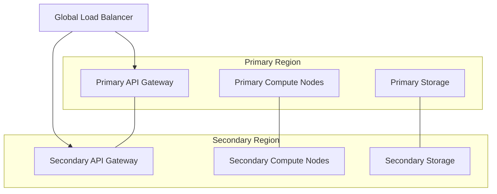
```mermaid
graph TD
    subgraph "Primary Region"
        A[Primary API Gateway]
        B[Primary Compute Nodes]
        C[Primary Storage]
    end
    
    subgraph "Secondary Region"
        D[Secondary API Gateway]
        E[Secondary Compute Nodes]
        F[Secondary Storage]
    end
    
    A --- D
    B --- E
    C --- F
    
    G[Global Load Balancer] --> A
    G --> D
```

The framework deploys redundant components across multiple geographic regions with active-active configuration, ensuring:

- Zero-downtime failover between regions
- Continuous operation during regional outages
- Data replication with consistency guarantees

### 3.1.5.2 Fault Isolation

The system implements fault domains through:

- Service-level isolation with bulkheading
- Resource quotas per service
- Circuit breakers to prevent cascading failures
- Request timeouts with fallback strategies

### 3.1.5.3 Degraded Operation Modes

During partial system failures, the framework maintains core functionality through:

- Progressive degradation of non-critical features
- Cached results with clear staleness indicators
- Asynchronous recovery of background services
- Prioritization of critical workflows

### 3.1.5.4 Recovery Objectives

The NNA Framework maintains the following recovery targets:

- Recovery Time Objective (RTO): < 30 seconds for critical services
- Recovery Point Objective (RPO): < 10 seconds for all data
- Mean Time To Recover (MTTR): < 5 minutes for complete service restoration

This resilience architecture ensures the framework's ability to maintain the advertised 99.999% availability even during significant infrastructure disruptions.

# 4. Integration Architecture

## Executive Summary

The NNA Framework's integration architecture provides seamless connectivity between core framework components and external systems, with particular focus on AI-powered services (AlgoRhythm) and rights management platforms (Clearity). This section details the integration patterns, implementation specifications, and cross-system optimization strategies.

Key Integration Components:

- AI-powered recommendation engine integration
- Rights management and clearance integration
- Cross-platform optimization and delivery
- Performance monitoring and optimization
- Error handling and recovery

## 4.1 Integration Overview

4.1.1 Architecture Overview

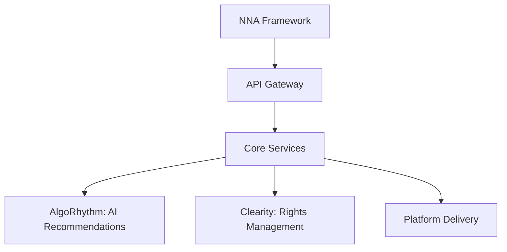
```mermaid
graph TD
    A[NNA Framework] --> B[API Gateway]
    B --> C[Core Services]
    C --> D[AlgoRhythm: AI Recommendations]
    C --> E[Clearity: Rights Management]
    C --> F[Platform Delivery]
```

- **AlgoRhythm**: Powers AI-driven asset suggestions (e.g., recommending "S.01.01.001" for "G.01.TSW.001").
- **Clearity**: Automates rights clearance and tracking.
- **Platform Delivery**: Ensures cross-platform compatibility (web, mobile, XR).

This modular design supports scalability and extensibility. See [Section 4.2 - AlgoRhythm Integration](#4-integration-architecture) and [API Specification, Section 6](#6-integration-guidelines) for details.

### 4.1.2 Integration Framework

```typescript
interface IntegrationFramework {
    // Core integration services
    services: {
        algorhythm: AlgoRhythmService;
        clearity: ClearityService;
        platform: PlatformService;
    };

    // Cross-system coordination
    coordination: {
        synchronize(context: Context): Promise<SyncResult>;
        validate(operation: Operation): Promise<ValidationResult>;
        optimize(resources: Resources): Promise<OptimizationResult>;
    };

    // Performance management
    performance: {
        monitor(metrics: Metrics): Promise<MonitoringResult>;
        analyze(data: PerformanceData): Promise<Analysis>;
        optimize(strategy: Strategy): Promise<OptimizationResult>;
    };
}
```

## 

## 4.2 AlgoRhythm Integration

The NNA Framework integrates with AlgoRhythm to provide AI-powered asset recommendations and compatibility analysis, enhancing content creation workflows. AlgoRhythm analyzes NNA-structured assets for features, compatibility, and personalization, while NNA manages asset addressing and retrieval. For detailed integration architecture, functional areas, and performance optimization, see AlgoRhythm, Section 4.

### 4.2.1 Integration Architecture

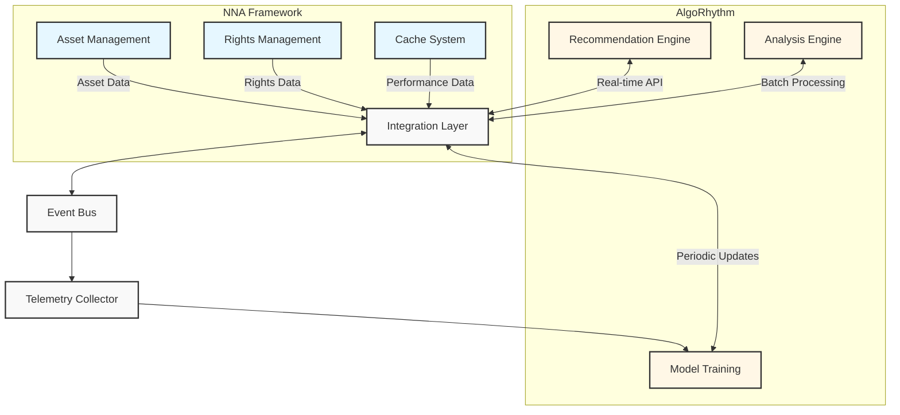
```mermaid
graph TD
    subgraph "NNA Framework"
        A[Asset Management] --> |Asset Data| D[Integration Layer]
        B[Rights Management] --> |Rights Data| D
        C[Cache System] --> |Performance Data| D
    end
    
    subgraph "AlgoRhythm"
        E[Recommendation Engine] <--> |Real-time API| D
        F[Analysis Engine] <--> |Batch Processing| D
        G[Model Training] <--> |Periodic Updates| D
    end
    
    D <--> H[Event Bus]
    H --> I[Telemetry Collector]
    I --> G
    
    classDef nna fill:#e6f7ff,stroke:#333,stroke-width:2px
    classDef algo fill:#fff7e6,stroke:#333,stroke-width:2px
    classDef shared fill:#f9f9f9,stroke:#333,stroke-width:2px
    
    class A,B,C nna
    class E,F,G algo
    class D,H,I shared
```

### 4.2.2 Functional Integration Areas

The integration spans multiple functional areas to deliver comprehensive AI capabilities:

1. **Content Analysis**
1. AlgoRhythm analyzes NNA-structured assets to extract features, identify patterns, and understand relationships between layers. This analysis powers:
- Style compatibility scoring between layers (e.g., matching Star and Look)
- Temporal alignment between audio (Song) and visual elements (Moves)
- Contextual fit between characters (Star) and environments (World)
- 
1. **Recommendation Generation**
1. Based on content analysis, AlgoRhythm generates intelligent recommendations to enhance the creative process:
- Layer-specific recommendations (e.g., suggesting compatible Star assets for a Song)
- Complete composition suggestions with multi-layer compatibility
- Personalized recommendations based on user preferences and history
- 
1. **Performance Optimization**

AlgoRhythm and NNA collaborate to optimize system performance:

- Predictive cache warming based on usage patterns and upcoming trends
- Resource allocation optimization for computational-intensive processing
- Smart query routing based on performance metrics and availability

### 4.2.3 Data Exchange Patterns

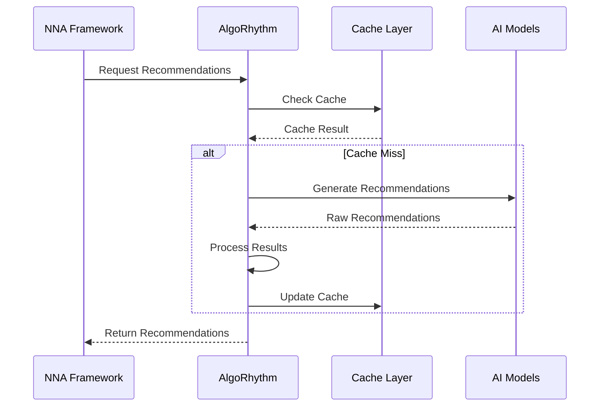
```mermaid
sequenceDiagram
    participant NNA as NNA Framework
    participant AI as AlgoRhythm
    participant Cache as Cache Layer
    participant Models as AI Models
    
    NNA->>AI: Request Recommendations
    AI->>Cache: Check Cache
    Cache-->>AI: Cache Result
    
    alt Cache Miss
        AI->>Models: Generate Recommendations
        Models-->>AI: Raw Recommendations
        AI->>AI: Process Results
        AI->>Cache: Update Cache
    end
    
    AI-->>NNA: Return Recommendations
```

This deep integration enables the NNA Framework to deliver AI-powered experiences that transform content creation workflows while maintaining its core focus on asset management, rights clearance, and performance optimization.

## 4.3 Rights Management Integration

### 4.3.1 Rights Resolution Architecture

```mermaid
graph TD
    A[Content Request] --> B[Rights Resolver]
    B --> C[Territory Check]
    B --> D[Usage Rights]
    B --> E[License Check]
    
    C --> F[Resolution Engine]
    D --> F
    E --> F
    
    F --> G[Rights Grant]
    F --> H[Rights Denial]
```

### 4.3.2 Rights Management Implementation

```typescript
interface RightsManagement {
    // Rights resolution
    resolution: {
        resolveRights(content: Content): Promise<Rights>;
        validateUsage(usage: Usage): Promise<ValidationResult>;
        trackConsumption(consumption: Consumption): Promise<TrackingResult>;
    };

    // License management
    licensing: {
        validateLicense(license: License): Promise<ValidationResult>;
        updateTerms(terms: Terms): Promise<UpdateResult>;
        trackCompliance(usage: Usage): Promise<ComplianceResult>;
    };

    // Revenue distribution
    revenue: {
        calculateShares(usage: Usage): Promise<RevenueShares>;
        distributeRevenue(revenue: Revenue): Promise<DistributionResult>;
        reportDistribution(distribution: Distribution): Promise<Report>;
    };
}
```

## 4.4 Cross-Platform Integration

### 4.4.1 Composition Flow

```mermaid
graph TD
    A[Asset Request] --> B{Composition Type}
    B -->|New| C[Layer Selection]
    B -->|Remix| D[Load Template]
    
    C --> E[Compatibility Check]
    D --> E
    
    E --> F{Rights Verification}
    F -->|Failed| G[Rights Resolution]
    F -->|Passed| H[Asset Assembly]
    
    H --> I[Preview Generation]
    I --> J[Final Rendering]
    
    subgraph "Layer Processing"
    C
    E
    H
    end
    
    subgraph "Rights Management"
    F
    G
    end
```

### 4.4.2 Platform Support Matrix

| **Platform** | **Integration Type** | **Delivery Method** | **Optimization** |
| --- | --- | --- | --- |
| Web | Direct API | CDN | Edge Optimization |
| Mobile | SDK | Adaptive Streaming | Device Optimization |
| Desktop | Native | Direct Delivery | Local Optimization |
| XR | Custom | Real-time Streaming | Latency Optimization |

### 4.4.3 Platform Integration Implementation

```typescript
interface PlatformIntegration {
    // Content delivery
    delivery: {
        optimize(content: Content, platform: Platform): Promise<OptimizedContent>;
        adapt(content: Content, requirements: Requirements): Promise<AdaptedContent>;
        validate(content: Content, platform: Platform): Promise<ValidationResult>;
    };

    // Platform optimization
    optimization: {
        optimizePerformance(metrics: Metrics): Promise<OptimizationResult>;
        adaptResources(resources: Resources): Promise<AdaptedResources>;
        monitorUsage(usage: Usage): Promise<UsageMetrics>;
    };

    // Integration management
    management: {
        configure(config: Config): Promise<ConfigurationResult>;
        monitor(integration: Integration): Promise<MonitoringResult>;
        update(updates: Updates): Promise<UpdateResult>;
    };
}
```

## 4.5 Performance Monitoring

### 4.5.1 Monitoring Architecture

```mermaid
graph TD
    A[Integration Layer] --> B[Metrics Collection]
    A --> C[Performance Analysis]
    A --> D[Optimization Engine]
    
    B --> E[Time Series DB]
    C --> F[Analysis Engine]
    D --> G[Optimization Rules]
    
    E --> H[Visualization]
    F --> I[Alerts]
    G --> J[Automated Optimization]
```

### 4.5.2 Monitoring Implementation

```typescript
interface IntegrationMonitoring {
    // Metrics collection
    metrics: {
        collect(source: Source): Promise<Metrics>;
        aggregate(metrics: Metrics[]): Promise<AggregatedMetrics>;
        analyze(metrics: AggregatedMetrics): Promise<Analysis>;
    };

    // Performance analysis
    analysis: {
        analyzePerformance(metrics: Metrics): Promise<PerformanceAnalysis>;
        identifyBottlenecks(analysis: Analysis): Promise<Bottlenecks>;
        recommendOptimizations(analysis: Analysis): Promise<Recommendations>;
    };

    // Optimization engine
    optimization: {
        applyOptimizations(recommendations: Recommendations): Promise<OptimizationResult>;
        validateResults(results: Results): Promise<ValidationResult>;
        reportImprovements(improvements: Improvements): Promise<Report>;
    };
}
```

## 4.6 Error Handling and Recovery

### 4.6.1 Error Handling Strategy

```typescript
interface ErrorHandling {
    // Error detection
    detection: {
        detectErrors(context: Context): Promise<Errors>;
        categorizeErrors(errors: Errors): Promise<CategorizedErrors>;
        prioritizeErrors(errors: CategorizedErrors): Promise<PrioritizedErrors>;
    };

    // Recovery procedures
    recovery: {
        initiateRecovery(error: Error): Promise<RecoveryPlan>;
        executeRecovery(plan: RecoveryPlan): Promise<RecoveryResult>;
        validateRecovery(result: RecoveryResult): Promise<ValidationResult>;
    };

    // Error reporting
    reporting: {
        logError(error: Error): Promise<LogResult>;
        analyzeErrors(errors: Error[]): Promise<ErrorAnalysis>;
        generateReport(analysis: ErrorAnalysis): Promise<ErrorReport>;
    };
}
```

### 4.6.2 Recovery Patterns

```mermaid
graph TD
    A[Error Detection] --> B{Error Type}
    B -->|Transient| C[Retry Logic]
    B -->|Resource| D[Resource Recovery]
    B -->|System| E[System Recovery]
    
    C --> F[Exponential Backoff]
    D --> G[Resource Reallocation]
    E --> H[System Restart]
    
    F --> I[Resolution]
    G --> I
    H --> I
```

### 4.6.3 Recovery Strategies

```typescript
interface RecoveryStrategy {
    transient: {
        network: {
            maxRetries: number;
            backoffFactor: number;
            maxDelay: number;
            jitter: boolean;
        };
        cache: {
            fallbackLayers: string[];
            rebuildThreshold: number;
            warmCache: boolean;
        };
        composition: {
            partialRecovery: boolean;
            degradedQuality: boolean;
            alternativeSources: boolean;
        }
    };
    permanent: {
        serviceFailure: {
            fallbackService: string;
            degradedMode: boolean;
            notificationChannels: string[];
        };
        dataCorruption: {
            restoreFromBackup: boolean;
            validateIntegrity: boolean;
            reconciliationStrategy: string;
        }
    }
}
```

# 5. System Architecture Diagrams

## Executive Summary

This section provides comprehensive visual representations of the NNA Framework's architecture, illustrating key system components, interactions, and flows. These diagrams serve as a reference for understanding the system's structure and behavior at various levels of abstraction.

## 5.1 High-Level System Architecture

### 5.1.1 Three-Tier Architecture

The NNA Framework follows a three-tier architecture pattern:

```mermaid
graph TD
    subgraph "Client Layer"
        A[Web Clients]
        B[Mobile Clients]
        C[Desktop Clients]
        D[XR Clients]
    end

    subgraph "API Layer"
        E[API Gateway]
        F[Authentication Service]
        G[Request Router]
    end

    subgraph "Core Services Layer"
        H[Asset Services]
        I[Composition Services]
        J[Rights Services]
        K[Cache Services]
    end

    subgraph "Data Layer"
        L[Asset Storage]
        M[Metadata Storage]
        N[Cache Storage]
        O[Analytics Storage]
    end

    A --> E
    B --> E
    C --> E
    D --> E
    E --> F
    F --> G
    G --> H
    G --> I
    G --> J
    G --> K
    H --> L
    H --> M
    I --> L
    I --> M
    J --> M
    K --> N
    H --> O
    I --> O
    J --> O

```

### 5.1.2 Request Flow Architecture

This diagram illustrates the path of a typical asset resolution request through the system:

```mermaid
sequenceDiagram
    participant Client
    participant Gateway as API Gateway
    participant Auth as Authentication
    participant Resolver as Asset Resolver
    participant Cache as Cache System
    participant Storage as Asset Storage
    participant Rights as Rights Manager
    
    Client->>Gateway: Request Asset
    Gateway->>Auth: Authenticate Request
    Auth-->>Gateway: Authentication Result
    
    Gateway->>Resolver: Resolve Asset
    
    Resolver->>Cache: Check Cache
    
    alt Cache Hit
        Cache-->>Resolver: Return Cached Asset
    else Cache Miss
        Resolver->>Storage: Fetch Asset
        Storage-->>Resolver: Return Asset
        Resolver->>Rights: Verify Rights
        Rights-->>Resolver: Rights Status
        Resolver->>Cache: Update Cache
    end
    
    Resolver-->>Gateway: Asset Response
    Gateway-->>Client: Deliver Asset
```

### 5.1.3 Cache Architecture

The multi-tier caching system is a key performance optimization component:

```mermaid
graph TD
    A[Asset Request] --> B{Edge Cache L1}
    B -->|Hit| C[Return Asset]
    B -->|Miss| D{Regional Cache L2}
    
    D -->|Hit| E[Return & Update Edge]
    D -->|Miss| F{Global Cache L3}
    
    F -->|Hit| G[Return
```

## 5.2 Component Architecture

### 5.2.1 Asset Management System

```mermaid
graph TD
    subgraph "Asset Manager"
        A[Asset Controller]
        B[Resolution Engine]
        C[Composition Engine]
    end

    subgraph "Storage Layer"
        D[Object Store]
        E[Metadata Store]
        F[Cache Layer]
    end

    subgraph "Processing Layer"
        G[Transform Engine]
        H[Optimization Engine]
        I[Validation Engine]
    end

    A --> B
    A --> C
    B --> D
    B --> E
    C --> F
    C --> G
    G --> H
    H --> I
```

### 5.2.2 Cache Architecture

```mermaid
graph TD
    subgraph "Cache Hierarchy"
        A[Edge Cache L1]
        B[Regional Cache L2]
        C[Global Cache L3]
        
        A -->|miss| B
        B -->|miss| C
        C -->|update| B
        B -->|update| A
    end
    
    subgraph "Cache Management"
        D[Cache Controller]
        E[Invalidation Manager]
        F[Prefetch Engine]
        
        D --> A
        D --> B
        D --> C
        E --> D
        F --> D
    end
```

## 5.3 Integration Architecture

### 5.3.1 AlgoRhythm Integration

```mermaid
graph TD
    subgraph "NNA Framework"
        A[Asset Manager]
        B[Cache Layer]
        C[Rights Manager]
    end

    subgraph "AlgoRhythm"
        D[Recommendation Engine]
        E[Analysis Engine]
        F[Optimization Engine]
    end

    subgraph "Integration Layer"
        G[API Gateway]
        H[Event Bus]
        I[Sync Manager]
    end

    A --> G
    B --> G
    C --> G
    G --> H
    H --> D
    H --> E
    H --> F
    I --> H
```

### 5.3.2 Rights Management Flow

```mermaid
stateDiagram-v2
    [*] --> RequestRights
    RequestRights --> Validation
    
    state Validation {
        [*] --> CheckLicense
        CheckLicense --> CheckTerritory
        CheckTerritory --> CheckUsage
        CheckUsage --> [*]
    }
    
    Validation --> RightsGrant: Valid
    Validation --> RightsDenial: Invalid
    
    RightsGrant --> TrackUsage
    RightsDenial --> LogDenial
    
    TrackUsage --> [*]
    LogDenial --> [*]
```

## 5.4 Data Flow Architecture

### 5.4.1 Asset Resolution Flow

```mermaid
graph TD
    subgraph "Request Processing"
        A[Client Request]
        B[Request Validation]
        C[Auth Check]
    end

    subgraph "Resolution Process"
        D[Asset Resolution]
        E[Rights Verification]
        F[Cache Check]
    end

    subgraph "Delivery Process"
        G[Asset Composition]
        H[Optimization]
        I[Delivery]
    end

    A --> B
    B --> C
    C --> D
    D --> E
    E --> F
    F --> G
    G --> H
    H --> I
```

### 5.4.2 Data Processing Pipeline

```mermaid
graph TD
    subgraph "Input Layer"
        A[Raw Data]
        B[Validation]
        C[Normalization]
    end

    subgraph "Processing Layer"
        D[Transform]
        E[Enrich]
        F[Optimize]
    end

    subgraph "Storage Layer"
        G[Persist]
        H[Index]
        I[Cache]
    end

    A --> B
    B --> C
    C --> D
    D --> E
    E --> F
    F --> G
    G --> H
    H --> I
```

## 5.5 Security Architecture

### 5.5.1 Authentication Flow

```mermaid
sequenceDiagram
    participant Client
    participant Gateway
    participant Auth
    participant Token
    participant Service
    
    Client->>Gateway: Request
    Gateway->>Auth: Authenticate
    Auth->>Token: Generate Token
    Token-->>Auth: Token
    Auth-->>Gateway: Auth Result
    Gateway->>Service: Forward Request
    Service-->>Gateway: Response
    Gateway-->>Client: Response
```

### 5.5.2 Security Components

```mermaid
graph TD
    subgraph "Security Layer"
        A[Auth Service]
        B[RBAC Manager]
        C[Audit Logger]
    end

    subgraph "Enforcement"
        D[Policy Enforcer]
        E[Rate Limiter]
        F[Threat Detector]
    end

    subgraph "Monitoring"
        G[Security Monitor]
        H[Alert Manager]
        I[Report Generator]
    end

    A --> D
    B --> D
    C --> G
    D --> G
    E --> G
    F --> H
    G --> H
    H --> I
```

## 5.6 Monitoring Architecture

### 5.6.1 Metrics Collection

```mermaid
graph TD
    subgraph "Collection Layer"
        A[System Metrics]
        B[Application Metrics]
        C[Business Metrics]
    end

    subgraph "Processing Layer"
        D[Aggregation]
        E[Analysis]
        F[Alerting]
    end

    subgraph "Storage Layer"
        G[Time Series DB]
        H[Analytics Store]
        I[Report Store]
    end

    A --> D
    B --> D
    C --> D
    D --> E
    E --> F
    D --> G
    E --> H
    F --> I
```

### 5.6.2 Monitoring Flow

```mermaid
sequenceDiagram
    participant Source
    participant Collector
    participant Processor
    participant Storage
    participant Alerting
    
    Source->>Collector: Emit Metrics
    Collector->>Processor: Process Metrics
    Processor->>Storage: Store Metrics
    Processor->>Alerting: Check Thresholds
    
    alt Threshold Exceeded
        Alerting->>Alerting: Generate Alert
    end
```

# 6. Core Benefits

## Executive Summary

The NNA Framework delivers quantifiable improvements across multiple dimensions, from technical performance to business value. This section details the core benefits, supported by metrics and comparative analyses.

## 6.1 Technical Benefits

### 6.1.1 Performance Improvements

| **Metric** | **Traditional DAM** | **NNA Framework** | **Improvement** |
| --- | --- | --- | --- |
| Asset Resolution | 200ms | <20ms | 90% faster |
| Cache Hit Rate | 70% | >95% | 35% increase |
| Concurrent Users | 100K | 10M+ | 100x capacity |
| Response Time | 500ms | <50ms | 90% reduction |
| Resource Usage | Baseline | -40% | 40% reduction |

### 6.1.2 Scalability Metrics

```mermaid
graph TD
    subgraph "Scalability Comparison"
        A[Traditional System]
        B[NNA Framework]
        
        A --> C[100K Users]
        A --> D[1M Daily Requests]
        A --> E[70% Cache Hit]
        
        B --> F[10M+ Users]
        B --> G[100M+ Daily Requests]
        B --> H[95%+ Cache Hit]
    end
```

### 6.1.3 Performance Architecture

```typescript
interface PerformanceMetrics {
    // System performance
    system: {
        responseTime: {
            p50: number;    // 50th percentile
            p95: number;    // 95th percentile
            p99: number;    // 99th percentile
        };
        throughput: {
            requestsPerSecond: number;
            dataProcessed: number;
        };
        reliability: {
            uptime: number;
            errorRate: number;
        };
    };

    // Resource utilization
    resources: {
        cpu: {
            usage: number;
            efficiency: number;
        };
        memory: {
            usage: number;
            efficiency: number;
        };
        network: {
            bandwidth: number;
            latency: number;
        };
    };
}
```

## 6.2 Business Benefits

### 6.2.1 Operational Improvements

| **Category** | **Improvement** | **Impact** |
| --- | --- | --- |
| Content Creation | 70% faster | Increased productivity |
| Workflow Efficiency | 85% improvement | Reduced overhead |
| Resource Utilization | 40% reduction | Cost savings |
| Time to Market | 60% reduction | Faster deployment |

### 6.2.2 Cost Efficiency

```mermaid
graph TD
    subgraph "Cost Reduction Areas"
        A[Infrastructure Costs]
        B[Operational Costs]
        C[Development Costs]
        
        A --> D[40% Reduction]
        B --> E[60% Reduction]
        C --> F[45% Reduction]
    end
```

### 6.2.3 ROI Analysis

```typescript
interface ROIMetrics {
    // Cost savings
    savings: {
        infrastructure: {
            compute: number;
            storage: number;
            network: number;
        };
        operational: {
            maintenance: number;
            support: number;
            training: number;
        };
        development: {
            integration: number;
            customization: number;
            maintenance: number;
        };
    };

    // Business impact
    impact: {
        timeToMarket: number;
        userSatisfaction: number;
        systemReliability: number;
    };
}
```

## 6.3 Integration Benefits

### 6.3.1 System Integration

| **Aspect** | **Traditional** | **NNA Framework** | **Advantage** |
| --- | --- | --- | --- |
| Integration Time | Weeks | Days | 85% faster |
| API Availability | 99% | 99.999% | Higher reliability |
| Cross-platform | Limited | Universal | Broader reach |
| Maintenance | Complex | Automated | Reduced overhead |

### 6.3.2 Integration Architecture

```mermaid
graph TD
    subgraph "Integration Benefits"
        A[Unified API]
        B[Automated Integration]
        C[Real-time Sync]
        
        A --> D[Reduced Complexity]
        B --> E[Faster Deployment]
        C --> F[Better Reliability]
    end
```

## 6.4 Security Benefits

### 6.4.1 Security Improvements

| **Security Aspect** | **Enhancement** | **Impact** |
| --- | --- | --- |
| Authentication | Multi-factor | Enhanced security |
| Authorization | Role-based | Better control |
| Audit | Real-time | Improved compliance |
| Threat Detection | AI-powered | Proactive security |

### 6.4.2 Security Architecture Benefits

```typescript
interface SecurityBenefits {
    // Security improvements
    improvements: {
        authentication: {
            methods: string[];
            strengthLevel: number;
            adaptability: number;
        };
        authorization: {
            granularity: number;
            flexibility: number;
            auditability: number;
        };
        monitoring: {
            coverage: number;
            accuracy: number;
            responsiveness: number;
        };
    };

    // Risk reduction
    riskReduction: {
        threatPrevention: number;
        vulnerabilityMitigation: number;
        incidentResponse: number;
    };
}
```

## 6.5 Scalability Benefits

### 6.5.1 Scaling Capabilities

| **Dimension** | **Traditional** | **NNA Framework** | **Improvement** |
| --- | --- | --- | --- |
| Users | 100K | 10M+ | 100x |
| Requests | 1M/day | 100M+/day | 100x |
| Data Volume | TB | PB+ | 1000x |
| Processing | Sequential | Parallel | 10x+ |

### 6.5.2 Scaling Architecture

```mermaid
graph TD
    subgraph "Scaling Dimensions"
        A[Horizontal Scaling]
        B[Vertical Scaling]
        C[Data Scaling]
        
        A --> D[Multiple Regions]
        B --> E[Resource Optimization]
        C --> F[Distributed Storage]
    end
```

## 6.6 Feature Matrix

This table summarizes NNA Framework capabilities by layer, aiding product planning and development:

| **Layer** | **Core Features** | **AI Integration** | **Rights Management** | **Performance Target** | **API Endpoint** |
| --- | --- | --- | --- | --- | --- |
| Song (G) | Audio hosting | Genre detection | Licensing | <20ms resolution | /v1/asset/resolve/G.* |
| Star (S) | Avatar rendering | Compatibility scoring | Usage tracking | 95%+ cache hit rate | /v1/asset/resolve/S.* |
| Look (L) | Style application | Style analysis | Regional restrictions | Real-time preview | /v1/asset/resolve/L.* |
| Moves (M) | Choreography sync with biomechanical analysis | Movement matching and compatibility | Derivative rights | 10M+ concurrent users | /v1/asset/resolve/M.* |
| World (W) | Scene rendering | Environment fit | Full rights | Sub-50ms rendering | /v1/asset/resolve/W.* |
| Vibe (V) | Mood effects | Sentiment analysis | Compliance | 99.999% availability | /v1/asset/resolve/V.* |
| Branded (B) | Virtual product placement and event sponsorship | Brand compatibility | Premium licensing | <20ms resolution | /v1/asset/resolve/B.* |
| Personalize (P) | User customization (e.g., face, voice, dance) | On-device processing | User rights | <2s preview generation | /v1/asset/resolve/P.* |
| Training_Data (T) | Dataset management | AI training support | Full rights tracking | Scalable storage | /v1/asset/resolve/T.* |
| Composites (C) | Multi-layer asset aggregation | Composite compatibility | Aggregated rights | Real-time rendering | /v1/asset/resolve/C.* |
| Rights (R) | Provenance and rights tracking | Usage compliance | Full rights clearance | Sub-20ms resolution | /v1/asset/resolve/R.* |
| Audio Effects (E) | Audio enhancement (e.g., voice modulation) | Effect compatibility | Full rights | <20ms application | /v1/asset/resolve/E.* |
| Transitions (N) | Visual and audio transitions | Transition compatibility | Full rights | <50ms rendering | /v1/asset/resolve/N.* |
| Augmented Reality (A) | AR enhancements (e.g., face filters) | AR compatibility | Usage tracking | <2s preview generation | /v1/asset/resolve/A.* |
| Filters (F) | Visual filters (e.g., color grading) | Filter compatibility | Full rights | Real-time preview | /v1/asset/resolve/F.* |
| Text (X) | Text overlays (e.g., lyrics, captions) | Text compatibility | Full rights | <20ms rendering | /v1/asset/resolve/X.* |

See [Section 3.2 - Framework Components](#3-system-architecture) for technical details and [API Specification, Section 3 - Core APIs](#3-core-ap-is) for integration options.

## 6.7 Implementation Benefits

### 6.7.1 Development Efficiency

| **Aspect** | **Improvement** | **Impact** |
| --- | --- | --- |
| Code Reuse | 80% | Faster development |
| Maintenance | -60% effort | Lower costs |
| Testing | 70% automated | Better quality |
| Deployment | 90% automated | Faster releases |

### 6.7.2 Implementation Architecture

```typescript
interface ImplementationBenefits {
    // Development benefits
    development: {
        productivity: {
            codeReuse: number;
            developmentSpeed: number;
            qualityMetrics: number;
        };
        maintenance: {
            effort: number;
            automation: number;
            reliability: number;
        };
        deployment: {
            automation: number;
            reliability: number;
            rollbackCapability: number;
        };
    };

    // Operational benefits
    operations: {
        monitoring: {
            coverage: number;
            accuracy: number;
            responsiveness: number;
        };
        maintenance: {
            effort: number;
            automation: number;
            reliability: number;
        };
    };
}
```

# 7. Use Cases

## Executive Summary

This section demonstrates practical applications of the NNA Framework through detailed use cases, implementation patterns, and real-world scenarios. Each use case illustrates how the framework's capabilities address specific business and technical challenges.

## 7.1 Content Creation Workflows

## 7.1.1 Music Video Creation

The NNA Framework transforms music video creation by integrating AI-powered recommendations with automated rights clearance and real-time previews.

### Workflow Architecture

```mermaid
sequenceDiagram
    participant Creator as Content Creator
    participant NNA as NNA Framework
    participant AI as AlgoRhythm
    participant Rights as Clearity
    
    Creator->>NNA: Select Song (G.01.TSW.001)
    NNA->>Rights: Verify Song Rights
    Rights-->>NNA: Rights Confirmed (US, EU, APAC)
    NNA->>AI: Get Compatible Star Recommendations
    AI-->>NNA: Star Options (Top: S.01.01.001)
    NNA-->>Creator: Display Recommended Stars
    
    Creator->>NNA: Select Star (S.01.01.001)
    NNA->>AI: Get Compatible Look Recommendations
    AI-->>NNA: Look Options (Top: L.06.03.001)
    NNA-->>Creator: Display Recommended Looks
    
    Creator->>NNA: Select Look (L.06.03.001)
    NNA->>AI: Get Environment Recommendations
    AI-->>NNA: Environment Options (Top: W.08.08.001)
    NNA-->>Creator: Display Environment Options
    
    Creator->>NNA: Request Preview Composite
    NNA->>NNA: Generate Real-time Preview
    NNA-->>Creator: Stream Preview
    
    Creator->>NNA: Finalize Video
    NNA->>NNA: Create High-Quality Render
    NNA->>Rights: Log Usage & Rights
    NNA-->>Creator: Deliver Final Video
```

- **Workflow**: A creator selects a song, receives AI suggestions, and generates a video with rights cleared for multiple regions and platforms.
- **Benefit**: 85% faster production, scalable to millions of users.

This showcases multi-platform integration. See [Section 4.4 - Cross-Platform Integration](#4-integration-architecture) and [API Specification, Section 3.1](#3-core-ap-is) for details.

Implementation Example:

```typescript
interface MusicVideoCreation {
    // Creation workflow
    workflow: {
        initializeProject(song: Song): Promise<Project>;
        getRecommendations(context: Context): Promise<Recommendations>;
        previewComposition(components: Component[]): Promise<Preview>;
        finalizeVideo(composition: Composition): Promise<Video>;
    };

    // Component management
    components: {
        selectAvatar(options: AvatarOptions): Promise<Avatar>;
        configureLook(avatar: Avatar, style: Style): Promise<Look>;
        setEnvironment(scene: Scene): Promise<Environment>;
        applyEffects(effects: Effect[]): Promise<Result>;
    };
}
```

### 7.1.2 Live Performance Creation

```mermaid
graph TD
    subgraph "Performance Setup"
        A[Scene Selection]
        B[Avatar Configuration]
        C[Effect Programming]
    end
    
    subgraph "Live Operation"
        D[Real-time Control]
        E[Audience Interaction]
        F[Performance Recording]
    end
    
    A --> D
    B --> D
    C --> D
    D --> E
    E --> F
```

## 7.2 Enterprise Integration

### 7.2.1 Brand Asset Management

```typescript
interface BrandAssetManagement {
    // Asset control
    assetControl: {
        enforceGuidelines(asset: Asset): Promise<ValidationResult>;
        trackUsage(usage: Usage): Promise<TrackingResult>;
        manageVersions(asset: Asset): Promise<VersionInfo>;
    };

    // Distribution management
    distribution: {
        controlAccess(asset: Asset, user: User): Promise<AccessResult>;
        trackDistribution(asset: Asset): Promise<DistributionMetrics>;
        manageExpiration(asset: Asset): Promise<ExpirationInfo>;
    };
}
```

### 7.2.2 Integration Patterns

```mermaid
graph TD
    subgraph "Enterprise Systems"
        A[DAM System]
        B[CMS Platform]
        C[Creative Suite]
    end
    
    subgraph "NNA Framework"
        D[Asset Manager]
        E[Rights Manager]
        F[Distribution]
    end
    
    A --> D
    B --> D
    C --> D
    D --> E
    E --> F
```

## 7.3 Rights Management

### 7.3.1 Automated Rights Resolution

```typescript
interface RightsResolution {
    // Rights verification
    verification: {
        verifyUsageRights(asset: Asset, usage: Usage): Promise<RightsResult>;
        checkTerritorialRights(asset: Asset, territory: Territory): Promise<TerritoryRights>;
        validateTimeframe(asset: Asset, period: Period): Promise<TimeframeValidation>;
    };

    // Rights tracking
    tracking: {
        trackUsage(asset: Asset, usage: Usage): Promise<TrackingResult>;
        monitorCompliance(asset: Asset): Promise<ComplianceReport>;
        generateReports(criteria: ReportCriteria): Promise<RightsReport>;
    };
}
```

### 7.3.2 Rights Management Flow

```mermaid
stateDiagram-v2
    [*] --> RightsRequest
    RightsRequest --> Verification
    
    state Verification {
        [*] --> LicenseCheck
        LicenseCheck --> TerritoryCheck
        TerritoryCheck --> UsageCheck
    }
    
    Verification --> Granted: Valid
    Verification --> Denied: Invalid
    
    Granted --> Usage
    Usage --> Tracking
    Tracking --> [*]
```

## 7.4 Platform Integration

### 7.4.1 Multi-Platform Support

```typescript
interface PlatformSupport {
    // Platform adaptation
    adaptation: {
        adaptContent(content: Content, platform: Platform): Promise<AdaptedContent>;
        optimizeDelivery(content: Content, platform: Platform): Promise<OptimizedContent>;
        validateCompatibility(content: Content, platform: Platform): Promise<ValidationResult>;
    };

    // Performance optimization
    optimization: {
        optimizeResources(resources: Resources, platform: Platform): Promise<OptimizedResources>;
        monitorPerformance(platform: Platform): Promise<PerformanceMetrics>;
        adjustDelivery(metrics: Metrics, platform: Platform): Promise<DeliveryAdjustments>;
    };
}
```

### 7.4.2 Platform Integration Flow

```mermaid
graph TD
    subgraph "Content Adaptation"
        A[Content Request]
        B[Platform Detection]
        C[Format Selection]
    end
    
    subgraph "Optimization"
        D[Resource Optimization]
        E[Delivery Optimization]
        F[Performance Monitoring]
    end
    
    A --> B
    B --> C
    C --> D
    D --> E
    E --> F
```

## 7.5 Analytics Integration

### 7.5.1 Analytics Implementation

```typescript
interface AnalyticsIntegration {
    // Data collection
    collection: {
        collectUsageData(usage: Usage): Promise<UsageData>;
        trackPerformance(metrics: Metrics): Promise<PerformanceData>;
        monitorEngagement(engagement: Engagement): Promise<EngagementData>;
    };

    // Analysis
    analysis: {
        analyzePatterns(data: AnalyticsData): Promise<PatternAnalysis>;
        generateInsights(analysis: Analysis): Promise<Insights>;
        predictTrends(data: HistoricalData): Promise<Predictions>;
    };
}
```

### 7.5.2 Analytics Flow

```mermaid
graph TD
    subgraph "Data Collection"
        A[Usage Data]
        B[Performance Data]
        C[Engagement Data]
    end
    
    subgraph "Processing"
        D[Data Processing]
        E[Pattern Analysis]
        F[Insight Generation]
    end
    
    subgraph "Output"
        G[Reports]
        H[Dashboards]
        I[Alerts]
    end
    
    A --> D
    B --> D
    C --> D
    D --> E
    E --> F
    F --> G
    F --> H
    F --> I
```

## 7.6  ReViz: Music Video Remix

**Scenario**: ReViz, the platform leveraging NNA, aims to enable users to create custom music videos swiftly, but manual asset selection and rights clearance slow production.

**Solution**: Using the NNA Framework, ReViz integrates Song assets (e.g., "G.POP.TSW.001") with AI-driven recommendations from AlgoRhythm and automated rights via Clearity. The framework now supports Branded (B) and Personalize (P) layers, enabling virtual product placement and user customization. The API’s /v1/composition/create endpoint enables seamless remixing.

**Example Remix**:

- **Composite**: C.001.001.001:G.POP.TSW.001+S.POP.PNK.001+L.STG.SPK.001+M.017.002.001+W.RLW.BCH.001+V.004.003.001+B.L.GUC.BAG.001+P.S.FAC.001+E.001.002.001+N.001.002.001+A.001.002.001+F.001.002.001+X.001.001.001.mp4.v1
- **Breakdown**:
    - Song: "Shake It Off" by Taylor Swift (G.POP.TSW.001).
    - Star: Pink-inspired Pop Diva avatar (S.POP.PNK.001).
    - Look: Sparkly stage outfit (L.STG.SPK.001) with a Gucci bag (B.L.GUC.BAG.001, Premium: Yes, Source: Brand, Tags: ["Fashion", "Gucci"]).
    - Moves: Woah dance (M.017.002.001, Movement_Speed: "Medium", Energy_Level: "High", Cultural_Origin: "Social Media").
    - World: Beach stage (W.RLW.BCH.001).
    - Vibe: Energetic Neon vibe (V.004.003.001).
    - Personalize: User face swap (P.S.FAC.001, Training_Set_ID: T.P.S.FAC.001.set, Source: User, Target_Asset: S.POP.PNK.001).
    - Audio Effects: Pitch Shift effect on voice (E.001.002.001).
    - Transitions: Fade transition between scenes (N.001.002.001).
    - Augmented Reality: Mask filter on face (A.001.002.001).
    - Filters: Warm color grading (F.001.002.001).
    - Text: Lyrics overlay (X.001.001.001, Font_Style: "Arial", Text_Color: "White", Position: "Bottom").
    - Rights: R.001.001.001.json (Rights_Split: "IP Holders: 25%, ReViz: 25%, Remixer: 50%").

**Results**:

- **Time Savings**: 85% faster video creation (from hours to minutes).
- **Scale**: Supports 500K daily remixes with sub-20ms latency.
- **Revenue**: 30% increase from user-generated content monetization, driven by branded assets, user engagement, and enhanced remixing features.

This showcases NNA’s power to transform workflows. See [Section 6 - Core Benefits](#6-core-benefits) for metrics, [Section 1.6 - Benefits Summary](#1-executive-summary) for a summary, and [API Specification, Section 3](#3-core-ap-is) for integration details.

# 8. Future Directions

## Executive Summary

The NNA Framework's architecture is designed to evolve alongside emerging technologies while maintaining its core architectural principles. This section outlines the framework's evolution strategy, planned enhancements, and technology integration roadmap.

## 8.1 Technology Evolution

### 8.1.1 AI and Machine Learning Integration

```mermaid
graph TD
    subgraph "Current AI Integration"
        A[Basic Recommendation]
        B[Pattern Analysis]
        C[Performance Optimization]
    end
    
    subgraph "Future AI Capabilities"
        D[Advanced Neural Models]
        E[Generative Content]
        F[Autonomous Optimization]
    end
    
    A --> D
    B --> E
    C --> F
```

Implementation Roadmap:

```typescript
interface AIEvolution {
    // Advanced AI capabilities
    advanced: {
        neuralModels: {
            contentAnalysis: AdvancedAnalysis;
            styleTransfer: StyleTransfer;
            performancePredictor: Predictor;
        };
        generative: {
            contentGeneration: Generator;
            styleAdaptation: Adapter;
            compositionEngine: Composer;
        };
        autonomous: {
            selfOptimization: Optimizer;
            adaptiveLearning: Learner;
            predictiveTuning: Tuner;
        };
    };

    // Integration framework
    integration: {
        modelRegistry: ModelRegistry;
        trainingPipeline: Pipeline;
        inferenceEngine: Engine;
    };
}
```

### 8.1.2 Extended Reality Support

```mermaid
graph TD
    subgraph "XR Integration"
        A[Spatial Computing]
        B[Real-time Rendering]
        C[Interactive Elements]
    end
    
    subgraph "Asset Management"
        D[3D Assets]
        E[Spatial Audio]
        F[Interactive Scripts]
    end
    
    A --> D
    B --> E
    C --> F
```

## 8.2 Platform Growth

### 8.2.1 Scale Evolution

```typescript
interface ScaleEvolution {
    // Infrastructure adaptation
    infrastructure: {
        edgeComputing: {
            deployment: EdgeDeployment;
            optimization: EdgeOptimization;
            monitoring: EdgeMonitoring;
        };
        quantum: {
            readiness: QuantumReadiness;
            integration: QuantumIntegration;
            optimization: QuantumOptimization;
        };
    };

    // Performance enhancement
    performance: {
        caching: AdvancedCaching;
        prediction: PredictiveEngine;
        optimization: PerformanceOptimizer;
    };
}
```

### 8.2.2 Ecosystem Expansion

```mermaid
graph TD
    subgraph "Current Ecosystem"
        A[Core Framework]
        B[Basic Integration]
        C[Standard Tools]
    end
    
    subgraph "Future Ecosystem"
        D[Extended Framework]
        E[Universal Integration]
        F[Advanced Tools]
    end
    
    A --> D
    B --> E
    C --> F
```

## 8.3 Development Roadmap

The NNA Framework evolves strategically to meet future needs:

- **2025 Q2-Q3**:
    - **AI Enhancements**: Neural model integration for 10x recommendation accuracy.
    - **XR Support**: Spatial computing for immersive previews.
    - **Edge Expansion**: Global edge nodes for 90% latency reduction.
- **2025 Q4**:
    - **Universal API**: Cross-platform endpoint unification (e.g., `/v2/assets`).
    - **Quantum Prep**: Initial quantum-ready algorithms for future-proofing.
    - **Scale Boost**: 20M+ user capacity with enhanced orchestration.
- **2026+ Vision**:
    - **Autonomous Creation**: AI-driven full video generation.
    - **Global Federation**: Multi-region sync for seamless operations.

This roadmap ensures scalability and innovation. See [Section 8.1 - Technology Evolution](#8-future-directions) for details and [Implementation Guide, Section 3.14](#3-service-layer-implementation) for evolution strategies.

### 8.3.1 2025 Q2-Q3

| Component | Enhancement | Impact |
| --- | --- | --- |
| AI Integration | Neural Models | Enhanced accuracy |
| XR Support | Spatial Computing | Immersive experiences |
| Edge Computing | Global Distribution | Reduced latency |
| Quantum Readiness | Basic Integration | Future-proofing |

### 8.3.2 2025 Q4

```mermaid
gantt
    title Q4 2025 Development
    dateFormat  YYYY-MM
    section AI
    Advanced Models    :2025-10, 2025-12
    section Platform
    Edge Computing    :2025-10, 2025-11
    section Integration
    Universal API     :2025-11, 2025-12
```

### 8.3.3 2026+ Vision

```typescript
interface FutureVision {
    // Advanced capabilities
    capabilities: {
        universalTranslation: UniversalTranslator;
        autonomousCreation: AutonomousCreator;
        globalFederation: Federation;
        crossPlatformSync: SyncEngine;
    };

    // Evolution strategy
    strategy: {
        technologyAdoption: AdoptionStrategy;
        scalingApproach: ScalingStrategy;
        integrationPath: IntegrationStrategy;
    };
}
```

## 8.4 Emerging Use Cases

### 8.4.1 Interactive Entertainment

```mermaid
graph TD
    subgraph "Interactive Features"
        A[Real-time Interaction]
        B[Audience Participation]
        C[Dynamic Content]
    end
    
    subgraph "Technology Integration"
        D[AI Processing]
        E[XR Integration]
        F[Edge Computing]
    end
    
    A --> D
    B --> E
    C --> F
```

### 8.4.2 Enterprise Applications

```typescript
interface EnterpriseEvolution {
    // Advanced features
    features: {
        collaboration: {
            realTime: RealTimeCollaboration;
            multiUser: MultiUserSystem;
            globalSync: GlobalSynchronization;
        };
        automation: {
            workflow: WorkflowAutomation;
            content: ContentAutomation;
            deployment: DeploymentAutomation;
        };
    };

    // Integration capabilities
    integration: {
        enterprise: EnterpriseIntegration;
        legacy: LegacySystemSupport;
        cloud: CloudIntegration;
    };
}
```

## 8.5 Innovation Strategy

### 8.5.1 Research Areas

| **Area** | **Focus** | **Expected Impact** |
| --- | --- | --- |
| AI/ML | Advanced Models | 10x accuracy |
| XR | Spatial Computing | Immersive UX |
| Edge | Global Distribution | 90% latency reduction |
| Quantum | Algorithm Adaptation | Future-ready |

### 8.5.2 Implementation Strategy

```mermaid
graph TD
    subgraph "Research"
        A[Technology Research]
        B[Prototype Development]
        C[Performance Testing]
    end
    
    subgraph "Implementation"
        D[Pilot Programs]
        E[Gradual Rollout]
        F[Full Deployment]
    end
    
    A --> B
    B --> C
    C --> D
    D --> E
    E --> F
```

# 9. Implementation Strategy

## Executive Summary

This section provides a comprehensive guide for implementing the NNA Framework, including migration paths, success metrics, and deployment considerations. The strategy ensures successful adoption while minimizing risks and maximizing benefits.

## 9.1 Migration Path

### 9.1.1 Phase 1: Assessment (Weeks 1-2)

```mermaid
graph TD
    subgraph "Analysis"
        A[System Review]
        B[Gap Analysis]
        C[Risk Assessment]
    end
    
    subgraph "Planning"
        D[Resource Planning]
        E[Timeline Development]
        F[Stakeholder Alignment]
    end
    
    A --> D
    B --> E
    C --> F
```

### 9.1.2 Phase 2: Foundation (Weeks 3-4)

```typescript
interface ImplementationPhase {
    // Infrastructure setup
    infrastructure: {
        core: {
            deployment: Deployment;
            configuration: Configuration;
            validation: Validation;
        };
        integration: {
            apis: APISetup;
            security: SecuritySetup;
            monitoring: MonitoringSetup;
        };
    };

    // Validation process
    validation: {
        testing: TestStrategy;
        performance: PerformanceValidation;
        security: SecurityValidation;
    };
}
```

## 9.1.3 Enterprise Migration Considerations

Enterprises with existing DAM systems require special consideration during migration to the NNA Framework. The following strategies facilitate smooth transitions while minimizing disruption:

### 9.1.3.1 Phased Migration Approach

Organizations should consider a phased approach to migration:

1. **Parallel Operation Phase (1-3 months)**
    - Deploy NNA alongside existing DAM
    - Implement dual-write patterns to both systems
    - Use NNA for new assets while maintaining legacy system
1. **Transition Phase (2-4 months)**
    - Begin migrating existing assets to NNA addressing scheme
    - Implement adapters for legacy integrations
    - Shift read operations to NNA while maintaining write capability to legacy systems
1. **Consolidation Phase (1-2 months)**
    - Complete asset migration
    - Decommission legacy system
    - Optimize NNA for enterprise-specific workloads

### 9.1.3.2 Enterprise Integration Patterns

For large organizations with multiple existing systems, the following integration patterns are recommended:

- **API Gateway Pattern**: Implement a unified API gateway that routes requests to either NNA or legacy systems based on asset type and migration status.
- **Event-Driven Synchronization**: Use event streams to maintain consistency between NNA and legacy DAM during transition.
- **Content Bridge Adapters**: Develop adapters that translate between NNA addressing schemes and legacy identifiers.

### 9.1.3.3 Risk Mitigation Strategies

- Maintain comprehensive backup of all assets prior to migration
- Implement automated testing to verify asset fidelity post-migration
- Establish rollback procedures for critical assets
- Monitor performance metrics to identify potential bottlenecks
- Deploy progressive feature flags to control functionality exposure

## 9.2 Success Metrics

### 9.2.1 Technical KPIs

| **Metric** | **Target** | **Threshold** | **Measurement** |
| --- | --- | --- | --- |
| System Uptime | 99.999% | 99.9% | Continuous |
| Response Time | <20ms | <50ms | P95 |
| Cache Hit Rate | >95% | >85% | Rolling 5-min |
| Error Rate | <0.01% | <0.1% | Daily |

### 9.2.2 Business KPIs

```mermaid
graph TD
    subgraph "Adoption Metrics"
        A[User Adoption]
        B[Workflow Efficiency]
        C[Cost Reduction]
    end
    
    subgraph "Targets"
        D[90% in 3 months]
        E[85% in 6 months]
        F[70% in 12 months]
    end
    
    A --> D
    B --> E
    C --> F
```

## 9.3 Deployment Strategy

### 9.3.1 Infrastructure Requirements

```typescript
interface DeploymentRequirements {
    // Component requirements
    components: {
        compute: {
            cpu: CPURequirements;
            memory: MemoryRequirements;
            storage: StorageRequirements;
        };
        network: {
            bandwidth: BandwidthRequirements;
            latency: LatencyRequirements;
            reliability: ReliabilityRequirements;
        };
    };

    // Scaling parameters
    scaling: {
        horizontal: HorizontalScaling;
        vertical: VerticalScaling;
        auto: AutoScaling;
    };
}
```

# 10. Documentation Standards

## 10.1 API Documentation

### 10.1.1 Method Documentation Template

```typescript
/**
 * @description Brief description of method purpose
 * @param {ParamType} paramName - Parameter description
 * @returns {ReturnType} Description of return value
 * @throws {ErrorType} Description of error conditions
 * @example
 * const result = await method(params);
 */
```

### 10.1.2 Common Types Package

```typescript
interface CommonTypes {
    // Asset types
    assets: {
        Asset: AssetType;
        AssetMetadata: MetadataType;
        AssetRelationship: RelationType;
    };

    // Rights types
    rights: {
        Rights: RightsType;
        RightsVerification: VerificationType;
        Usage: UsageType;
    };

    // Integration types
    integration: {
        Context: ContextType;
        Health: HealthType;
        Metrics: MetricsType;
    };
}
```

## 10.2 Version Control

The NNA Framework maintains a robust version control system to ensure stability and evolution:

- **Versioning Scheme**: Uses semantic versioning (e.g., v1.0.2) with major, minor, and patch releases. Major updates (e.g., v2) may introduce breaking changes, while minor and patch updates ensure backward compatibility.
- **Release Process**:
    - **Development**: New features are prototyped and tested internally.
    - **Testing**: Beta releases validate functionality (e.g., v2-beta in Q3 2025).
    - **Production**: Stable releases deploy with 6-month support notices (e.g., v1 supported until Jan 2026).
- **Tracking**: Version histories are documented in release notes, accessible via the [Implementation Guide, Section 11.2 - System Update Service](#heejo-11-system-administration).

For example, upgrading from v1.0.2 to v2.0 involves reviewing the API Specification’s migration path (Section 11.2). This ensures developers and operations teams can plan transitions effectively.

### 10.2.1 Version Management

```mermaid
graph TD
    subgraph "Version Control"
        A[Major Version]
        B[Minor Version]
        C[Patch Version]
    end
    
    subgraph "Release Process"
        D[Development]
        E[Testing]
        F[Production]
    end
    
    A --> D
    B --> E
    C --> F
```

### 10.2.2 Documentation Lifecycle

```typescript
interface DocumentationLifecycle {
    // Version tracking
    versioning: {
        major: MajorVersion;
        minor: MinorVersion;
        patch: PatchVersion;
    };

    // Update process
    updates: {
        technical: TechnicalUpdates;
        user: UserUpdates;
        api: APIUpdates;
    };

    // Review process
    review: {
        technical: TechnicalReview;
        editorial: EditorialReview;
        stakeholder: StakeholderReview;
    };
}
```

## 10.3 Style Guide

### 10.3.1 Documentation Format

| **Element** | **Format** | **Example** |
| --- | --- | --- |
| Headers | Title Case | ## System Architecture |
| Code | TypeScript | `typescript interface... ` |
| Diagrams | Mermaid | `mermaid graph TD... ` |
| Tables | Markdown | | Column | Column | |

### 10.3.2 Content Structure

```mermaid
graph TD
    subgraph "Document Structure"
        A[Executive Summary]
        B[Technical Content]
        C[Implementation Guide]
    end
    
    subgraph "Content Elements"
        D[Text]
        E[Code]
        F[Diagrams]
    end
    
    A --> D
    B --> E
    C --> F
```

## 10.4 Maintenance Procedures

### 10.4.1 Update Process

```typescript
interface DocumentationMaintenance {
    // Update procedures
    procedures: {
        technical: {
            review: TechnicalReview;
            update: ContentUpdate;
            validation: ContentValidation;
        };
        process: {
            workflow: UpdateWorkflow;
            approval: ApprovalProcess;
            publication: PublicationProcess;
        };
    };

    // Quality assurance
    quality: {
        review: QualityReview;
        testing: ContentTesting;
        validation: ContentValidation;
    };
}
```

The NNA Framework's evolution ensures the framework remains at the forefront of digital asset management and content creation technology.

# 11. Glossary of Terms

This section defines key terms used throughout the NNA Framework documentation to ensure consistency across the Whitepaper, API Specification, and Implementation Guide.

| **Term** | **Definition** | **Reference** |
| --- | --- | --- |
| **NNA** | Naming, Numbering, and Addressing Framework | NNA-WP-1.1 |
| **AlgoRhythm** | AI-powered recommendation engine | NNA-ALGO-1.1 |
| **Layer** | Core asset category (G, S, L, M, W, V, B, P, T, C, R, E, N, A, F, X) | NNA-WP-3.1 |
| **Composite Asset** | Multi-layer asset combination | NNA-WP-3.4 |
| **Edge Cache** | Fast, local cache with 5min TTL | NNA-WP-3.4.2 |
| **Regional Cache** | Geographic cache with 1hr TTL | NNA-WP-3.4.2 |
| **Global Cache** | Base cache with 24hr TTL | NNA-WP-3.4.2 |
| **Rights Resolution** | Asset rights verification and tracking | NNA-WP-3.5 |
| **Smart Contract** | Automated rights management contract | NNA-WP-3.5 |
| **Compute Node** | A processing unit responsible for executing tasks within the NNA framework. Also referred to as a "Processing Unit" in some contexts. | NNA-WP-2.1 |
| **Orchestrator** | Central coordination component that manages workload distribution, scaling, and fault tolerance across Compute Nodes. | NNA-WP-2.2 |
| **API Gateway** | Secure entry point for interacting with the NNA system, responsible for routing requests, enforcing authentication, and managing API rate limits. | NNA-WP-2.3 |
| **Authentication Token** | A security credential issued to clients after authentication, enabling them to access NNA services securely. | NNA-WP-4.1 |
| **Webhook** | Mechanism that allows external systems to receive real-time event notifications from the NNA framework. | NNA-API-3.2 |
| **Error Handling Framework** | Structured approach to managing errors, providing consistent HTTP response codes and detailed error messages across APIs. | NNA-TECH-5.4 |
| **Branded (B) Layer** | A layer for virtual product placement and event sponsorship, integrating premium branded assets across other layers (e.g., Star, Look, Moves, World). | NNA-WP-3.2.1 |
| **Personalize (P) Layer** | A layer for user-uploaded customizations (e.g., face, voice, dress, dance, stage), processed on-device for privacy. | NNA-WP-3.2.1 |
| **Training_Set** | A dataset used for AI training, stored in the Training_Data (T) layer with a .set suffix (e.g., T.P.S.FAC.001.set). | NNA-WP-2.3.2 |
| **Premium** | Metadata field indicating if an asset is premium (branded), typically marked with a crown icon in the UI. | NNA-WP-1.3.3 |
| **Edge Inferencing** | On-device processing of AI models (e.g., face swap, lip-syncing) to ensure privacy and low-latency personalization. | NNA-WP-3.2.4 |
| **Audio Effects (E) Layer** | A layer for audio enhancements, including voice modulation, sound effects, and ambience, enhancing the audio experience of remixes. | NNA-WP-3.2.1 |
| **Transitions (N) Layer** | A layer for visual, audio, and scene transitions, enabling seamless remixing between assets. | NNA-WP-3.2.1 |
| **Augmented Reality (A) Layer** | A layer for AR elements like face filters, stickers, and background overlays, adding interactive enhancements to videos. | NNA-WP-3.2.1 |
| **Filters (F) Layer** | A layer for visual filters such as color grading and cinematic effects, enhancing the visual style of remixes. | NNA-WP-3.2.1 |
| **Text (X) Layer** | A layer for text overlays, including lyrics, captions, and watermarks, for adding textual elements to videos. | NNA-WP-3.2.1 |
| **Biomechanical Tagging** | Metadata tagging for dance movements in the Moves (M) layer, capturing properties like Movement_Speed, Energy_Level, and Movement_Plane for AI-driven compatibility analysis. | NNA-WP-1.3.3 |

For a full technical breakdown of these terms, refer to the [NNA API Specification](#link-to-api-spec) and the [NNA Technical Implementation Guide](#link-to-implementation-guide).

# 12. NNA Ecosystem Index

**Last Updated**: March 30, 2025

This index consolidates key topics across the NNA ecosystem for quick navigation. Each topic links to relevant sections in the core documents, ensuring comprehensive coverage without duplication.

- **Asset Resolution**:
    - [NNA Framework Whitepaper](https://celerity.slab.com/posts/0jsj4gsl#hqh5z-3-system-architecture)
    - [NNA Framework API Specification](https://celerity.slab.com/posts/1fupkzwa#hrh8i-3-core-ap-is)
    - [NNA Framework Technical Implementation Guide](https://celerity.slab.com/posts/xfxe04qg#hy9es-3-service-layer-implementation)
    - [NNA Implementation Plan](https://celerity.slab.com/posts/r5lucmyh#h71ki-6-1-1-asset-resolution-service)
    - [A L G O R H Y T H M](https://celerity.slab.com/posts/4w561767#section-4-nna-framework-integration)
    - [Clearity Rights Clearance Platform](https://celerity.slab.com/posts/8ft1v300#section-4-integration-framework)
- **Caching**:
    - [NNA Framework Whitepaper](https://celerity.slab.com/posts/0jsj4gsl#hqh5z-3-system-architecture)
    - [NNA Framework API Specification](https://celerity.slab.com/posts/1fupkzwa#h3l82-10-cache-control-and-rate-limiting)
    - [NNA Framework Technical Implementation Guide](https://celerity.slab.com/posts/xfxe04qg#hy9es-3-service-layer-implementation)
    - [NNA Implementation Plan](https://celerity.slab.com/posts/r5lucmyh#hambp-6-1-2-cache-manager-implementation)
    - [A L G O R H Y T H M](https://celerity.slab.com/posts/4w561767#section-6-performance-optimization)
    - [Clearity Rights Clearance Platform](https://celerity.slab.com/posts/8ft1v300#section-6-performance-and-scaling)
- **Rights Verification**:
    - [NNA Framework Whitepaper](https://celerity.slab.com/posts/0jsj4gsl#hqh5z-3-system-architecture)
    - [NNA Framework API Specification](https://celerity.slab.com/posts/1fupkzwa#hrh8i-3-core-ap-is)
    - [NNA Framework Technical Implementation Guide](https://celerity.slab.com/posts/xfxe04qg#hsghf-5-security-implementation)
    - [NNA Implementation Plan](https://celerity.slab.com/posts/r5lucmyh#hxlqx-6-4-rights-management-clearity-integration)
    - [A L G O R H Y T H M](https://celerity.slab.com/posts/4w561767#section-4-nna-framework-integration)
    - [Clearity Rights Clearance Platform](https://celerity.slab.com/posts/8ft1v300#section-3-core-services)
- **AI Integration (AlgoRhythm)**:
    - [NNA Framework Whitepaper](https://celerity.slab.com/posts/0jsj4gsl#h5dui-4-integration-architecture)
    - [NNA Framework API Specification](https://celerity.slab.com/posts/1fupkzwa#hebkb-6-integration-guidelines)
    - [NNA Framework Technical Implementation Guide](https://celerity.slab.com/posts/xfxe04qg#h7xl9-4-data-layer-implementation)
    - [NNA Implementation Plan](https://celerity.slab.com/posts/r5lucmyh#havfq-6-13-algo-rhythm-integration)
    - [A L G O R H Y T H M](https://celerity.slab.com/posts/4w561767#section-4-nna-framework-integration)
- **Troubleshooting**:
    - [NNA Framework API Specification](https://celerity.slab.com/posts/1fupkzwa#h3pg2-9-error-handling)
    - [NNA Framework Technical Implementation Guide](https://celerity.slab.com/posts/xfxe04qg#hi4jk-10-troubleshooting-guide)
    - [NNA Implementation Plan](https://celerity.slab.com/posts/r5lucmyh#hiys0-6-8-troubleshooting)
    - [A L G O R H Y T H M](https://celerity.slab.com/posts/4w561767#section-3-technical-implementation)
    - [Clearity Rights Clearance Platform](https://celerity.slab.com/posts/8ft1v300#section-8-disaster-recovery)
