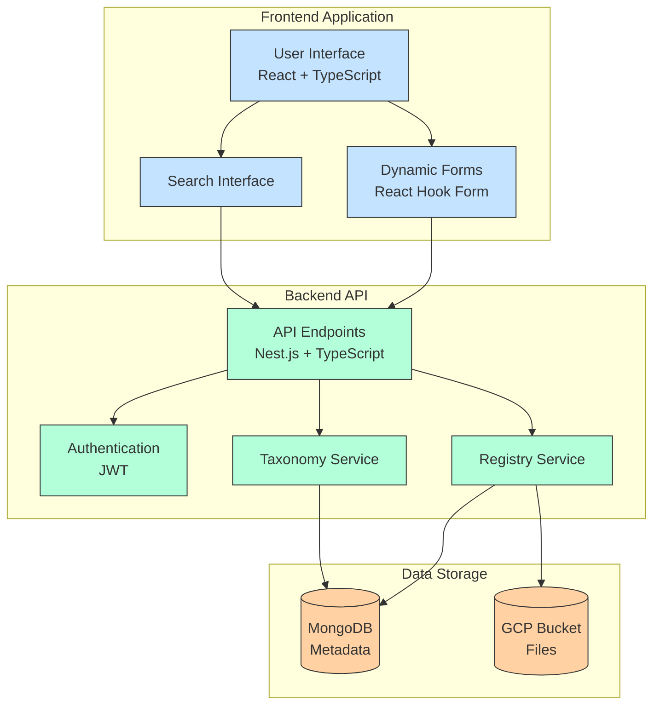
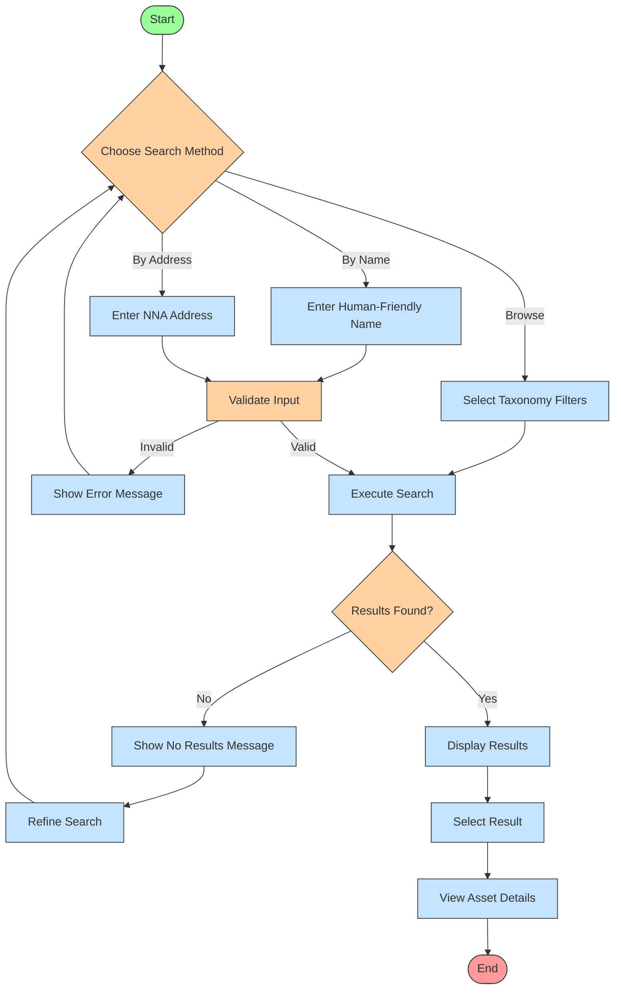

#  Registry Service Requirements and Use Cases 

**Version**: 1.1.1

**Last Updated**: April 10, 2025

**Status**: Updated Draft

## Executive Summary

The NNA Registry Service is a core component of the NNA Framework, designed to manage digital assets for ReViz's AI-powered video remixing platform. It leverages the enhanced NNA Layer Taxonomy to register, categorize, and retrieve assets, supporting seamless integration with AlgoRhythm (AI recommendations) and Clearity (rights management). This document outlines the requirements, user experience, use cases, architecture, and implementation plan for building the Registry Service, assuming a team of one front-end engineer and one back-end engineer.

# 1. Registry Service Product Overview

## 1.1 Purpose

The NNA Registry Service enables content creators to register digital assets (e.g., songs, dance moves, looks) using a hierarchical taxonomy, store them securely, and retrieve them for use in video remixing. It provides a dual addressing system (Human-Friendly Names and NNA Addresses) and integrates with Google Drive for file storage, MongoDB for metadata, and external services like AlgoRhythm and Clearity.

## 1.2 Target Users

- **Content Creators**: Register and manage assets for video remixing.
- **System Administrators**: Manage taxonomy and oversee asset registration.
- **Integration Developers**: Use APIs to integrate with other systems (e.g., AlgoRhythm, Clearity).

## 1.3 Business Goals and MVP Scope

- Streamline asset registration and management
- Ensure consistent taxonomy application
- Enable efficient asset discovery
- Support AI/ML training data organization
- Facilitate integration with other systems

## 1.4 Taxonomy Structure Overview

The NNA Layer Taxonomy has been enhanced to support the diverse needs of ReViz's platform with the following layers. We will use enriched_nna_layer_taxonomy_v1.2.json file for category and subcategory definitions.The Scope of the MVP is to focus on only 7 layers - Songs, Stars, Looks, Moves, Worlds, Branded, and Personalize. In addition, the two invisible (to the ReViz UX) layers of Training_Data and Rights Layers.

| **Layer Code** | **Name** | **Purpose** | **Dependencies** |
| --- | --- | --- | --- |
| G | Songs | Music tracks & audio | None |
| S | Stars | Performance avatars | Song |
| L | Looks | Costumes & styling | Star |
| M | Moves | Choreography | Star |
| W | Worlds | Environments | Independent |
| V | Vibes | Mood & effects | All layers |
| B | Branded | Virtual product placement | Star, Look, Moves, World |
| P | Personalize | User-uploaded customizations | Star, Look, Moves, World |
| T | Training_Data | Datasets for AI training | All layers |
| C | Composites | Aggregated multi-layer assets | All layers |
| R | Rights | Provenance and rights tracking | All layers |
| E | Audio_Effects | Voice modulation & sound effects | Song, Voice |
| N | Transitions | Visual and audio transitions | Multiple assets |
| A | Augmented_Reality | AR effects and overlays | Star, World |
| F | Filters | Visual filters and effects | All layers |

### 1.4.1 Dual Addressing System

The Registry Service implements a dual addressing approach:

1. **Human-Friendly Names (HFN)**:
1.  Format: `[Layer].[CategoryCode].[SubCategoryCode].[Sequential].[Type]`
1.  Example: `G.POP.TSW.001.mp3` (Taylor Swift Pop song)
1. **NNA Addresses (machine-friendly)**:
1.  Format: `[Layer].[CategoryNum].[SubCategoryNum].[Sequential].[Type]`
1.  Example: `G.003.042.001.mp3` (Same song in numeric format)

### 1.4.2 Enhanced Metadata Fields

The enhanced taxonomy includes comprehensive metadata for AI integration and user experience. They are out-of-scope for this MVP.

- **Analytics & Recommendations**: Popularity_Score, Trending_Factor, Engagement_Rate
- **Content Management**: Version, Deprecated, Replacement, License_Expiration
- **Cultural Context**: Cultural_Context, Regional_Popularity, Demographic_Appeal
- **Technical**: Cache_Priority, File_Size, Duration, Resolution
- **Platform Integration**: Social_Media_Format, Export_Settings, Hashtags_Suggested

## 1.5 Key Features for the MVP

### 1.5.1 Asset Registration

- **Taxonomy Selection**: Select layer, category, and subcategory from the taxonomy.
- **Asset Upload**: Upload a file (e.g., MP3 for songs, MP4 for moves) to Google Drive.
- **Training Data Upload**: Upload Prompts, Images, and Videos used to generate the Asset
- **Metadata**: Capture basic metadata (e.g., source, tags).
- **HFN Generation**: Generate a Human-Friendly Name (e.g., G.POP.TSW.001).

### 1.5.2 Asset Retrieval

- **Search by HFN**: Retrieve an asset by its Human-Friendly Name.
- **Filter by Taxonomy**: Filter assets by layer, category, and subcategory.
- **Pagination**: Support pagination for large result sets.

### 1.5.3 Asset Management

- **Search and Discovery:** Full-Text search based on metadata, filter by taxonomy (layer/category/subcategory) and sort by various criteria (date, name, etc.) 
- **Curate Asset:** Review and validate asset's NNA, HFN, and Description
- **Update Asset**: Update an asset’s taxonomy fields and metadata.
- **Delete Asset**: Delete an asset (admin-only).

### 1.5.4 Authentication

- **User Registration/Login**: Basic JWT-based authentication.
- **Role-Based Access**: Protect endpoints, with admin-only access for deletion.

### 1.5.5 Integration

- **Google Drive**: Store asset files securely.
- **APIs**: Provide RESTful endpoints for asset operations.

# 2. Architecture

## 2.1 System Components



The Registry Service consists of the following key components:

1. **Frontend Application**: React-based interface for taxonomy management
1. **Backend API**: Nest.js server handling registry operations
1. **MongoDB Database**: Stores mappings and metadata
1. **GCP Bucket Integration**: Handles file storage for assets
1. **Authentication Service**: Manages user access and permissions

## 2.2 Data Models

### 2.2.1 Asset (MongoDB)

```typescript
interface Asset {
  _id: string;
  layer: string;               // e.g., "G"
  category: string;            // e.g., "POP"
  subcategory: string;         // e.g., "TSW"
  name: string;                // Human-Friendly Name, e.g., "G-POP-TSW-001"
  googleDriveUrl: string;      // URL to the file in Google Drive
  source: string;              // e.g., "ReViz", "User"
  tags: string[];              // e.g., ["pop", "taylor swift"]
  createdAt: Date;
  updatedAt: Date;
}
```

### 2.2.2 User (MongoDB)

```typescript
interface User {
  _id: string;
  email: string;
  password: string;
  role: "user" | "admin";
  createdAt: Date;
  updatedAt: Date;
}
```

### 2.2.3 Taxonomy (JSON File)

- Use enriched_nna_layer_taxonomy_v1.2.json for taxonomy data.
- Example Structure:

```typescript
{
  "G": {
    "categories": {
      "001": {
        "name": "Pop",
        "subcategories": {
          "001": { "name": "Base" },
          "002": { "name": "Global_Pop" },
          // ... other subcategories
        }
      },
      // ... other categories
    }
  },
  "M": {
    "categories": {
      "001": {
        "name": "Pop_Dance",
        "subcategories": {
          "001": { "name": "Base" },
          "002": { "name": "Disco" },
          // ... other subcategories
        }
      },
      // ... other categories
    }
  }
}
```

### 2.2.3 Registry Entry

This core model maps between human-friendly names and NNA addresses:

```typescript
interface RegistryEntry {
  id: string;
  friendly_name: string;       // G.POP.TSW.001
  nna_address: string;         // G.003.042.001
  layer: string;               // G
  category_code: string;       // POP
  category_num: number;        // 003
  subcategory_code: string;    // TSW
  subcategory_num: number;     // 042
  sequential: number;          // 001
  type: string;                // mp3
  version: string;             // v1
  status: 'active' | 'deprecated';
  metadata: AssetMetadata;
  created_at: Date;
  updated_at: Date;
}
```

### 2.2.4 Category Mapping

Maps between human-readable category codes and numeric IDs:

```typescript
interface CategoryMapping {
  id: string;
  layer: string;               // G
  category_code: string;       // POP
  category_num: number;        // 003
  category_name: string;       // "Pop"
  is_deprecated: boolean;
  replacement_category?: string;
}
```

### 2.2.5 Subcategory Mapping

Maps between human-readable subcategory codes and numeric IDs:

```typescript
interface SubcategoryMapping {
  id: string;
  layer: string;               // G
  category_code: string;       // POP
  subcategory_code: string;    // TSW
  subcategory_num: number;     // 042
  subcategory_name: string;    // "Taylor Swift Works"
  is_deprecated: boolean;
  replacement_subcategory?: string;
}
```

### 2.2.6 Sequential Counter

Manages the sequential numbering for assets:

```typescript
interface SequentialCounter {
  id: string;
  layer: string;
  category_code: string;
  subcategory_code: string;
  next_sequential: number;
}
```

### 2.2.7 Asset Metadata

Stores the enhanced metadata for each asset:

```typescript
interface AssetMetadata {
  // Standard fields
  training_set_id?: string;
  source: string;
  target_asset?: string;
  premium: boolean;
  tags: string[];
  provenance: string;
  rights_split: string;
  
  // Enhanced fields
  popularity_score: number;
  trending_factor: number;
  engagement_rate: number;
  creator_boost?: number;
  
  // Content management
  version: string;
  deprecated: boolean;
  replacement?: string;
  license_expiration?: Date;
  seasonal_relevance?: string[];
  content_rating: string;
  
  // Cultural context
  cultural_context?: string;
  regional_popularity?: Record<string, number>;
  demographic_appeal?: string[];
  festival_relevance?: string[];
  locale?: string;
  
  // Technical
  cache_priority: 'High' | 'Medium' | 'Low';
  file_size?: number;
  duration?: number;
  resolution?: string;
  
  // Layer-specific fields
  // (Dynamically included based on layer type)
  
  // For Moves layer (M)
  movement_speed?: 'Slow' | 'Medium' | 'Fast';
  energy_level?: 'Low' | 'Medium' | 'High';
  movement_plane?: string[];
  complexity_level?: 'Beginner' | 'Intermediate' | 'Advanced';
  primary_body_parts?: string[];
  movement_quality?: string[];
  learning_difficulty?: number;
  
  // Social media integration
  social_media_format?: Record<string, any>;
  export_settings?: Record<string, any>;
  hashtags_suggested?: string[];
}
```

## 2.3 Tech Stack

### 2.3.1 Frontend

- **React + TypeScript**: For building a dynamic UI.
- **React Hook Form**: For form management.
- **Axios**: For API requests.
- **Material-UI (MUI)**: For UI components.

### 2.3.2 Backend

- **Nest.js + TypeScript**: For the API server, providing a structured, modular architecture.
- **MongoDB (Mongoose)**: For storing metadata.
- **Google Cloud Storage (GCP Bucket)**: For secure file storage.
- **JWT (jsonwebtoken)**: For authentication.
- **class-validator & class-transformer**: For input validation and transformation.
- **@nestjs/swagger**: For API documentation.
- **@sentry/node**: For error tracking and monitoring.
- **Winston**: For logging.

## 3. User Interfaces and Workflows

## 3.1 Asset Registration Flow

The enhanced taxonomy requires an intuitive registration interface that guides users through the complex hierarchical structure:



## 3.2 Asset Registration Interface

### Use Case 1: Register a New Asset

**Primary Actor**: Content Creator/AI Engineer

1. **Login**:
1. User logs in with email and password to obtain a JWT token.

```
┌───────────────────────────────┐
│ Login                         │
│ Email: [user@example.com    ] │
│ Password: [********         ] │
│ [Login]                       │
└───────────────────────────────┘
```

1. **Layer Selection**
1. Users first select the appropriate layer, with contextual help explaining the purpose of each layer:

```
┌─────────────────────────────────────┐
│ Select Asset Layer                  │
├─────────────────────────────────────┤
│ [G] Songs        [S] Stars          │
│ [L] Looks        [M] Moves          │
│ [W] Worlds       [B] Branded        │
│ [T] Training     [P] Personalize    │
│ [C] Composites   [R] Rights         │
└─────────────────────────────────────┘
```

1. **Category & Subcategory Selection**
1. Dynamic dropdown lists populated based on the selected layer:

```
┌─────────────────────────────────────┐
│ Selected Layer: Moves (M)           │
├─────────────────────────────────────┤
│ Category:                           │
│ ┌─────────────────────────┐        │
│ │ Hip_Hop_Dance          ▼│        │
│ └─────────────────────────┘        │
│                                     │
│ Subcategory:                        │
│ ┌─────────────────────────┐        │
│ │ Breakdance             ▼│        │
│ └─────────────────────────┘        │
└─────────────────────────────────────┘
```

1. **Metadata Input**
1. Layer-specific metadata fields are dynamically presented based on the selected layer:

```
Visual: Form with rich text capabilities
┌─────────────────────────────────────┐
│ [✓] > [2] > [3] > [4]              │
│ Asset Details                       │
├─────────────────────────────────────┤
│ Description                         │
│ ┌─────────────────────────┐        │
│ │                         │        │
│ └─────────────────────────┘        │
│ Source                             │
│ ┌─────────────────────────┐        │
│ │                         │        │
│ └─────────────────────────┘        │
│ Tags                               │
│ ┌─────────────────────────┐        │
│ │ [Tag 1] [Tag 2] [+]    │        │
│ └─────────────────────────┘        │
└─────────────────────────────────────┘
```

```
┌─────────────────────────────────────┐
│ Metadata for: M.003.002 (Hip-Hop Dance - Breakdance) │
├─────────────────────────────────────┤
│ Basic Information:                  │
│ ◉ Source: ○ ReViz ● User ○ Brand   │
│ □ Premium Asset                     │
│                                     │
│ Dance-Specific Metadata:            │
│ Movement Speed: ○ Slow ● Medium ○ Fast │
│ Energy Level: ○ Low ○ Medium ● High │
│ Primary Body Parts:                 │
│ ☑ Arms ☑ Legs ☐ Torso ☑ Full Body  │
└─────────────────────────────────────┘
```

1. **Training Data Upload**

```
Visual: Drag-and-drop upload area
┌─────────────────────────────────────┐
│ [✓] > [✓] > [3] > [4]              │
│ Training Data                       │
├─────────────────────────────────────┤
│ ┌─────────────────────────┐        │
│ │  Drag & Drop Files Here │        │
│ │         or              │        │
│ │     [Browse Files]      │        │
│ └─────────────────────────┘        │
│                                     │
│ Uploaded Files:                     │
│ [File 1] [✓] █████████ 100%        │
│ [File 2] [...] ███░░░░░ 60%        │
└─────────────────────────────────────┘
```

1. **Review and Confirmation**

User reviews the registered asset details.

```
Visual: Summary view with edit options
┌───────────────────────────────┐
│ Asset Registered              │
│ Name: G-POP-TSW-001           │
│ URL: [Google Drive Link]      │
│ [Review Asset] [Register Another] │
└───────────────────────────────┘
┌─────────────────────────────────────┐
│ [✓] > [✓] > [✓] > [4]              │
│ Review                              │
├─────────────────────────────────────┤
│ Taxonomy                   [Edit]    │
│ Layer: Moves                        │
│ Category: Dance                     │
│ Subcategory: Hip-Hop               │
│                                     │
│ Details                    [Edit]    │
│ Description: ...                    │
│ Source: ...                         │
│ Tags: [Tag 1] [Tag 2]              │
│                                     │
│ Files                      [Edit]    │
│ 3 files uploaded                    │
└─────────────────────────────────────┘
```

## 3.2 Asset Lookup Interface

The Registry Service provides intuitive search capabilities:


### Use Case 2: Search and Browse Assets

**Primary Actor**: Content Creator/Content Curator

**User Experience Flow**:

1. **Asset Dashboard**
1. User searches, filters assets by taxonomy, sorts by name, date

```
Visual: Grid/List view with sorts and filters
┌─────────────────────────────────────┐
│ Search Assets                       │
│ ┌─────────────────────────┐ [Filter]│
│ │Search...                │        │
│ └─────────────────────────┘        │
├─────────────────────────────────────┤
┌───────────────────────────────┐
│ Layer: [G - Songs ▼]          │
│ Category: [Pop ▼]             │
│ Subcategory: [TSW ▼]          │
│ Page: [1] Limit: [10]         │
│ [Search]                      │
└───────────────────────────────┘
│ Filters Applied:                    │
│ [Layer: Moves ⨯] [Category: Dance ⨯]│
└─────────────────────────────────────┘
```

1. **Asset Detail View**

```
Visual: Detailed asset information
┌─────────────────────────────────────┐
│ Asset: 1. G-POP-TSW-001 [View]      │
│ ┌─────────────┐                     │
│ │             │ Status: Active      │
│ │  Preview    │ Version: 1.0        │
│ │             │ Created: 2024-03-20 │
│ └─────────────┘       
[Previous] [1] [2] [Next]             │
└─────────────────────────────────────┘
```

## 3.3 Asset Management

### Use Case 3: Asset Administration

**Primary Actor**: Content Curator

**User Experience Flow**:

1. **Management Dashboard**

```
Visual: Management dashboard
┌─────────────────────────────────────┐
│ Asset Management                    │
├─────────────────────────────────────┤
│ Statistics                          │
│ Total Assets: 1,234                 │
│ Storage Used: 45.6 GB               │
│ Active Users: 12                    │
└─────────────────────────────────────┘
```

1. **Version Control**

```
Visual: Version history interface
┌─────────────────────────────────────┐
│ Version History: G-POP-TSW-001      │
├─────────────────────────────────────┤
│ v1.2 (Current) - 2024-03-20        │
│ Changed: Description, Tags          │
│ [View] [Restore] [Compare]          │
└─────────────────────────────────────┘
```

1. **Update Asset**:
1. Curator updates an asset’s taxonomy.

```
┌───────────────────────────────┐
│ Update Asset: G-POP-TSW-001   │
│ Layer: [G - Songs ▼]          │
│ Category: [Rock ▼]            │
│ Subcategory: [Classic_Rock ▼] │
│ [Update]                      │
└───────────────────────────────┘
```

1. **Delete Asset**:
1. Curator delets an asset.

```
┌───────────────────────────────┐
│ Delete Asset: G-POP-TSW-001   │
│                               │
│ [Confirm Delete]              │
└───────────────────────────────┘
```

## 3.4 Integration Access

### Use Case 4: API Integration

**Primary Actor**: Integration Developer

1. **API Dashboard**

```
Visual: Developer portal
┌─────────────────────────────────────┐
│ API Access                          │
├─────────────────────────────────────┤
│ Your API Keys                       │
│ [Generate New Key]                  │
│                                     │
│ Active Key: ****************        │
│ Status: Active                      │
└─────────────────────────────────────┘
```

## 3.5  Registering NNA Assets with Training Data Journey Map

### 3.5.1 Overview

This journey map details the step-by-step process for content creators registering new assets in the NNA Framework, including the simultaneous creation of training data sets with automatic naming and addressing.

### 3.5.2 User Persona: Content Creator

**Name:** Alex

**Role:** Video Content Creator for ReViz

**Goal:** Register a new dance move asset and its training data set to enable AI recommendations

### 3.5.3 Asset Registration Journey Map Steps

### Step 1: Initiate Asset Registration

**Interface:**

```
┌─────────────────────────────────────────────────┐
│                                                 │
│  Register New Asset                             │
│                                                 │
│  ◯ Single Asset Registration                    │
│  ● Asset with Training Data Registration        │
│                                                 │
│  [ Continue → ]                                 │
│                                                 │
└─────────────────────────────────────────────────┘
```

**System Process:**

- System prepares registration flow for both primary asset and training data
- Tracking session started to link related assets
- Preliminary validation of user permissions

### Step 2: Layer and Taxonomy Selection

**Interface:**

```
┌─────────────────────────────────────────────────┐
│                                                 │
│  Select Asset Layer                             │
│                                                 │
│  ○ G - Songs     ○ S - Stars    ○ L - Looks    │
│  ● M - Moves     ○ W - Worlds   ○ V - Vibes    │
│  ○ B - Branded   ○ P - Person.  ○ Other...     │
│                                                 │
│  [ ← Back ]                     [ Continue → ]  │
│                                                 │
└─────────────────────────────────────────────────┘
```

**After selecting Moves (M):**

```
┌─────────────────────────────────────────────────┐
│                                                 │
│  Select Category & Subcategory                  │
│                                                 │
│  Category:                                      │
│  ┌───────────────────────────────┐              │
│  │ Hip_Hop_Dance                ▼│              │
│  └───────────────────────────────┘              │
│                                                 │
│  Subcategory:                                   │
│  ┌───────────────────────────────┐              │
│  │ Top_Rock                     ▼│              │
│  └───────────────────────────────┘              │
│                                                 │
│  [ ← Back ]                     [ Continue → ]  │
│                                                 │
└─────────────────────────────────────────────────┘
```

**System Process:**

- Dynamic loading of categories based on selected layer
- Dynamic loading of subcategories based on selected category
- Validation that selection is active and not deprecated
- Preparation of layer-specific metadata fields for next step

### Step 3: Primary Asset Information

**Interface:**

```
┌─────────────────────────────────────────────────┐
│                                                 │
│  Asset Information: Hip-Hop Dance - Top Rock    │
│                                                 │
│  Asset Name: Urban Top Rock Sequence            │
│                                                 │
│  Description:                                   │
│  ┌───────────────────────────────────────────┐  │
│  │ Classic hip-hop top rock sequence with    │  │
│  │ contemporary urban styling. Features      │  │
│  │ cross-step and shuffle variations.        │  │
│  └───────────────────────────────────────────┘  │
│                                                 │
│  Tags: hip-hop, breakdance, urban, top-rock    │
│                                [ + Add Tag ]    │
│                                                 │
│  Source: ● ReViz  ○ User  ○ Brand              │
│                                                 │
│  Asset Type: ● Video  ○ Image  ○ Audio         │
│                                                 │
│  [ ← Back ]                     [ Continue → ]  │
│                                                 │
└─────────────────────────────────────────────────┘
```

**System Process:**

- Validation of required fields
- Tag suggestions based on taxonomy selection
- Asset name uniqueness check
- Preparation of temporary IDs for both primary asset and training data set

### Step 4: Movement-Specific Metadata

**Interface:**

```
┌─────────────────────────────────────────────────┐
│                                                 │
│  Dance Movement Metadata                        │
│                                                 │
│  Movement Speed:  ○ Slow  ● Medium  ○ Fast     │
│                                                 │
│  Energy Level:    ○ Low   ● Medium  ○ High     │
│                                                 │
│  Primary Body Parts:                            │
│  ☑ Arms  ☑ Legs  ☐ Torso  ☑ Full Body          │
│                                                 │
│  Movement Quality:                              │
│  ☑ Sharp  ☐ Fluid  ☑ Percussive  ☐ Sustained   │
│                                                 │
│  Complexity Level:                              │
│  ○ Beginner  ● Intermediate  ○ Advanced        │
│                                                 │
│  Learning Difficulty: ●●●○○  (3/5)             │
│                                                 │
│  [ ← Back ]                     [ Continue → ]  │
│                                                 │
└─────────────────────────────────────────────────┘
```

**System Process:**

- Capture of layer-specific metadata
- Metadata validation according to layer rules
- Suggestions for AlgoRhythm compatibility based on metadata
- Preparation for training data association

### Step 5: Asset Upload & Training Data Preparation

**Interface:**

```
┌─────────────────────────────────────────────────┐
│                                                 │
│  Asset Upload                                   │
│                                                 │
│  Primary Asset:                                 │
│  ┌───────────────────────────────────────────┐  │
│  │  Drag & Drop Video File Here              │  │
│  │            or                             │  │
│  │        [ Browse Files ]                   │  │
│  └───────────────────────────────────────────┘  │
│                                                 │
│  ✓ Automatically create training data set       │
│                                                 │
│  Temporary Asset ID Preview:                    │
│  Primary: M.HIP.TPR.xxx                         │
│  Training: T.M.HIP.TPR.xxx.set                  │
│                                                 │
│  [ ← Back ]                     [ Continue → ]  │
│                                                 │
└─────────────────────────────────────────────────┘
```

**After uploading:**

```
┌─────────────────────────────────────────────────┐
│                                                 │
│  Training Data Assets                           │
│                                                 │
│  Video Segments (min. 3 recommended):           │
│  ┌───────────────────────────────────────────┐  │
│  │  Drag & Drop Video Segments Here          │  │
│  │            or                             │  │
│  │        [ Browse Files ]                   │  │
│  └───────────────────────────────────────────┘  │
│                                                 │
│  Uploaded:                                      │
│  • segment_01.mp4 ✓ [Preview] [Remove]          │
│  • segment_02.mp4 ✓ [Preview] [Remove]          │
│  • segment_03.mp4 ⟳ Uploading...                │
│                                                 │
│  Tutorial Guidance (optional):                  │
│  ┌───────────────────────────────────────────┐  │
│  │ Start with feet shoulder-width apart...   │  │
│  └───────────────────────────────────────────┘  │
│                                                 │
│  [ ← Back ]                     [ Continue → ]  │
│                                                 │
└─────────────────────────────────────────────────┘
```

**System Process:**

- Upload handling for primary asset
- Creation of asset preview
- Preparation of training data container
- Collection of training data segments
- Validation of training data completeness
- Temporary ID generation to show relationship

### Step 6: Final Review and Submission

**Interface:**

```
┌─────────────────────────────────────────────────┐
│                                                 │
│  Review and Submit                              │
│                                                 │
│  ┌─────────────────────────────────────┐        │
│  │ Primary Asset: M.HIP.TPR.xxx        │ [Edit] │
│  │ • Name: Urban Top Rock Sequence     │        │
│  │ • Layer: Moves (M)                  │        │
│  │ • Category: Hip_Hop_Dance           │        │
│  │ • Subcategory: Top_Rock             │        │
│  └─────────────────────────────────────┘        │
│                                                 │
│  ┌─────────────────────────────────────┐        │
│  │ Training Data: T.M.HIP.TPR.xxx.set  │ [Edit] │
│  │ • 3 video segments                  │        │
│  │ • Tutorial guidance included        │        │
│  └─────────────────────────────────────┘        │
│                                                 │
│  ┌─────────────────────────────────────┐        │
│  │ Preview:                            │ [Play] │
│  │ [Video Thumbnail]                   │        │
│  └─────────────────────────────────────┘        │
│                                                 │
│  [ ← Back ]                     [ Register ✓ ]  │
│                                                 │
└─────────────────────────────────────────────────┘
```

**System Process:**

- Final validation of all required fields
- Generation of permanent Human-Friendly Names and NNA Addresses
- Preview generation
- Preparation of database entries

### Step 7: Registration Confirmation

**Interface:**

```
┌─────────────────────────────────────────────────┐
│                                                 │
│  ✅ Registration Complete                        │
│                                                 │
│  Assets have been successfully registered!      │
│                                                 │
│  Primary Asset:                                 │
│  • Human-Friendly Name: M.HIP.TPR.001           │
│  • NNA Address: M.003.007.001                   │
│                                                 │
│  Training Data:                                 │
│  • Human-Friendly Name: T.M.HIP.TPR.001.set     │
│  • NNA Address: T.M.003.007.001.set             │
│                                                 │
│  [ View Asset Details ]   [ Register Another ]  │
│                                                 │
└─────────────────────────────────────────────────┘
```

**System Process:**

- Database storage of asset metadata
- Google Drive storage of asset files
- Training data linkage to primary asset
- Notification to AlgoRhythm of new training data
- Confirmation message with permanent IDs

### 3.5.4 Simplified User Experience Recommendations

1. **Progressive Asset Creation**
    - Guide creators through a logical flow from general to specific
    - Show only relevant options at each step
    - Provide contextual help and tooltips
1. **Smart Defaults**
    - Pre-populate metadata fields based on taxonomy selection
    - Suggest tags based on category and previous assets
    - Use AI to auto-detect some metadata from uploaded files
1. **Parallel Creation**
    - Create training data in parallel with primary asset
    - Maintain visual connection between primary and training assets
    - Auto-generate matching names and addresses
1. **Immediate Feedback**
    - Show generated IDs in real-time as selections are made
    - Provide preview of assets at each step
    - Validate entries immediately to prevent submission errors
1. **Guided Assistance**
    - Include tooltips and examples for complex fields
    - Provide guidance for training data preparation
    - Show best practices for each asset type

## 3.6 Taxonomy Curation: Curator Journey Map

### 3.6.1 Overview

This use case details how administrators manage and extend the NNA taxonomy structure, including adding new categories, subcategories, and reviewing system-generated codes.

### 3.6.2 User Persona: Taxonomy Curator

**Name:** Taylor

**Role:** Content Taxonomy Administrator

**Goal:** Manage and extend the taxonomy structure to support new content types and trends

### 3.6.3 Curation Journey Map Steps

### Step 1: Access Taxonomy Management

### Interface:

```
┌─────────────────────────────────────────────────┐
│                                                 │
│  NNA Registry Admin Panel                       │
│                                                 │
│  [ Asset Management ]    [ User Management ]    │
│                                                 │
│  [ ★ Taxonomy Management ]                      │
│                                                 │
│  [ Rights Management ]   [ System Settings ]    │
│                                                 │
└─────────────────────────────────────────────────┘
```

**System Process:**

- Verify admin credentials and permissions
- Load current taxonomy structure
- Prepare audit logging for any changes

### Step 2: Select Layer to Manage

**Interface:**

```
┌─────────────────────────────────────────────────┐
│                                                 │
│  Taxonomy Management                            │
│                                                 │
│  Select a layer to manage:                      │
│                                                 │
│  G - Songs (124 categories)                     │
│  S - Stars (87 categories)                      │
│  M - Moves (32 categories) ← Trending           │
│  W - Worlds (17 categories)                     │
│  ...                                            │
│                                                 │
│  [ + Create New Layer ]                         │
│                                                 │
└─────────────────────────────────────────────────┘
```

**System Process:**

- Load layer statistics (counts, recent additions)
- Highlight trending or recently modified layers
- Check for pending review items

### Step 3: View Layer Categories

**Interface:**

```
┌─────────────────────────────────────────────────┐
│                                                 │
│  Layer: Moves (M)                               │
│                                                 │
│  Categories:                                    │
│  ┌───────────────────────────────────────────┐  │
│  │ ID │ Code │ Name            │ Subcats │   │  │
│  │----│------│-----------------│---------│---│  │
│  │ 001│ POP  │ Pop_Dance       │ 6       │ ▼ │  │
│  │ 002│ JAZ  │ Jazz_Dance      │ 5       │ ▼ │  │
│  │ 003│ HIP  │ Hip_Hop_Dance   │ 6       │ ▼ │  │
│  │ ... │     │                 │         │   │  │
│  └───────────────────────────────────────────┘  │
│                                                 │
│  [ Filter ]  [ Sort ]  [ + Add Category ]       │
│                                                 │
└─────────────────────────────────────────────────┘
```

**System Process:**

- Load categories with their associated subcategories
- Calculate usage statistics for each category
- Check for deprecated or pending categories

### Step 4: Add New Category

**Interface:**

```
┌─────────────────────────────────────────────────┐
│                                                 │
│  Add New Category to Moves (M)                  │
│                                                 │
│  Category Name:                                 │
│  [TikTok_Trending_Moves                      ]  │
│                                                 │
│  Description:                                   │
│  ┌───────────────────────────────────────────┐  │
│  │ Trending dance moves and challenges       │  │
│  │ popularized on TikTok and similar         │  │
│  │ short-form video platforms.               │  │
│  └───────────────────────────────────────────┘  │
│                                                 │
│  Suggested Code: TIK                            │
│                                                 │
│  Custom Code (optional): [   ]                  │
│                                                 │
│  Next Numeric ID: 033                           │
│                                                 │
│  [ Cancel ]                       [ Create ✓ ]  │
│                                                 │
└─────────────────────────────────────────────────┘
```

**System Process:**

- Auto-generate suggested three-letter code from name
- Check code uniqueness within layer
- Reserve next available numeric ID
- Validate against naming conventions

### Step 5: Category Creation Confirmation

**Interface:**

```
┌─────────────────────────────────────────────────┐
│                                                 │
│  ✅ Category Created Successfully               │
│                                                 │
│  Layer: Moves (M)                               │
│  Category: TikTok_Trending_Moves                │
│  Code: TIK                                      │
│  Numeric ID: 033                                │
│                                                 │
│  Would you like to add subcategories now?       │
│                                                 │
│  [ Skip for Now ]          [ Add Subcategories ]│
│                                                 │
└─────────────────────────────────────────────────┘
```

**System Process:**

- Create category in database
- Update category mappings
- Log action in audit trail
- Prepare for subcategory creation

### Step 6: Add Subcategories

**Interface:**

```
┌─────────────────────────────────────────────────┐
│                                                 │
│  Add Subcategories: TikTok_Trending_Moves       │
│                                                 │
│  ┌───────────────────────────────────────────┐  │
│  │ Name                | Code | Status       │  │
│  │--------------------│------│--------------│  │
│  │ Renegade           | REN  | ✓ Valid      │  │
│  │ Savage             | SAV  | ✓ Valid      │  │
│  │ Woah               | WOA  | ✓ Valid      │  │
│  │ Say_So             | SAY  | ⚠ Similar to │  │
│  │                    |      | SAV          │  │
│  │ [+ Add Row]        |      |              │  │
│  └───────────────────────────────────────────┘  │
│                                                 │
│  [ Regenerate Codes ]    [ Custom Codes ↓ ]     │
│                                                 │
│  [ Cancel ]                       [ Create ✓ ]  │
│                                                 │
└─────────────────────────────────────────────────┘
```

**System Process:**

- Batch validation of subcategory names and codes
- Check for code conflicts
- Suggest alternative codes for conflicts
- Prepare subcategory mappings

### Step 7: Edit Subcategory Codes

**:**

```
┌─────────────────────────────────────────────────┐
│                                                 │
│  Edit Code: Say_So                              │
│                                                 │
│  Current Code: SAY                              │
│  Conflict: Similar to SAV (Savage)              │
│                                                 │
│  Suggestions:                                   │
│  ○ SSO                                          │
│  ○ SYS                                          │
│  ● Custom: [SOS]                                │
│                                                 │
│  [ Cancel ]                         [ Save ✓ ]  │
│                                                 │
└─────────────────────────────────────────────────┘
```

**System Process:**

- Generate alternative code suggestions
- Validate custom code against system rules
- Check updated code for conflicts
- Prepare to update database

### Step 8: Review and Deploy Taxonomy Updates

**Interface:**

```
┌─────────────────────────────────────────────────┐
│                                                 │
│  Review and Deploy                              │
│                                                 │
│  New Category:                                  │
│  • M.TIK (033) - TikTok_Trending_Moves          │
│                                                 │
│  New Subcategories:                             │
│  • M.TIK.REN (033.001) - Renegade               │
│  • M.TIK.SAV (033.002) - Savage                 │
│  • M.TIK.WOA (033.003) - Woah                   │
│  • M.TIK.SOS (033.004) - Say_So                 │
│                                                 │
│  Impact:                                        │
│  • No conflicts with existing assets            │
│  • AlgoRhythm needs reindexing                  │
│                                                 │
│  [ Cancel ]     [ Save as Draft ]   [ Deploy ✓ ]│
│                                                 │
└─────────────────────────────────────────────────┘
```

**System Process:**

- Final validation of complete taxonomy set
- Impact analysis for existing systems
- Preparation of database transaction
- Notification preparation for affected systems

### Step 9: Deployment Confirmation

**Interface:**

```
┌─────────────────────────────────────────────────┐
│                                                 │
│  ✅ Taxonomy Updated Successfully               │
│                                                 │
│  New taxonomy elements have been deployed.      │
│                                                 │
│  System notifications sent to:                  │
│  • AlgoRhythm Team                              │
│  • Content Creation Team                        │
│  • Rights Management Team                       │
│                                                 │
│  The new categories are now available for       │
│  asset registration.                            │
│                                                 │
│  [ Back to Taxonomy Management ]                │
│                                                 │
└─────────────────────────────────────────────────┘
```

**System Process:**

- Commit changes to production database
- Update search indices
- Send notifications to dependent systems
- Log deployment in audit trail
- Update caching layers

## 3.6.4 Curation Best Practices

1. **Controlled Expansion**
    - Limit taxonomy growth to maintain usability
    - Ensure new additions follow naming conventions
    - Consider deprecating unused categories instead of deletion
1. **Code Generation Rules**
    - Prioritize recognizable abbreviations
    - Avoid ambiguous or similar-sounding codes
    - Maintain consistent code generation logic
1. **Change Management**
    - Document rationale for taxonomy changes
    - Provide migration paths for deprecated elements
    - Communicate changes to affected teams
1. **Governance**
    - Implement review process for new additions
    - Maintain versioning for taxonomy changes
    - Schedule regular reviews of taxonomy usage
1. **Documentation**
    - Maintain detailed descriptions for all taxonomy elements
    - Create usage guidelines for each category
    - Document relationships between taxonomy elements

This use case provides administrators with the tools to manage and extend the taxonomy structure in a controlled, consistent manner, ensuring the NNA Framework remains organized and usable as it grows to support 10M+ users and billions of assets.

# 4. Implementation Strategy

This high-level overview and implementation strategy is  detailed  as  a comprehensive, step-by-step implementation guide is in the NNA Registry Service  implementation plan.

## 4.1 Development Phases (4 Weeks)

### Phase 1: Foundation (Week 1)

**Goal**: Set up the project structure, database, and authentication.

- **Backend Engineer**:
    - Set up Express.js + TypeScript project.
    - Configure MongoDB with Mongoose (Asset and User models).
    - Implement JWT authentication (register/login endpoints).
    - Set up Google Drive API integration.
    - Create basic logging with Winston.
    - **Deliverables**:
        - /api/auth/register and /api/auth/login endpoints.
        - MongoDB connection and models.
        - Google Drive upload functionality.
- **Frontend Engineer**:
    - Set up React + TypeScript project with Material-UI.
    - Configure React Hook Form and Axios.
    - Create a basic login page.
    - **Deliverables**:
        - Login page UI.
        - API client setup for authentication.

### Phase 2: Core Functionality (Week 2)

**Goal**: Implement asset registration and retrieval.

- **Backend Engineer**:
    - Implement POST /api/assets endpoint with taxonomy validation and Google Drive upload.
    - Implement GET /api/assets endpoint with filtering and pagination.
    - Implement GET /api/assets/:id endpoint.
    - Add authentication middleware to protect endpoints.
    - **Deliverables**:
        - Asset registration and retrieval endpoints.
        - Taxonomy validation logic.
- **Frontend Engineer**:
    - Create asset registration form with taxonomy dropdowns.
    - Create asset search page with filters and pagination.
    - Integrate with backend APIs.
    - **Deliverables**:
        - Asset registration UI.
        - Asset search UI.

### Phase 3: Asset Management (Week 3)

**Goal**: Add update and delete functionality.

- **Backend Engineer**:
    - Implement PUT /api/assets/:id endpoint.
    - Implement DELETE /api/assets/:id endpoint (admin-only).
    - Add role-based access control (admin middleware).
    - **Deliverables**:
        - Update and delete endpoints.
- **Frontend Engineer**:
    - Create asset detail page with update and delete options.
    - Add admin-only UI for deletion.
    - **Deliverables**:
        - Asset detail page with update/delete UI.

### Phase 4: Testing and Deployment (Week 4)

**Goal**: Test and deploy the application.

- **Backend Engineer**:
    - Write unit tests for endpoints.
    - Perform integration tests with MongoDB and Google Drive.
    - Deploy backend to a hosting service (e.g., Heroku).
    - **Deliverables**:
        - Test coverage for backend.
        - Deployed backend.
- **Frontend Engineer**:
    - Write UI tests for forms and search.
    - Deploy frontend to a hosting service (e.g., Netlify).
    - **Deliverables**:
        - Test coverage for frontend.
        - Deployed frontend.

## 4.2 Testing Strategy

The Registry Service will be tested using:

1. **Unit Tests**: Verify individual component functionality
1. **Integration Tests**: Test interaction between components
1. **API Tests**: Validate API functionality and security
1. **Performance Tests**: Ensure scalability and speed
1. **UI Tests**: Validate user interface functionality

# 5. Next Steps After MVP

- **Enhance Metadata**: Include more metadata fields (e.g., popularity_score).
- **Integrate with AlgoRhythm and Clearity**: Add API integration for recommendations and rights management.
- **Add Advanced Features**: Versioning, batch uploads, advanced search.

## 5.1 AlgoRhythm Integration

The Registry Service provides asset metadata to AlgoRhythm for AI recommendations using Nest.js HTTP module:

```typescript
// Example integration with AlgoRhythm API
import { Injectable } from '@nestjs/common';
import { HttpService } from '@nestjs/axios';
import { ConfigService } from '@nestjs/config';
import { catchError, firstValueFrom } from 'rxjs';

@Injectable()
export class AlgoRhythmService {
  constructor(
    private readonly httpService: HttpService,
    private readonly configService: ConfigService
  ) {}

  async getRecommendations(assetId: string, userContext: any) {
    const url = this.configService.get<string>('ALGORHYTHM_API_URL') + '/recommendations';
    
    const payload = {
      asset_id: assetId,
      user_context: userContext,
      compatibility_check: {
        current_selection: userContext.recent_interactions || []
      }
    };
    
    const { data } = await firstValueFrom(
      this.httpService.post(url, payload, {
        headers: {
          'Content-Type': 'application/json',
          'X-API-Key': this.configService.get<string>('ALGORHYTHM_API_KEY'),
        }
      }).pipe(
        catchError((error) => {
          throw new Error(`AlgoRhythm API error: ${error.message}`);
        }),
      ),
    );
    
    return data;
  }
}
```

## 5.2 Clearity Integration

```markdown
## 5.2 Clearity Integration

The Registry Service integrates with Clearity for rights management using Nest.js modules:

```typescript
// Example integration with Clearity API
import { Injectable } from '@nestjs/common';
import { HttpService } from '@nestjs/axios';
import { ConfigService } from '@nestjs/config';
import { catchError, firstValueFrom } from 'rxjs';

@Injectable()
export class ClearityService {
  constructor(
    private readonly httpService: HttpService,
    private readonly configService: ConfigService
  ) {}

  async verifyRights(assetId: string, usageContext: any) {
    const url = this.configService.get<string>('CLEARITY_API_URL') + '/rights/verify';
    
    const payload = {
      asset_id: assetId,
      usage_context: {
        publication_platform: usageContext.platform,
        territories: usageContext.territories,
        usage_type: usageContext.usage_type,
        duration: usageContext.duration
      }
    };
    
    const { data } = await firstValueFrom(
      this.httpService.post(url, payload, {
        headers: {
          'Content-Type': 'application/json',
          'X-API-Key': this.configService.get<string>('CLEARITY_API_KEY'),
        }
      }).pipe(
        catchError((error) => {
          throw new Error(`Clearity API error: ${error.message}`);
        }),
      ),
    );
    
    return data;
  }
}
```

## 5.3 GCP Bucket Integration

Assets are stored in Google Cloud Storage (GCP Bucket) with a structured folder hierarchy:

Assets are stored in Google Drive with structured folder hierarchy:

```
/ReViz-Assets/
  /Songs/
    /Pop/
      /Taylor_Swift_Works/
        G.POP.TSW.001.mp3
  /Moves/
    /Hip_Hop_Dance/
      /Breakdance/
        M.HIP.BRK.001.mp4
```

This structure provides several advantages:

1. **Organization**: Assets are neatly organized by taxonomy
1. **Security**: Fine-grained access control at folder and file levels
1. **Performance**: Fast, global access with Google's CDN
1. **Scalability**: Handles billions of files and exabytes of data
1. **Durability**: 99.999999999% durability for stored objects
1. **Integration**: Seamless integration with other Google Cloud services

# 6. User Experience Considerations

## 6.1 Taxonomy Presentation

The complex taxonomy will be presented to users in an intuitive manner:

1. **Visual Hierarchy**: Visual representation of taxonomy relationships
1. **Progressive Disclosure**: Show only relevant options based on context
1. **Search-First Approach**: Allow users to search across the taxonomy
1. **Recent Selections**: Show recently used categories for quick access

## 6.2 Performance Optimizations

To ensure responsive user experience with Nest.js:

1. **Caching with Nest.js Cache Manager**:

```typescript
import { CacheModule, Module } from '@nestjs/common';
import { redisStore } from 'cache-manager-redis-store';

@Module({
  imports: [
    CacheModule.registerAsync({
      useFactory: () => ({
        store: redisStore,
        host: 'localhost',
        port: 6379,
        ttl: 300, // 5 minutes cache duration
      }),
    }),
  ],
})
export class AppModule {}
```

1. **Pagination with Efficient Queries:**
- Use MongoDB's skip/limit functionality with optimized queries
- Implement cursor-based pagination for large datasets
- 
1. **Lazy Loading**:
- Implement NestJS lazy module loading for optimized startup
- Use dynamic imports for optional functionality
- 
1. **Typeahead Search with Debouncing**:
- Implement server-side debouncing for search endpoints
- Use MongoDB text indexes for efficient full-text search
- 
1. **Response Streaming**:
- Use Nest.js StreamableFile for efficient file transfers
- Implement compression for API responses

# 7. Implementation Code Samples

## 7.1 Registry Lookup Operation

```typescript
// Example Registry Service lookup method
async function lookupByFriendlyName(friendlyName: string): Promise<RegistryEntry> {
  // Parse friendly name components
  const [layer, categoryCode, subcategoryCode, sequential, type] = friendlyName.split('.');
  
  // Look up in database
  const entry = await RegistryEntryModel.findOne({
    layer,
    category_code: categoryCode,
    subcategory_code: subcategoryCode,
    sequential: parseInt(sequential, 10),
    type
  });
  
  if (!entry) {
    throw new Error(`Asset not found: ${friendlyName}`);
  }
  
  return entry;
}
```

## 7.2 Registration Operation

```typescript
// Example registration method
async function registerNewAsset(
  layer: string,
  categoryCode: string,
  subcategoryCode: string,
  type: string,
  metadata: AssetMetadata
): Promise<RegistryEntry> {
  // Validate layer, category, subcategory
  await validateTaxonomyStructure(layer, categoryCode, subcategoryCode);
  
  // Get next sequential number
  const sequentialCounter = await SequentialCounterModel.findOneAndUpdate(
    { layer, category_code: categoryCode, subcategory_code: subcategoryCode },
    { $inc: { next_sequential: 1 } },
    { new: true, upsert: true }
  );
  
  // Look up numeric codes
  const categoryMapping = await CategoryMappingModel.findOne({
    layer,
    category_code: categoryCode
  });
  
  const subcategoryMapping = await SubcategoryMappingModel.findOne({
    layer,
    category_code: categoryCode,
    subcategory_code: subcategoryCode
  });
  
  // Format sequential as 3-digit string
  const sequentialFormatted = sequentialCounter.next_sequential.toString().padStart(3, '0');
  
  // Create friendly name and NNA address
  const friendlyName = `${layer}.${categoryCode}.${subcategoryCode}.${sequentialFormatted}${type ? '.' + type : ''}`;
  const nnaAddress = `${layer}.${categoryMapping.category_num}.${subcategoryMapping.subcategory_num}.${sequentialFormatted}${type ? '.' + type : ''}`;
  
  // Create new registry entry
  const registryEntry = await RegistryEntryModel.create({
    friendly_name: friendlyName,
    nna_address: nnaAddress,
    layer,
    category_code: categoryCode,
    category_num: categoryMapping.category_num,
    subcategory_code: subcategoryCode,
    subcategory_num: subcategoryMapping.subcategory_num,
    sequential: sequentialCounter.next_sequential,
    type,
    version: 'v1',
    status: 'active',
    metadata,
    created_at: new Date(),
    updated_at: new Date()
  });
  
  return registryEntry;
}
```

# 8. Conclusion

The NNA Registry Service implementation leverages the enhanced taxonomy to provide a robust, scalable system for managing digital assets in the ReViz platform. By implementing the dual addressing system and comprehensive metadata model, the service will enable efficient asset discovery, AI-powered recommendations, and seamless rights management.

The development approach focuses on building a service that is:

1. **Flexible**: Accommodates future expansion of the taxonomy
1. **Performant**: Provides sub-20ms lookup times
1. **Intuitive**: Makes the complex taxonomy accessible to users
1. **Integrated**: Works seamlessly with AlgoRhythm and Clearity
1. **Secure**: Protects valuable digital assets with proper authentication

This requirements document provides a blueprint for developing the Registry Service to support ReViz's vision of transforming casual viewers into creators through AI-powered video remixing.

---

# 
